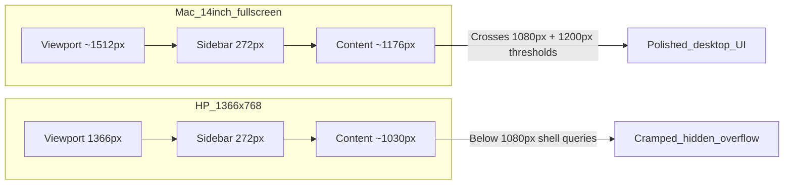
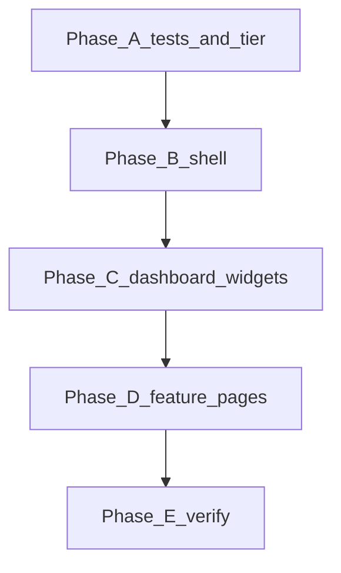

# 1366×768 responsive pass — diagnosis and fix plan

## Why it looks great on Mac 14" but awful on 1366×768

This is not a random HP/browser bug. The layout math and breakpoint choices systematically favor your Mac and mobile, while **1366×768 sits in a dead zone**.



### 1. Width: fixed sidebar steals ~20% of the laptop screen

Both apps use the shared shell in [`packages/ui/src/components/layout-shell.tsx`](packages/ui/src/components/layout-shell.tsx) with a **fixed expanded sidebar**:

```17:19:packages/ui/src/components/shell/shell-styles.ts
export const shellSidebarCollapsedWidthClass = "w-[5rem]";
export const shellSidebarExpandedWidthClass = "w-[17rem]";
```

On a 1366px viewport with the sidebar open:

| | Mac 14" (~1512px) | HP 1366×768 |
|---|---|---|
| Sidebar | 272px | 272px |
| Horizontal padding (`px-6 lg:px-8`) | ~64px | ~64px |
| **Usable content width** | **~1176px** | **~1030px** |

The app’s “comfortable desktop” thresholds assume **1080–1200px+ of content**, not ~1030px:

- Admin dashboard hides button labels below `@min-[1080px]/shell` ([`apps/admin/src/features/dashboard/dashboard-page.tsx`](apps/admin/src/features/dashboard/dashboard-page.tsx))
- Global search keyboard hint hidden below `@min-[960px]/shell` ([`apps/admin/src/features/global-search/global-search-trigger.tsx`](apps/admin/src/features/global-search/global-search-trigger.tsx))
- Dashboard grid `lg` tier starts at **1200px container** ([`packages/web-shared/src/dashboard/generate-responsive-layouts.ts`](packages/web-shared/src/dashboard/generate-responsive-layouts.ts))

On your Mac, those all fire. On the HP, they often **don’t** — icons without labels, denser grids, widgets that never reflow.

### 2. Height: 768px is a second problem (not just width)

Mac 14" typically gives **~900–980px** of usable CSS height. At 768px you lose ~150–200px to:

- Sticky app bar (`shellAppBarClass` in shell-styles)
- Dashboard period filter card (multi-row grid + 2-month date picker at `@min-[860px]` in [`packages/web-shared/src/components/dashboard-period-filter.tsx`](packages/web-shared/src/components/dashboard-period-filter.tsx))
- Timesheet views using `max-h-[calc(100vh-14rem)]` ([`apps/client/src/features/timesheet/timesheet-calendar.tsx`](apps/client/src/features/timesheet/timesheet-calendar.tsx))

Result: more vertical scroll, widgets feel “squashed,” and above-the-fold content disappears behind chrome.

### 3. Widgets use viewport breakpoints, not actual column width

The worst offender is Team Activities:

```42:42:apps/client/src/features/dashboard/widgets/team-activities-widget.tsx
  const isDesktop = useMediaQuery("(min-width: 1024px)");
```

```99:100:apps/client/src/features/dashboard/widgets/team-activities-widget.tsx
          <div className="overflow-x-auto">
            <div className="min-w-[52rem]">
```

At 1366px viewport, `isDesktop` is **always true**, so the 832px-wide desktop table renders even when the widget column is only ~500–700px wide → **horizontal scroll inside the widget**, broken alignment, “awful” feel.

Similar patterns elsewhere:

- Export flows use `lg:grid-cols-12` (1024px **viewport**) while the left column may only be ~340–687px ([`apps/admin/src/features/exports/export-quick-flow.tsx`](apps/admin/src/features/exports/export-quick-flow.tsx))
- Admin report charts `lg:grid-cols-5` cram 5 columns into ~1030px
- [`apps/client/src/features/timesheet/timesheet-month.tsx`](apps/client/src/features/timesheet/timesheet-month.tsx) has `min-w-[36rem]` (576px) — contained scroll, but still tight

### 4. Testing blind spot

E2E overflow checks target **375×812 mobile** only. Playwright has no explicit viewport override (defaults to 1280×720). **Nobody routinely tests the 1030px shell band** that 1366×768 + expanded sidebar produces.

---

## Fix strategy (full pass: admin + client)

Goal: treat **~1000–1100px shell content width** and **~700px usable height** as a first-class “compact laptop” tier, without regressing Mac 14" or mobile.

### Phase A — Establish the target and guardrails

1. Add a documented breakpoint tier in [`packages/ui/src/globals.css`](packages/ui/src/globals.css) or a small `responsive-tiers.ts` in `packages/web-shared`:
   - `compactLaptop`: shell content ~960–1100px
   - `comfortableDesktop`: shell content 1100px+
2. Add Playwright projects/viewports for **1366×768** (and optionally 1280×720) in admin + client e2e configs.
3. Add overflow assertions on key routes at 1366×768 (dashboard, exports, timesheet) — mirror existing mobile overflow tests in [`apps/client/e2e/dashboard.spec.ts`](apps/client/e2e/dashboard.spec.ts).

### Phase B — Shell and global chrome (highest leverage)

Changes in [`packages/ui`](packages/ui) affect both apps:

| Change | Rationale |
|--------|-----------|
| **Auto-collapse sidebar** when viewport &lt; ~1400px (persist preference) OR use a narrower expanded rail (`w-[14rem]`) between `md` and `xl` | Recovers ~48–64px without user action |
| Lower `@min-[1080px]/shell` → `@min-[960px]/shell` for admin dashboard label visibility | Labels return at ~1030px shell |
| App bar: allow title truncation + earlier icon-only actions on compact tier | Reduces horizontal crowding |
| Optional: remember “compact mode” in localStorage when user manually collapses sidebar | Respects user intent on small laptops |

Primary files:
- [`packages/ui/src/components/shell/shell-styles.ts`](packages/ui/src/components/shell/shell-styles.ts)
- [`packages/ui/src/components/layout-shell.tsx`](packages/ui/src/components/layout-shell.tsx)
- [`packages/ui/src/components/shell/app-bar.tsx`](packages/ui/src/components/shell/app-bar.tsx)
- [`apps/admin/src/features/dashboard/dashboard-page.tsx`](apps/admin/src/features/dashboard/dashboard-page.tsx)

### Phase C — Dashboard grid and widgets

| Change | Files |
|--------|-------|
| Consider lowering `DASHBOARD_GRID_BREAKPOINTS.lg` from 1200 → 1080 **or** measuring container width instead of window | [`packages/web-shared/src/dashboard/generate-responsive-layouts.ts`](packages/web-shared/src/dashboard/generate-responsive-layouts.ts) |
| **Team Activities**: replace viewport `useMediaQuery` with `@container` query or measure widget width; drop `min-w-[52rem]` or switch to card layout when column &lt; ~700px | [`team-activities-widget.tsx`](apps/client/src/features/dashboard/widgets/team-activities-widget.tsx), [`team-activity-member-row.tsx`](apps/client/src/features/dashboard/widgets/team-activity-member-row.tsx) |
| Period filter: single-month picker or stacked layout below ~900px **container** (not just 860px self-container) | [`dashboard-period-filter.tsx`](packages/web-shared/src/components/dashboard-period-filter.tsx) |
| Audit admin dashboard widgets with `min-h-[220px]` + charts for vertical overflow at 768px height | `apps/admin/src/features/dashboard/widgets/*` |

### Phase D — Feature pages (admin + client)

| Area | Fix |
|------|-----|
| **Exports** (your open file) | Switch `lg:grid-cols-12` to `@min-[900px]/shell:grid-cols-12` or stack preview panel below form until shell ≥ ~1100px | [`export-quick-flow.tsx`](apps/admin/src/features/exports/export-quick-flow.tsx), [`export-custom-flow.tsx`](apps/admin/src/features/exports/export-custom-flow.tsx), [`export-download-panel.tsx`](apps/admin/src/features/exports/export-download-panel.tsx) |
| **Reports / charts** | `lg:grid-cols-5` → `xl:grid-cols-5` or 2-row stack at compact tier | [`apps/admin/src/components/report-charts.tsx`](apps/admin/src/components/report-charts.tsx) |
| **Export schedules** | Replace rigid `min-w-[200px]` flex rows with `flex-wrap` + `min-w-0` | [`export-schedules-panel.tsx`](apps/admin/src/components/export-schedules-panel.tsx) |
| **Timesheet** | Verify calendar + month view at 768px height; tighten sticky header offsets | [`timesheet-calendar.tsx`](apps/client/src/features/timesheet/timesheet-calendar.tsx), [`timesheet-month.tsx`](apps/client/src/features/timesheet/timesheet-month.tsx) |
| **Submissions / tables** | Ensure page-level scroll, not nested double-scroll | [`submissions-table.tsx`](apps/client/src/features/submissions/submissions-table.tsx), admin approvals tables |

### Phase E — Verification

Run at 1366×768 in browser DevTools and Playwright:

```bash
pnpm format:check && pnpm lint && pnpm typecheck && pnpm test && pnpm build
```

Manual checklist:
- Dashboard: no in-widget horizontal scroll; admin action labels visible (or intentionally icon-only with tooltips)
- Exports: form + preview readable without sideways scroll
- Timesheet: week view fits without excessive nested scroll
- Sidebar: auto-collapse or easy collapse on first visit at 1366px

---

## Recommended implementation order



**Phase B alone** (sidebar auto-collapse + lower 1080px thresholds) will noticeably improve the HP experience. **Phase C** (Team Activities + dashboard grid) fixes the worst “broken widget” feeling. Phases D and E polish exports, timesheet, and prevent regression.

## Risk notes

- Lowering dashboard `lg` from 1200 may reflow saved widget layouts — test layout persistence and the arrange-grid flow.
- Auto-collapsing sidebar should respect explicit user preference (expanded on Mac should stay expanded).
- Prefer **container queries on `@container/shell`** (already used in app bar) over viewport `lg:` for anything inside the shell — viewport `lg` (1024px) fires on 1366 laptops even when content is only ~1030px.
