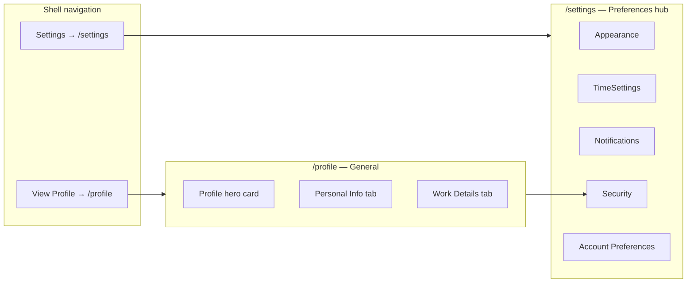
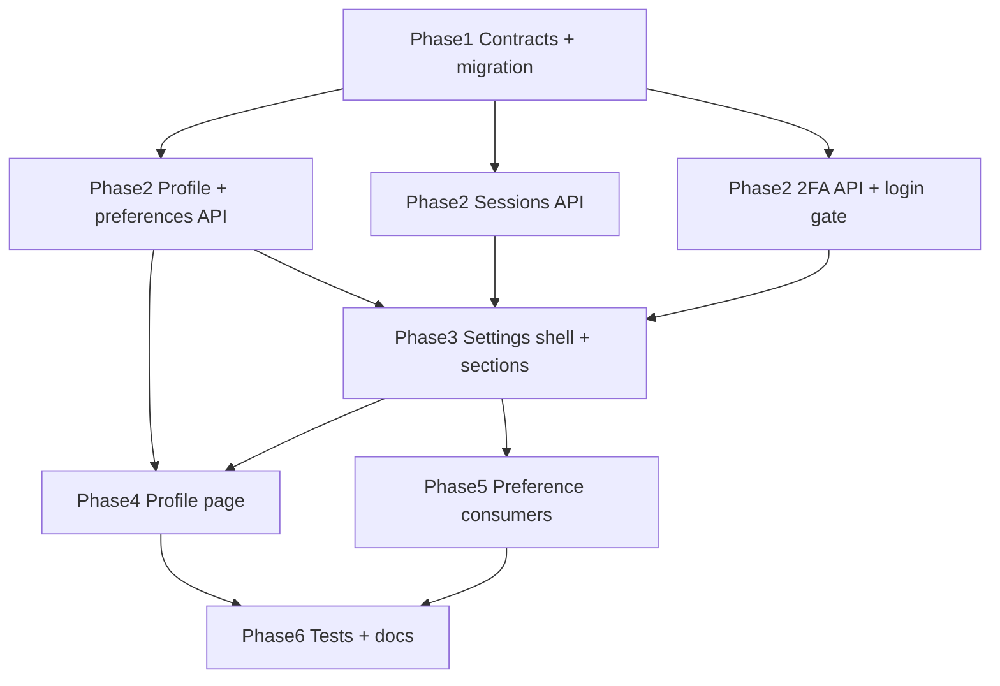

# Account & Settings UX Transform

## Target information architecture



| Route                                                              | Purpose                                                                  | Mockup reference                                  |
| ------------------------------------------------------------------ | ------------------------------------------------------------------------ | ------------------------------------------------- |
| [`/profile`](<apps/client/src/app/(workspace)/profile/page.tsx>)   | Name, contact, work fields, activity stats                               | Sarah Johnson hero + Personal Info / Work Details |
| [`/settings`](<apps/client/src/app/(workspace)/settings/page.tsx>) | Appearance, time display, notifications, security actions, account prefs | Sidebar mockups 1–5                               |

Today both apps render [`AccountSettingsPage`](packages/web-shared/src/features/account/account-settings-page.tsx) at `/settings` with a single card + 3 segmented tabs. This will be **replaced** by the split above.

---

## Phase 1 — Contracts & data model (contract-first)

### 1.1 Extend user profile DTO

File: [`packages/contracts/src/dto/user-profile.dto.ts`](packages/contracts/src/dto/user-profile.dto.ts)

Add fields to `userProfileSchema` and `updateUserProfileSchema`:

| Field                    | Type                     | Notes                                                   |
| ------------------------ | ------------------------ | ------------------------------------------------------- |
| `firstName`, `lastName`  | string                   | Compose `name` on save for backward compatibility       |
| `phone`                  | string optional          | E.164 or loose string                                   |
| `location`               | string optional          | City/region display                                     |
| `avatarUrl`              | string optional nullable | URL; upload endpoint deferred to v1 URL paste           |
| `jobTitle`, `department` | string optional          | Member-editable work context                            |
| `workStartDate`          | ISO date optional        | Maps to mockup "Start Date"                             |
| `activityStats`          | read-only object         | `{ totalHours, projectCount, memberSince }` on GET only |

Keep `email` and `defaultHourlyRate` read-only on PATCH (admin sets rate).

### 1.2 Extend user preferences schema

File: [`packages/contracts/src/user-preferences.ts`](packages/contracts/src/user-preferences.ts)

```ts
// New preference keys (all optional, merged on PATCH)
theme: "light" | "dark" | "system";
dateFormat: "MDY" | "DMY" | "YMD";
timeFormat: "12h" | "24h";
language: string; // e.g. "en"
defaultWorkspaceId: uuid;
startupPage: "dashboard" | "timer" | "timesheet" | "time-tracker";
notifications: {
  enabled: boolean;
  projectAssignment: {
    inApp: boolean;
    email: boolean;
  }
  taskAssignment: {
    inApp: boolean;
    email: boolean;
  }
  timesheetReminders: {
    inApp: boolean;
    email: boolean;
  }
  idleTimerAlert: {
    inApp: boolean;
    email: boolean;
  }
  jiraSyncUpdates: {
    inApp: boolean;
    email: boolean;
  }
}
```

Add `mergeUserPreferences()` defaults helper and update [`packages/contracts/src/contracts.spec.ts`](packages/contracts/src/contracts.spec.ts).

### 1.3 New routes

File: [`packages/contracts/src/routes.ts`](packages/contracts/src/routes.ts)

```ts
USERS: {
  ME: "/users/me",
  PREFERENCES: "/users/me/preferences",
  PASSWORD: "/users/me/password",
  SESSIONS: "/users/me/sessions",
  SESSION: (id: string) => `/users/me/sessions/${id}`,
  TWO_FA_ENABLE: "/users/me/2fa/enable",
  TWO_FA_VERIFY: "/users/me/2fa/verify",
  TWO_FA_DISABLE: "/users/me/2fa/disable",
  ACTIVITY: "/users/me/activity"   // optional: stats-only if not on GET /me
}
```

### 1.4 Prisma migration

File: [`apps/api/prisma/schema.prisma`](apps/api/prisma/schema.prisma)

**User table** — add nullable columns:

- `first_name`, `last_name`, `phone`, `location`, `avatar_url`, `job_title`, `department`, `work_start_date`
- `totp_secret` (encrypted), `totp_enabled_at`

**RefreshToken table** — add session metadata:

- `user_agent`, `ip_address`, `last_used_at`

Migration strategy for `name`: backfill `first_name`/`last_name` from existing `name` split on first space; keep `name` as canonical display string updated when first/last change.

---

## Phase 2 — API implementation

Primary module: [`apps/api/src/modules/users/`](apps/api/src/modules/users/)

### 2.1 Profile CRUD extensions

- Extend [`users.service.ts`](apps/api/src/modules/users/application/users.service.ts) `getProfile` / `updateProfile` for new columns
- Compute `activityStats` via existing time aggregation (sum `TimeLog.durationSec`, count distinct `TeamMember.projectId` or assigned projects)
- Session store sync: after name update, mirror into JWT session payload (existing pattern in [`use-user-profile.ts`](packages/web-shared/src/features/account/use-user-profile.ts))

### 2.2 Preferences extensions

- Merge new preference keys in `updatePreferences` (already JSON-merge)
- On GET `/users/me`, return resolved `effectiveTimezone`, `effectiveDateFormat`, etc. helpers in contracts

### 2.3 Security: sessions

- On login/refresh in [`auth.service.ts`](apps/api/src/modules/auth/application/auth.service.ts): persist `userAgent`, `ip`, `lastUsedAt` on `RefreshToken`
- `GET /users/me/sessions` — list non-revoked tokens for user (mask token hash; label device from UA)
- `DELETE /users/me/sessions/:id` — revoke single session; current session identifiable via cookie/header

### 2.4 Security: 2FA (TOTP)

New `users-2fa.service.ts` (or subfolder under users):

- `POST enable` → generate secret, return `otpauth://` QR payload + manual key (not enabled until verified)
- `POST verify` → validate 6-digit code, set `totpEnabledAt`
- `POST disable` → require password + TOTP code
- **Login gate** (same epic): after password valid, if `totpEnabledAt` set, require TOTP step — extend auth contracts with `requires2fa` login response shape

### 2.5 Tests

Per [`chronomint-test-delivery`](.cursor/skills/chronomint-test-delivery/SKILL.md):

- Extend [`users.service.spec.ts`](apps/api/src/modules/users/application/users.service.spec.ts)
- New specs for 2FA + sessions
- E2E in `apps/api/test/users-profile.e2e.ts` (or extend existing users e2e)

---

## Phase 3 — Shared UI primitives

Create reusable layout pieces in [`packages/web-shared/src/features/account/`](packages/web-shared/src/features/account/) (optionally promote `SettingsCard` to [`packages/ui`](packages/ui) if admin-only styling diverges).

| Component                      | Role                                                                                                                             |
| ------------------------------ | -------------------------------------------------------------------------------------------------------------------------------- |
| `settings-shell.tsx`           | Two-column layout: vertical nav (icons + active chevron) + scrollable panel                                                      |
| `settings-nav.tsx`             | Nav item list; supports `?section=` deep link                                                                                    |
| `settings-card.tsx`            | Mockup card row: icon tile, title, description, control slot                                                                     |
| `settings-save-bar.tsx`        | Sticky bottom "Save Changes" with dirty state (replaces per-section footers)                                                     |
| `theme-picker-section.tsx`     | 3 large selectable cards + live preview (extract from [`theme-toggle.tsx`](packages/web-shared/src/components/theme-toggle.tsx)) |
| `notification-channel-row.tsx` | In-App / Email toggle pair                                                                                                       |

**Settings sections** (one file each under `sections/`):

- `appearance-section.tsx` — theme picker; persists `preferences.theme` + syncs `next-themes`
- `time-settings-section.tsx` — timezone, dateFormat, timeFormat, weekStart + "Current display" preview
- `notifications-section.tsx` — master toggle + 5 channel rows
- `security-section.tsx` — action cards: Change Password (opens dialog/sheet), Enable 2FA, View Sessions
- `account-preferences-section.tsx` — language, default workspace (from [`useWorkspacesStore`](packages/web-shared/src/stores/workspaces.store.ts)), startup page

Refactor [`account-settings-page.tsx`](packages/web-shared/src/features/account/account-settings-page.tsx) → thin orchestrator using `SettingsShell` + section switcher. Default section: `appearance`.

---

## Phase 4 — Profile page (`/profile`)

New files:

- `profile-page.tsx` — main page component
- `profile-hero.tsx` — avatar initials, badges (role, workspace, active), stats strip, "Edit Photo" (URL input dialog for v1)
- `personal-info-section.tsx` — first/last name, email (read-only), phone, location
- `work-details-section.tsx` — job title, department, work start date, hourly rate (read-only), activity stat cards

Inner tabs via `SegmentedControl` (Personal Info | Work Details) — **no Security tab here**; security lives at `/settings?section=security` with cross-link.

Hook: extend [`use-user-profile.ts`](packages/web-shared/src/features/account/use-user-profile.ts) → `useUserProfile` gains `updateProfile`, `sessions`, `twoFactor` helpers.

### App routes

| App    | New route                                                               | Change                                                                       |
| ------ | ----------------------------------------------------------------------- | ---------------------------------------------------------------------------- |
| Client | `apps/client/src/app/(workspace)/profile/page.tsx`                      | New                                                                          |
| Client | [`workspace-shell.tsx`](apps/client/src/components/workspace-shell.tsx) | `profileHref="/profile"`; add Settings nav item or header link → `/settings` |
| Admin  | `apps/admin/src/app/(admin)/profile/page.tsx`                           | New (same shared component)                                                  |
| Admin  | settings page unchanged path, new UI                                    |                                                                              |

Export from [`packages/web-shared/src/index.ts`](packages/web-shared/src/index.ts): `ProfilePage`, `AccountSettingsPage`.

---

## Phase 5 — Preference consumption (wire-up)

Settings are useless until apps read them:

| Preference                                          | Consumer                                                                                                              |
| --------------------------------------------------- | --------------------------------------------------------------------------------------------------------------------- |
| `theme`                                             | [`Providers`](packages/web-shared/src/components/providers.tsx) — hydrate `next-themes` from GET `/users/me` on login |
| `timezone`, `weekStart`, `dateFormat`, `timeFormat` | [`timesheet-page.tsx`](apps/client/src/features/timesheet/timesheet-page.tsx), time-tracker, export date labels       |
| `startupPage`                                       | Post-login redirect in client shell                                                                                   |
| `defaultWorkspaceId`                                | Workspace switcher default on login                                                                                   |
| `notifications.*`                                   | Stub dispatch for now (store only); mailer reads later                                                                |

Use existing [`resolveEffectiveTimezone`](packages/contracts/src/user-preferences.ts) and add `formatUserDateTime()` helper in contracts or web-shared.

---

## Phase 6 — QA & docs

- Unit tests: each new section component (`*.spec.tsx` in web-shared)
- Playwright: `apps/client/e2e/profile.spec.ts`, `apps/client/e2e/settings.spec.ts` — navigate sections, save profile name, change theme
- Update [`docs/specs/user-profile.md`](docs/specs/user-profile.md) with new fields, routes, and `/profile` vs `/settings` split
- Pre-PR gate: `pnpm format:check && pnpm lint && pnpm typecheck && pnpm test && pnpm build`

---

## Suggested delivery order (task board)

Work strictly contract → API → UI → integration → tests per section to avoid drift.



---

## Key risks and decisions

1. **2FA + login flow** is the highest-risk slice — touches auth contracts, login UI, and refresh flow. Ship sessions + profile first if timeline slips; keep 2FA behind feature flag until login gate is tested.
2. **Name migration** — keep `name` as denormalized display field; API accepts `firstName`/`lastName` and writes both + `name`.
3. **Avatar** — v1: URL text field only; file upload is a follow-up (S3/presigned URLs).
4. **Notification email** — preferences persist now; no mailer sends in this epic (matches existing roadmap).
5. **Impersonation** — retain existing guard: no PATCH on profile/preferences/password/2FA while impersonating ([`users.controller.ts`](apps/api/src/modules/users/interface/http/users.controller.ts)).

---

## Files most impacted

| Layer     | Files                                                                                                    |
| --------- | -------------------------------------------------------------------------------------------------------- |
| Contracts | `user-profile.dto.ts`, `user-preferences.ts`, `routes.ts`, `contracts.spec.ts`                           |
| API       | `schema.prisma`, `users.service.ts`, `users.controller.ts`, `auth.service.ts`, new 2fa/sessions services |
| Shared UI | `account-settings-page.tsx` + ~12 new section/shell files, `use-user-profile.ts`, `theme-toggle.tsx`     |
| Client    | `profile/page.tsx`, `workspace-shell.tsx`                                                                |
| Admin     | `profile/page.tsx`, shell header links                                                                   |
