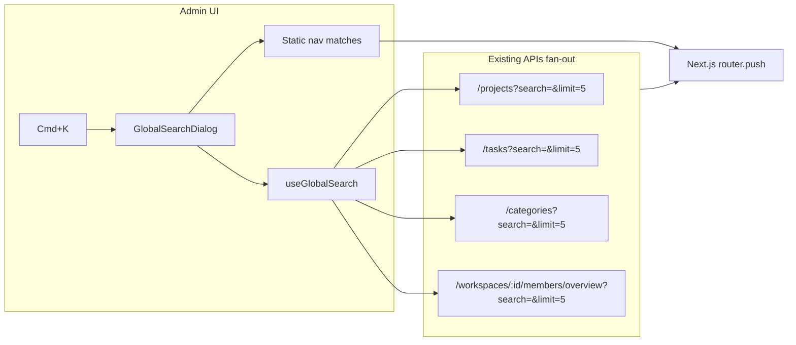

# Admin global search plan

## Goal

Give workspace **admins** a single entry point—**⌘K / Ctrl+K**—to jump anywhere in the admin app and find **projects, tasks, categories, and team members** without leaving the current page. Admin-only is intentional; the client app stays unchanged.

## Current state

- No global search, `cmdk`, or keyboard shortcut anywhere in the monorepo.
- Admin shell ([`apps/admin/src/components/admin-shell.tsx`](apps/admin/src/components/admin-shell.tsx)) has 10 static sidebar routes; header ([`ShellHeaderActions`](packages/web-shared/src/components/shell-header-actions.tsx)) has notifications/theme/settings only.
- Page-local search already exists via `usePaginatedList` + `TableToolbar` on projects, categories, team management.
- Four list APIs already support `search` and are admin-accessible:

| Entity | Route | Search fields |
|--------|-------|---------------|
| Projects | `GET /projects` | name, clientName |
| Tasks | `GET /tasks` | taskName, category name |
| Categories | `GET /categories` | name, description |
| Team members | `GET /workspaces/:id/members/overview` | name, email |

**Out of v1 scope** (document as future): timesheets/approvals, notifications, billing rates, exports, reporting aggregates, unified `GET /search`.



---

## BA deliverable: `docs/specs/global-search.md`

Create this **before** any code (per [`role-ba.md`](.cursor/rules/role-ba.md) and [`chronomint-feature-delivery`](.cursor/skills/chronomint-feature-delivery/SKILL.md)). Follow the same structure as [`docs/specs/reporting.md`](docs/specs/reporting.md).

### Sections to include

**1. User-visible outcome**
- **Admins** open global search from anywhere in the admin app via **⌘K** (Mac) / **Ctrl+K** (Windows/Linux) or a header search affordance.
- Results grouped: **Pages**, **Projects**, **Tasks**, **Categories**, **People**.
- Selecting a result navigates to the correct admin destination.
- Empty query shows **Pages** only (quick jump).
- Typing ≥2 characters triggers entity search (debounced 300ms, matching existing list pattern in [`use-paginated-list.ts`](packages/web-shared/src/hooks/use-paginated-list.ts)).

**2. Scope & exclusions**
- Admin app only (`apps/admin`); no client/member surface.
- No cross-workspace search; scoped to active workspace from session.
- No free-text search on approvals, notifications, billing, or exports in v1.
- Clients are not a separate entity; project `clientName` matches via project search.

**3. API** (reuse existing — no new route in v1)

| Method | Route | Roles | Purpose |
|--------|-------|-------|---------|
| GET | `/projects?search=&limit=5` | ADMIN | Project hits |
| GET | `/tasks?search=&limit=5` | ADMIN | Task hits |
| GET | `/categories?search=&limit=5` | ADMIN | Category hits |
| GET | `/workspaces/:id/members/overview?search=&limit=5` | ADMIN | People hits |

Link to [`packages/contracts/src/pagination.ts`](packages/contracts/src/pagination.ts) (`search` 1–200 chars) and existing DTOs. Note: v1 needs **no new contract route**; optional shared **frontend-only** result type in `web-shared` is acceptable without a contract gate.

**4. Navigation targets (deep links)**

| Result type | Destination |
|-------------|-------------|
| Page | Static route from `baseNav` in admin-shell |
| Project | `/projects/:id` |
| Task | `/projects/:projectId` (tasks tab — confirm tab query/hash convention in [`project-detail-nav.tsx`](apps/admin/src/features/projects/project-detail-nav.tsx)) |
| Category | `/categories` (highlight optional in v2) |
| Person | `/team-management` with optional `?search=` prefill (reuse team page search param if present) |

**5. Behavior / domain rules**
- Minimum query length: **2** chars before API fan-out (1 char = nav-only).
- Debounce: **300ms**; cancel in-flight requests on new input (AbortController).
- Parallel fan-out; show per-group loading skeleton; partial results OK if one call fails.
- Cap: **5 hits per entity group**; show “View all in …” row linking to the list page with `?search=` when `total > 5`.
- RBAC: only render palette when `session.workspaceRole === "ADMIN"` (already enforced by admin shell).
- Keyboard: ↑↓ navigate, Enter select, Esc close; trap focus in dialog.

**6. Given / When / Then** (acceptance criteria)

Examples to include:
- **When** admin presses ⌘K on any admin page → palette opens, Pages group lists all sidebar destinations.
- **When** admin types “acme” (≥2 chars) → Projects/Tasks/Categories/People groups populate from API.
- **When** admin selects a project → navigates to `/projects/:id`, palette closes.
- **When** admin selects “Approvals” page → navigates to `/approvals`.
- **When** search returns no entity matches → show “No results” in entity sections; Pages still filter locally.
- **When** one API call fails → other groups still render; failed group shows subtle error or is omitted.
- **When** workspace is switched while palette is open → close palette and clear results.

**7. UI**
- Entry: `GlobalSearchTrigger` in admin shell `shellToolbar` (search icon + “Search…” hint with ⌘K badge).
- Feature folder: `apps/admin/src/features/global-search/`
- Dependency: add **`cmdk`** (industry standard; not in repo today) — either in `packages/ui` as a wrapped `Command` primitive or directly in admin if you want minimal UI package churn.

**8. Edge cases**
- Slow network / race: stale response discarded if query changed.
- Special characters in query: pass through URL encoding via existing `buildListQuery`.
- Member with no assigned projects still appears in People search.
- Task without resolvable `projectId` in DTO: omit or link to projects list (document chosen behavior).

**9. Follow-ups (document, don’t build in v1)**
- Unified `GET /search` for ranking and single round-trip.
- Timesheet/approval text search.
- Wire ignored `search` on notifications and billing ([`notifications.service.ts`](apps/api/src/modules/notifications/application/notifications.service.ts), billing `listRates`).
- Recent searches (localStorage).
- Client app parity (out of scope).

Also register in [`TASK_BOARD.json`](TASK_BOARD.json), [`docs/README.md`](docs/README.md) spec table, and [`docs/architecture/PRODUCT_ROADMAP.md`](docs/architecture/PRODUCT_ROADMAP.md) when shipped.

---

## Implementation (after BA + optional contract note)

### 1. UI package / dependency

- Add `cmdk` to `packages/ui` or `apps/admin`.
- Wrap with existing `Dialog` from [`packages/ui`](packages/ui/src/index.ts) for modal shell and a11y.

### 2. Admin feature module

New folder: [`apps/admin/src/features/global-search/`](apps/admin/src/features/global-search/)

| File | Responsibility |
|------|----------------|
| `global-search-dialog.tsx` | cmdk UI, grouped sections, keyboard handling |
| `use-global-search.ts` | debounce, AbortController, parallel `fetchPaginatedList` calls |
| `global-search-nav.ts` | static page items from `baseNav` + local filter |
| `global-search-results.ts` | map API DTOs → `{ id, label, subtitle, href, type }` |
| `global-search-trigger.tsx` | header button + shortcut listener |

### 3. Wire into shell

In [`admin-shell.tsx`](apps/admin/src/components/admin-shell.tsx):
- Mount `GlobalSearchDialog` at shell level (open state).
- Extend `shellToolbar` with trigger before `ShellHeaderActions`.
- Global `useEffect` keydown listener for `(meta|ctrl)+k`.

Extract `baseNav` to a shared module so nav items are single-sourced for sidebar and palette.

### 4. Search hook pattern

Reuse [`buildListQuery`](packages/web-shared/src/api/list-query.ts) and [`fetchPaginatedList`](packages/web-shared/src/api/fetch-list-items.ts):

```typescript
// Conceptual fan-out (limit=5 each)
Promise.all([
  fetchPaginatedList(ROUTES.PROJECTS.LIST, { search: q, limit: 5, page: 1 }),
  fetchPaginatedList(ROUTES.TASKS.LIST, { search: q, limit: 5, page: 1 }),
  // ...
]);
```

### 5. Tests (per [`chronomint-test-delivery`](.cursor/skills/chronomint-test-delivery/SKILL.md))

| Layer | What to test |
|-------|----------------|
| Unit | `use-global-search` debounce, abort, result mapping, nav filter |
| Unit | `global-search-results` href builders |
| Component | dialog opens on shortcut, groups render, selection calls router |
| E2E | `apps/admin/e2e/global-search.spec.ts` — open palette, type query, navigate to project |

### 6. Pre-PR

```bash
pnpm format:check && pnpm lint && pnpm typecheck && pnpm test && pnpm build
```

---

## Delivery order

1. **BA** — write [`docs/specs/global-search.md`](docs/specs/global-search.md) with sections above; add task to `TASK_BOARD.json`.
2. **Contracts** — skip new API route; document reused endpoints in spec only.
3. **QA** — failing unit/e2e tests for palette + fan-out hook.
4. **FE** — `cmdk` dialog, hook, shell wiring in `apps/admin`.
5. **Docs** — update `docs/README.md`, roadmap, optional one-liner in [`docs/user-guides/admin/getting-started.md`](docs/user-guides/admin/getting-started.md).

No BE work required for v1 unless you later add unified search or fix notifications/billing `search` gaps.
