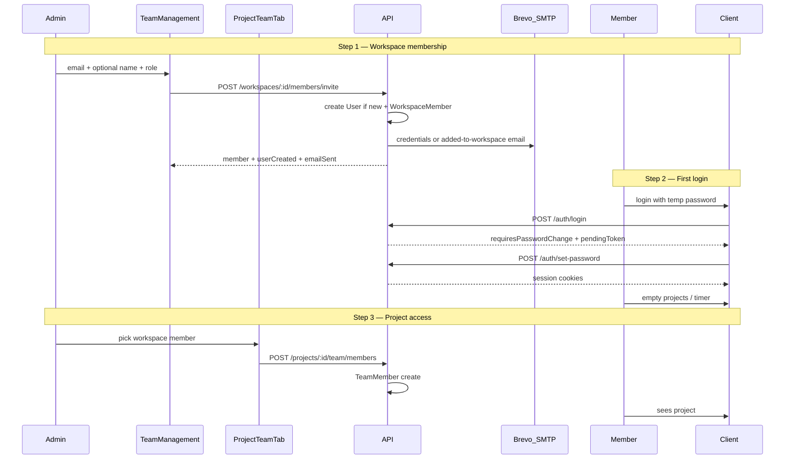

# Admin-provisioned members — revised plan (UI + design audit)

## Research gaps found (addressed in this revision)

| Gap                                     | Current state                                | v1 fix                                                   |
| --------------------------------------- | -------------------------------------------- | -------------------------------------------------------- |
| Self-register still linked from login   | `/register` + footer link                    | Remove UI; `403` on API                                  |
| Workspace invite requires existing user | `"User must register first"`                 | Create user + temp password in `invite()`                |
| Invite API returns raw Prisma row       | Missing `userName` / `userEmail` vs contract | Return `inviteMemberResponseSchema`                      |
| No `emailSent` feedback to admin        | Silent skip when SMTP unset                  | Response `emailSent` + `emailSkipReason`; toast variants |
| Generic UI errors                       | Single catch message                         | Parse `api()` error + `ErrorCodes`                       |
| Team overview load errors ignored       | `error` from hook not shown                  | Toast on load failure                                    |
| Project team = invite link only         | Card + manual copy; `window.confirm`         | **Direct add** from workspace member picker              |
| No `POST /projects/:id/team/members`    | Only PATCH/DELETE member                     | New contract route + service method                      |
| Forced password change                  | Not implemented                              | Mirror 2FA `pendingToken` pattern                        |
| 2FA + forced password order             | Undefined                                    | **Password change first**, then 2FA, then session        |
| `mustChangePassword`                    | Not in DB/JWT                                | Prisma flag; gate before cookies                         |
| Mailer `send()` silent                  | No return value                              | Return `{ sent, reason }` for `emailSent`                |
| No member-provisioning tests            | e2e only loads team page                     | Full flow e2e + service specs                            |
| Client empty projects UX                | Exists but no admin guidance                 | Cross-link copy in admin + member guide                  |

**Deferred post-v1:** forgot-password, email verification, invite-link fallback on project tab, admin provisioning of other admins via same flow (seeds/DB only for admins in v1).

---

## End-to-end flow (professional v1)



## Membership ordering rule

| Step | Admin UI                            | API                                            | Member sees             |
| ---- | ----------------------------------- | ---------------------------------------------- | ----------------------- |
| 1    | Team Management → Add member        | `POST .../members/invite`                      | —                       |
| 2    | —                                   | `POST /auth/login` → `POST /auth/set-password` | Client app, no projects |
| 3    | Project → Team → Add from workspace | `POST .../team/members`                        | Project in client       |

---

## Phase 1 — Contracts (first)

[`packages/contracts`](packages/contracts) — all changes before API/FE.

**Workspace invite**

```typescript
// workspace.dto.ts — extend request
inviteMemberSchema = z.object({
  email: z.string().email(),
  role: workspaceRoleSchema.default("MEMBER"),
  name: z.string().min(1).max(120).optional()
});

// workspace.dto.ts — new response (fixes raw Prisma leak)
inviteMemberResponseSchema = z.object({
  member: workspaceMemberSchema,
  userCreated: z.boolean(),
  emailSent: z.boolean(),
  emailSkipReason: z.enum(["smtp_unconfigured", "send_failed"]).optional()
});
```

**Project direct add**

```typescript
// team.dto.ts
addTeamMemberSchema = z.object({ userId: uuidSchema });

// routes.ts
ROUTES.PROJECTS.TEAM_MEMBERS = (id) => `/projects/${id}/team/members`;
// POST create; existing TEAM_MEMBER(projectId, memberId) stays PATCH/DELETE
```

**Auth forced password**

- `loginRequiresPasswordChangeResponseSchema` — `{ requiresPasswordChange: true, pendingToken }` (mirror [`loginRequires2faResponseSchema`](packages/contracts/src/dto/user-profile.dto.ts))
- `setInitialPasswordSchema` — `{ pendingToken, newPassword }`
- `ROUTES.AUTH.SET_PASSWORD` → `POST /auth/set-password`

**Errors:** add `MEMBER_ALREADY_EXISTS` (409 duplicate workspace member); keep `EMAIL_EXISTS` for edge cases.

Update [`contracts.spec.ts`](packages/contracts/src/contracts.spec.ts), [`docs/api/ROUTES.md`](docs/api/ROUTES.md).

**Register:** deprecate in docs; API returns `403` — do not remove `registerSchema` yet.

---

## Phase 2 — Database

[`schema.prisma`](apps/api/prisma/schema.prisma):

```prisma
mustChangePassword Boolean @default(false) @map("must_change_password")
```

Seeds: `mustChangePassword: false` for `admin@` / `member@`.

---

## Phase 3 — Disable self-registration

- [`auth.controller.ts`](apps/api/src/modules/auth/interface/http/auth.controller.ts): `POST /auth/register` → `403`
- Remove [`register/page.tsx`](<apps/client/src/app/(auth)/register/page.tsx>) (redirect to `/login`)
- Remove footer link in [`login-form.tsx`](<apps/client/src/app/(auth)/login/login-form.tsx>)
- e2e: register returns 403

---

## Phase 4 — Workspace provision + email

Refactor [`workspace.service.invite()`](apps/api/src/modules/workspace/application/workspace.service.ts):

| Case                            | Behavior                                                                                                                |
| ------------------------------- | ----------------------------------------------------------------------------------------------------------------------- |
| New email                       | Create `User` (temp password, `mustChangePassword: true`, name from `dto.name` or email local-part) + `WorkspaceMember` |
| Existing user, not in workspace | `WorkspaceMember` only + notification email (no password)                                                               |
| Already member                  | `409 MEMBER_ALREADY_EXISTS`                                                                                             |

**Never return temp password in API body** — email or dev log only.

New [`member-provisioning.mailer.ts`](apps/api/src/common/mailer/member-provisioning.mailer.ts):

- HTML + plain text
- Subject: `[Kloqra] You've been added to {workspaceName}`
- Login URL: first origin from `FRONTEND_ORIGIN` (same as [`projects.service.ts`](apps/api/src/modules/projects/application/projects.service.ts) `clientOrigin()`)
- Inviter name from acting admin (pass `invitedByUserId` from controller)

Enhance [`mailer.service.ts`](apps/api/src/common/mailer/mailer.service.ts):

```typescript
send(opts): Promise<{ sent: boolean; reason?: "unconfigured" | "failed" }>
```

**Policy:** invite **succeeds** even if email fails → `emailSent: false`, `emailSkipReason`.

Extract shared `hashPassword` / `generateTempPassword` helper (avoid duplicating `auth.service` bcrypt logic).

Tests: [`workspace.service.spec.ts`](apps/api/src/modules/workspace/application/workspace.service.spec.ts), `member-provisioning.mailer.spec.ts`.

---

## Phase 5 — Forced password change (mirror 2FA)

Reuse patterns from [`auth.service.ts`](apps/api/src/modules/auth/application/auth.service.ts) (`purpose: "2fa-pending"`).

**Login order (explicit):**

1. Verify email + password
2. If `mustChangePassword` → `{ requiresPasswordChange, pendingToken }` — **no cookies**
3. Else if 2FA enabled → `{ requires2fa, pendingToken }`
4. Else → full session + cookies

**New:** `purpose: "password-change-pending"` JWT (5m TTL).

**`POST /auth/set-password`:** verify token → set password → clear flag → revoke old refresh tokens → return session + cookies.

**UI** (shared in [`web-shared`](packages/web-shared)):

- New [`set-password-form.tsx`](packages/web-shared/src/features/account/set-password-form.tsx) — new + confirm (reuse validation from [`change-password-section.tsx`](packages/web-shared/src/features/account/change-password-section.tsx), **no current password**)
- [`apps/client/src/app/(auth)/set-password/page.tsx`](<apps/client/src/app/(auth)/set-password/page.tsx>)
- [`apps/admin/src/app/(auth)/set-password/page.tsx`](<apps/admin/src/app/(auth)/set-password/page.tsx>) — admin temp-password path
- Update [`login-form.tsx`](<apps/client/src/app/(auth)/login/login-form.tsx>) + [`admin login`](apps/admin/src/app/login/page.tsx): branch on `requiresPasswordChange` → `/set-password?token=...` or in-memory state like 2FA

Optional: show banner on login when `?reason=password-changed` (already set by voluntary change flow).

---

## Phase 6 — Project direct add (new in v1)

**API** — [`projects.service.ts`](apps/api/src/modules/projects/application/projects.service.ts):

```typescript
async addTeamMember(workspaceId, projectId, userId) {
  // verify project in workspace
  // verify user is WorkspaceMember
  // ensureTeam(projectId)
  // upsert TeamMember; 409 if already on team
}
```

**Controller** — [`projects.controller.ts`](apps/api/src/modules/projects/interface/http/projects.controller.ts): `POST ROUTES.PROJECTS.TEAM_MEMBERS(":id")`, ADMIN guard.

**Admin UI** — rewrite [`project-team-tab.tsx`](apps/admin/src/features/projects/project-team-tab.tsx):

| Remove / replace             | Add                                       |
| ---------------------------- | ----------------------------------------- |
| Invite link card + copy flow | `AppModal` “Add team member”              |
| `window.confirm` on remove   | `ConfirmDialog` (match team management)   |
| Plain empty state            | `EmptyState` + link to `/team-management` |

**Picker:** load workspace members from `GET /workspaces/:id/members/overview` (or `listMembers`); filter out users already on project team; `Select` or combobox by name/email.

**Optional notification email** when added to project (v1 nice-to-have; can be toast-only).

Tests: `projects.service.spec.ts`, admin e2e `project-team.spec.ts` (add member → visible in table).

**Client invite route** [`/invite/[token]`](apps/client/src/app/invite/[token]/page.tsx): keep for backward compatibility but **not exposed in admin v1 UI**.

---

## Phase 7 — Team Management UI polish

[`team-management-page.tsx`](apps/admin/src/features/team-management/team-management-page.tsx):

- Optional **Name** field (placeholder: “Defaults from email if blank”)
- Modal copy: _“Add a workspace member. New users receive sign-in credentials by email.”_
- Role helper text: Admin vs Member permissions (one line each)
- Success toasts driven by `InviteMemberResponseDto`:
  - `userCreated && emailSent` → “Account created and email sent.”
  - `userCreated && !emailSent` → “Member added. Email not sent — check mail configuration.”
  - `!userCreated` → “Existing user added to workspace.”
- Errors: use `err.message` from `api()`; map `MEMBER_ALREADY_EXISTS` vs validation
- Show `useTeamMembersOverview` load errors (toast)
- Profile dialog: link “Add to project →” when `projectCount === 0` (navigate to projects list or deep link later)

e2e: [`team-management.spec.ts`](apps/admin/e2e/team-management.spec.ts) — submit invite, assert table row (with SMTP unset + log path).

---

## Phase 8 — Wire Brevo

Ops checklist: [brevo_email_setup plan](.cursor/plans/brevo_email_setup_656adf10.plan.md).

```bash
SMTP_HOST=smtp-relay.brevo.com
SMTP_PORT=587
SMTP_USER=<brevo-login-email>
SMTP_PASS=<brevo-smtp-key>
SMTP_FROM=Kloqra <noreply@kloqra.app>
FRONTEND_ORIGIN=http://localhost:3000,http://localhost:3002
```

Document in [`apps/api/.env.example`](apps/api/.env.example), [`ENVIRONMENT.md`](docs/development/ENVIRONMENT.md), deploy env examples.

**Verify:** Team Management add member → Brevo logs → inbox → login → set password → direct project add → client sees project.

---

## Phase 9 — Docs and seeds

- [`auth-workspace.md`](docs/specs/auth-workspace.md) — closed signup, provision flow, response shape
- [`member/getting-started.md`](docs/user-guides/member/getting-started.md) — no self-register; admin adds you; check email for password
- [`projects-and-teams.md`](docs/user-guides/admin/projects-and-teams.md) — workspace first, then project picker
- [`CONTRIBUTING.md`](docs/development/CONTRIBUTING.md) — remove register references
- Admins: seed or manual DB only (`mustChangePassword: false`)

---

## Security

- Temp password email-only; forced change before any session cookies
- Rate-limit: invite + set-password (5/min)
- `addTeamMember` verifies workspace membership server-side (never trust client)
- Audit log temp password generation in dev only (structured log, no PII in production logs beyond email hash optional)

---

## Out of scope (v1)

- Forgot-password / self-service reset
- Email verification / double opt-in
- Project invite link UI (API + client accept remain for legacy tokens)
- Public `registerSchema` removal from contracts
- Admin-created ADMIN users via UI (use seeds/DB; UI role select stays but document as advanced)

---

## Test checklist (pre-PR)

- `pnpm format:check && pnpm lint && pnpm typecheck && pnpm test && pnpm build`
- API: workspace invite (new/existing/duplicate), set-password, addTeamMember, register 403
- Admin e2e: team-management invite + project team add
- Client: login → set-password → empty projects
- Manual + Brevo: full flow through project visibility on client
