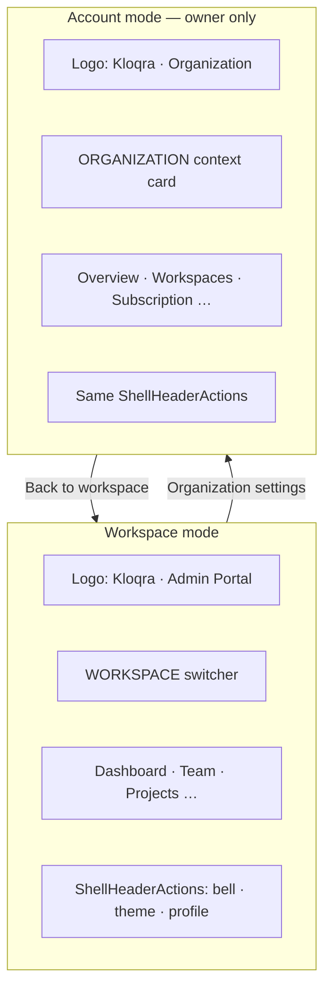

# Admin sidebar: role hierarchy + nav scope split

## Verification summary (docs + schema + code — June 2026)

**Verdict: Plan is directionally correct and matches API enforcement, specs, and user-confirmed hierarchy. Three corrections and two doc conflicts noted below.**

---

## Project lead RBAC — why it feels messy (and what we’re doing)

### It’s intentional, not a bug

Project lead is **not** a workspace admin. It is a **project-scoped PM** layer:

| Layer | Storage | Meaning |
| ----- | ------- | ------- |
| Workspace | `workspace_members.role = MEMBER` | Staff in the workspace; uses **client** for time logging |
| Project | `team_members.role = LEAD` | PM for **specific projects** only |

This was a deliberate SaaS decision ([`SAAS_PLATFORM_PLAN.md`](docs/architecture/SAAS_PLATFORM_PLAN.md) D06): avoid a workspace-level “PM” role that overlaps workspace admin. Enforcement is solid:

- [`ProjectAccessService`](apps/api/src/common/access/project-access.service.ts) — `assertCanManageProject`, `ledProjectIds`
- [`AdminOrProjectLeadGuard`](apps/api/src/common/guards/admin-or-project-lead.guard.ts) — admin **or** any `ledProjectIds`
- E2E: [`project-lead.e2e.ts`](apps/api/test/project-lead.e2e.ts) — task create/approve scoped to led projects only
- Categories / project create: `@Roles("ADMIN")` only — **leads cannot** manage workspace categories or create projects ([`project-lead.md`](docs/specs/project-lead.md) matrix)

### Your mental model vs current product

You described project lead as an **assistant admin** (approvals, categories, task creation). **Partial match:**

| Capability | Project lead today | Workspace admin |
| ---------- | ------------------ | --------------- |
| Approve timesheets | Yes — **led projects only** | Yes — all projects |
| Create / edit tasks | Yes — **led projects only** | Yes — all projects |
| Project team invites | Yes — **led projects only** | Yes |
| **Categories CRUD** | **No** (workspace-wide) | Yes |
| **Create projects** | **No** | Yes |
| Team Management (workspace) | No | Yes |
| Exports / hourly rates | No | Yes |

Categories are **workspace-scoped**, not project-scoped — giving leads category access would break the isolation model without a larger redesign.

### Why UX feels wrong

The **same person** is labeled “Member” in the workspace switcher but uses the **admin app** with a cut-down nav — that’s the messiness, not broken guards.

**Decision (confirmed):** Keep RBAC as-is for this initiative. Fix **labeling and scope communication** only — present leads as **Project Manager**, not “member who leads.”

### UX-only fixes (in scope)

- Workspace switcher subtitle: `Project manager` instead of `Member` when `ledProjectIds.length > 0` and `workspaceRole === MEMBER`
- Shell scope line: `Project manager · {workspace}` (Badge or muted text)
- AppBar on Dashboard/Approvals: `Managing N projects` in description
- Optional empty-state copy on restricted routes: “Workspace-wide tools are managed by your workspace admin.”
- **Do not** call them “Member” anywhere in admin shell chrome

### Out of scope (future epic if product changes)

- New `workspace_members.role` (e.g. `ASSISTANT_ADMIN`)
- Category or project-create permissions for leads
- Merging client + admin into one app for dual-hat users

---

## Canonical role hierarchy (verified)

```
Platform admin  →  Tenant owner  →  Workspace admin  →  Project lead  →  Member
```

### Schema mapping ([`schema.prisma`](apps/api/prisma/schema.prisma))

| Hierarchy level | Table / field | Values |
| --------------- | ------------- | ------ |
| Platform admin | `platform_users.role` | `SUPERADMIN` |
| Tenant owner / delegate | `tenant_members.role` | `OWNER` \| `ADMIN` ([`tenant-rbac.ts`](packages/contracts/src/tenant-rbac.ts)) |
| Workspace admin / member | `workspace_members.role` | `ADMIN` \| `MEMBER` |
| Project lead | `team_members.role` | `LEAD` \| `MEMBER` |

Constraints verified:
- `users.tenantMembership` — at most **one** `tenant_members` row per user (D08)
- `workspace_members` — unique `(workspace_id, user_id)`
- Session JWT carries `tenantId`, `tenantRole?`, `workspaceId`, `workspaceRole`, `ledProjectIds?` ([`auth.dto.ts`](packages/contracts/src/dto/auth.dto.ts)) — no `tenantName`

### App routing (verified against [`TENANT_RBAC.md`](docs/architecture/TENANT_RBAC.md) §4, [`SAAS_PLATFORM_PLAN.md`](docs/architecture/SAAS_PLATFORM_PLAN.md) §5)

| Level | App | Nav |
| ----- | --- | --- |
| Platform admin | `platform-admin` | Ops sidebar; profile/settings in header |
| Tenant owner | `admin` | Account mode `/account/*` **and** Workspace mode when `workspaceRole === ADMIN` or project lead |
| Workspace admin | `admin` | Workspace mode — full [`ADMIN_NAV_ITEMS`](apps/admin/src/config/admin-nav.ts) |
| Project lead | `admin` | Workspace mode — [`projectLeadNavItems()`](apps/admin/src/config/project-lead-nav.ts); shell labels **Project manager** (not Member) |
| Member | `client` | Out of scope |

---

## API permission verification (account vs workspace)

| Account route / API | Guard | Matches plan? |
| ------------------- | ----- | ------------- |
| `GET /tenants/current` | Any authenticated tenant user | Yes — org read for context |
| `PATCH /tenants/current`, overview, analytics, subscription, checkout, data export | `@TenantRoles("OWNER")` | Yes — **OWNER only** |
| `GET /tenants/members` | `@TenantRoles("OWNER", "ADMIN")` | Tenant ADMIN has **API-only** member list — no account UI in plan |
| Workspace ops (`/dashboard`, projects, etc.) | `workspaceRole` + LEAD guards | Yes — workspace admin / lead |

Specs explicitly align:
- [`tenant-analytics.md`](docs/specs/tenant-analytics.md): rollup **OWNER only**; "Tenant ADMIN access — out of scope v1"
- [`subscriptions.md`](docs/specs/subscriptions.md): billing routes **OWNER only**; banner for owners in shell

**Conclusion:** OWNER-only Account UI matches implemented API + feature specs, not the broader wording in TENANT_RBAC §2 for tenant ADMIN.

---

## Doc conflicts to resolve (fast-follow)

| Source | Says | Reality in code | Plan action |
| ------ | ---- | --------------- | ----------- |
| [`TENANT_RBAC.md`](docs/architecture/TENANT_RBAC.md) §1 | "Owner, optional Admin delegate → Account mode" | Only OWNER can use account APIs | Update doc: tenant ADMIN = delegate for narrow APIs (e.g. members list), **not** Account sidebar |
| [`TENANT_RBAC.md`](docs/architecture/TENANT_RBAC.md) §2 tenant ADMIN | "Help manage account settings" | No PATCH/overview/billing for ADMIN | Doc overstates v1; defer delegate UI or scope to members list only |
| [`TENANT_RBAC.md`](docs/architecture/TENANT_RBAC.md) §12 | `account/layout.tsx` with Account sub-nav | **Not implemented** | Dual-mode `AdminShell` fulfills §4 intent ("owner lands on Account, workspace operators on Workspace") |

---

## Plan corrections from verification

### 1. Remove unsupported persona: "owner without workspace ops"

[`TENANT_RBAC.md`](docs/architecture/TENANT_RBAC.md) persona **Alex** (`OWNER` only) cannot use `admin` today:
- [`login/page.tsx`](apps/admin/src/app/login/page.tsx) requires `workspaceRole === "ADMIN"`
- [`bootstrapSession`](packages/web-shared/src/auth/bootstrap-session.ts) uses `requiredRole: "ADMIN"` (+ `allowProjectLead`)

Seed owner (`admin@kloqra.dev`) is always in `WORKSPACE_ADMIN_EMAILS` — has workspace ADMIN row.

**Corrected rule:** Tenant owner accesses Account mode **and** Workspace mode only when also workspace ADMIN or project lead. Account-only owner is doc persona, not supported login path (out of scope unless auth changes).

### 2. Distinguish two "billing" surfaces (avoid regressions)

| Path | Label in nav | Scope | Who |
| ---- | ------------ | ----- | --- |
| `/billing` | Hourly rates | Workspace client billing rates | Workspace admin (not project lead) |
| `/account/billing` | Subscription | SaaS plan / Stripe | Tenant owner only |

Project lead spec correctly excludes `/billing` from [`LEAD_ALLOWED_HREFS`](apps/admin/src/config/project-lead-nav.ts).

### 3. Fix pre-existing shell issue (include in this work)

[`admin-shell.tsx`](apps/admin/src/components/admin-shell.tsx) calls `useTenantSubscription()` for **all** users; API is OWNER-only → 403 for workspace admins on every load. **Gate hook/banner to `tenantRole === "OWNER"`** (billing alert already gated).

### 4. Multi-workspace owner landing — confirmed bug

| Flow | Destination | Verified |
| ---- | ----------- | -------- |
| Single-workspace owner login | `/account` via [`resolveAdminLandingPath`](packages/web-shared/src/auth/resolve-admin-landing-path.ts) | Yes |
| Multi-workspace owner login | `/select-workspace` → `/dashboard` via [`select-workspace/page.tsx`](apps/admin/src/app/select-workspace/page.tsx) | **Inconsistent** |

**Decision (recommended):** After workspace pick, owners → `/account`; others → `/dashboard`. Update `WorkspaceSelectForm` or pass owner-aware `defaultRedirect`.

---

## Target navigation (verified)

### Workspace mode (`/dashboard`, `/team-management`, …)

| Actor | Sidebar | Account links |
| ----- | ------- | ------------- |
| Tenant owner + workspace ADMIN | `ADMIN_NAV_ITEMS` | None; switcher footer → Organization settings |
| Tenant owner + project lead only | `projectLeadNavItems()` | None |
| Workspace admin (`ops@` — tenant ADMIN + ws ADMIN) | `ADMIN_NAV_ITEMS` | None; `/account` → redirect |
| Project lead | `projectLeadNavItems()` | None; `/account` → redirect |

### Account mode (`/account/*`)

| Actor | Sidebar | Top slot |
| ----- | ------- | -------- |
| Tenant owner | `ACCOUNT_NAV_ITEMS` | Org name (`useTenantCurrent`) + Back to [workspace] |
| Everyone else | — | Redirect `/dashboard` |

[`account-nav.ts`](apps/admin/src/config/account-nav.ts) items match [`TENANT_RBAC.md`](docs/architecture/TENANT_RBAC.md) §12 component map (overview, workspaces, organization, billing, data-privacy).

---

## UI / UX design (professional, consistent, role-aware)

Design goal: **one shell, two clear mental models** — Organization (owner) vs Workspace (operators) — with the same visual language as [`platform-shell.tsx`](apps/platform-admin/src/components/platform-shell.tsx) and existing [`shell-styles.ts`](packages/ui/src/components/shell/shell-styles.ts). No new color system; extend primitives only where reused twice.

### Design principles

1. **Single scope per sidebar** — never mix org links with workspace ops (fixes current UX failure).
2. **Chrome reflects context** — subtitle, top slot, and nav list all agree on Organization vs Workspace.
3. **Operators feel complete** — workspace admin sees full ops nav; project lead sees intentional subset, not a broken admin UI.
4. **Owner mode switch is obvious** — one click in workspace switcher to Organization; one click back to workspace.
5. **Reuse SSOT** — `ResponsiveLayoutShell`, `AppBar`, `Badge`, `shellMenuPanelClass`, `DashboardStatCard`, `SettingsShell` spacing patterns ([`FRONTEND-UI.md`](docs/development/FRONTEND-UI.md)).

### Shell chrome by mode



| Element | Workspace mode | Account mode |
| ------- | -------------- | ------------ |
| `logoSubtitle` | `Admin Portal` | `Organization` |
| `logoLinkHref` | `/dashboard` | `/account` |
| Top slot | [`WorkspaceSwitcher`](packages/web-shared/src/components/workspace-switcher.tsx) | `OrganizationContextPanel` (new) |
| Sidebar nav | Ops items only | `ACCOUNT_NAV_ITEMS` only |
| Optional nav label | `Workspace` (above links, matches switcher label style) | `Organization` (above links) |
| Main background | `bg-muted/20` (unchanged) | same |

### New component: `OrganizationContextPanel` (`@kloqra/web-shared`)

Replaces workspace switcher in account mode. Visual parity with workspace switcher block (same label typography: `text-[10px] font-semibold uppercase tracking-widest`).

**Expanded sidebar:**

```
ORGANIZATION                          ← section label (same as WORKSPACE label)
┌─────────────────────────────────┐
│ [Building2 icon]  Kloqra Demo Org │  ← tenant.name from useTenantCurrent
│                   Owner · Pro plan │  ← Badge: plan name; subtle status
└─────────────────────────────────┘
[ ← Back to Acme Corporation ]        ← Button variant outline, full width, ArrowLeft icon
                                      ← links to /dashboard, workspace name from session
```

**Collapsed sidebar:** org initials avatar (same 2-letter pattern as workspace collapsed switcher); tooltip = tenant name; back action via dropdown portal (reuse switcher positioning logic).

**Loading:** skeleton block matching switcher height (`Skeleton` from `@kloqra/ui`).

**Billing alert:** keep existing global banner above main content in both modes (owner only).

### Workspace switcher polish (workspace mode)

Extend dropdown footer (owner only):

```
─────────────────────────
🏢  Organization settings     → /account
─────────────────────────
+   Create workspace          → /account/workspaces  (owner + workspace ADMIN)
```

- Use `shellMenuItemVariants` / border-t pattern already in switcher footer.
- `Building2` icon for org row; distinct from workspace list rows.
- Non-owners: no org row; create workspace only if `workspaceRole === ADMIN` **and** `tenantRole === OWNER` (owners only per API).

### Per-role experience

#### Tenant owner (workspace ADMIN)

- **Default after login:** `/account` (organization home).
- **Workspace mode:** full ops nav; switcher shows current workspace; org entry in dropdown.
- **Account mode:** org panel + account nav; pages use existing `DashboardStatCard` rollup (already polished).
- **Dual-hat clarity:** switching modes changes subtitle + top slot + nav — never both lists at once.

#### Workspace admin (`ops@`)

- **Same shell chrome** as owner in workspace mode (logo, switcher, header actions).
- **No org entry** in switcher; no account nav; no misleading empty sections.
- **Full ops nav** — identical link styling, badges on Approvals/Notifications.
- **Hourly rates** (`/billing`) visible; **Subscription** only via owner — no dead links.

#### Project manager (project lead — UX label)

RBAC unchanged: workspace `MEMBER` + project `LEAD`. UI must not surface “Member” in admin chrome.

- **Switcher subtitle:** `Project manager` (not `Member`)
- **Scope badge:** `Project manager · {workspace}` near footer or AppBar
- **AppBar:** `Managing {n} projects` on Dashboard / Approvals where relevant
- **Trimmed nav is correct** per spec — 6 items (dashboard, projects, approvals, time tracker, team live, notifications)
- **Honest boundary copy** when user hits admin-only URL: “Workspace-wide tools (categories, exports, team) are managed by your workspace admin.”
- **Dual app** remains: client for personal time; admin for PM tools ([`project-lead.md`](docs/specs/project-lead.md) § Dual app usage)

### Account pages layout polish

Today account feature pages wrap content in `div.space-y-6.p-6` **inside** shell content that already applies [`shellMainContentClass`](packages/ui/src/components/shell/shell-styles.ts) (`px-6 lg:px-8`) — double horizontal padding.

**Normalize:**

- Remove redundant `p-6` from account feature pages; use `space-y-6` or `space-y-8` only (match [`dashboard-page.tsx`](apps/admin/src/features/dashboard/dashboard-page.tsx)).
- Keep `AppBar` as page header (sticky band per shell tokens).
- Pending-setup organization page: keep form in `Card` (existing pattern).

### Header actions (all roles)

Unchanged [`ShellHeaderActions`](packages/web-shared/src/components/shell-header-actions.tsx):

- Notifications, theme, personal settings (`/settings`), profile (`/profile`) — **user-level**, not org-level.
- Do not add org settings to header gear; org lives in switcher / account mode (avoids duplicating platform-admin mistake of overloading header).

### Mobile and collapsed

| State | Workspace mode | Account mode |
| ----- | -------------- | ------------ |
| Mobile drawer | Switcher + full nav for role | Org panel + account nav |
| Collapsed rail | Workspace initials button | Org initials + popover with back link + org name |
| Nav badges | Approvals / Notifications counts | None on account nav |

Parity rule: anything reachable on desktop must be reachable on mobile drawer (no org settings only on desktop).

### Motion and feedback

- Mode switch (account ↔ workspace): rely on existing sidebar `transition-all duration-300` — no full-page transition.
- `toast.success` on workspace switch (existing); no toast on org mode navigation (route change is sufficient).
- Active nav: keep [`resolveActiveNavHref`](packages/ui/src/components/resolve-active-nav-href.ts) — primary rail indicator unchanged.

### Accessibility

- Org panel back button: `aria-label="Back to {workspaceName} workspace"`.
- Section labels: `aria-hidden` on decorative uppercase labels; nav has `aria-label="Organization navigation"` vs `"Workspace navigation"`.
- Switcher org footer link: `aria-label="Organization settings"`.

### Consistency matrix (what each role sees)

| UI element | Owner | Workspace admin | Project manager |
| ---------- | ----- | --------------- | ------------ |
| Account mode / org panel | Yes | No | No |
| Workspace switcher | Yes | Yes | Yes |
| Full ops nav | If ws ADMIN | Yes | No (6 items) |
| Hourly rates nav | If ws ADMIN | Yes | No |
| Global search (ops pages) | Yes | Yes | Yes (filtered pages) |
| Global search (org pages) | Yes (owner) | No | No |
| Billing alert banner | Yes | No | No |
| Profile / settings header | Yes | Yes | Yes |

### UI files to add / change

| File | UX deliverable |
| ---- | -------------- |
| New: `packages/web-shared/src/components/organization-context-panel.tsx` | Account-mode top slot |
| New: `packages/web-shared/src/components/organization-context-panel.spec.tsx` | RTL: loading, back link, collapsed |
| [`packages/ui/src/components/layout-shell.tsx`](packages/ui/src/components/layout-shell.tsx) | Optional `navSectionLabel?: string` prop (uppercase label above nav links) |
| [`packages/ui/src/components/layout-shell.spec.tsx`](packages/ui/src/components/layout-shell.spec.tsx) | Section label render |
| [`apps/admin/src/components/admin-shell.tsx`](apps/admin/src/components/admin-shell.tsx) | Wire mode chrome, panels, labels |
| [`packages/web-shared/src/components/workspace-switcher.tsx`](packages/web-shared/src/components/workspace-switcher.tsx) | Org footer row + styling |
| `apps/admin/src/features/account/*-page.tsx` | Padding normalization |
| Optional: `apps/admin/src/components/admin-scope-hint.tsx` | Project lead Badge / description helper |

### UI test plan

- RTL: `OrganizationContextPanel` — loading, tenant name, back href.
- RTL: `layout-shell` — nav section label when provided.
- Playwright: owner sees subtitle `Organization` on `/account`, `Admin Portal` on `/dashboard`.
- Playwright: workspace admin never sees Organization in sidebar or switcher footer.
- Playwright: project lead sees 6 nav links; no Team Management / Exports.
- Visual: collapsed sidebar org initials + workspace initials snapshots (optional).

---

## Implementation approach

### 1. Dual-mode `AdminShell` (`usePathname`)

- Account path → account nav only, OWNER gate, org context block, `logoLinkHref="/account"`
- Else → workspace nav only (no `ACCOUNT_NAV_ITEMS` concatenation)
- Remove `tenantRole === "ADMIN"` from account nav gate (line 70 today)

### 2. `WorkspaceSwitcher` — `organizationHref?: string` (OWNER only)

Footer: **Organization settings** → `/account`

Owner create-workspace: `/account/workspaces` (replace `/workspace?create=true` in [`workspace-switcher.tsx`](packages/web-shared/src/components/workspace-switcher.tsx))

### 3. Global search — owner-only account pages

Extend [`global-search-nav.ts`](apps/admin/src/features/global-search/global-search-nav.ts).

### 4. Consolidate workspace management entry points

| Action | Canonical |
| ------ | --------- |
| Create / assign workspaces | `/account/workspaces` |
| Workspace timezone / settings | `/workspace` |
| Remove duplicate owner "Create workspace" on [`workspace-page.tsx`](apps/admin/src/features/workspace/workspace-page.tsx) or link to account |

---

## Files to change

| File | Change |
| ---- | ------ |
| [`apps/admin/src/components/admin-shell.tsx`](apps/admin/src/components/admin-shell.tsx) | Dual-mode nav, mode chrome, OWNER gating, org context slot, subscription hook gate |
| New: [`packages/web-shared/src/components/organization-context-panel.tsx`](packages/web-shared/src/components/organization-context-panel.tsx) | Account-mode org card + back CTA |
| [`packages/web-shared/src/components/workspace-switcher.tsx`](packages/web-shared/src/components/workspace-switcher.tsx) | `organizationHref`, org footer, create-workspace target, **Project manager** role label |
| [`packages/ui/src/components/layout-shell.tsx`](packages/ui/src/components/layout-shell.tsx) | Optional `navSectionLabel` for Workspace / Organization |
| [`packages/web-shared/src/features/auth/workspace-select-form.tsx`](packages/web-shared/src/features/auth/workspace-select-form.tsx) | Owner-aware post-select redirect |
| [`apps/admin/src/app/select-workspace/page.tsx`](apps/admin/src/app/select-workspace/page.tsx) | Owner redirect prop |
| [`apps/admin/src/features/global-search/global-search-nav.ts`](apps/admin/src/features/global-search/global-search-nav.ts) | Owner account search |
| `apps/admin/src/features/account/*-page.tsx` | Remove double padding; AppBar alignment |
| Optional: `apps/admin/src/components/admin-scope-hint.tsx` | Project lead scope badge |
| [`apps/admin/src/config/admin-nav.spec.ts`](apps/admin/src/config/admin-nav.spec.ts) | Scope specs |
| New: `apps/admin/e2e/account-nav-scope.spec.ts` | Hierarchy + subtitle e2e |
| [`apps/admin/e2e/helpers/auth.ts`](apps/admin/e2e/helpers/auth.ts) | `loginAsWorkspaceAdmin` (`ops@kloqra.dev`) |

**No schema or contract changes required for v1.** Org name via `useTenantCurrent()`.

---

## Test plan (verified fixtures)

| User | `tenant_members` | `workspace_members` | Test |
| ---- | ---------------- | ------------------- | ---- |
| `admin@kloqra.dev` | OWNER | ADMIN | Account + workspace modes, switcher org link |
| `ops@kloqra.dev` | ADMIN | ADMIN | Ops nav only, no account, `/account` redirect |
| `member@kloqra.dev` | — (workspace member) | MEMBER + LEAD | Filtered nav, `/account` redirect |

Regression: [`account-billing.spec.ts`](apps/admin/e2e/account-billing.spec.ts), [`account-rollup.spec.ts`](apps/admin/e2e/account-rollup.spec.ts), [`account-workspace.spec.ts`](apps/admin/e2e/account-workspace.spec.ts), [`project-lead.spec.ts`](apps/admin/e2e/project-lead.spec.ts).

---

## What we are NOT changing (verified in scope)

- `packages/contracts` / Prisma schema
- Platform-admin shell (already ops-only)
- Client app member nav
- API tenant role guards (already OWNER-centric for account)
- Project lead nav filter set (already matches spec)

---

## Pre-implementation checklist

1. ~~Verify hierarchy against schema/docs~~ — **done**
2. ~~Define UI/UX per role~~ — **done** (see UI section above)
3. Build `OrganizationContextPanel` + `navSectionLabel` + switcher polish
4. Implement dual-mode `AdminShell` + OWNER gating + subscription hook fix
5. Normalize account page layout padding
6. Project lead scope affordance
7. Align multi-workspace owner landing → `/account`
8. E2E + RTL per role (`admin@`, `ops@`, `member@` lead)
9. Fast-follow: reconcile TENANT_RBAC.md tenant ADMIN wording
