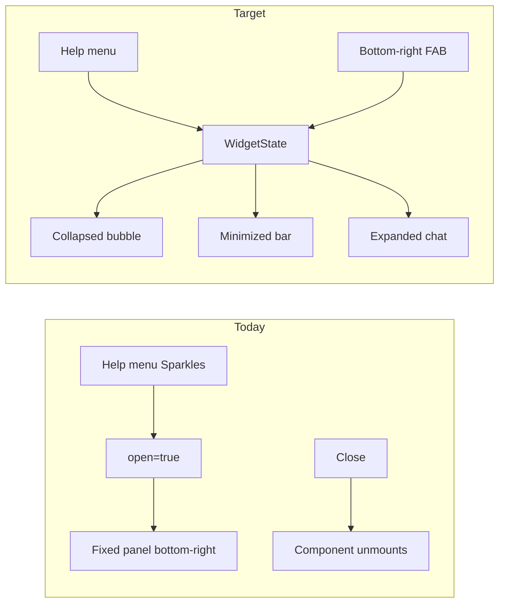

# Assistant UI/UX improvement plan

## Current state

The assistant is already **bottom-right when open** ([`assistant-panel.tsx`](apps/client/src/features/assistant/assistant-panel.tsx)), but it behaves like a modal panel rather than a traditional chat widget:

- **No persistent launcher** — panel is `null` when closed; users must open via Sparkles → "Ask Kloqra" in [`shell-header-actions.tsx`](packages/web-shared/src/components/shell-header-actions.tsx)
- **Binary open/close** — no minimize, expand, or collapsed bubble state
- **Basic chat UI** — plain bubbles, `max-h-80` scroll area, minimal markdown (`**bold**` only)
- **Errors only via toast** — [`use-assistant-chat.ts`](apps/client/src/features/assistant/use-assistant-chat.ts) uses Sonner; nothing shown in the thread
- **No session memory** — turns live in React state only ([`assistant-provider.tsx`](apps/client/src/features/assistant/assistant-provider.tsx)); refresh clears history
- **Static starter prompts** — same 3 chips on every page regardless of context



---

## Target UX (traditional assistant pattern)

| State         | Behavior                                                                              |
| ------------- | ------------------------------------------------------------------------------------- |
| **Collapsed** | Circular FAB bottom-right (`MessageCircle` / sparkle), always visible on member shell |
| **Expanded**  | ~380×520px chat window above FAB; slide-up + fade animation                           |
| **Minimized** | Thin header bar ("Ask Kloqra") above FAB; preserves conversation                      |
| **Closed**    | FAB remains; conversation optionally persisted in `sessionStorage`                    |

Both **Help menu** and **FAB** call the same `openAssistant()` — user preference, equal prominence.

---

## Implementation (client-only, no contract changes)

### 1. Refactor widget shell

Split [`assistant-panel.tsx`](apps/client/src/features/assistant/assistant-panel.tsx) into:

- **`assistant-widget.tsx`** — orchestrates FAB + panel states
- **`assistant-chat.tsx`** — message list, input, starter chips (extracted from current panel)
- **`assistant-launcher.tsx`** — fixed FAB button (`fixed bottom-4 right-4 z-50`)

Extend [`assistant-provider.tsx`](apps/client/src/features/assistant/assistant-provider.tsx):

```typescript
type AssistantView = "collapsed" | "expanded" | "minimized";
// openAssistant() → expanded
// minimizeAssistant() → minimized (keeps turns)
// closeAssistant() → collapsed (FAB visible, optional persist)
```

Wire in [`workspace-shell.tsx`](apps/client/src/components/workspace-shell.tsx): replace `<AssistantPanel />` with `<AssistantWidget />`.

### 2. Visual polish (match Kloqra design system)

Reuse patterns from [`spotlight-tour.tsx`](packages/ui/src/components/spotlight-tour.tsx) and [`widget-control-panel.tsx`](apps/client/src/features/dashboard/widget-control-panel.tsx):

- **Header**: primary accent bar, "Ask Kloqra" title, minimize (`Minus`) + close (`X`) controls
- **Messages**: distinct user (right-aligned, `bg-primary/10`) vs assistant (left-aligned, avatar dot or `MessageCircle`, `bg-muted`) bubbles with `leading-relaxed`
- **Links**: pill-style action buttons with arrow icon; navigate + minimize (not full close) so user can return
- **Loading**: animated dots or existing `Loader2` in an assistant bubble (not orphan text)
- **Empty state**: friendly greeting using `session.user.firstName` + contextual subtitle
- **Animations**: `animate-in slide-in-from-bottom-4 fade-in-0 duration-200` on expand; respect `motion-reduce`
- **Mobile**: full-width minus margins on small screens; FAB offset above safe area (`bottom-4 right-4` → `max(1rem, env(safe-area-inset-bottom))`)

### 3. Smart UX

**Page-aware starter prompts** — new `getContextualPrompts(pathname)` in `apps/client/src/features/assistant/assistant-prompts.ts`:

| Route          | Example chips                                             |
| -------------- | --------------------------------------------------------- |
| `/timer`       | "How do I start a timer?", "Why can't I edit this entry?" |
| `/timesheet`   | "How do I add an entry?", "Export my hours"               |
| `/submissions` | "Submit my timesheet", "What does pending mean?"          |
| default        | Current 3 generic prompts                                 |

Use `usePathname()` from Next.js; show chips when `turns.length === 0`.

**Session persistence** — `sessionStorage` key `kloqra-assistant-turns-v1`:

- Save turns on each append; restore on mount
- `clearTurns()` on "New chat" + storage clear
- Cap at last 20 turns client-side (API already caps at 10 messages per request)

**Keyboard shortcut** — `⌘/` or `Ctrl+/` toggles expanded ↔ collapsed (document listener in provider or widget; skip when focus is in `input`/`textarea` except chat input)

### 4. Quick wins

**In-panel error messages** — extend `useAssistantChat` to return `{ error: string | null }`; render as assistant-styled error bubble with "Try again" action instead of toast-only (keep toast as fallback for unexpected parse errors).

**New chat** — header overflow menu or icon button; calls `clearTurns()` + clears storage; disabled while loading.

**Feedback thumbs** — local-only v1 (no backend):

- After each assistant turn, show subtle 👍/👎 icons
- Store `{ turnIndex, helpful: boolean }` in `sessionStorage` for analytics prep
- Optional: on 👎, show "Was this unhelpful?" with link to member docs

### 5. Accessibility

- FAB: `aria-label="Open help assistant"`, `aria-expanded={view === "expanded"}`
- Panel: keep `role="dialog"`, trap focus in expanded state, `Escape` → minimize
- Live region for new assistant messages (`aria-live="polite"`)

---

## Tests to update/add

Per [`chronomint-test-delivery`](.cursor/skills/chronomint-test-delivery/SKILL.md):

| File                                                                                                     | Coverage                                                                    |
| -------------------------------------------------------------------------------------------------------- | --------------------------------------------------------------------------- |
| [`assistant-panel.spec.tsx`](apps/client/src/features/assistant/assistant-panel.spec.tsx) → rename/split | FAB visible when collapsed; expand/minimize; contextual prompts on `/timer` |
| [`assistant-prompts.ts`](apps/client/src/features/assistant/assistant-prompts.ts)                        | Unit test prompt mapping                                                    |
| [`assistant.e2e.ts`](apps/client/e2e/assistant.spec.ts)                                                  | Open via FAB + Help menu; New chat clears thread; keyboard shortcut         |
| [`shell-header-actions.spec.tsx`](packages/web-shared/src/components/shell-header-actions.spec.tsx)      | Unchanged behavior for Help menu entry                                      |

No contract/API/Python changes required for this iteration.

---

## Explicitly out of scope (future phases per [`docs/specs/assistant.md`](docs/specs/assistant.md))

- Read tools ("how many hours this week?") — needs NestJS executor + contract extensions
- Confirm-before-execute action cards — Phase 4
- Server-side conversation history / thumbs analytics — Postgres + API
- Admin workspace toggle (`assistantEnabled`) — separate feature

---

## File touch list

| File                                                                                  | Change                                  |
| ------------------------------------------------------------------------------------- | --------------------------------------- |
| [`assistant-provider.tsx`](apps/client/src/features/assistant/assistant-provider.tsx) | View state, persistence hooks, keyboard |
| [`assistant-panel.tsx`](apps/client/src/features/assistant/assistant-panel.tsx)       | Split → widget + chat + launcher        |
| [`assistant-prompts.ts`](apps/client/src/features/assistant/assistant-prompts.ts)     | **New** — route → prompts map           |
| [`use-assistant-chat.ts`](apps/client/src/features/assistant/use-assistant-chat.ts)   | Return inline error state               |
| [`workspace-shell.tsx`](apps/client/src/components/workspace-shell.tsx)               | `<AssistantWidget />`                   |
| Tests + e2e                                                                           | As above                                |

No changes to [`shell-header-actions.tsx`](packages/web-shared/src/components/shell-header-actions.tsx) beyond keeping `onOpenAssistant` — both entry points stay.
