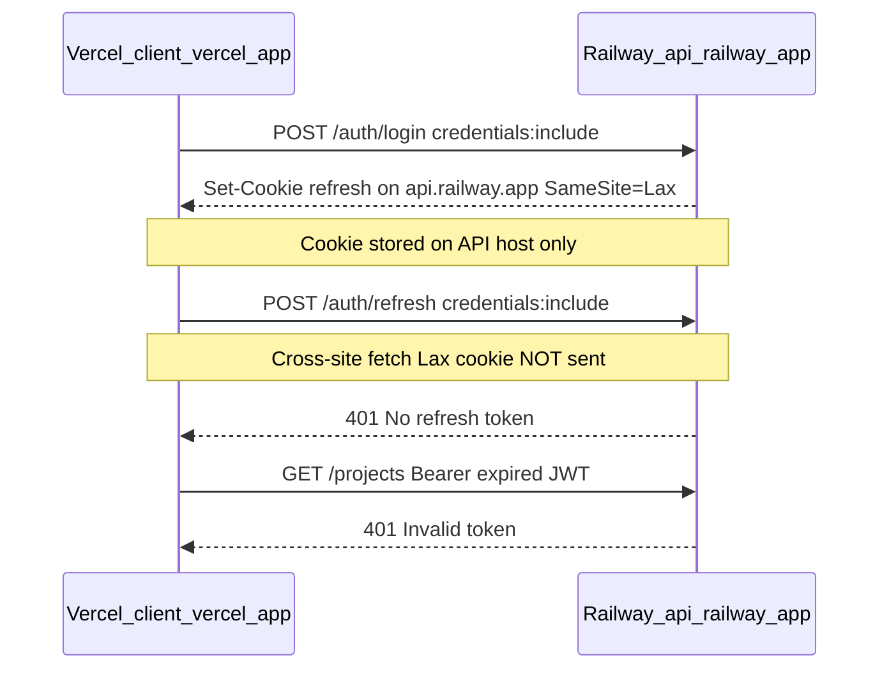
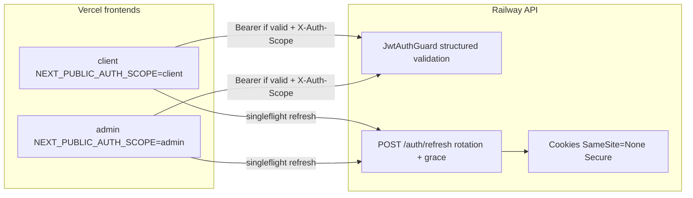

# Auth token hardening (production Vercel + Railway)

## Problem diagnosis

Your production topology is **cross-site** by definition:



Three compounding issues explain heavy prod "Invalid token":

| Issue                                                                                                | Impact in prod                                                                                                                                              |
| ---------------------------------------------------------------------------------------------------- | ----------------------------------------------------------------------------------------------------------------------------------------------------------- |
| **Cross-site cookies with `SameSite=Lax`**                                                           | Refresh httpOnly cookie is **not sent** on `fetch` from `*.vercel.app` → `*.up.railway.app`. Silent refresh always fails after access token expires (~15m). |
| **Bearer preferred over cookie** ([jwt-auth.guard.ts](apps/api/src/common/guards/jwt-auth.guard.ts)) | Expired `localStorage` JWT is always sent first → generic `Invalid token` even when a valid access cookie exists.                                           |
| **Refresh rotation race** ([auth.service.ts](apps/api/src/modules/auth/application/auth.service.ts)) | Concurrent tab/request refreshes trigger `Refresh token reuse detected` and revoke the whole family.                                                        |

Local dev works because `localhost:3000` → `localhost:3001` is **same-site**; Lax cookies are sent.

---

## Target architecture



---

## Phase 1 — Production cookie fix (highest priority)

**Files:** [auth.controller.ts](apps/api/src/modules/auth/interface/http/auth.controller.ts), [load-env.ts](apps/api/src/load-env.ts), [deploy/env.production.example](deploy/env.production.example), [docs/runbooks/vercel.md](docs/runbooks/vercel.md)

1. Add env-driven cookie policy (defaults safe for local, correct for prod cross-site):

```typescript
// New helper: apps/api/src/common/auth/cookie-options.ts
AUTH_COOKIE_SAME_SITE = none; // production cross-site (Vercel + Railway)
AUTH_COOKIE_SECURE = true; // required when SameSite=none
// Keep lax for local same-site dev
```

2. Centralize `getCookieOpts()` / `getClearCookieOpts()` — replace inline logic in auth controller and impersonate/stop-impersonation paths.

3. **Startup validation (production):** warn/fail if `NODE_ENV=production` and `AUTH_COOKIE_SAME_SITE` is not `none` when any `FRONTEND_ORIGIN` host is not same registrable domain as API host (detect `vercel.app` vs `railway.app` mismatch).

4. **Do not set `COOKIE_DOMAIN`** for Vercel+Railway — cookies belong on the API host only; domain attribute is unnecessary and can break cross-host cookie storage.

5. **Railway deploy checklist** (document, not code):
   - `FRONTEND_ORIGIN=https://<client>.vercel.app,https://<admin>.vercel.app` (exact URLs, no trailing slash)
   - `NODE_ENV=production`
   - `AUTH_COOKIE_SAME_SITE=none`
   - Vercel: `NEXT_PUBLIC_API_BASE_URL=https://<api>.up.railway.app` (with `https://`)

---

## Phase 2 — Backend JWT validation hardening

**New module:** `apps/api/src/common/auth/jwt-token.service.ts`  
**Update:** [jwt-auth.guard.ts](apps/api/src/common/guards/jwt-auth.guard.ts), [auth.service.ts](apps/api/src/modules/auth/application/auth.service.ts)

### 2a. Structured access-token verification

Extract verification from the guard into a dedicated service:

- Verify with `JWT_ACCESS_SECRET`
- Require claims: `sub`, `workspaceId`, `role` (`ADMIN` | `MEMBER`)
- Add **`typ: "access"`** claim on all new tokens ([signAccessToken](apps/api/src/modules/auth/application/auth.service.ts)); reject tokens with `typ: "refresh"` or missing `typ` (grace period: accept legacy tokens without `typ` for one release, log warning)
- Add optional **`scope: "client" | "admin"`** claim at sign time from `X-Auth-Scope` on login/refresh/switch — validate in guard when present

### 2b. Explicit error responses (replace generic `Invalid token`)

Map `@nestjs/jwt` errors to distinct API bodies (same `UNAUTHORIZED` code, differentiated `details.reason`):

| `details.reason`   | When                         | Client action  |
| ------------------ | ---------------------------- | -------------- |
| `token_expired`    | `TokenExpiredError`          | Silent refresh |
| `token_invalid`    | bad signature / wrong secret | Force re-login |
| `token_malformed`  | not a JWT                    | Force re-login |
| `token_wrong_type` | refresh JWT used as access   | Force re-login |
| `missing_claims`   | missing sub/workspaceId/role | Force re-login |

Optional additive contract: `TOKEN_EXPIRED` in [errors.ts](packages/contracts/src/errors.ts) — only if we want a distinct code; otherwise `details.reason` avoids contract churn.

### 2c. Guard token resolution order

Update [jwt-auth.guard.ts](apps/api/src/common/guards/jwt-auth.guard.ts):

1. If Bearer present **and not expired** (quick `exp` decode) → use Bearer
2. Else if scoped access cookie valid → use cookie
3. Else if Bearer expired → throw `token_expired` (not `token_invalid`) so client refreshes instead of treating as corrupt session

### 2d. Refresh endpoint validation

In [auth.controller.ts](apps/api/src/modules/auth/interface/http/auth.controller.ts) `POST /auth/refresh`:

- Require `X-Auth-Scope: client | admin` in production (reject `app` default)
- Verify refresh JWT `typ: "refresh"` (add to [signAndStoreRefreshToken](apps/api/src/modules/auth/application/auth.service.ts))
- Ensure scoped cookie name matches header scope

### 2e. Rotation grace window (multi-tab safety)

In [rotateRefreshToken](apps/api/src/modules/auth/application/auth.service.ts):

- When reuse detected (`revokedAt !== null`), check if revoked **within last 10s** and same `family` + `userAgent` → return the **latest active token in family** instead of revoking family (idempotent refresh)
- Keeps security for true replay (reuse after grace window) while fixing concurrent tab races

Env: `REFRESH_ROTATION_GRACE_MS=10000` (default 10s)

---

## Phase 3 — Frontend refresh concurrency + Bearer hygiene

**Files:** [refresh-session.ts](packages/web-shared/src/auth/refresh-session.ts), [client.ts](packages/web-shared/src/api/client.ts), [jwt-payload.ts](packages/web-shared/src/auth/jwt-payload.ts), [admin-shell.tsx](apps/admin/src/components/admin-shell.tsx), [workspace-shell.tsx](apps/client/src/components/workspace-shell.tsx)

### 3a. Refresh singleflight

- Module-level `refreshPromise` in `refresh-session.ts` — all concurrent callers await one in-flight `POST /auth/refresh`
- `api()` 401 handler and shell bootstrap share this promise

### 3b. Skip expired Bearer

In [client.ts](packages/web-shared/src/api/client.ts):

```typescript
const token = getAccessToken();
if (token && !isAccessTokenExpired(token)) {
  headers.Authorization = `Bearer ${token}`;
}
```

Add `isAccessTokenExpired()` in [jwt-payload.ts](packages/web-shared/src/auth/jwt-payload.ts) (client-side `exp` check only — API still verifies).

### 3c. React to structured errors

On 401 with `details.reason === "token_expired"` → refresh (existing path).  
On `token_invalid` / `token_malformed` / reuse detected → `clear()` + redirect login.

### 3d. Cross-tab sync

On successful refresh in [session.store.ts](packages/web-shared/src/stores/session.store.ts):

- `BroadcastChannel("cm-auth-{scope}")` notify other tabs → update `localStorage` + zustand without re-calling refresh

### 3e. Shell bootstrap parity

Extract shared `bootstrapSession()` in `web-shared`:

- Try refresh if no valid token
- `GET /auth/me` + `WORKSPACES.LIST`
- Use in **both** [workspace-shell.tsx](apps/client/src/components/workspace-shell.tsx) and [admin-shell.tsx](apps/admin/src/components/admin-shell.tsx) (admin currently skips silent refresh — [lines 54-57](apps/admin/src/components/admin-shell.tsx))

Fix impersonation path: after `?impersonate=true` refresh, still run full bootstrap (don't early-return on `session` alone).

---

## Phase 4 — Impersonation hardening (prod)

**Files:** [auth.controller.ts](apps/api/src/modules/auth/interface/http/auth.controller.ts)

- Impersonate already hardcodes `access_token_client` / `refresh_token_client` — apply same `getCookieOpts()` (SameSite=None in prod)
- `STOP_IMPERSONATION`: use `getAuthScope(req)` + `refreshCookieName(scope)` consistently (partially done; align with new cookie helper)
- Preserve `impersonatorId` through refresh rotation (already implemented — add test)

---

## Phase 5 — Tests and docs

| Test                                              | Location                                             |
| ------------------------------------------------- | ---------------------------------------------------- |
| JWT service: expired / wrong typ / missing claims | `apps/api/src/common/auth/jwt-token.service.spec.ts` |
| Guard: expired Bearer vs valid cookie             | `apps/api/src/common/guards/jwt-auth.guard.spec.ts`  |
| Rotation grace: concurrent refresh same token     | `apps/api/test/auth.e2e.ts`                          |
| Refresh requires X-Auth-Scope in prod             | `apps/api/test/auth.e2e.ts`                          |
| `isAccessTokenExpired` + singleflight             | `packages/web-shared/src/auth/*.spec.ts`             |
| Multi-tab refresh (optional Playwright)           | `apps/client/e2e/`                                   |

Update stale docs:

- [MULTI_DEVICE_SESSIONS.md](docs/architecture/MULTI_DEVICE_SESSIONS.md) — DB rotation **is** implemented; document tab concurrency + grace window
- [AUTH.md](docs/architecture/AUTH.md) — cross-site cookie policy for Vercel+Railway
- [vercel.md](docs/runbooks/vercel.md) — add `AUTH_COOKIE_SAME_SITE=none` to Railway vars section

---

## Deploy sequence (after merge)

1. Set Railway API vars: `AUTH_COOKIE_SAME_SITE=none`, verify `FRONTEND_ORIGIN` lists both Vercel URLs
2. Redeploy API (cookie policy change requires users to re-login once — acceptable)
3. Redeploy Vercel client + admin (frontend singleflight + Bearer fix)
4. Smoke: login client → wait 16m OR force-expire token → confirm silent refresh works in Network tab (`refresh` request sends cookie, returns 200)
5. Smoke: two client tabs open → trigger parallel API calls after expiry → no family revocation

---

## Out of scope (future)

- Moving refresh token to response body + memory (BFF pattern) — only needed if third-party cookie blocking worsens
- Global session revocation UI wired to `revokeAllRefreshTokens`
- Per-device refresh families exposed in account settings (already in DB schema)

## Risk notes

- `SameSite=None` requires `Secure=true` — Railway serves HTTPS; OK
- Legacy tokens without `typ` claim: accept temporarily with deprecation log
- Rotation grace window is a deliberate security tradeoff (10s, same userAgent) — document in SECURITY.md
