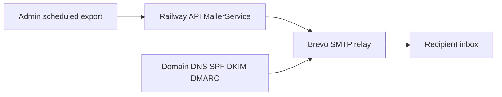

# Brevo email setup for Kloqra

## Current state in the repo

Email is already implemented — no application code changes are required for initial go-live.

- [`apps/api/src/common/mailer/mailer.service.ts`](apps/api/src/common/mailer/mailer.service.ts) — Nodemailer wrapper reading `SMTP_HOST`, `SMTP_PORT`, `SMTP_USER`, `SMTP_PASS`, `SMTP_FROM`
- [`apps/api/src/load-env.ts`](apps/api/src/load-env.ts) — optional SMTP vars validated at startup
- [`apps/api/src/modules/export/application/export-schedule.service.ts`](apps/api/src/modules/export/application/export-schedule.service.ts) — only current consumer; sends scheduled export attachments with subject `[Kloqra] Scheduled export: {name}`
- Default From address if unset: `Kloqra <noreply@kloqra.app>`

Mail is sent from the **Railway API service only** — not Vercel client/admin. If `SMTP_HOST` is missing, the app logs a warning and skips send (no crash).



---

## Prerequisites (gather first)

| Item               | Where to get it                                        | Notes                                                                         |
| ------------------ | ------------------------------------------------------ | ----------------------------------------------------------------------------- |
| Sending domain     | Domain registrar (Cloudflare, Namecheap, etc.)         | Use production domain, e.g. `kloqra.app` — not `kloqra.dev` (local seed only) |
| DNS admin access   | Registrar / Cloudflare dashboard                       | Required for SPF, DKIM, DMARC records from Brevo                              |
| Brevo account      | [brevo.com](https://www.brevo.com)                     | Free tier is sufficient for scheduled exports                                 |
| Railway API access | Railway → `kloqra-staging` / `kloqra-prod` → Variables | Where `SMTP_*` env vars live                                                  |
| Test inbox         | Personal/work email                                    | For smoke tests and export verification                                       |

**Not required for v1:**

- Railway outbound IP (only if you enable IP restrictions in Brevo — skip)
- Brevo dedicated IP (paid; unnecessary at current volume)
- Vercel environment variables
- Code or contract changes

---

## Phase 1 — Brevo account and SMTP credentials (~15 min)

1. Sign up at [brevo.com](https://www.brevo.com) and verify your login email.
2. Go to **Settings → SMTP & API** (or **Transactional → SMTP**).
3. **Generate a new SMTP key** — name it `kloqra-api-staging` (create a separate `kloqra-api-prod` key later).
4. Save these values immediately (key is shown once):

| Credential   | Value                          |
| ------------ | ------------------------------ |
| SMTP server  | `smtp-relay.brevo.com`         |
| Port         | `587` (TLS)                    |
| Login / user | Your **Brevo account email**   |
| Password     | The **SMTP key** you generated |

---

## Phase 2 — Domain authentication (~30–60 min + DNS propagation)

1. In Brevo: **Settings → Senders, domains & dedicated IPs → Domains → Add a domain**.
2. Enter your production domain (e.g. `kloqra.app`).
3. Brevo displays DNS records — copy **exactly** from the UI (do not guess IPs):

| Record type  | Purpose                                           |
| ------------ | ------------------------------------------------- |
| TXT (SPF)    | Authorizes Brevo to send on behalf of your domain |
| CNAME (DKIM) | Email signing for deliverability                  |
| TXT (DMARC)  | Recommended; start with `p=none`                  |

4. Add records at your DNS host:
   - **Cloudflare:** set DKIM CNAMEs to **DNS only** (grey cloud), not proxied.
5. Return to Brevo → **Verify domain**. Allow 5–60 minutes (up to 24h).
6. Add sender: **Senders → Add a sender** → `noreply@kloqra.app` (must match verified domain).

---

## Phase 3 — Configure Kloqra environment variables

Add these five variables to the API service:

```bash
SMTP_HOST=smtp-relay.brevo.com
SMTP_PORT=587
SMTP_USER=<your-brevo-login-email>
SMTP_PASS=<your-brevo-smtp-key>
SMTP_FROM=Kloqra <noreply@kloqra.app>
```

| Environment | Where to set                                       |
| ----------- | -------------------------------------------------- |
| Local dev   | [`apps/api/.env`](apps/api/.env) (gitignored)      |
| Staging     | Railway → `kloqra-staging` API service → Variables |
| Production  | Railway → `kloqra-prod` API service → Variables    |

Use **separate SMTP keys** per environment for easier rotation. [`deploy/env.production.example`](deploy/env.production.example) does not yet document SMTP — add vars manually in Railway dashboards.

On API boot, confirm log line: `Mailer configured — SMTP host: smtp-relay.brevo.com` (not `SMTP_HOST is not configured`).

---

## Phase 4 — Test end-to-end

### 4a. Optional SMTP smoke test (local)

With `apps/api/.env` loaded, send a one-off test via Nodemailer to your personal inbox to confirm credentials before testing the product flow.

### 4b. Product test — scheduled export (recommended)

1. Start API locally or use staging admin.
2. **Admin → Scheduled exports** — create a schedule:
   - Frequency: daily (shortest wait)
   - Recipient: your test inbox
   - Valid export body from the wizard
3. Wait for schedule run (or check timing in [`export-schedule.service.ts`](apps/api/src/modules/export/application/export-schedule.service.ts)).
4. Verify:
   - Email received with attachment
   - Railway/API logs show `Email sent: to=...`
   - Brevo dashboard → **Transactional → Logs** shows delivered

---

## Phase 5 — Production rollout checklist

- [ ] Domain SPF + DKIM verified green in Brevo
- [ ] DMARC TXT record added
- [ ] `SMTP_FROM` uses verified domain address
- [ ] Staging SMTP vars tested with one scheduled export
- [ ] Production SMTP vars set (separate SMTP key)
- [ ] Production test email received; check spam folder
- [ ] Brevo transactional logs monitored for bounces/blocks

---

## Monitoring and limits

| Location                     | What to watch                                        |
| ---------------------------- | ---------------------------------------------------- |
| Brevo → Transactional → Logs | Sent, delivered, bounced, blocked                    |
| Railway API logs             | `Email sent` vs `Email not sent (SMTP unconfigured)` |
| Recipient spam folder        | Common for new domains first few days                |

Brevo free tier has daily send limits — scheduled exports to a few recipients per workspace should be well within limits. Revisit plan tier if you add password reset, invites, or digest emails later.

---

## Optional repo documentation follow-up (not blocking go-live)

After Brevo is working in production, consider documenting SMTP vars in:

- [`apps/api/.env.example`](apps/api/.env.example)
- [`docs/development/ENVIRONMENT.md`](docs/development/ENVIRONMENT.md)
- [`deploy/env.staging.example`](deploy/env.staging.example) and [`deploy/env.production.example`](deploy/env.production.example)

These are docs-only changes; no code changes required for email to work.
