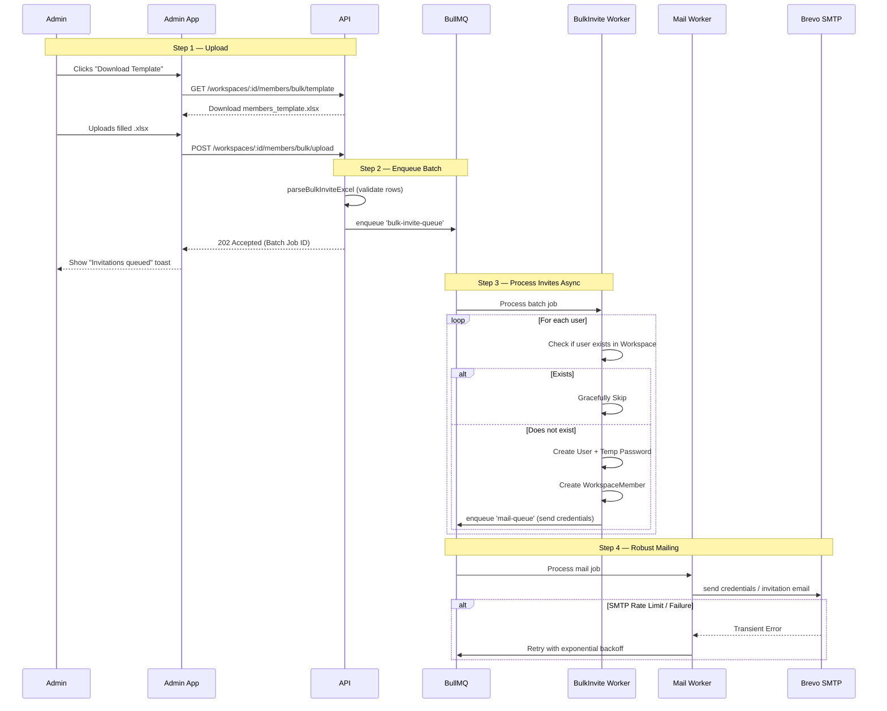

# Bulk member provisioning and Mailing Queue

## End-to-end flow

---

## Phase 1 — Contracts & DTOs

[`packages/contracts/src/workspace.dto.ts`](packages/contracts/src/workspace.dto.ts)
- `BulkInviteMemberDto`: Array of `{ email, name, role }`.
- `BulkInviteResponseDto`: `{ jobId: string, status: string, enqueuedCount: number }`.

[`packages/contracts/src/routes.ts`](packages/contracts/src/routes.ts)
- `ROUTES.WORKSPACES.BULK_MEMBERS_TEMPLATE`
- `ROUTES.WORKSPACES.BULK_MEMBERS_UPLOAD`
- `ROUTES.WORKSPACES.BULK_MEMBERS`

---

## Phase 2 — Dependencies & Setup

- Install `@nestjs/bullmq` and `bullmq` in `apps/api`.
- Configure `BullModule.forRootAsync` in `AppModule` pointing to `process.env.REDIS_URL`.
- Note: `exceljs` and file upload interceptors are already standard.

---

## Phase 3 — Background Queues & Workers

Create a new module `src/modules/queues/queues.module.ts`.

### 1. The Mailing Queue (`MailWorker`)
- Decorate with `@Processor('mail-queue')`.
- Injects `MemberProvisioningMailer`.
- Sole responsibility is taking an email payload and calling the SMTP service.
- BullMQ naturally handles exponential backoffs for transient SMTP issues.

### 2. The Bulk Invite Queue (`BulkInviteWorker`)
- Decorate with `@Processor('bulk-invite-queue')`.
- Injects `PrismaService` and `AuthService`.
- Iterates over the payload array.
- Checks `WorkspaceMember` presence — **Gracefully skips existing members**.
- Creates the User (if missing) and Membership.
- Enqueues individual jobs to the `mail-queue`.

---

## Phase 4 — Excel Endpoints & Workspace Service

In `workspace.service.ts`:
- `generateBulkInviteTemplate(res: Response)`: Uses `exceljs` to stream a `.xlsx` with columns `Email`, `Name`, `Role`.
- `parseBulkInviteExcel(buffer)`: Uses `exceljs` to parse the uploaded sheet into `BulkInviteMemberDto`.
- `bulkInvite(workspaceId, payload)`: Validates and pushes the payload to BullMQ. Returns `202 Accepted`.

In `workspace-members.controller.ts`:
- `GET /template`: Returns the Excel stream.
- `POST /upload`: Uses `@UseInterceptors(FileInterceptor('file'))`. Parses via service, enqueues.
- `POST /`: Accepts JSON payload directly (useful for programmatic API access).

---

## Security & Constraints

- Ensure the file upload size is reasonably capped (e.g., 2MB).
- Enforce a maximum batch limit (e.g., 500 members) during parsing to prevent memory exhaustion and queue flooding.
- Excel parser must strictly sanitize input to prevent injection attacks.

---

## Out of scope (v1)

- Complex frontend UI with real-time WebSockets/SSE to track progress bar of the batch. (v1 will rely on simple success toasts).
- Detailed CSV/Excel error reports for partially failed rows (invalid emails). Invalid rows will be skipped and logged in the backend.

---

## Test checklist (pre-PR)

- `pnpm format:check && pnpm lint && pnpm typecheck && pnpm test && pnpm build`
- API tests: Bulk invite worker successfully skips existing members.
- Manual test: Download template, fill with 5 emails, upload, check DB for memberships, and verify mail delivery.
