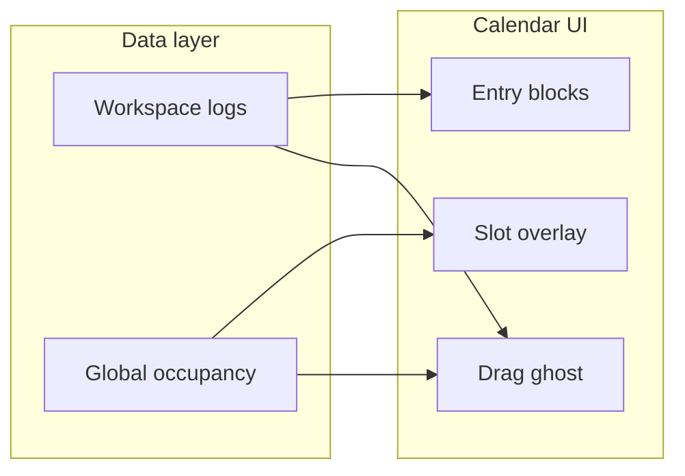

# Calendar occupied-slot UX (member timesheet)

## Problem

Today the member calendar only loads **workspace-scoped** logs ([`timelogs.service.ts` L68–80](apps/api/src/modules/timelogs/application/timelogs.service.ts) filters `task.project.workspaceId`), but overlap validation is **user-global** ([`assertNoOverlap`](apps/api/src/modules/timelogs/application/timelogs.service.ts)). Members see empty slots that are actually blocked by time logged elsewhere, and only learn on save/move via toast.

Three independent constraints must be surfaced:

| Constraint        | Rule                                           | Current UI gap                                                     |
| ----------------- | ---------------------------------------------- | ------------------------------------------------------------------ |
| **Overlap**       | One timeline per person, any project/workspace | Empty slots look clickable                                         |
| **Approval lock** | Submitted/approved period per project          | `isEntryLocked` in list/dialog only; calendar blocks look editable |
| **Timer**         | `source: timer` not PATCHable                  | No visual distinction on calendar                                  |

## Recommended UX (professional, phased)

### Visual language (consistent, accessible)

Use **pattern + icon + tooltip** — not color alone:

1. **Entry in current workspace** — keep existing project-colored blocks.
2. **Time logged elsewhere** — muted diagonal hatch on the **empty grid** behind blocks (not a second block). Tooltip: `"Logged in {workspace}: {task} ({time})"`. `cursor-not-allowed` on those slot buttons.
3. **Locked entry** (submitted/approved) — same block color but reduced opacity, small lock icon, no resize handles, drag opens read-only dialog with existing message.
4. **Timer entry** — clock badge, no resize; click opens view-only or existing error on edit.
5. **Invalid drag preview** — ghost gets destructive border/ring; tooltip shows `formatOverlapError` text already in [`calendar-utils.ts`](apps/client/src/features/timesheet/calendar-utils.ts).

Compact legend under the calendar toolbar (3 items max): _Elsewhere_, _Locked_, _Timer_. Legend only visible when overlay is **on**.

### Overlay toggle (user preference)

Members get a **Show / Hide occupied slots** control in the calendar toolbar — same placement and style as the existing **Hide summary** button in [`timesheet-page.tsx`](apps/client/src/features/timesheet/timesheet-page.tsx) (`Eye` / `EyeOff`, ghost `Button`, `text-xs`).

| Setting                | Behavior                                                                                                                                                |
| ---------------------- | ------------------------------------------------------------------------------------------------------------------------------------------------------- |
| **Default**            | On (`true`) — first visit shows overlay so members discover the feature                                                                                 |
| **Persistence**        | `localStorage` key `kloqra-show-occupancy-overlay` (mirrors `kloqra-show-timesheet-summary`)                                                            |
| **Scope when OFF**     | Hide cross-workspace hatch on empty grid, slot `cursor-not-allowed` / disabled styling, and occupancy legend                                            |
| **Always on (safety)** | Locked/timer styling on entry blocks; overlap checks on save/move/duplicate; invalid drag ghost during move — enforcement does not depend on the toggle |

Rationale: power users who find the hatch noisy can declutter the grid without losing conflict protection or lock indicators on real entries.

Prop flow: `showOccupancyOverlay` state in `timesheet-page.tsx` → `TimesheetCalendar` → `DayColumn` gates overlay layer + slot blocking only.

### Interaction rules

- **Slot click / range select** (overlay **on**): if any selected 30-min slot intersects global occupancy elsewhere (excluding the entry being moved), block action and show toast.
- **Slot click / range select** (overlay **off**): slots look normal; overlap still caught on dialog save and on move commit.
- **Move / duplicate / resize**: live ghost validation during pointer move regardless of toggle; commit still guarded client-side + API.
- **Do not** grey out slots covered by **visible** workspace blocks (blocks already communicate occupancy); hatch only fills gaps where another workspace owns the time.

---

## Phase 1 — Contract + API (global occupancy)

**Spec first:** extend [`docs/specs/timelogs.md`](docs/specs/timelogs.md) with `GET /timelogs/occupancy`.

**New contract** in [`packages/contracts`](packages/contracts):

- `timeLogOccupancyItemSchema`: `id`, `startTime`, `endTime`, `workspaceId`, `workspaceName`, `label` (e.g. `"Project — Task"`), `source`, `isLocked`
- `listTimeLogOccupancyQuerySchema`: `from`, `to` (required; same max range as list)
- `ROUTES.TIMELOGS.OCCUPANCY = "/timelogs/occupancy"`

**API** in [`timelogs.service.ts`](apps/api/src/modules/timelogs/application/timelogs.service.ts):

- `listOccupancy(userId, query)` — `timeLog.findMany` **without** workspace filter; `where: { userId, interval overlap }`
- Join `task → project → workspace` for names
- Compute `isLocked` via existing `TimesheetLockService` (same rules as PATCH)
- **MEMBER only** (admins don't need this on client calendar); return 403 for admin role or document as member-self only

**Tests:** service spec + one e2e case (member with logs in two workspaces returns both intervals).

---

## Phase 2 — Client data + overlap source of truth

In [`timesheet-page.tsx`](apps/client/src/features/timesheet/timesheet-page.tsx):

- Add `occupancy` state; `refreshOccupancy()` parallel to `refreshLogs()` using visible range (`day` / `week` / `month` views that show calendar).
- Replace `findOverlappingLog(logs, …)` with `findOverlappingLog(occupancy, …)` for save/move/duplicate so client checks match server globally.
- Add `showOccupancyOverlay` + `toggleOccupancyOverlay` (localStorage-backed, default `true`).
- Pass to calendar:
  - `logs` — workspace display (unchanged)
  - `occupancy` — global intervals (still fetched when overlay off — needed for overlap checks)
  - `showOccupancyOverlay` — gates visual overlay only
  - `isEntryLocked`, `isTimerEntry` callbacks (timer: `log.source === "timer"`)

---

## Phase 3 — Calendar rendering

**Utilities** in [`calendar-utils.ts`](apps/client/src/features/timesheet/calendar-utils.ts):

- `buildDayOccupancySegments(day, occupancy, timezone, workspaceId)` → clipped intervals per day
- `isSlotOccupiedElsewhere(slotStart, slotEnd, segments, workspaceId, excludeLogId?)` → boolean
- `findOccupancyConflict(occupancy, start, end, excludeId?)` — thin wrapper over existing overlap logic with label lookup for tooltips

**[`timesheet-calendar.tsx`](apps/client/src/features/timesheet/timesheet-calendar.tsx)** — `DayColumn` changes:

1. **Overlay layer** (between slot buttons and entry blocks): when `showOccupancyOverlay`, render hatch rectangles for segments where `workspaceId !== currentWorkspaceId` using existing `blockStyle()`.
2. **Slot buttons**: when overlay on, add `aria-disabled`, `pointer-events-none` + muted/hatch when `isSlotOccupiedElsewhere`; wire tooltip via `title` or shared `Tooltip`.
3. **Entry blocks**: when `isEntryLocked(log)` — lock icon, `opacity-80`, hide resize handles; when timer — clock badge, hide resize.
4. **`EntryGhost`**: new `invalid?: boolean` + `invalidMessage?`; destructive styling when overlap detected against `occupancy` during move/duplicate/resize preview.
5. **`TimesheetCalendarProps`**: `workspaceId`, `occupancy`, `showOccupancyOverlay`, `isEntryLocked`, `isTimerEntry`.

**Toolbar:** in `timesheet-page.tsx` (calendar views only), add toggle beside **Hide summary**; show legend row only when `showOccupancyOverlay` is true.

---

## Phase 4 — Tests + QA

- **Unit:** `calendar-utils.spec.ts` — slot occupancy for cross-workspace segment, exclude-id on move, partial slot overlap.
- **Manual QA checklist:**
  - Member in 2 workspaces: log 2–4pm in WS-A, switch to WS-B calendar → 2–4pm hatched, click blocked, drag ghost red.
  - Toggle **Hide occupied slots** → hatch and legend disappear; save/move overlap errors still work; toggle persists after refresh.
  - Locked submitted entry: lock icon, cannot resize/drag.
  - Timer entry: no resize; PATCH still blocked server-side.
  - Reseeded DB (no false overlaps): hatch only where real cross-workspace time exists.

---

## Out of scope (defer)

- Admin timesheet calendar (client-only today).
- Month view occupancy hatch (optional follow-up; week/day are priority).
- Changing overlap business rule.
- Merging list + occupancy into one endpoint (separate keeps workspace list unchanged and payload small).

## Files touched (summary)

| Layer     | Files                                                                                         |
| --------- | --------------------------------------------------------------------------------------------- |
| Spec      | [`docs/specs/timelogs.md`](docs/specs/timelogs.md)                                            |
| Contracts | `timelog-occupancy.dto.ts`, `routes.ts`, contract tests                                       |
| API       | `timelogs.service.ts`, `timelogs.controller.ts`, specs/e2e                                    |
| Client    | `calendar-utils.ts`, `calendar-utils.spec.ts`, `timesheet-calendar.tsx`, `timesheet-page.tsx` |

## Effort estimate

~1 focused sprint slice: API half-day, calendar UI 1 day, tests/QA half-day.
