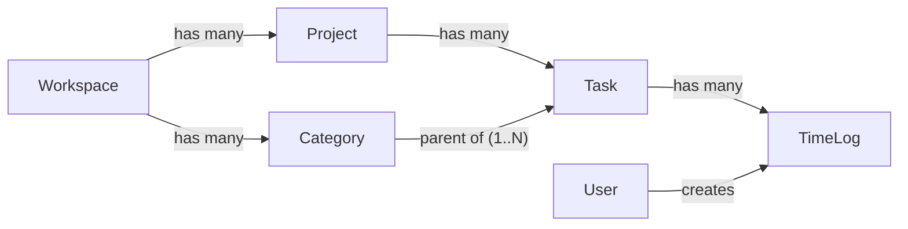

## Scope (confirmed)

- **Task authority:** Strict admin-only. Members can no longer create/edit/delete tasks (inline "create new task" removed from timer, timesheet, and `/tasks`).
- **Categories scope:** Workspace-scoped (mirrors Projects).
- **Existing data:** Migration creates one `"Uncategorized"` category per workspace and backfills every existing task into it. No data loss.

## Target data model



- `Category { id, workspaceId, name, description?, createdAt, updatedAt }` — unique `(workspaceId, name)`.
- `Task` adds `categoryId` (FK to Category, **NOT NULL** after backfill, `onDelete: Restrict`).
- `TimeLog` is unchanged (still references `taskId`, still carries `description`).

## Delivery order (contract-first per [.cursor/rules/master-orchestrator.mdc](.cursor/rules/master-orchestrator.mdc))

### 1. Contracts (`packages/contracts/src/`) — **breaking**

- **New** [`dto/category.dto.ts`](packages/contracts/src/dto/category.dto.ts):
  - `categorySchema` = `{ id, workspaceId, name (1..120), description (max 500) | null }`
  - `createCategorySchema` = `{ name, description? }`
  - `updateCategorySchema` = `{ name?, description? }`
- **Extend** [`dto/task.dto.ts`](packages/contracts/src/dto/task.dto.ts):
  - `taskSchema` gains `categoryId: uuidSchema`, optional `categoryName` for read responses.
  - `createTaskSchema` gains required `categoryId: uuidSchema`.
  - `updateTaskSchema` gains `categoryId?: uuidSchema`.
  - `listTasksQuerySchema` gains optional `categoryId`.
- **Extend** [`routes.ts`](packages/contracts/src/routes.ts):
  - Add `CATEGORIES: { LIST: "/categories", CREATE: "/categories", BY_ID: (id) => `/categories/${id}` }`.
- **Re-export** new DTO from [`packages/contracts/src/index.ts`](packages/contracts/src/index.ts).
- **Update** [`packages/contracts/src/contracts.spec.ts`](packages/contracts/src/contracts.spec.ts): add category schema tests; assert `createTaskSchema` rejects missing `categoryId`; cover new routes.
- Label change `BREAKING` in commit/PR per [.cursor/rules/contracts-gate.mdc](.cursor/rules/contracts-gate.mdc).

### 2. Prisma + migration (`apps/api/prisma/`)

- **Schema** ([`schema.prisma`](apps/api/prisma/schema.prisma)):
  - New `Category` model (table `categories`) with workspace relation, unique `@@unique([workspaceId, name])`, index on `workspaceId`.
  - Extend `Workspace` with `categories Category[]`.
  - Extend `Task` with `categoryId String @map("category_id")` and `category Category @relation(fields:[categoryId], references:[id], onDelete: Restrict)`, plus `@@index([categoryId])`.
- **Migration** `apps/api/prisma/migrations/2026XXXX_categories_and_task_categoryId/migration.sql`:
  1. `CREATE TABLE categories ...` with FK + unique.
  2. `ALTER TABLE tasks ADD COLUMN category_id UUID NULL`.
  3. Backfill SQL: for each workspace, insert a `categories` row `('Uncategorized', 'Auto-created during category restructure')`; UPDATE tasks set `category_id = (SELECT id FROM categories c JOIN projects p ON p.workspace_id = c.workspace_id WHERE p.id = tasks.project_id AND c.name = 'Uncategorized')`.
  4. `ALTER TABLE tasks ALTER COLUMN category_id SET NOT NULL`.
  5. Add FK `tasks_category_id_fkey ... ON DELETE RESTRICT`.
- **Seed** ([`apps/api/prisma/seed.ts`](apps/api/prisma/seed.ts)): create a starter category set per workspace (e.g. `Software Development`, `UI/UX Design`, `Meetings`), assign seeded tasks to appropriate categories.

### 3. API (`apps/api/src/modules/`) — `kloqra-api-slice` skill

- **New module** `apps/api/src/modules/categories/`:
  - `categories.module.ts`, `categories.controller.ts`, `application/categories.service.ts`.
  - Routes: `GET /categories` (ADMIN+MEMBER read), `POST/PATCH/DELETE` **ADMIN-only** via `@Roles("ADMIN")`.
  - Service enforces workspace scoping, unique-name conflict (409), and `DELETE` returns 409 if any tasks still reference the category.
  - Register in [`apps/api/src/app.module.ts`](apps/api/src/app.module.ts).
- **Tasks module** ([`apps/api/src/modules/tasks/`](apps/api/src/modules/tasks/)):
  - Add `@Roles("ADMIN")` to `POST /tasks`, `PATCH /tasks/:id`, `DELETE /tasks/:id` (keep `GET /tasks` open to members).
  - `TasksService.create/update` accept and validate `categoryId` belongs to the same workspace as the project.
  - `TasksService.list` joins category and returns `categoryId` + `categoryName`; supports `?categoryId=` filter.
  - Replace hardcoded path on `PATCH /tasks/:id` with `ROUTES.TASKS.BY_ID(":id")`.
- **Timer / Timelogs** — no contract change, but verify `TimerService.start` and `TimelogsService.create` still resolve task→project access correctly (no behavior change expected).

### 4. Admin frontend (`apps/admin/`) — `kloqra-fe-feature` skill

- **New page** `apps/admin/src/app/(admin)/categories/page.tsx` → `apps/admin/src/features/categories/categories-page.tsx`:
  - Table of categories (name, description, task-count) with create/edit/delete dialogs.
  - Use `api()` from `@kloqra/web-shared` against `ROUTES.CATEGORIES.*`.
- **Nav** in [`apps/admin/src/components/admin-shell.tsx`](apps/admin/src/components/admin-shell.tsx): insert `Categories` entry between `Workspace` and `Projects` (icon: `Tags` or `FolderTree` from lucide).
- **Project detail tasks UI** in [`apps/admin/src/features/projects/projects-page.tsx`](apps/admin/src/features/projects/projects-page.tsx): add a "Tasks" panel on the selected project. Each task row shows `taskName`, `category` (dropdown of workspace categories), `billable default`. Create-task form requires a category select. Restrict to ADMIN role (already gated by admin app).

### 5. Client frontend (`apps/client/`)

- **Timer page** ([`apps/client/src/features/timer/timer-page.tsx`](apps/client/src/features/timer/timer-page.tsx)):
  - Remove "+ Create new task..." option from the task dropdown.
  - Optionally group the task dropdown by category (visual only; emit `taskId`).
  - Add empty-state copy: "Ask your admin to add tasks to this project."
- **Timesheet** ([`apps/client/src/features/timesheet/timesheet-page.tsx`](apps/client/src/features/timesheet/timesheet-page.tsx) and `time-entry-dialog.tsx`): same removal of inline task creation; description field already exists on the entry dialog (no change to data flow).
- **Tasks page** ([`apps/client/src/features/tasks/tasks-page.tsx`](apps/client/src/features/tasks/tasks-page.tsx)): turn into read-only browser grouped by category, with project filter. Remove the create form.
- **Onboarding** ([`apps/client/src/features/onboarding/onboarding-overlay.tsx`](apps/client/src/features/onboarding/onboarding-overlay.tsx)): when admin completes onboarding, create at least one category (e.g. `General`) before the default `General Tasks` task.
- **Stores** ([`apps/client/src/stores/projects.store.ts`](apps/client/src/stores/projects.store.ts)): cache categories list; refresh after admin mutations (admin app doesn't share state with client, so a simple refetch on focus is sufficient).

### 6. Downstream (low-risk verification)

- **Reporting** ([`apps/api/src/modules/reporting/`](apps/api/src/modules/reporting/)) and **Export** ([`apps/api/src/modules/export/`](apps/api/src/modules/export/)): existing `by_task` outputs continue to work via `Task.taskName`. Optionally add `category` column / `by_category` breakdown later (out of scope unless requested).
- **Presence** ([`apps/api/src/modules/presence/`](apps/api/src/modules/presence/)): no change.
- **Timer quick-actions favorites**: stored as `{ projectId, taskId }` in localStorage — still valid post-migration.

### 7. Tests (per [.cursor/rules/testing-tdd.mdc](.cursor/rules/testing-tdd.mdc))

- Extend [`packages/contracts/src/contracts.spec.ts`](packages/contracts/src/contracts.spec.ts) for category schemas and updated `createTaskSchema`.
- New `apps/api/src/modules/categories/application/categories.service.spec.ts`: create/list/update/delete + workspace isolation + delete-with-tasks rejection.
- New `apps/api/src/modules/tasks/application/tasks.service.spec.ts`: enforces `categoryId` belongs to project's workspace; admin-role gating.
- Update [`apps/client/e2e/screenshot.spec.ts`](apps/client/e2e/screenshot.spec.ts) and timer flow if it currently asserts inline task creation.

## Pre-PR checks ([master-orchestrator](.cursor/rules/master-orchestrator.mdc))

```bash
pnpm format:check && pnpm lint && pnpm typecheck && pnpm test && pnpm build
pnpm --filter @kloqra/api prisma migrate dev   # local verification of the backfill
```

## Risk / rollback

- Backfill is idempotent (`INSERT ... ON CONFLICT (workspace_id, name) DO NOTHING`).
- `onDelete: Restrict` on `tasks.category_id` prevents accidental data loss if a category is deleted while tasks reference it (service returns 409).
- Rollback path: revert migration creates the inverse `DROP COLUMN tasks.category_id` + `DROP TABLE categories`; safe because tasks/time-logs remain intact.
