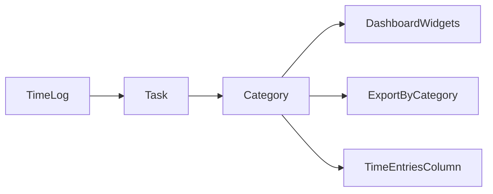
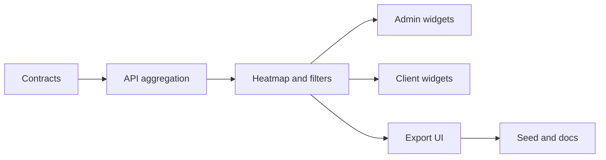

# Category-aware dashboards, export, and analytics

Branch: `feature/category-widgets`

## Investigation: how categories add analytics value

Categories turn **task names** into **work-type dimensions**. Today every log links to a task with `categoryId`, but aggregation only rolls up by project / member / task name — so you cannot answer:

| Question                                            | Today                        | With category analytics                                       |
| --------------------------------------------------- | ---------------------------- | ------------------------------------------------------------- |
| What % of time is Meetings vs Software Development? | Manual guess from task names | Donut / `by_category` export                                  |
| Is this member overloaded on meetings?              | No                           | Member × category matrix or filter                            |
| Which project has the most QA time?                 | Approximate via task names   | Category on `time_entries` + `by_task` with category column   |
| Invoice / client narrative by work type             | Export by task only          | `by_category` sheet + category on invoice rows                |
| Admin capacity planning                             | Utilization by person only   | Category mix per team (e.g. too much Support Retainer triage) |



**Analytics surfaces (in scope for this feature):**

1. **Composition** — hours donut / bar by category (admin + member)
2. **Breakdown table** — category rows with billable split (admin)
3. **Task breakdown** — add `categoryName` per task row (admin existing widget)
4. **Export** — new `by_category` report + optional `category` column on detail sheets
5. **Group-by** — `category` dimension in export wizard (rolls up to `by_category`)
6. **Category filter** — optional `categoryId` on reporting + export queries (slice all widgets/exports to one category)
7. **`tabs_per_category`** — Excel workbook layout with one sheet per category (admin export)
8. **Category × project heatmap** — admin widget showing where each category’s hours land across projects
9. **Member `by_category` export** — members can download their own category rollup (not just admin)

---

## Current gaps (confirmed)

- [`TimeAggregationService`](apps/api/src/common/time/time-aggregation.service.ts) — `fetchLogs` does not join `task.category`
- [`DashboardReportDto`](packages/contracts/src/dto/reporting.dto.ts) — no `timeByCategory`
- [`TaskBreakdownItem`](packages/contracts/src/dto/reporting.dto.ts) — no `categoryName`
- [`export.dto.ts`](packages/contracts/src/dto/export.dto.ts) — no `by_category`, no `category` groupBy, no category columns
- **Admin dashboard** — 26 widgets; [`task_breakdown`](apps/admin/src/features/dashboard/widgets/) groups by task name only
- **Client dashboard** — category grouping exists only in Quick Timer picker ([`dashboard-page.tsx`](apps/client/src/features/dashboard/dashboard-page.tsx)); widgets use project/day only
- **Seed** — [`seed.ts`](apps/api/prisma/seed.ts) export preset "Full analytics (90d)" omits `by_category`

No Prisma migration required — `Task.categoryId` already exists.

---

## Phase 1 — Contracts (SSOT, non-breaking additive)

**Files:** [`packages/contracts/src/dto/reporting.dto.ts`](packages/contracts/src/dto/reporting.dto.ts), [`packages/contracts/src/dto/export.dto.ts`](packages/contracts/src/dto/export.dto.ts), [`packages/contracts/src/contracts.spec.ts`](packages/contracts/src/contracts.spec.ts)

### Reporting DTOs

```ts
export const timeByCategorySchema = hoursBreakdownSchema.extend({
  categoryId: uuidSchema,
  categoryName: z.string(),
  billableAmount: z.number()
});

// Add to dashboardReportSchema:
timeByCategory: z.array(timeByCategorySchema)

// Add to taskBreakdownItemSchema:
categoryId: uuidSchema.optional(),
categoryName: z.string().optional()

// Add to myWeekSummarySchema (member week view):
byCategory: z.array(z.object({
  categoryId: uuidSchema,
  categoryName: z.string(),
  totalHours: z.number(),
  billableHours: z.number()
}))
```

Label: **non-breaking** (new optional fields / new array on dashboard).

### Reporting query filter

Extend [`reportQuerySchema`](packages/contracts/src/dto/reporting.dto.ts):

```ts
categoryId: uuidSchema.optional();
```

Applies to `GET /reporting/dashboard`, `/reporting/tasks`, `/reporting/heatmap`, `/reporting/categories-heatmap` (new), and export body filters.

### Category × project heatmap DTO

```ts
export const categoryProjectHeatmapCellSchema = z.object({
  categoryId: uuidSchema,
  categoryName: z.string(),
  projectId: uuidSchema,
  projectName: z.string(),
  hours: z.number().nonnegative()
});

export const categoryProjectHeatmapResponseSchema = z.object({
  categories: z.array(z.object({ categoryId: uuidSchema, categoryName: z.string() })),
  projects: z.array(z.object({ projectId: uuidSchema, projectName: z.string() })),
  cells: z.array(categoryProjectHeatmapCellSchema)
});
```

New route: `ROUTES.REPORTING.CATEGORIES_HEATMAP = "/reporting/categories-heatmap"` (or extend existing heatmap with `mode=category_project` — prefer dedicated route for clarity).

### Export DTOs

- Add `"by_category"` to `exportReportTypeSchema` **and** `memberExportReportTypeSchema` (member gets own category rollup)
- Add `"category"` to `exportGroupByDimensionSchema`
- Add `"tabs_per_category"` to `exportSheetLayoutSchema` (alongside `tabs_per_member`, `tabs_per_project`, `tabs_per_client`)
- Add optional `categoryId` to export filter/body schema (same as reporting)
- New `BY_CATEGORY_COLUMNS`: `category`, `project`, `client`, `total_hours`, `billable_hours`, `non_billable_hours`, `billable_amount`, `active_tasks`
- New `MEMBER_BY_CATEGORY_COLUMNS` (subset: `category`, `total_hours`, `billable_hours`, `non_billable_hours`)
- Add optional `category` key to `TIME_ENTRIES_COLUMNS`, `BY_TASK_COLUMNS`, `INVOICE_COLUMNS`
- Update `exportColumnsSchema`, labels, defaults, `contracts.spec.ts`

---

## Phase 2 — API aggregation (shared foundation)

**Files:** [`time-aggregation.service.ts`](apps/api/src/common/time/time-aggregation.service.ts), [`export-rows.builder.ts`](apps/api/src/modules/export/application/export-rows.builder.ts), [`export-sort.util.ts`](apps/api/src/modules/export/application/export-sort.util.ts), [`reporting.service.ts`](apps/api/src/modules/reporting/application/reporting.service.ts)

### `fetchLogs` — include category on task select

```ts
task: {
  select: {
    // existing fields...
    categoryId: true,
    category: { select: { id: true, name: true } }
  }
}
```

### `buildAggregates` — add `byCategory: Map<categoryId, HoursBreakdown + name>`

Roll up each log’s hours into its task’s category (fallback `"Uncategorized"` if missing).

### Reporting service

- `getDashboard()` — populate `timeByCategory` from aggregates (sorted by totalHours desc); respect optional `categoryId` filter on all queries
- `getTasks()` — include `categoryId` / `categoryName` on each breakdown item
- `getMyWeekSummary()` — populate `byCategory` for member endpoint
- **`getCategoryProjectHeatmap()`** — matrix of category × project hours for date range (top N categories/projects + “Other” bucket)
- Pass `categoryId` through existing `fetchLogs` filter when present

### Export module

- `buildByCategory()` in `export-rows.builder.ts` (mirror `buildByTask`); support member-scoped rows via existing user filter
- `logToTimeEntryRow()` — add `category` from task relation
- `export-sort.util.ts` — sort keys for `by_category` and `category` groupBy
- [`export-sheet.util.ts`](apps/api/src/modules/export/application/export-sheet.util.ts) — **`tabs_per_category`**: one worksheet per category name (sanitize sheet titles)
- [`export-group-by.ts`](apps/admin/src/lib/export-group-by.ts) — `category → by_category` rollup mapping
- Member `POST /export/me` — allow `reportTypes: ["by_category"]` with `MEMBER_BY_CATEGORY_COLUMNS`

**Tests:** extend [`export-preview.spec.ts`](apps/api/src/modules/export/application/export-preview.spec.ts), [`reporting.service.spec.ts`](apps/api/src/modules/reporting/application/reporting.service.spec.ts) with category fixtures + heatmap matrix + `categoryId` filter cases.

---

## Phase 3 — Admin dashboard widgets

**Files:** [`widget-registry.ts`](apps/admin/src/features/dashboard/widget-registry.ts), [`dashboard-page.tsx`](apps/admin/src/features/dashboard/dashboard-page.tsx), new widgets under `widgets/`, [`report-charts.tsx`](apps/admin/src/components/report-charts.tsx)

### New widgets

| ID                         | Label                      | Group       | Data source                         | Default visible |
| -------------------------- | -------------------------- | ----------- | ----------------------------------- | --------------- |
| `category_distribution`    | Category Distribution      | composition | `report.timeByCategory`             | yes             |
| `category_breakdown`       | Category Breakdown         | composition | `report.timeByCategory`             | no              |
| `category_project_heatmap` | Category × Project Heatmap | composition | `GET /reporting/categories-heatmap` | no              |

Reuse chart patterns from [`distribution_donut`](apps/admin/src/features/dashboard/dashboard-page.tsx) / `breakdown_table` — add **Category** toggle alongside User / Project where applicable. Heatmap reuses grid styling from existing [`time_of_day_heatmap`](apps/admin/src/features/dashboard/dashboard-page.tsx) widget.

### Dashboard filters (admin)

Add **Category** dropdown next to existing Project / Member filters on [`dashboard-page.tsx`](apps/admin/src/features/dashboard/dashboard-page.tsx):

- Loads `GET /categories` once per workspace
- Passes `categoryId` into `GET /reporting/dashboard` and per-widget reporting calls
- “All categories” = no filter (current behavior)

### Enhance existing

- **`task_breakdown`** — show category badge/column using enriched `/reporting/tasks` response
- **`breakdown_table`** — third dimension toggle: User | Project | **Category**

Widget icons: `Tags` (already used on categories nav).

---

## Phase 4 — Member (client) dashboard widgets

**Files:** [`apps/client/src/features/dashboard/widget-registry.ts`](apps/client/src/features/dashboard/widget-registry.ts), [`dashboard-page.tsx`](apps/client/src/features/dashboard/dashboard-page.tsx), new `category-split-widget.tsx`

### New widget

| ID               | Label          | Data source                                                                                                         |
| ---------------- | -------------- | ------------------------------------------------------------------------------------------------------------------- |
| `category_split` | Category Split | Prefer `GET /reporting/me` → `byCategory` after Phase 2; fallback: client-side join `logs` + `tasks[].categoryName` |

### Light enhancements (same PR if small)

- **`today_logs`** / **`recent_activity`** — show `categoryName` chip next to task name (lookup from tasks map already loaded on page)

Extend existing `GET /reporting/me` with `byCategory`; optional `?categoryId=` filter for member drill-down.

### Member export

[`timesheet-export.tsx`](apps/client/src/components/timesheet-export.tsx):

- Report type toggle: add **By Category** (`by_category`)
- Optional `category` column on `time_entries`
- Uses `POST /export/me` with `memberExportReportTypeSchema` including `by_category`

---

## Phase 5 — Export UI (admin + member)

**Admin:** [`exports-page.tsx`](apps/admin/src/features/exports/exports-page.tsx), [`export-column-picker.tsx`](apps/admin/src/components/export-column-picker.tsx), [`export-sheet-layout.ts`](apps/admin/src/lib/export-sheet-layout.ts)

- Add **By Category** under Breakdowns in `REPORT_GROUPS`
- Add `category` to column picker for `time_entries`, `by_task`, `invoice`
- Add **Group by → Category** in sort/rollup UI ([`export-group-by.ts`](apps/admin/src/lib/export-group-by.ts))
- Add **Sheet layout → Tabs per category** (`tabs_per_category`) in layout picker
- Add **Category filter** dropdown on export wizard (optional `categoryId` in export body)

**Member:** [`timesheet-export.tsx`](apps/client/src/components/timesheet-export.tsx)

- **By Category** report type (dedicated rollup sheet)
- Optional `category` column on `time_entries`
- Category filter (optional) scoped to member’s own logs

**Seed:** update [`seed-data.ts`](apps/api/prisma/seed-data.ts) / [`seed.ts`](apps/api/prisma/seed.ts) preset "Full analytics (90d)" to include `by_category` in `reportTypes`.

**Docs:** [`docs/specs/export.md`](docs/specs/export.md), [`docs/specs/reporting.md`](docs/specs/reporting.md), [`docs/api/ROUTES.md`](docs/api/ROUTES.md) — document new report type, heatmap route, `categoryId` filter, and dashboard fields.

---

## Delivery order (contract-first)



1. Contracts + `contracts.spec.ts` (includes filter, heatmap, `tabs_per_category`, member `by_category`)
2. `TimeAggregationService` + reporting + export builders + category heatmap endpoint
3. API unit tests for category rollup, filter, and heatmap matrix
4. Admin widgets + category filter + export UI (parallel)
5. Client widgets + member export
6. Seed preset + docs

**Pre-PR:** `pnpm format:check && pnpm lint && pnpm typecheck && pnpm test && pnpm build`

---

## Success criteria

- Admin dashboard shows **Category Distribution** donut with seeded data (Meetings, Dev, QA, etc.)
- Admin **Category filter** narrows all dashboard widgets to a single category
- **`category_project_heatmap`** shows hours at category × project intersections
- `breakdown_table` can switch to category rows
- `POST /export` with `reportTypes: ["by_category"]` returns correct totals matching dashboard
- `tabs_per_category` layout produces one Excel sheet per category
- `time_entries` export includes `category` column when selected
- Member dashboard **Category Split** reflects week hours by category
- Member can export **`by_category`** via timesheet export UI
- No schema migration; existing logs/tasks unchanged

## Deliverables summary

### Admin

| Area             | What they get                                                                                       |
| ---------------- | --------------------------------------------------------------------------------------------------- |
| Dashboard        | Category Distribution donut, Category Breakdown table, Category × Project heatmap                   |
| Filters          | Category dropdown (all widgets respect it)                                                          |
| Existing widgets | Breakdown table + Task breakdown show category dimension                                            |
| Export           | `by_category` report, category column, group-by category, tabs-per-category layout, category filter |

### Member

| Area      | What they get                                                   |
| --------- | --------------------------------------------------------------- |
| Dashboard | Category Split widget, category chips on activity feeds         |
| Export    | `by_category` rollup + optional category column on time entries |

## Estimated effort

| Phase                                       | Effort    |
| ------------------------------------------- | --------- |
| Contracts                                   | 0.5–1 day |
| API aggregation + heatmap + filters + tests | 1.5 days  |
| Admin dashboard + filters + export UI       | 2 days    |
| Client dashboard + member export            | 0.75 day  |
| Docs + seed                                 | 0.25 day  |

**Total:** ~5–6 days
