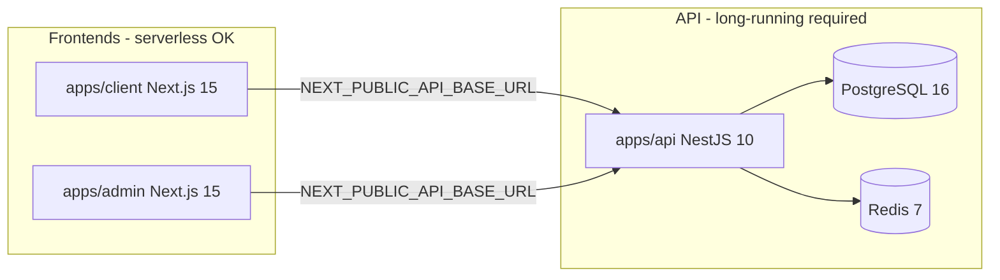
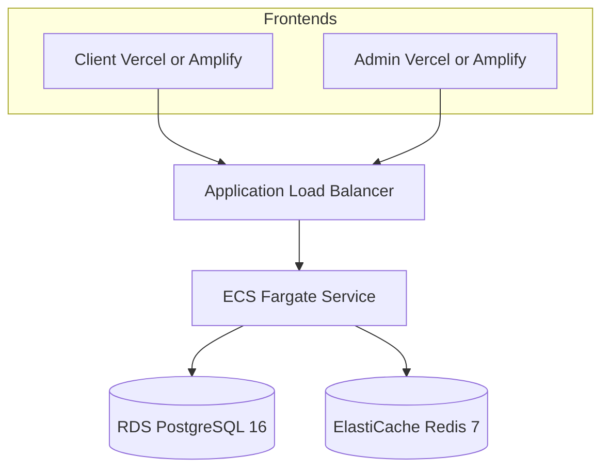
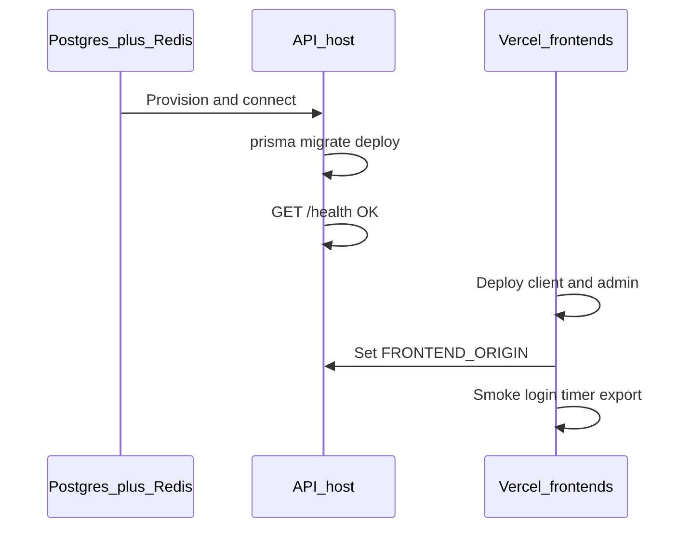

# Kloqra deployment plan

## Architecture constraint (from codebase)

Kloqra is **not** a single deployable unit. It has three apps with different runtime requirements:



**Why the API cannot live on Vercel:** NestJS runs as a persistent process with Prisma, Redis-backed timer/presence, SSE streams ([`presence.service.ts`](apps/api/src/modules/presence/application/presence.service.ts)), and a 60s export scheduler ([`export-schedule.service.ts`](apps/api/src/modules/export/application/export-schedule.service.ts)). Vercel serverless timeouts and lack of always-on Redis break these features.

**Existing repo assets:**

- API Docker image: [`apps/api/Dockerfile`](apps/api/Dockerfile) — build from monorepo root
- Vercel config: [`apps/client/vercel.json`](apps/client/vercel.json), [`apps/admin/vercel.json`](apps/admin/vercel.json)
- Runbooks: [`docs/runbooks/deploy.md`](docs/runbooks/deploy.md), [`docs/runbooks/vercel.md`](docs/runbooks/vercel.md)

---

## Recommended path (minimal ops): Vercel + Railway

Given your preference for **minimal ops** and **staging + production**, use this hybrid for both environments.

| Layer            | Staging                                | Production                     |
| ---------------- | -------------------------------------- | ------------------------------ |
| Client           | Vercel project `kloqra-client-staging` | Vercel project `kloqra-client` |
| Admin            | Vercel project `kloqra-admin-staging`  | Vercel project `kloqra-admin`  |
| API + DB + Redis | Railway project `kloqra-staging`       | Railway project `kloqra-prod`  |

### Phase 1 — Staging API (Railway)

1. Create Railway project `kloqra-staging`.
2. Add **PostgreSQL** and **Redis** plugins.
3. Add API service from GitHub repo:
   - Monorepo root (not `apps/api`)
   - Dockerfile path: `apps/api/Dockerfile`
4. Set environment variables:

| Variable             | Staging value                              |
| -------------------- | ------------------------------------------ |
| `DATABASE_URL`       | `${{Postgres.DATABASE_URL}}`               |
| `REDIS_URL`          | From Redis plugin                          |
| `JWT_ACCESS_SECRET`  | Random 32+ chars (unique per env)          |
| `JWT_REFRESH_SECRET` | Random 32+ chars (unique per env)          |
| `FRONTEND_ORIGIN`    | Staging Vercel URLs (update after Phase 2) |
| `PORT`               | `3001`                                     |

5. Run migrations once against staging DB:

```bash
DATABASE_URL="<staging-url>" pnpm --filter @kloqra/api exec prisma migrate deploy
```

6. Optional: seed staging data (`pnpm --filter @kloqra/api exec prisma db seed`).
7. Smoke test: `curl https://<staging-api>/health`

**Do not set** `REDIS_USE_MEMORY` in any deployed environment.

### Phase 2 — Staging frontends (Vercel)

Create **two** Vercel projects (same repo, different roots):

**Client** (`apps/client`):

- Root Directory: `apps/client`
- Enable **Include source files outside of Root Directory**
- Build uses existing [`vercel.json`](apps/client/vercel.json): `pnpm --filter @kloqra/client... build`
- Env: `NEXT_PUBLIC_API_BASE_URL=https://<staging-api-url>`, `NEXT_PUBLIC_AUTH_SCOPE=client`
- Git branch: `develop` or `staging` (Preview vs Production per your branching model)

**Admin** (`apps/admin`):

- Root Directory: `apps/admin`
- Same monorepo setting
- Build: `pnpm --filter @kloqra/admin... build`
- Env: `NEXT_PUBLIC_API_BASE_URL`, `NEXT_PUBLIC_AUTH_SCOPE=admin`, optional `NEXT_PUBLIC_ADMIN_URL`

### Phase 3 — Wire CORS and re-smoke

Update staging API `FRONTEND_ORIGIN` to exact HTTPS origins:

```env
FRONTEND_ORIGIN=https://kloqra-client-staging.vercel.app,https://kloqra-admin-staging.vercel.app
```

Manual smoke (from [`deploy.md`](docs/runbooks/deploy.md)):

1. Admin login → Dashboard
2. Client login → start timer
3. Admin Team live shows activity
4. Export download from admin

### Phase 4 — Production (repeat with isolation)

Duplicate Railway + Vercel setup with **separate** projects, secrets, and DBs:

- New JWT secrets (never reuse staging secrets)
- Production branch deploys (typically `main`)
- Custom domains when ready: `app.example.com`, `admin.example.com`, `api.example.com`
- Add custom domains to `FRONTEND_ORIGIN` on prod API

### CI/CD (minimal)

Current [`.github/workflows/ci.yml`](.github/workflows/ci.yml) runs tests only — no deploy workflow yet.

For minimal ops, rely on **platform auto-deploy**:

- Railway: deploy on push to `staging` / `main`
- Vercel: Production = `main`, Preview = PRs

Optional later: add a GitHub Actions deploy workflow that runs `prisma migrate deploy` before API rollout.

---

## Option 2 — Vercel (frontends only)

Vercel is the right host for **client + admin only**. This is already configured in the repo.

### What goes on Vercel

| App    | Root dir      | Key env vars                                                |
| ------ | ------------- | ----------------------------------------------------------- |
| Client | `apps/client` | `NEXT_PUBLIC_API_BASE_URL`, `NEXT_PUBLIC_AUTH_SCOPE=client` |
| Admin  | `apps/admin`  | `NEXT_PUBLIC_API_BASE_URL`, `NEXT_PUBLIC_AUTH_SCOPE=admin`  |

### Vercel project checklist (per environment)

1. Import GitHub repo
2. Set Root Directory (`apps/client` or `apps/admin`)
3. Turn on **Include source files outside Root Directory** (required for `packages/ui`, `packages/contracts`)
4. Confirm pnpm 9 (`packageManager` in root [`package.json`](package.json))
5. Set env vars in Vercel dashboard (Production + Preview scopes)
6. Deploy API **first**, then frontends

### Staging vs production on Vercel

- **Two projects per app per env** (4 staging + 4 prod = 8 projects) — clearest isolation
- **Or** one project per app with Preview env vars pointing at staging API and Production env vars at prod API (fewer projects, more env discipline)

### What does NOT go on Vercel

The NestJS API — documented explicitly in [`vercel.md`](docs/runbooks/vercel.md). Pair Vercel frontends with Railway, Render, or Fly for the API.

---

## Option 1 — AWS (when you outgrow PaaS)

AWS is viable but **higher ops burden** than your stated preference. Use when you need VPC isolation, compliance, or cost control at scale.

### Recommended AWS topology (moderate complexity)



| Component     | AWS service                                      | Notes                                                                                    |
| ------------- | ------------------------------------------------ | ---------------------------------------------------------------------------------------- |
| API container | **ECS Fargate**                                  | Push image from [`apps/api/Dockerfile`](apps/api/Dockerfile) to ECR; 1+ tasks behind ALB |
| Database      | **RDS PostgreSQL 16**                            | Multi-AZ for prod; smaller instance for staging                                          |
| Redis         | **ElastiCache Redis 7**                          | Required for timer + presence pub/sub                                                    |
| Load balancer | **ALB**                                          | Health check path `/health`; enable sticky sessions if SSE issues arise                  |
| Secrets       | **Secrets Manager** or SSM                       | JWT secrets, `DATABASE_URL`                                                              |
| DNS/TLS       | **Route 53 + ACM**                               | `api.example.com`                                                                        |
| Frontends     | **Keep on Vercel** (simplest) or Amplify Hosting | Repo already optimized for Vercel                                                        |

### AWS deploy sequence

1. VPC with public subnets (ALB, NAT) + private subnets (ECS, RDS, Redis)
2. RDS + ElastiCache (note security groups — ECS tasks only)
3. ECR repo → build and push Docker image from monorepo root
4. ECS task definition with env vars (same checklist as [`deploy.md`](docs/runbooks/deploy.md))
5. Run `prisma migrate deploy` via one-off ECS task or CI job
6. ALB target group health check on `/health`
7. Point Vercel `NEXT_PUBLIC_API_BASE_URL` at ALB/API domain
8. Set `FRONTEND_ORIGIN` on API

### Lighter AWS alternatives

| Service                  | Fit                          | Tradeoff                               |
| ------------------------ | ---------------------------- | -------------------------------------- |
| **App Runner**           | Easiest AWS container deploy | Less control over VPC/Redis networking |
| **Lightsail containers** | Small staging                | Not ideal for prod SSE + Redis         |
| **EKS**                  | Large teams / multi-service  | Overkill for Kloqra today              |

### Staging + prod on AWS

- Separate AWS accounts (best) or separate VPCs/RDS instances per env
- Staging: single-AZ, smaller instances
- Prod: Multi-AZ RDS, 2+ Fargate tasks, automated backups

**Cost note:** AWS fixed baseline (~$50–150+/mo for RDS + ElastiCache + Fargate) vs Railway ~$20–50/mo for staging. Only migrate when PaaS limits bite.

---

## Option 3 — Other alternatives

All support the same split: **PaaS for API + managed Postgres + Redis**, **Vercel for frontends**.

| Platform                         | Best for                                     | API deploy                                          | DB/Redis                                | Est. ops    |
| -------------------------------- | -------------------------------------------- | --------------------------------------------------- | --------------------------------------- | ----------- |
| **Railway**                      | Default minimal-ops choice (already in docs) | Docker [`apps/api/Dockerfile`](apps/api/Dockerfile) | Built-in plugins                        | Lowest      |
| **Render**                       | Similar to Railway                           | Docker web service                                  | Managed Postgres + Upstash/Render Redis | Low         |
| **Fly.io**                       | Global edge, Docker-native                   | `fly launch` + Dockerfile                           | Fly Postgres + Upstash Redis            | Low–medium  |
| **DigitalOcean App Platform**    | DO ecosystem                                 | Docker component                                    | Managed DB + Redis                      | Low         |
| **Northflank / Coolify**         | Self-serve PaaS on your cloud                | Docker                                              | Bring your own DB                       | Medium      |
| **Hetzner VPS + Docker Compose** | Cheapest bare metal                          | `docker-compose` extended with API service          | Self-managed PG/Redis on same VPS       | Medium–high |

### Render quick path (Railway alternative)

1. Web Service → Docker → repo root, Dockerfile `apps/api/Dockerfile`
2. Add Render Postgres + Redis (or Upstash for Redis)
3. Same env vars as Railway
4. Pre-deploy command or manual: `prisma migrate deploy`

### Fly.io quick path

1. `fly launch` from repo root with Dockerfile path
2. Attach Fly Postgres; add Upstash Redis (or Fly Redis)
3. Set secrets via `fly secrets set`
4. Scale to at least 1 always-on machine (SSE + scheduler)

---

## Environment variable matrix (both envs)

| Service      | Variable                   | Staging             | Production                          |
| ------------ | -------------------------- | ------------------- | ----------------------------------- |
| API          | `DATABASE_URL`             | Staging DB          | Prod DB                             |
| API          | `REDIS_URL`                | Staging Redis       | Prod Redis                          |
| API          | `JWT_*_SECRET`             | Unique              | Unique (rotate independently)       |
| API          | `FRONTEND_ORIGIN`          | Staging Vercel URLs | Prod URLs + custom domains          |
| API          | `PUBLIC_ADMIN_URL`         | Staging admin URL   | Prod admin URL (export share links) |
| Client/Admin | `NEXT_PUBLIC_API_BASE_URL` | Staging API URL     | Prod API URL                        |

Full reference: [`docs/development/ENVIRONMENT.md`](docs/development/ENVIRONMENT.md)

---

## Deployment order (all options)



1. Provision Postgres + Redis
2. Deploy API + run migrations
3. Verify `/health`
4. Deploy Vercel client + admin with API URL
5. Update `FRONTEND_ORIGIN` on API
6. Run smoke tests

---

## Decision summary

| Priority                              | Recommendation                                          |
| ------------------------------------- | ------------------------------------------------------- |
| **Now (minimal ops, staging + prod)** | Railway (API/DB/Redis) + Vercel (client/admin) × 2 envs |
| **Frontends**                         | Vercel — repo-ready via `vercel.json`                   |
| **API**                               | Railway or Render — not Vercel                          |
| **Later (scale/compliance)**          | AWS ECS Fargate + RDS + ElastiCache; keep Vercel for UI |
| **Avoid for v1**                      | All-in AWS from day one, EKS, serverless API on Lambda  |

---

## Pre-deploy checklist

- [ ] `pnpm format:check && pnpm lint && pnpm typecheck && pnpm test && pnpm build` passes locally
- [ ] Staging and prod secrets are unique
- [ ] `REDIS_USE_MEMORY` is unset in all deployed API envs
- [ ] Migrations applied before API traffic
- [ ] CORS origins match exact frontend URLs (HTTPS)
- [ ] Smoke: health, login, timer, presence, export
- [ ] Record release in [`CHANGELOG.md`](CHANGELOG.md)
