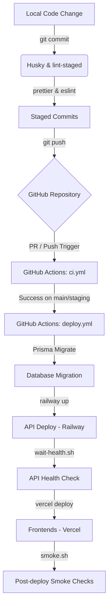

# Kloqra Automated CI/CD Workflow Hardening Plan

This plan provides a comprehensive professional overview of Kloqra's current CI/CD and automation flows, identifies key efficiency and reliability gaps, and proposes concrete hardening changes to optimize resource utilization and deployment safety.

## User Review Required

> [!IMPORTANT]
>
> - **CI Trigger Change**: Pushing to feature branches will no longer trigger CI runs unless there is an active Pull Request. This prevents double-building on PR updates. Pushes to `main` and `staging` will still run CI directly.
> - **E2E Tests in CI**: We propose adding Playwright E2E tests to the CI pipeline. This will increase CI run time slightly (mitigated by new caching strategies) but ensures visual and logical stability.
> - **Turborepo Caching**: We will initialize a GitHub Actions-based build cache for Turborepo (`.turbo`) and Next.js (`.next/cache`).

## 1. Professional Overview of Current Automation Flow

Kloqra uses a multi-layered automation strategy:



### Layer 1: Local Pre-commit Validation

- **Tooling**: `husky` + `lint-staged`.
- **Execution**: Triggered automatically on `git commit`. Checks, formats, and automatically fixes files (`eslint --fix` and `prettier --write`).
- **Vulnerability**: If developers bypass hooks (`--no-verify`), unformatted or lint-broken code can get to the remote repository.

### Layer 2: Continuous Integration (`ci.yml`)

- **Tooling**: GitHub Actions, PostgreSQL alpine service, Redis alpine service, pnpm, Prisma.
- **Execution**: Runs on any branch push or pull request.
- **Tasks**: Installs dependencies, generates Prisma client, deploys local test migrations, verifies code format (`pnpm format:check`), lints (`pnpm lint`), typechecks (`pnpm typecheck`), builds all monorepo packages, runs unit/integration tests (`pnpm test`), and conducts bundle analysis.

### Layer 3: Continuous Deployment (`deploy.yml`)

- **Tooling**: GitHub Actions (triggered by `workflow_run` on successful CI completion on `main` or `staging`), Railway CLI, Vercel CLI.
- **Execution**:
  - Runs Database migrations on target environment.
  - Deploys NestJS API to Railway (`railway up`).
  - Polls health endpoint of API until ready.
  - Deploys Frontends (Client & Admin) to Vercel.
  - Executes smoke checks for API and frontend reachability.

### Layer 4: Platform Auto-Deploys

- **Vercel**: Restricted using `ignoreCommand` in `vercel.json` to only build when the target branch is `main`.

---

## 2. Identified Gaps and Resource Waste Issues

### 1. Trigger Redundancy (Double Runs)

- **Gap**: Pushing to a branch with an open pull request triggers both `push` and `pull_request` workflows concurrently on the exact same commit hash.
- **Cost**: Doubles the GitHub Actions minutes used for everyday feature branch development.

### 2. Lack of Concurrency Management

- **Gap**: Fast, consecutive pushes to the same branch or PR trigger multiple parallel builds. Outdated builds continue to run to completion instead of being auto-canceled.
- **Cost**: Wasted CI container resources and delays in queueing relevant builds.

### 3. Missing Build Caching (Turborepo & Next.js)

- **Gap**: `pnpm build` builds all Next.js applications and shared workspace packages completely from scratch on every run.
- **Cost**: Average build time is ~3-5 minutes. With caching, unchanged modules can bypass rebuilding entirely, cutting build times down by up to 80%.

### 4. No Path-based Exclusions

- **Gap**: Any modification to markdown documentation (`docs/`, `*.md` files), github workflow files themselves, or other non-production configs spins up the entire test suite, including database containers.
- **Cost**: Unnecessary waiting times for simple documentation edits.

### 5. Playwright E2E Tests Not Executed

- **Gap**: Visual regressions and major page-flow errors (like login/timer/calendar breaking) are not validated automatically, despite having Playwright tests in `apps/client/e2e`.
- **Cost**: Risk of deploying broken client interfaces.

---

## 3. Proposed Hardening Changes

Separate components with horizontal rules for visual clarity.

### CI Workflow Configuration

#### [MODIFY] [ci.yml](file:///Users/chamal/Desktop/Kloqra/.github/workflows/ci.yml)

- Modify triggers to avoid double-runs (run `push` only on `main` and `staging`, run `pull_request` on all branches).
- Add path exclusions to skip CI for docs and markdown files.
- Add a `concurrency` block to auto-cancel older runs.
- Add caching steps for Turborepo (`.turbo`) and Next.js (`.next/cache`).
- Add a `Playwright E2E` job that runs after unit tests succeed, utilizing caching for browser binaries.

---

### CD Workflow Configuration

#### [MODIFY] [deploy.yml](file:///Users/chamal/Desktop/Kloqra/.github/workflows/deploy.yml)

- Add path exclusions to skip deploy checking if the push was only for documentation files.
- Add caching steps for Turborepo (`.turbo`) and Next.js (`.next/cache`) inside the manual deploy quality check job.

---

## 4. Detailed Code Diffs

### 1. Hardening `ci.yml` Trigger & Concurrency

```yaml
name: CI

on:
  push:
    branches: [main, staging]
    paths-ignore:
      - "**.md"
      - "docs/**"
  pull_request:
    branches: ["**"]
    paths-ignore:
      - "**.md"
      - "docs/**"

concurrency:
  group: ${{ github.workflow }}-${{ github.event.pull_request.number || github.ref }}
  cancel-in-progress: true
```

### 2. Adding Caching to jobs in `ci.yml`

```yaml
# Set up Turborepo and Next.js Caching
- name: Cache Turborepo & Next.js build cache
  uses: actions/cache@v4
  with:
    path: |
      .turbo
      apps/admin/.next/cache
      apps/client/.next/cache
    key: ${{ runner.os }}-turbo-next-${{ github.sha }}
    restore-keys: |
      ${{ runner.os }}-turbo-next-
```

### 3. Adding Playwright E2E Tests Job to `ci.yml`

```yaml
e2e:
  name: Playwright E2E Tests
  needs: ci
  runs-on: ubuntu-latest
  steps:
    - uses: actions/checkout@v4
    - uses: pnpm/action-setup@v4
      with:
        version: 9.15.0
    - uses: actions/setup-node@v4
      with:
        node-version: "20"
        cache: "pnpm"
    - run: pnpm install --frozen-lockfile
    - name: Cache Playwright Browsers
      id: cache-playwright
      uses: actions/cache@v4
      with:
        path: ~/.cache/ms-playwright
        key: ${{ runner.os }}-playwright-${{ hashFiles('**/pnpm-lock.yaml') }}
    - name: Install Playwright Browsers
      if: steps.cache-playwright.outputs.cache-hit != 'true'
      run: pnpm exec playwright install --with-deps
    - name: Run E2E tests
      # We start the local API/Client servers and run tests
      # Note: Playwright can auto-start webservers using webServer configuration,
      # but we must ensure dependencies are built first.
      run: |
        pnpm prisma:generate
        pnpm --filter @kloqra/contracts build
        pnpm --filter @kloqra/ui build
        pnpm test:e2e
```

---

## 5. Verification Plan

### Automated Verification

- Run `actionlint` (if installed) or check yaml syntax locally by parsing yaml files using Node.js script.
- Push changes to branch to verify GitHub Actions syntax checks pass and runners execute correctly.

### Manual Verification

- Commit the hardened workflows and verify that pushing a change does not trigger double-builds.
- Verify that build times drop on the second CI run due to Turborepo cache hits.
- Verify E2E tests run successfully in the CI container environment.
