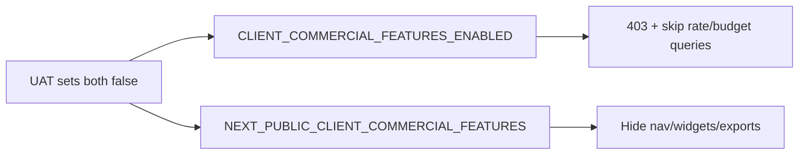

# Env-gated client commercial features (revenue + budget)

## Why two env vars (API + Admin)?

| Env | App | Objective |
|-----|-----|-----------|
| `CLIENT_COMMERCIAL_FEATURES_ENABLED` | **API** (`apps/api`) | **Server enforcement + performance.** Reject commercial routes (403), skip HourlyRate/budget DB work, refuse invoice/budget exports. UI alone is not enough — anyone with a token/Postman could still hit `/billing` or invoice APIs. |
| `NEXT_PUBLIC_CLIENT_COMMERCIAL_FEATURES` | **Admin** (and client for profile rate) | **UX.** Hide nav, widgets, export options so UAT users never see those surfaces. |

They must be set together for UAT. Hiding UI without the API flag leaves the backend open; gating the API without the UI flag leaves broken/empty pages.



## Decision

- **Scope B:** client revenue (rates, amounts, invoices) + project hour budgets — **not** SaaS `/account/billing`, **not** billable-hour tracking.
- **Always keep (never gated):**
  - `TimeLog.isBillable` (entry toggle / filters / billable-hour KPIs)
  - `Task.billableDefault` (task “billable” setting used when starting timers / creating entries)
- **Intent:** features stay in the codebase for future use. The flag only **shows/hides UI** and **allows/rejects API** — no removals, no schema drops. Flip env → features come back.
- **Enforcement:** UI hide + API reject (`DomainException` → 403).
- **Default:** **enabled** when unset (production-safe). UAT sets both flags to `false`.

## What happens when the flag is off (UAT)

| Layer | Behavior |
|-------|----------|
| Code / DB | Unchanged — rates, budget hours, amount math, invoice export all still exist |
| Admin UI | Nav item, revenue/budget widgets, invoice export, rate columns hidden |
| API | Dedicated commercial routes 403; dashboard builds **hours-only** (skips rate/budget queries) |
| Perf | No HourlyRate lookups, budget burn math, or budget alert fan-out while off |
| SaaS billing | Still works (`/account/billing`) |
| Billable tracking | Still works (entry + task billable) |

## What happens when you turn it back on later

Set both env vars to `true` (or unset them) and redeploy/restart — rates page, revenue widgets, budgets, invoices return with existing data. No migration or feature re-implement needed.

## Flag contract

| Env | App | Semantics |
|-----|-----|-----------|
| `CLIENT_COMMERCIAL_FEATURES_ENABLED` | API | `"false"` / `"0"` → off; unset/`true` → on |
| `NEXT_PUBLIC_CLIENT_COMMERCIAL_FEATURES` | Admin (+ client) | same; must match API for UAT |

Shared helper pattern (mirror assistant / signup):

- API: `apps/api/src/common/commercial/client-commercial-features.util.ts` + `*.spec.ts`
- Admin: `apps/admin/src/lib/client-commercial-features.ts`
- Web-shared: `packages/web-shared/src/client-commercial-features.ts` (profile / notification prefs)
- Contracts: `ErrorCodes.COMMERCIAL_FEATURES_DISABLED` in `packages/contracts/src/errors.ts`
- Docs: `docs/development/ENVIRONMENT.md`, `.env.example` files

## API (hard gate)

1. **Guard** `CommercialFeaturesGuard` — if disabled, throw `DomainException(ErrorCodes.COMMERCIAL_FEATURES_DISABLED, ..., 403)`.
2. Apply to billing controller, reporting budget routes, export invoice.
3. **Composite endpoints:** skip rate/budget work when off (hours-only dashboard); reject `invoice` / `budget_vs_actual` export types and money columns.
4. **Do not gate** subscription module, timelog `isBillable`, or task `billableDefault`.

## Performance (when flag is off)

Do **not** compute then strip — skip expensive commercial work entirely:

1. Skip `HourlyRate` `findMany` / `resolveRateMaps`
2. Skip `budgetHours` project selects and burn-down series
3. Admin FE excludes commercial widgets from registry (no lazy-load/fetch)
4. Guard util is O(1) env read only

## Admin UI (soft hide)

When `NEXT_PUBLIC_CLIENT_COMMERCIAL_FEATURES` is off: hide `/billing` nav + redirect, commercial dashboard/account widgets, invoice export mode, `invoice`/`budget_vs_actual` scenarios, money columns, `budgetAlert` prefs, profile `defaultHourlyRate`.

**Keep:** billable hour widgets/filters, task billable default, SaaS `/account/billing`.

## UAT wiring

```bash
CLIENT_COMMERCIAL_FEATURES_ENABLED=false
NEXT_PUBLIC_CLIENT_COMMERCIAL_FEATURES=false
```

Leave unset (or `true`) in production.

## Out of scope

- Deleting commercial modules, widgets, or Prisma columns
- Disabling SaaS Stripe/simulated subscription billing
- Removing or hiding `TimeLog.isBillable` or `Task.billableDefault`
- Per-tenant flags (env-only for now)
