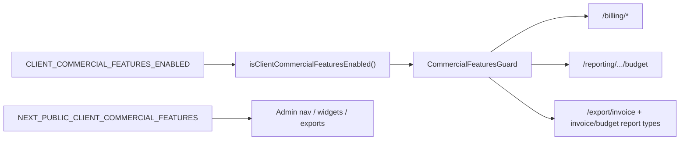

# Env-gated client commercial features (revenue + budget)

## Decision

- **Scope B:** client revenue (rates, amounts, invoices) + project hour budgets — **not** SaaS `/account/billing`, **not** billable-hour tracking.
- **Always keep (never gated):**
  - `TimeLog.isBillable` (entry toggle / filters / billable-hour KPIs)
  - `Task.billableDefault` (task “billable” setting used when starting timers / creating entries)
- **Intent:** features stay in the codebase for future use. The flag only **shows/hides UI** and **allows/rejects API** — no removals, no schema drops, no “rip out billing.” Flip env → features come back.
- **Enforcement:** UI hide + API reject (`DomainException` → 403).
- **Default:** **enabled** when unset (production-safe). UAT sets both flags to `false`.



## What happens when the flag is off (UAT)

| Layer | Behavior |
|-------|----------|
| Code / DB | Unchanged — rates, budget hours, amount math, invoice export all still exist |
| Admin UI | Nav item, revenue/budget widgets, invoice export, rate columns hidden |
| API | Dedicated commercial routes 403; dashboard builds **hours-only** (skips rate/budget queries) |
| Perf | No HourlyRate lookups, budget burn math, or budget alert fan-out while off |
| SaaS billing | Still works (`/account/billing`) |
| Billable tracking | Still works (entry + task billable) |

## What happens when you turn it back on later

Set both env vars to `true` (or unset them) and redeploy/restart — rates page, revenue widgets, budgets, invoices return with existing data. No migration or feature re-implement needed.
## Flag contract

| Env | App | Semantics |
|-----|-----|-----------|
| `CLIENT_COMMERCIAL_FEATURES_ENABLED` | API | `"false"` / `"0"` → off; unset/`true` → on |
| `NEXT_PUBLIC_CLIENT_COMMERCIAL_FEATURES` | Admin | same; must match API for UAT |

Shared helper pattern (mirror assistant / signup):

- API: `apps/api/src/common/commercial/client-commercial-features.util.ts` + `*.spec.ts`
- Admin: `apps/admin/src/lib/client-commercial-features.ts` reading `NEXT_PUBLIC_CLIENT_COMMERCIAL_FEATURES`
- Contracts: add `ErrorCodes.COMMERCIAL_FEATURES_DISABLED` in [`packages/contracts/src/errors.ts`](packages/contracts/src/errors.ts)
- Docs / examples: [`docs/development/ENVIRONMENT.md`](docs/development/ENVIRONMENT.md), `apps/api/.env.example`, `apps/admin/.env.example`

## API (hard gate)

1. **Guard** `CommercialFeaturesGuard` — if disabled, throw `DomainException(ErrorCodes.COMMERCIAL_FEATURES_DISABLED, ..., 403)`.
2. Apply to:
   - [`apps/api/src/modules/billing/`](apps/api/src/modules/billing/) controller (`/billing/rates`, `/billing/summary`)
   - Reporting budget routes: `ROUTES.REPORTING.BUDGET` + public mirror in reporting controller
   - Export invoice: `POST /export/invoice`
3. **Composite endpoints** (don’t 403 whole dashboard):
   - When disabled, strip/zero money + budget fields from reporting/dashboard and tenant analytics responses (`totalAmount`, `billableAmount`, `budgetHours`/`budgetStatus` on project rows) so remaining hour widgets keep working.
   - Reject export jobs whose `reportType` is `invoice` or `budget_vs_actual`, or whose column set is money-only (`rate`, `amount`, `billable_amount`) when those are the payload.
4. **Budget notifications:** skip emitting `budget.near` / `budget.over` when disabled (find emitter in reporting/projects notification path).
5. **Do not gate** subscription module (`/tenants/current/subscription*`), timelog `isBillable`, or task `billableDefault` CRUD/read APIs.

## Performance (when flag is off)

Do **not** compute then strip — skip expensive commercial work entirely:

1. **Rate resolution** — skip `HourlyRate` `findMany` / `resolveRateMaps` and amount accumulation in [`time-aggregation.service.ts`](apps/api/src/common/time/time-aggregation.service.ts) and reporting dashboard builders; return `0` for amounts without rate lookups.
2. **Budget queries** — skip `budgetHours` project selects and `computeBudgetFields` / burn-down series when building dashboard aggregates.
3. **Budget alerts** — no scan/emit of `budget.near` / `budget.over` (saves notification fan-out).
4. **Admin FE** — exclude commercial widgets from registry so they are not lazy-loaded or fetched; no billing/summary client calls when nav is hidden.
5. **Guard util** — O(1) `process.env` read only (same as existing kill-switches); no Redis/DB flag lookup.

When flag is **on**, behavior and query cost stay identical to today.

Tests: util unit + controller/e2e asserting 403 when env false; dashboard still 200 with amounts zeroed; unit test that aggregation path skips rate map load when disabled.

## Admin UI (soft hide)

When `NEXT_PUBLIC_CLIENT_COMMERCIAL_FEATURES` is off:

1. **Nav** — filter out `/billing` (“Hourly rates”) in [`apps/admin/src/config/admin-nav.ts`](apps/admin/src/config/admin-nav.ts) (or filter at consumer so project-lead specs stay green).
2. **Route** — `/billing` page redirects to dashboard or shows a short “unavailable” empty state (avoid blank crash if bookmarked).
3. **Dashboard widgets** — exclude from registry / visible layout when disabled (existing `mergeLayoutsWithRegistry` drops unknown ids):
   - `stat_revenue`, `revenue_trend`, `revenue_by_project`, `budget_burndown`, `project_health`, `rate_efficiency`, `hourly_rates`
4. **Account overview** — hide `kpi_billable_amount`, `chart_revenue`; hide Revenue column in workspace hours table ([`account-overview-page.tsx`](apps/admin/src/features/account/account-overview-page.tsx), [`account-workspace-hours-table.tsx`](apps/admin/src/features/account/account-workspace-hours-table.tsx)).
5. **Exports** — hide Invoice mode / wizard; remove `invoice` and `budget_vs_actual` from report-type pickers; hide `rate` / `amount` / `billable_amount` columns in custom export.
6. **Notifications prefs** — hide `budgetAlert` row in [`notifications-section.tsx`](packages/web-shared/src/features/account/settings/sections/notifications-section.tsx) when flag off (pass flag or read public env in admin only — keep client unaffected if section is shared; prefer admin-only wrapper or prop).
7. **Profile** — hide read-only `defaultHourlyRate` display when off.

**Keep visible:** `stat_billable` / `stat_nonbillable`, billability hour widgets, time tracker billable filters, task billable default UI (admin + client), SaaS Subscription nav/`/account/billing`.

## Client app

Minimal: no revenue nav today. If member export exposes `rate`/`amount` columns, hide those when a matching `NEXT_PUBLIC_CLIENT_COMMERCIAL_FEATURES` is added to client `.env.example` (same default-on). **Keep** entry `isBillable` toggles and task `billableDefault` display/edit.

## UAT wiring

Set in UAT env files / host config:

```bash
CLIENT_COMMERCIAL_FEATURES_ENABLED=false
NEXT_PUBLIC_CLIENT_COMMERCIAL_FEATURES=false
```

Leave unset (or `true`) in production.

## Out of scope

- Deleting commercial modules, widgets, or Prisma columns (this is a kill-switch, not a removal)
- Disabling SaaS Stripe/simulated subscription billing
- Removing or hiding `TimeLog.isBillable` or `Task.billableDefault`
- Per-tenant flags (env-only for now; matches house style)
