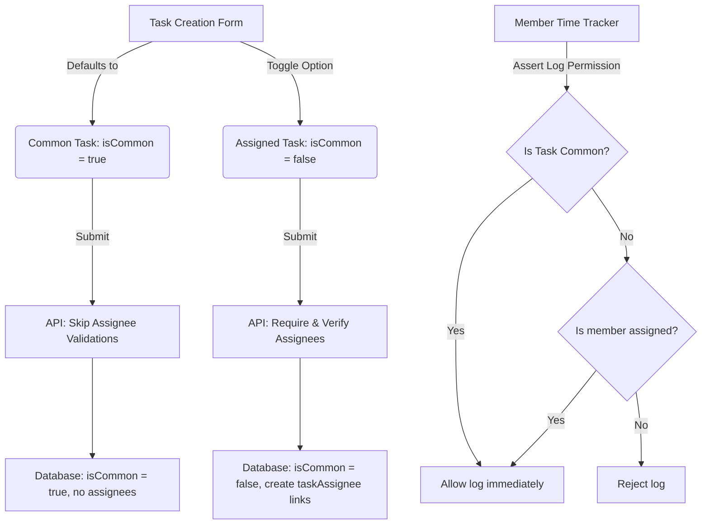

# Implementation Plan: Common Tasks (Shared Tasks by Default)

This plan details the design and implementation of the **Common Tasks** feature. It addresses the product requirement to simplify task creation by making tasks shared/common to all project team members by default (no explicit assignment required), while retaining the ability to restrict tasks to specific assignees.

---

## Proposed Solution



### 1. Database Schema (`schema.prisma`)
- Added `isCommon Boolean @default(true) @map("is_common")` to the `Task` model.
- Created and executed a database migration to add the column without breaking existing task records.

### 2. Validation & Contracts (`packages/contracts`)
- Added `isCommon` boolean property to Zod schemas: `taskSchema`, `createTaskSchema`, and `updateTaskSchema`.
- Relaxed the validation for `createTaskSchema.assigneeUserIds` from `min(1)` to `default([])` so that unassigned tasks are permitted when `isCommon: true`.

### 3. Backend Logic (`apps/api`)
- **Access Check (`project-access.service.ts`)**:
  - `assertCanLogTask` skips specific assignee checking if the task is a common task (`task.isCommon === true`).
- **Listing (`tasks.service.ts`)**:
  - Modified the filter in the `list()` method so that project members see all tasks where `isCommon: true` in addition to tasks they are explicitly assigned to.
- **Service Operations (`tasks.service.ts`)**:
  - In `create()`: Skip checking `assertAssigneesOnProject` if `dto.isCommon` is true.
  - In `update()`: If a task changes to a common task (`isCommon: true`), delete any existing member assignments in the `taskAssignee` table. Skip notifying users of unassignments in this transition since the task remains accessible.

### 4. Admin UI (`apps/admin`)
- **Project Tasks Panel (`project-tasks-panel.tsx`)**:
  - Added form state variables (`newIsCommon` and `editIsCommon`) to both the creation form and the inline edit view.
  - Added a radio selector group for **Task Assignment Type**:
    - **Common task (all members)**: Hides the assignee picker, resets the assignee list to `[]` when submitted.
    - **Assigned task (restrict members)**: Renders the team multi-selector and enforces that at least one member is selected before submission.
  - Rendered a helper description "Common task (all members)" next to common tasks in the list.
  - Updated the count of "unassigned tasks" to ignore common tasks, since they are not hidden from members.

---

## Verification Plan

### Automated Tests
- Updated Zod validation tests in `contracts.spec.ts`.
- Added tests in `tasks.service.spec.ts` asserting:
  - Common task creation saves `isCommon: true` and skips assignee inserts.
  - Assigned task creation correctly verifies and writes assignees.
  - Updating a task to common deletes database assignments.
- Updated mocked tasks in other test suites (`period-entry-activity.utils.spec.ts`, `global-search-results.spec.ts`, `category-split-data.spec.ts`, `project-split-data.spec.ts`, `time-tracker-entry-row.spec.tsx`) to resolve compile errors.

Run verification:
```bash
corepack pnpm --filter @kloqra/contracts test
corepack pnpm --filter @kloqra/admin test
corepack pnpm --filter @kloqra/client test
corepack pnpm --filter @kloqra/api test
```
*Result*: **All tests compile, typecheck, and pass successfully.**
