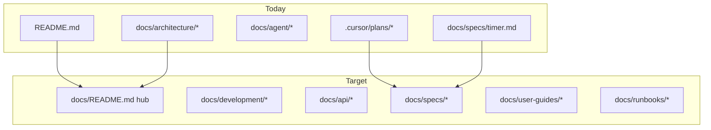

# Complete Kloqra documentation

## Current state (baseline)

**What exists today**

| Area                | Status                                                                                                                                                                      |
| ------------------- | --------------------------------------------------------------------------------------------------------------------------------------------------------------------------- |
| Onboarding          | Strong: [README.md](README.md) — stack, `pnpm serve`, ports, seed accounts, client vs admin matrix                                                                          |
| Architecture        | Thin but useful: [CONTEXT.md](docs/architecture/CONTEXT.md), [DOMAIN_MODEL.md](docs/architecture/DOMAIN_MODEL.md), [TIMER_SEQUENCE.md](docs/architecture/TIMER_SEQUENCE.md) |
| Product direction   | Good: [PRODUCT_ROADMAP.md](docs/architecture/PRODUCT_ROADMAP.md), [FUTURE_SCOPE.md](docs/architecture/FUTURE_SCOPE.md)                                                      |
| Agent workflow      | [AGENTS.md](docs/agent/AGENTS.md), [ROC.md](docs/agent/ROC.md), [TASK_BOARD.json](TASK_BOARD.json)                                                                          |
| Feature specs       | **Only** [timer.md](docs/specs/timer.md)                                                                                                                                    |
| API reference       | **None** (no OpenAPI); SSOT is [packages/contracts](packages/contracts/src/) + [routes.ts](packages/contracts/src/routes.ts)                                                |
| Runbooks            | [deploy.md](docs/runbooks/deploy.md) only                                                                                                                                   |
| Per-app READMEs     | **None**                                                                                                                                                                    |
| End-user guides     | **None**                                                                                                                                                                    |
| Deep feature design | Lives in `.cursor/plans/` (export, settings) — not linked from README                                                                                                       |

**Gaps to close:** no docs index, no env/security/testing guides, no ER/schema doc, no specs for 8+ shipped API modules, export knowledge trapped in a Cursor plan file.



---

## Proposed docs structure

```
docs/
  README.md                 # Documentation hub (start here)
  development/
    CONTRIBUTING.md         # Branching, pnpm scripts, module layout, PR checklist
    ENVIRONMENT.md          # All env vars (api + client + admin)
    TESTING.md              # unit, e2e, seed data, CI expectations
    SECURITY.md             # JWT, cookies, workspace header, RBAC summary
  architecture/
    CONTEXT.md              # extend (module inventory, links)
    DOMAIN_MODEL.md         # extend (ER diagram, key Prisma models)
    DATA_MODEL.md           # NEW: tables, relations, enums from schema.prisma
    AUTH.md                 # NEW: login, refresh, switch-workspace, guards
    PRODUCT_ROADMAP.md      # keep; link shipped features to specs
  api/
    OVERVIEW.md             # Base URL, headers, errors, pagination conventions
    ROUTES.md               # Generated or maintained from contracts ROUTES + DTOs
  specs/
    timer.md                # exists
    timelogs.md, projects.md, billing.md, reporting.md,
    export.md, presence.md, auth-workspace.md  # NEW
  user-guides/
    README.md               # Who reads what
    member/                 # client app (:3000)
    admin/                  # admin app (:3002)
  runbooks/
    deploy.md               # exists
    local-troubleshooting.md  # NEW: Redis, DB, CORS, common failures
```

Per-app pointers (short, link to hub):

- [apps/api/README.md](apps/api/README.md) — migrate, seed, module map
- [apps/client/README.md](apps/client/README.md) — routes, env, dev port
- [apps/admin/README.md](apps/admin/README.md) — same

---

## Phase 1 — Foundation (1–2 days)

**Goal:** Any new contributor or user can find the right doc in under a minute.

1. **Create [docs/README.md](docs/README.md)** — table of contents with audience tags (Developer | User | Ops | Agent). Update [README.md](README.md) Docs section to point here first.

2. **[docs/development/ENVIRONMENT.md](docs/development/ENVIRONMENT.md)** — consolidate from [apps/api/.env.example](apps/api/.env.example) and Next.js `NEXT_PUBLIC_*` vars; document `REDIS_USE_MEMORY`, `FRONTEND_ORIGIN`, JWT secrets, ports 3000/3001/3002.

3. **[docs/development/CONTRIBUTING.md](docs/development/CONTRIBUTING.md)** — monorepo layout (mirror [CONTEXT.md](docs/architecture/CONTEXT.md)), contract-first rule (`packages/contracts` before API/FE), feature module pattern (`domain/`, `application/`, `infrastructure/`, `interface/http/`), scripts from root [package.json](package.json), link [AGENTS.md](docs/agent/AGENTS.md) for agent-driven work.

4. **[docs/development/TESTING.md](docs/development/TESTING.md)** — `pnpm test`, `pnpm test:e2e`, where specs live (`*.spec.ts` under API modules, [packages/contracts](packages/contracts/src/contracts.spec.ts)), seed accounts from README, what e2e covers today.

5. **Per-app READMEs** — three small files linking back to hub; API README lists modules under [apps/api/src/modules/](apps/api/src/modules/).

6. **[docs/runbooks/local-troubleshooting.md](docs/runbooks/local-troubleshooting.md)** — Postgres.app vs Docker, `createdb chronomint`, refresh cookie / CORS, timer without Redis.

**Deliverable check:** README → docs hub → env + contributing + testing without reading source.

---

## Phase 2 — Architecture & API (2–3 days)

**Goal:** Developers understand system shape and can call every shipped endpoint without spelunking controllers.

1. **Extend [DOMAIN_MODEL.md](docs/architecture/DOMAIN_MODEL.md)** — mermaid ER for `Workspace`, `Project`, `Team`, `TeamMember`, `Task`, `TimeLog`, `BillingRate`; clarify workspace admin vs project team.

2. **NEW [docs/architecture/DATA_MODEL.md](docs/architecture/DATA_MODEL.md)** — enums (`WorkspaceRole`, `TimeLogSource`, etc.), JSON fields (`Workspace.settings`), indexes worth knowing; source of truth: [apps/api/prisma/schema.prisma](apps/api/prisma/schema.prisma).

3. **NEW [docs/architecture/AUTH.md](docs/architecture/AUTH.md)** — sequence diagram: register/login → access token + httpOnly refresh → `Authorization` + `X-Workspace-Id`; admin-only routes; member redirect behavior (from README matrix).

4. **NEW [docs/api/OVERVIEW.md](docs/api/OVERVIEW.md)** — conventions: JSON body, Zod validation errors, workspace scoping, no cross-module imports.

5. **NEW [docs/api/ROUTES.md](docs/api/ROUTES.md)** — route catalog grouped by domain, derived from [routes.ts](packages/contracts/src/routes.ts). For each group, link to DTO file and controller:
   - Auth → `auth.dto.ts` → [auth.controller.ts](apps/api/src/modules/auth/interface/http/auth.controller.ts)
   - Export → `export.dto.ts` → [export.controller.ts](apps/api/src/modules/export/interface/http/export.controller.ts)
   - etc.

   **Maintenance options** (pick one when implementing):
   - **A (low effort):** hand-maintained markdown table updated when contracts change
   - **B (medium):** small script `scripts/generate-api-docs.ts` that reads `ROUTES` + exports DTO schema names (no full OpenAPI v1)
   - **C (later):** Nest Swagger plugin — only if you want interactive docs; not required for v1

6. **NEW [docs/development/SECURITY.md](docs/development/SECURITY.md)** — secrets handling, never commit `.env`, production JWT rotation, `FRONTEND_ORIGIN` purpose.

**Deliverable check:** Developer can implement a new endpoint knowing headers, module folder, and where to add Zod.

---

## Phase 3 — Feature specs (2–3 days)

**Goal:** One canonical spec per shipped feature (Given/When/Then or user stories + API touchpoints), aligned with [AGENTS.md](docs/agent/AGENTS.md) workflow.

| Spec file           | Module           | Key behaviors to document                                                                                                                                                                               |
| ------------------- | ---------------- | ------------------------------------------------------------------------------------------------------------------------------------------------------------------------------------------------------- |
| `timelogs.md`       | timelogs         | CRUD, manual vs timer immutability                                                                                                                                                                      |
| `projects.md`       | projects         | CRUD, team invites, access rules                                                                                                                                                                        |
| `billing.md`        | billing          | Rate precedence (project → user → default), summary                                                                                                                                                     |
| `reporting.md`      | reporting        | Dashboard aggregates, `/reporting/me`                                                                                                                                                                   |
| `export.md`         | export           | **Promote from** [.cursor/plans/export_feature_plan_1864d505.plan.md](.cursor/plans/export_feature_plan_1864d505.plan.md) — report catalog, filters, formats, filename rules; trim implementation todos |
| `presence.md`       | presence         | SSE stream vs snapshot, team live                                                                                                                                                                       |
| `auth-workspace.md` | auth + workspace | Register, members, invites                                                                                                                                                                              |

Each spec should include:

- User-visible outcome (member or admin)
- API routes + contract file link
- Edge cases (permissions, empty ranges)
- Link to relevant UI route (`apps/client/...` or `apps/admin/...`)

Update [PRODUCT_ROADMAP.md](docs/architecture/PRODUCT_ROADMAP.md) **Shipped** rows with links to these specs (not only PR paths).

**Optional:** When [user settings plan](.cursor/plans/user_settings_management_79030cb7.plan.md) ships, add `workspace-settings.md` the same way.

---

## Phase 4 — End-user guides (1–2 days)

**Goal:** Non-developers can use client and admin without tribal knowledge.

Structure under `docs/user-guides/`:

**Member ([apps/client](apps/client))**

| Guide                           | Covers                                          |
| ------------------------------- | ----------------------------------------------- |
| `member/getting-started.md`     | Register, login, accept team invite             |
| `member/timer-and-timesheet.md` | Start/stop timer, manual entries, week view     |
| `member/export-my-data.md`      | CSV/Excel/PDF from timesheet, “My week summary” |

**Admin ([apps/admin](apps/admin))**

| Guide                              | Covers                                                                                 |
| ---------------------------------- | -------------------------------------------------------------------------------------- |
| `admin/getting-started.md`         | Admin login, workspace overview                                                        |
| `admin/projects-and-teams.md`      | Create project, invite links                                                           |
| `admin/dashboard-and-team-live.md` | Analytics, presence                                                                    |
| `admin/billing.md`                 | Rates, billable summary                                                                |
| `admin/exports.md`                 | Wizard: filters, report types, columns, formats (user language, not exceljs internals) |

Use screenshots only if you plan to keep them updated; otherwise numbered UI steps (“Exports → date range → …”) referencing route paths from the app.

**Deliverable check:** Seed-account walkthrough documented end-to-end for both roles.

---

## Phase 5 — Ops, changelog, and maintenance (ongoing)

1. **Extend [deploy.md](docs/runbooks/deploy.md)** — env checklist cross-link to ENVIRONMENT.md; migration policy; health/smoke (already started).

2. **NEW [CHANGELOG.md](CHANGELOG.md)** (repo root) — Keep a Changelog format; first entry = Phase 1–2 shipped baseline (timer, reporting, export, etc.).

3. **Documentation hygiene** (document in CONTRIBUTING.md):
   - New feature PR must add/update `docs/specs/<feature>.md` and a line in docs hub
   - Shipped roadmap item → move to **Shipped** + spec link
   - Agent tasks → continue updating [ROC.md](docs/agent/ROC.md)
   - `.cursor/plans/` = **draft**; promote stable design to `docs/specs/` or `docs/architecture/` when feature completes (export is the first candidate)

4. **Optional later:** OpenAPI/Swagger, public docs site (VitePress/Docusaurus), diagram for export aggregation flow.

---

## Suggested execution order

| Order | Phase                                                 | Why                                        |
| ----- | ----------------------------------------------------- | ------------------------------------------ |
| 1     | Foundation hub + env + contributing + per-app READMEs | Unblocks everyone immediately              |
| 2     | DATA_MODEL + AUTH + API ROUTES                        | Highest developer ROI                      |
| 3     | Feature specs (start with **export** promotion)       | Captures shipped behavior before it drifts |
| 4     | User guides                                           | Depends on accurate specs                  |
| 5     | CHANGELOG + maintenance rules                         | Keeps docs from rotting                    |

---

## Out of scope (unless you ask later)

- Full OpenAPI UI in v1
- Video tutorials
- Translating docs to other languages
- Documenting unshipped roadmap items as if they exist (keep those in PRODUCT_ROADMAP only)

---

## Success criteria

- [ ] `docs/README.md` is the single entry point; root README links to it
- [ ] Every shipped API module has a spec under `docs/specs/`
- [ ] Export design lives in `docs/specs/export.md`, not only in `.cursor/plans/`
- [ ] Member and admin each have a getting-started + primary workflow guide
- [ ] New contributor can run app, run tests, and find route/DTO reference without opening Nest controllers first
