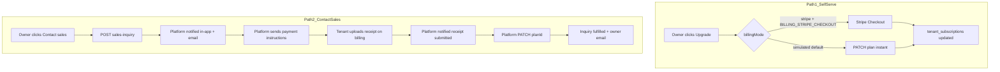

# Two-path billing — self-serve vs contact sales

## Product model (confirmed)

When a tenant owner switches plans on **Account → Billing**, two paths apply based on plan `billingMode` in the `plans` table (edited in platform-admin):

| Path | Plans | Tenant experience | Platform role |
|------|-------|-------------------|---------------|
| **1. Self-serve** | Starter, Pro (`billingMode: stripe`) | Stripe Checkout (prod) or simulated instant PATCH (dev default) | None — webhooks or simulate update `tenant_subscriptions` |
| **2. Contact sales** | Enterprise (`billingMode: contact`) | Submit inquiry → receive payment instructions → upload receipt → wait for activation | Review receipt, assign plan in tenant detail |

**Custom plans** (non-catalog pricing/limits) — **research only** in this epic; no build until spike is done.

---

## What exists today

| Piece | Status |
|-------|--------|
| Self-serve simulated PATCH | Done — [subscriptions.md](docs/specs/subscriptions.md) |
| Self-serve Stripe Checkout | Done — gated by `BILLING_STRIPE_CHECKOUT=true` |
| Contact sales CTA | **mailto only** — [plan-pricing-card.tsx](apps/admin/src/features/account/plan-pricing-card.tsx) |
| Platform plan assignment | Done — [tenant-detail-page.tsx](apps/platform-admin/src/features/tenants/tenant-detail-page.tsx) `PATCH planId` |
| Platform notifications + email | Done — [platform-notifications-dispatch.service.ts](apps/api/src/modules/platform/application/platform-notifications-dispatch.service.ts) |
| **Receipt upload** | **Does not exist** — research gap |
| **Payment instructions step** | **Does not exist** — research gap |
| **Custom plan catalog** | **Does not exist** — defer |

---

## Research gaps (must resolve in design before receipt work)

### Receipt upload (new capability)

No billing receipt API, UI, or storage model exists. Closest pattern: local filesystem storage in [export-job-storage.util.ts](apps/api/src/modules/export/application/export-job-storage.util.ts) (export jobs only).

| Decision | Proposed default (v1) |
|----------|----------------------|
| **When upload** | **After platform sends instructions** (user confirmed) — not required at inquiry submit |
| **File types** | PDF, PNG, JPG; max ~5 MB |
| **Storage** | Reuse local `EXPORT_JOBS_DIR`-style dir or dedicated `BILLING_RECEIPTS_DIR`; `storage_key` on row (S3 later) |
| **Who can read** | Tenant owner (own receipts); platform superadmin (download from tenant detail) |
| **Retention** | Keep with inquiry record; no auto-delete in v1 |

### Payment instructions

| Decision | Proposed default (v1) |
|----------|----------------------|
| **Trigger** | Platform-admin button on open inquiry: **Send payment instructions** |
| **Content** | Email template with static wire/bank block from env (`BILLING_MANUAL_PAYMENT_INSTRUCTIONS` markdown or HTML) + plan name + amount context |
| **Inquiry status** | `open` → `awaiting_receipt` after instructions sent |

### Custom plans (deferred — spike only)

Document open questions in `docs/specs/custom-plans-research.md` (new):

- Separate `plans` row per custom tenant vs `limits_override` only?
- How does pricing display on billing cards?
- Does custom plan use contact-sales path or a third `billingMode`?
- Stripe invoice vs fully offline?

**No implementation** until product signs off on spike.

### Minor fix (existing gap)

Platform notification emails link to `/tenants/:id` but [app-origin.util.ts](apps/api/src/common/mailer/app-origin.util.ts) does not route those to platform-admin — fix using [platform-origin.util.ts](apps/api/src/common/mailer/platform-origin.util.ts).

---

## Data model

### `tenant_sales_inquiries`

| Column | Notes |
|--------|--------|
| `id`, `tenant_id`, `requested_plan_id` | FKs |
| `requested_by_user_id` | Owner |
| `message` | Optional at inquiry |
| `billing_interval` | `monthly` \| `yearly` |
| `status` | `open` \| `awaiting_receipt` \| `receipt_submitted` \| `fulfilled` \| `closed` |
| `instructions_sent_at` | Set when platform sends payment email |
| `created_at`, `fulfilled_at` | Audit |

### `tenant_sales_inquiry_receipts`

| Column | Notes |
|--------|--------|
| `id`, `inquiry_id` | FK |
| `uploaded_by_user_id` | Owner |
| `filename`, `content_type`, `storage_key`, `size_bytes` | File metadata |
| `created_at` | |

One inquiry can have multiple receipts (re-upload / supplemental).

---

## API surface

### Tenant (owner)

| Route | Purpose |
|-------|---------|
| `POST /tenants/current/subscription/sales-inquiry` | Start contact-sales path |
| `GET /tenants/current/subscription/sales-inquiry` | Current open inquiry + status (for billing UI) |
| `POST /tenants/current/subscription/sales-inquiry/receipts` | Multipart upload — only when `status === awaiting_receipt` |

### Platform (superadmin)

| Route | Purpose |
|-------|---------|
| `GET /platform/tenants/:id/sales-inquiries` | List inquiries + receipt metadata |
| `POST /platform/tenants/:id/sales-inquiries/:inquiryId/send-instructions` | Email tenant + set `awaiting_receipt` |
| `GET /platform/tenants/:id/sales-inquiries/:inquiryId/receipts/:receiptId` | Download receipt file |

### Notifications

| Type | When | Preference key |
|------|------|----------------|
| `SALES_INQUIRY` | Inquiry created | `tenantLifecycle` |
| `SALES_RECEIPT_UPLOADED` | Tenant uploads receipt | `tenantLifecycle` |

Emails: platform superadmins (via dispatch service); tenant owner (via [billing.mailer.ts](apps/api/src/common/mailer/billing.mailer.ts)) for inquiry received, instructions sent, plan activated.

---

## UI

### Admin billing ([account-billing-page.tsx](apps/admin/src/features/account/account-billing-page.tsx))

- **Stripe/simulated tiers:** unchanged upgrade flow (path 1).
- **Contact tier:** dialog → submit inquiry → show status card:
  - `open` — “We’ll send payment instructions shortly.”
  - `awaiting_receipt` — upload receipt UI + file picker.
  - `receipt_submitted` — “Under review.”
  - Remove default `mailto` for in-app contact tiers.

### Platform-admin ([tenant-detail-page.tsx](apps/platform-admin/src/features/tenants/tenant-detail-page.tsx))

- **Sales inquiries** card: status, message, billing interval, receipts list with download.
- **Send payment instructions** button (when `open`).
- Existing **plan dropdown + Save** fulfills when staff is satisfied (path 2 completion).

---

## Implementation phases

| Phase | Scope | Ships |
|-------|--------|-------|
| **A** | Inquiry + platform/tenant emails + notifications + platform email link fix + billing status UI (no upload yet) | Minimum viable handoff |
| **B** | Payment instructions action + receipt upload + `RECEIPT_UPLOADED` notify + platform receipt view | Full manual path per your model |
| **C** | Custom plans research doc only | No code |

Phase A can ship first if you want faster iteration; Phase B completes the receipt loop.

---

## Tests + docs

- Unit: inquiry service, receipt validation, status transitions
- E2E: full manual path `open` → instructions → upload → PATCH plan → `fulfilled`
- Playwright: billing page shows correct CTA per `billingMode`; receipt upload when `awaiting_receipt`
- Docs: [subscriptions.md](docs/specs/subscriptions.md) — two-path table; [platform-admin.md](docs/specs/platform-admin.md) — manual fulfillment runbook; [ENVIRONMENT.md](docs/development/ENVIRONMENT.md) — `BILLING_MANUAL_PAYMENT_INSTRUCTIONS`

---

## Out of scope (this epic)

- Custom plan implementation
- Stripe for Enterprise
- Automated receipt OCR / fraud checks
- Tenant in-app notifications (email sufficient for v1)
