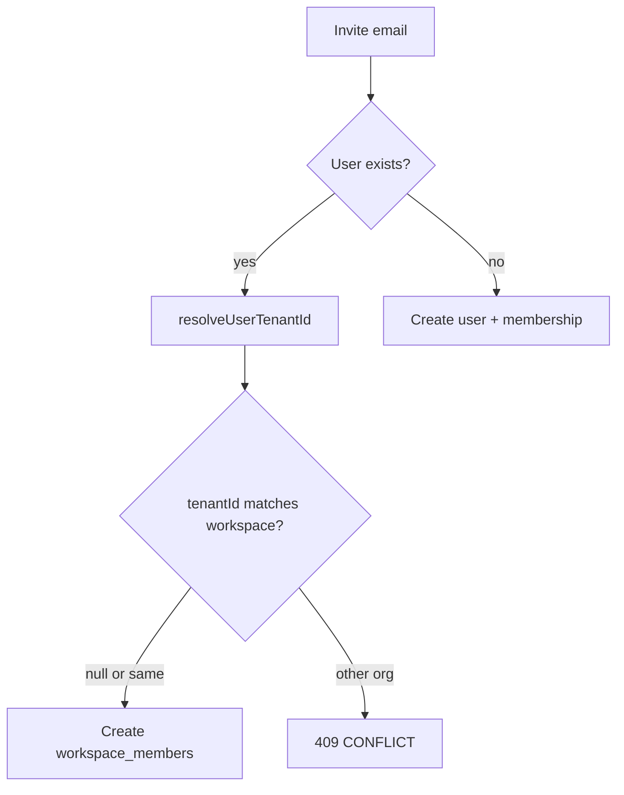

# Enforce D08 on all invite paths

## Problem

Golden rule **D08** (one user ↔ one organization) is already documented and partly enforced:

- DB: `tenant_members.user_id` is `UNIQUE`
- Enforced: tenant-admin invite, assign-workspace-admin, signup, platform provision
- **Gap:** [`WorkspaceService.invite`](apps/api/src/modules/workspace/application/workspace.service.ts) and [`BulkInviteWorker`](apps/api/src/modules/queues/workers/bulk-invite.worker.ts) only check “already in *this* workspace,” so they can attach an existing user to another org’s workspace

Org/workspace “invites” create membership immediately (no pending accept). Blocking at **invite-create** is the correct place—same as [`TenantsService.inviteMember`](apps/api/src/modules/tenants/application/tenants.service.ts) and `assignAdmin`.



## Approach

1. **Shared guard** in [`apps/api/src/common/tenant/tenant-context.ts`](apps/api/src/common/tenant/tenant-context.ts):

```ts
assertUserNotInOtherTenant(prisma, userId, tenantId)
// if resolveUserTenantId(...) is set and !== tenantId → CONFLICT
// message: "User already belongs to another organization"
```

Reuse the same `ErrorCodes.CONFLICT` + message already used by tenant invite / assign-admin (keep `ALREADY_IN_ORGANIZATION` for signup/platform).

2. **Call the guard in `WorkspaceService.invite`** after the user is found/created and before creating `workspace_members`. That covers:
   - `POST .../members/invite`
   - `assignAdmin` (already checks, then calls `invite`—guard inside `invite` is the source of truth; leave the pre-check in `assignAdmin` or remove as redundant once `invite` is covered)

3. **Bulk invite worker:** after resolving the user, if they belong to another tenant, **skip** that row (increment `skippedCount`, do not create membership)—consistent with how bulk already skips existing workspace members, instead of failing the whole job.

4. **Same-tenant multi-workspace remains allowed (D14):** only reject when `resolveUserTenantId !== workspace.tenantId`.

5. **No schema change required** for the fix itself (`tenant_members.user_id` UNIQUE already exists). Optional follow-up: audit query for existing cross-tenant `workspace_members` rows and deactivate/delete them if any were created via the gap.

## Tests (required)

- Unit: [`workspace.service.spec.ts`](apps/api/src/modules/workspace/application/workspace.service.spec.ts) — invite rejects when `resolveUserTenantId` is another org; invite still succeeds for same-tenant / new email
- Unit: bulk-invite worker spec (or extend existing) — cross-tenant email skipped, not joined
- E2E: extend [`workspace-lifecycle.e2e.ts`](apps/api/test/workspace-lifecycle.e2e.ts) (or workspace invite e2e) — `POST .../members/invite` with other-org email → 409

## Docs (light)

- Add a one-liner under Edge cases in [`docs/specs/tenants.md`](docs/specs/tenants.md): workspace/bulk invite also enforce D08

## Out of scope

- Pending invite tokens / accept flow redesign (not how org/workspace invites work today)
- FE changes unless invite UI does not already surface API error messages (admin forms generally do)
- Changing signup/platform codes from `ALREADY_IN_ORGANIZATION`
