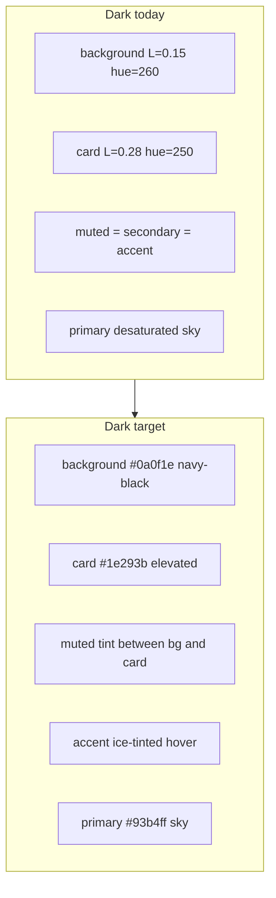

# Dark theme palette refresh

## Problem diagnosis

Light mode in [`packages/ui/src/globals.css`](packages/ui/src/globals.css) is cohesive: navy foreground, ice surfaces, saturated Kloq Blue primary. Dark mode uses the same token _names_ but the _values_ create the issues you flagged:

| Issue                  | Root cause in `.dark` today                                                                                                                                                 |
| ---------------------- | --------------------------------------------------------------------------------------------------------------------------------------------------------------------------- |
| Cold / muddy           | Mixed hues (`260` background, `250` cards/muted, `264` foreground) — neutrals don't share one color family                                                                  |
| Flat surfaces          | `--secondary`, `--muted`, and `--accent` are **identical** (`oklch(0.32 0.04 250)`) — sidebar, cards, and hover states collapse                                             |
| Weak primary           | `--primary` is high-lightness, low-chroma (`0.78 / 0.12`) — buttons and links feel washed vs light's `0.58 / 0.22`                                                          |
| Clashing status colors | Semantic tokens (`success`, `warning`) are **unchanged** between themes; ~30 feature files also hardcode `dark:bg-*-950/30` Tailwind greens/ambers that fight the navy base |

Brand constants in [`packages/contracts/src/brand.ts`](packages/contracts/src/brand.ts) already define the intended dark anchors (`black: #0a0f1e`, `dark: #1e293b`, `sky: #93b4ff`) — the rebrand plan in [`.cursor/plans/kloqra_brand_rebrand_0119fd2b.plan.md`](.cursor/plans/kloqra_brand_rebrand_0119fd2b.plan.md) sketched this but dark tokens were never fully aligned.



**Scope constraint:** Light `:root` tokens stay untouched. Changes are `.dark { ... }` only plus shared status utilities that read those tokens.

---

## Phase 1 — Retune dark semantic tokens (single file, highest ROI)

**File:** [`packages/ui/src/globals.css`](packages/ui/src/globals.css)

Rewrite the `.dark` block using OKLCH conversions of brand hex, unified on **hue 264** (Kloqra blue family):

| Token                  | Target (from brand)                       | Intent                                                  |
| ---------------------- | ----------------------------------------- | ------------------------------------------------------- |
| `--background`         | `#0a0f1e`                                 | Deep navy-black canvas                                  |
| `--foreground`         | near-white with slight blue tint          | Readable body text                                      |
| `--card` / `--popover` | `#1e293b`                                 | Clear elevation over background                         |
| `--muted`              | ~4–6% lighter than background, low chroma | Main content wash (`shellMainClass` uses `bg-muted/20`) |
| `--secondary`          | between muted and card                    | Sidebar footer, secondary buttons                       |
| `--accent`             | ice-tinted (`#eef2ff` at ~8–12% on dark)  | Hover/focus fills — distinct from muted                 |
| `--border` / `--input` | `#334155`-range, blue-tinted              | Visible but not harsh dividers                          |
| `--primary`            | `#93b4ff` (sky)                           | Restores CTA punch                                      |
| `--primary-foreground` | `#0a0f1e`                                 | Strong contrast on sky buttons                          |
| `--muted-foreground`   | `#94a3b8`                                 | Matches brand muted                                     |
| `--ring`               | sky primary                               | Focus rings match CTAs                                  |

**Dark-only semantic retune** (currently copied from light):

- `--success` / `--success-foreground` — mint readable on navy (lighter fg, slightly toned bg mixes)
- `--warning` / `--warning-foreground` — amber that doesn't neon on dark
- `--destructive` — slightly softer fill, brighter fg for badges
- `--premium` — indigo tuned for dark charts/badges
- `--chart-1` … `--chart-5` — re-derive from dark primaries so dashboard charts harmonize

Add **status surface tokens** (new, both themes but tuned separately):

```css
/* Example shape — values differ in :root vs .dark */
--status-success-bg: color-mix(in oklch, var(--success) 10%, transparent);
--status-success-fg: ...;
--status-success-border: color-mix(in oklch, var(--success) 25%, transparent);
/* same pattern for warning, info, danger */
```

Wire into `@theme inline` as `--color-status-success-bg` etc. so Tailwind utilities exist (`bg-status-success-bg`).

**Shimmer / skeleton tweak:** In `.animate-shimmer`, dark muted mix may need a slightly higher contrast stop so loading states aren't invisible on navy.

---

## Phase 2 — Migrate shared components off hardcoded Tailwind status colors

Replace `dark:text-amber-300`, `dark:bg-green-950/30`, `bg-yellow-500/10`, etc. with semantic status utilities in **packages/ui** and **web-shared** first (auto-fixes both apps):

| File                                                                                                    | Change                                                                                                                                      |
| ------------------------------------------------------------------------------------------------------- | ------------------------------------------------------------------------------------------------------------------------------------------- |
| [`timesheet-approval-status-badge.tsx`](packages/ui/src/components/timesheet-approval-status-badge.tsx) | `SUBMITTED` → warning status tokens; `APPROVED` → success; amendment → info/primary tokens                                                  |
| [`modal-styles.ts`](packages/ui/src/components/ui/modal-styles.ts)                                      | Warning callout uses status tokens                                                                                                          |
| [`layout.tsx`](packages/ui/src/components/layout.tsx)                                                   | Empty-state amber strip → `status-warning-*`                                                                                                |
| [`layout-shell.tsx`](packages/ui/src/components/layout-shell.tsx)                                       | Demo badge → status tokens                                                                                                                  |
| [`badge.tsx`](packages/ui/src/components/ui/badge.tsx)                                                  | Add `success-subtle` / `warning-subtle` / `info-subtle` outline variants using status tokens (keeps solid `success`/`warning` for emphasis) |

Pattern for subtle badges (replaces scattered classes):

```tsx
// Before
"bg-emerald-500/10 text-emerald-600 dark:text-emerald-400 border-emerald-500/25";
// After
"bg-status-success-bg text-status-success-fg border-status-success-border";
```

---

## Phase 3 — High-traffic feature surfaces (targeted sweep)

Migrate the worst offenders in apps (same token pattern, no per-file color invention):

**Client** — [`submission-status-card.tsx`](apps/client/src/features/timesheet/submission-status-card.tsx), [`timesheet-status-card.tsx`](apps/client/src/features/timesheet/timesheet-status-card.tsx), [`time-tracker-entry-status.tsx`](apps/client/src/features/time-tracker/time-tracker-entry-status.tsx), [`workspace-shell.tsx`](apps/client/src/components/workspace-shell.tsx) (impersonation banner)

**Admin** — [`pending-timesheet-card.tsx`](apps/admin/src/features/approvals/pending-timesheet-card.tsx), [`budget-burndown-widget.tsx`](apps/admin/src/features/dashboard/budget-burndown-widget.tsx), [`team-utilization-widget.tsx`](apps/admin/src/features/dashboard/team-utilization-widget.tsx), [`live-presence-widget.tsx`](apps/admin/src/features/dashboard/widgets/live-presence-widget.tsx)

**Explicitly skip** for this pass: chart data colors in [`project-overview-chart-data.ts`](packages/web-shared/src/components/project-overview-chart-data.ts) (project-specific hues), project color picker swatches, PDF/export hex in API.

---

## Phase 4 — Verify and document

**Manual smoke** (both apps, dark mode only):

- Shell: sidebar (`bg-card`), main wash (`bg-muted/20`), app bar blur — confirm 3 visible surface levels
- Primary CTAs, links, active nav (`bg-primary/10`) — sky blue should pop
- Submissions + approvals status badges — no neon green/amber on navy
- Dashboard widgets with green/amber/red health chips
- Charts using `--chart-*` tokens
- `prefers-reduced-motion` unchanged

**Automated:**

- Update [`timesheet-approval-status-badge.spec.tsx`](packages/ui/src/components/timesheet-approval-status-badge.spec.tsx) to assert status token classes (not hardcoded `yellow-700`)
- Add [`theme-tokens.spec.ts`](packages/ui/src/theme-tokens.spec.ts) — lightweight test that `.dark` block defines expected custom properties (parse CSS or snapshot the token block) so regressions are caught
- Pre-PR gate: `pnpm format:check && pnpm lint && pnpm typecheck && pnpm test && pnpm build`

---

## What stays the same

- Light theme `:root` values — no changes
- Theme toggle / `next-themes` plumbing — unchanged
- Layout structure, motion polish, component APIs — unchanged
- `BRAND_COLORS` in contracts — reference only; CSS remains source of truth for UI (no contracts edit needed)

## Expected outcome

Dark mode will feel like the **navy extension of light Kloqra** rather than a generic blue-gray Tailwind dark: deeper background, clearer card elevation, punchy sky primary, and status colors that share the same muted-on-tint language as light mode.
