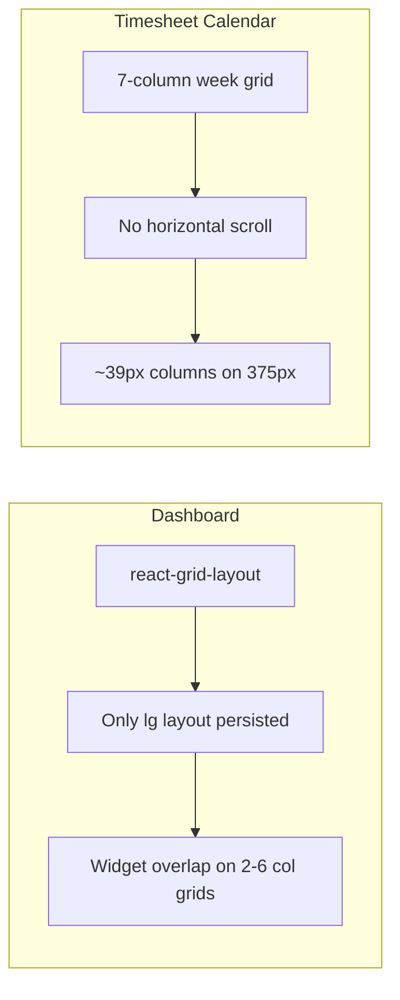
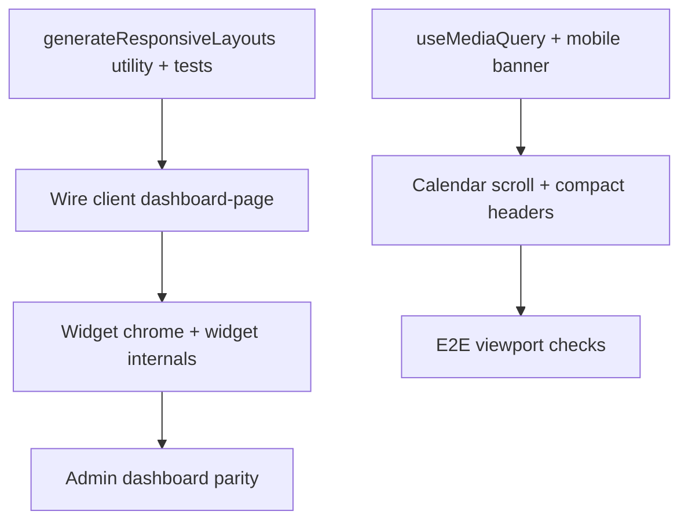

# Dashboard and Calendar Responsive Fix

## Problem diagnosis

Both pages work on desktop but break on narrow viewports for different reasons:



| Area          | Root cause                                                                                                                                                                 | Symptom                                 |
| ------------- | -------------------------------------------------------------------------------------------------------------------------------------------------------------------------- | --------------------------------------- |
| **Dashboard** | [`dashboard-page.tsx`](apps/client/src/features/dashboard/dashboard-page.tsx) passes `layouts={{ lg: visibleItems }}` only (L672) while column counts shrink to 2 on `xxs` | Widgets overlap, clip, or overflow      |
| **Dashboard** | Fixed `w-[420px]` customize drawer ([`widget-control-panel.tsx`](apps/client/src/features/dashboard/widget-control-panel.tsx) L35)                                         | Drawer wider than phone viewport        |
| **Dashboard** | Widget internals assume horizontal space (quick timer, today logs, charts)                                                                                                 | Cramped/unreadable content inside cells |
| **Calendar**  | Week grid uses `repeat(7, minmax(0, 1fr))` with no min column width ([`timesheet-calendar.tsx`](apps/client/src/features/timesheet/timesheet-calendar.tsx) L441)           | Unreadable 7-day week on phones         |
| **Calendar**  | Default view is `week` ([`timesheet-page.tsx`](apps/client/src/features/timesheet/timesheet-page.tsx) L110)                                                                | Users land on worst layout first        |

The original dashboard plan explicitly required 375px support ([`.cursor/plans/dashboard_widget_system_plan.plan.md`](.cursor/plans/dashboard_widget_system_plan.plan.md) L209) but only the desktop `lg` layout was wired up. `/time-tracker` already exists as a mobile-friendly list alternative; you chose a **hybrid** calendar approach.

**Scope:** Client app primary. [`apps/admin/src/features/dashboard/dashboard-page.tsx`](apps/admin/src/features/dashboard/dashboard-page.tsx) has the same RGL pattern — apply the same layout utility there for parity.

---

## Part 1 — Dashboard responsive grid

### 1.1 Client-side responsive layout generation (no contract change)

Stored layout remains a single `layout[]` per workspace ([`packages/contracts/src/dashboard-layout.ts`](packages/contracts/src/dashboard-layout.ts)) — **do not** add per-breakpoint persistence yet.

Add a pure utility, e.g. [`apps/client/src/features/dashboard/generate-responsive-layouts.ts`](apps/client/src/features/dashboard/generate-responsive-layouts.ts):

- Input: `WidgetLayoutItem[]` + RGL `cols` map
- Output: `{ lg, md, sm, xs, xxs }` layouts
- Algorithm (stack-first on narrow breakpoints):
  - **`lg`**: use stored layout as-is
  - **`md` / `sm`**: clamp `w` to `cols`, reflow with `x=0` stacking (preserve relative order by `y`, then `x`)
  - **`xs` / `xxs`**: force full-width (`w = cols`, `x = 0`), vertical stack
  - Respect each widget's `minSize` from [`widget-registry.ts`](apps/client/src/features/dashboard/widget-registry.ts) when clamping

Wire into [`dashboard-page.tsx`](apps/client/src/features/dashboard/dashboard-page.tsx):

```tsx
const responsiveLayouts = useMemo(
  () => generateResponsiveLayouts(visibleItems, COLS),
  [visibleItems]
);
// ...
layouts = { responsiveLayouts };
compactType = "vertical";
```

- **Persist only on `lg`**: in `onLayoutChange`, detect current breakpoint (RGL provides this via callback or track with `onBreakpointChange`) and only call `updateLayout` when breakpoint is `lg` and `isArranging`.
- Remove or narrow `-mx-4` on the grid container (L671) to avoid horizontal page scroll.

### 1.2 Page chrome and customize panel

| File                                                                                              | Change                                                                                                                             |
| ------------------------------------------------------------------------------------------------- | ---------------------------------------------------------------------------------------------------------------------------------- |
| [`widget-control-panel.tsx`](apps/client/src/features/dashboard/widget-control-panel.tsx)         | `w-full max-w-[420px] sm:w-[420px]`; add semi-transparent backdrop (`fixed inset-0`) that closes on tap; body scroll lock optional |
| [`dashboard-arrange-banner.tsx`](packages/web-shared/src/components/dashboard-arrange-banner.tsx) | `flex-col gap-2 sm:flex-row` for button group; stack on narrow screens                                                             |
| [`dashboard-page.tsx`](apps/client/src/features/dashboard/dashboard-page.tsx) filters (L616–636)  | `SegmentedControl fullWidth` on mobile; date inputs `w-full sm:w-[145px]`; wrap toolbar like time-tracker toolbar                  |

Reuse patterns from [`time-tracker-toolbar.tsx`](apps/client/src/features/time-tracker/time-tracker-toolbar.tsx) (`flex-col lg:flex-row`) and [`ReportScopeFilters`](packages/web-shared/src/components/report-scope-filters.tsx) (already responsive).

### 1.3 Widget-internal breakpoints

Targeted CSS-only fixes inside widgets (no behavior change):

| Widget               | File                                                                                                  | Fix                                                                  |
| -------------------- | ----------------------------------------------------------------------------------------------------- | -------------------------------------------------------------------- |
| Quick Timer (idle)   | `dashboard-page.tsx` ~L876                                                                            | `grid-cols-1 sm:grid-cols-2` for project/task selects                |
| Quick Timer (active) | `dashboard-page.tsx` ~L806                                                                            | `flex-col sm:flex-row` for clock vs metadata                         |
| Today's Activity     | [`today-logs-widget.tsx`](apps/client/src/features/dashboard/widgets/today-logs-widget.tsx)           | Stack row on `max-sm`: project/duration on one line, actions below   |
| Weekly Progress      | [`weekly-progress-widget.tsx`](apps/client/src/features/dashboard/widgets/weekly-progress-widget.tsx) | Ensure chart container has `min-w-0`; reduce legend font on `max-sm` |

### 1.4 Admin parity

Mirror layout utility + `compactType` + `onBreakpointChange` guard in [`apps/admin/src/features/dashboard/dashboard-page.tsx`](apps/admin/src/features/dashboard/dashboard-page.tsx). Share utility via `packages/web-shared` if both apps need it (preferred to avoid duplication).

### 1.5 Tests

Per [`chronomint-test-delivery`](.cursor/skills/chronomint-test-delivery/SKILL.md):

- Unit: `generate-responsive-layouts.spec.ts` — assert no item exceeds column count at each breakpoint; `xxs` is single-column stack
- E2E: extend [`apps/client/e2e/dashboard.spec.ts`](apps/client/e2e/dashboard.spec.ts) with `page.setViewportSize({ width: 375, height: 812 })` — no horizontal overflow, key widgets visible

---

## Part 2 — Calendar hybrid responsive

### 2.1 Mobile Time Tracker prompt

In [`timesheet-page.tsx`](apps/client/src/features/timesheet/timesheet-page.tsx), below `AppBar`, add a dismissible banner visible only below `md`:

- Copy: e.g. "On mobile, Time Tracker is easier for viewing and editing entries."
- Link button to `/time-tracker` (already in [`workspace-shell.tsx`](apps/client/src/components/workspace-shell.tsx) nav)
- Use existing `PreviewBanner` from `@kloqra/ui` or a simple `Card` with `md:hidden`

Persist dismiss in `sessionStorage` so it does not nag every visit.

### 2.2 Viewport-aware defaults

Add a small hook, e.g. [`apps/client/src/hooks/use-media-query.ts`](apps/client/src/hooks/use-media-query.ts):

```ts
export function useMediaQuery(query: string): boolean;
```

In `timesheet-page.tsx`:

- On first mount, if `max-width: 767px` and view is `week`, **suggest** day view (auto-set `view` to `"day"` once, or show inline hint — prefer auto day view on first load only to avoid fighting user choice on resize)
- Keep day/week/month toggle; do not hide week/month on mobile

### 2.3 Week view horizontal scroll (usable columns)

In [`timesheet-calendar.tsx`](apps/client/src/features/timesheet/timesheet-calendar.tsx):

- Wrap the sticky header + grid in `overflow-x-auto`
- Set grid `minWidth` to `3.5rem + days.length * MIN_DAY_COL_PX` (e.g. 72–80px per day) so week view scrolls horizontally instead of squishing
- Sync sticky header scroll with body (single scroll container)

### 2.4 Compact headers and mobile help

| File                                                                                           | Change                                                                                                             |
| ---------------------------------------------------------------------------------------------- | ------------------------------------------------------------------------------------------------------------------ |
| [`display-format.ts`](apps/client/src/features/timesheet/display-format.ts)                    | Add `formatDayHeaderShort(day, pref)` → `"Mon 6"` for narrow columns; use when `compact` or via prop from calendar |
| [`timesheet-calendar.tsx`](apps/client/src/features/timesheet/timesheet-calendar.tsx) L430–434 | Replace desktop-only help with responsive text: hide `Ctrl+drag` on `max-md`; show touch-oriented hints            |
| [`timesheet-month.tsx`](apps/client/src/features/timesheet/timesheet-month.tsx)                | Wrap month grid in `overflow-x-auto` with `min-w-[36rem]` so cells stay ~80px+                                     |

### 2.5 Touch polish (lightweight)

- Review `touch-none` on slot buttons — allow vertical scroll passthrough where it blocks scrolling
- Increase resize handle hit area on `max-md` via `h-3` (optional, low priority)

### 2.6 Tests

- Unit: `display-format.spec.ts` — short header format
- E2E (optional): timesheet at 375px — banner visible, week view scrolls horizontally (no `document.documentElement.scrollWidth` overflow)

---

## Implementation order



Estimated touch surface: ~12–15 files, no API/contract migrations.

## Verification

Before PR (per workspace rules):

```bash
pnpm format:check && pnpm lint && pnpm typecheck && pnpm test && pnpm build
```

Manual checks at **375px**, **768px**, and **1440px**:

- Dashboard: widgets stack, no horizontal page scroll, customize drawer usable
- Timesheet: mobile banner + day default; week view scrolls; month view readable
