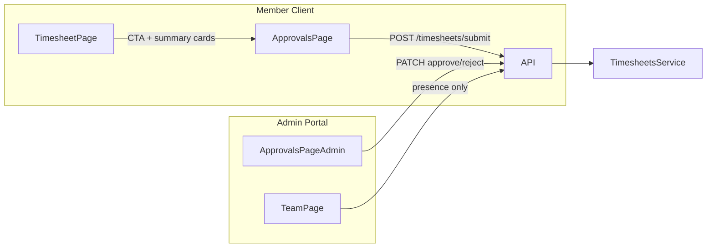

# Dedicated Approvals & Send to Approvals

## Current state

The approval **workflow is implemented end-to-end in the API** but **buried in the UI**:

| Surface              | Today                                                                                                                                                     | Problem                                                    |
| -------------------- | --------------------------------------------------------------------------------------------------------------------------------------------------------- | ---------------------------------------------------------- |
| **Member submit**    | [`TimesheetStatusCard`](apps/client/src/features/timesheet/timesheet-status-card.tsx) inside Timesheet summary grid (hidden behind "Show summary" toggle) | Hard to discover; no nav entry                             |
| **Member dashboard** | [`TimesheetSubmissionsWidget`](apps/client/src/features/dashboard/widgets/timesheet-submissions-widget.tsx) (hidden by default, read-only)                | No submit action, no deep link                             |
| **Admin review**     | Tab inside [`TeamPage`](apps/admin/src/features/team/team-page.tsx) ("Timesheet Approvals")                                                               | Nav says "Team Live"; approvals compete with live activity |
| **Admin dashboard**  | [`PendingTimesheetsWidget`](apps/admin/src/features/dashboard/widgets/pending-timesheets-widget.tsx) (hidden, simplified UX, duplicated logic)            | No review notes / entry activity                           |

**API routes already in contracts** ([`packages/contracts/src/routes.ts`](packages/contracts/src/routes.ts)):

- Member: `MY_SUBMISSIONS`, `SUBMIT`, `MY_STATUS`
- Admin: `LIST_PENDING`, `APPROVE`, `REJECT`

No new workflow states needed — this is a **navigation + UX consolidation** pass with one API list-scope fix.



---

## Target UX (per your choices)

### Member (`apps/client`)

1. **New nav item**: `Approvals` → `/approvals` (between Timesheet and My projects)
2. **Dedicated page**: inbox of all approval-enabled projects for the selected period, with status + **"Send to Approvals"** CTA (rename from "Submit Week/Day/Month for Approval")
3. **Timesheet page stays**: keep summary cards when expanded **plus** a persistent toolbar CTA when any draft/rejected periods exist (e.g. badge + "Send to Approvals" link to `/approvals`)
4. **Dashboard widget**: link rows / footer to `/approvals`; optionally enable widget by default in [`widget-registry.ts`](apps/client/src/features/dashboard/widget-registry.ts)

### Admin (`apps/admin`)

1. **New nav item**: `Approvals` → `/approvals` with pending-count badge
2. **Extract full review queue** from Team page into dedicated feature module
3. **Team page** (`/team`): rename nav to **"Team Live"**, remove segmented control and approvals tab entirely — stopwatch activity only
4. **Dashboard widget**: refactor to use shared review row component or "View all → /approvals" link

---

## Implementation plan

### 1. Contracts (minimal)

**File:** [`packages/contracts/src/dto/timesheet.dto.ts`](packages/contracts/src/dto/timesheet.dto.ts)

- Extend `timesheetSubmissionsQuerySchema` with optional `scope: z.enum(["logged", "assigned"]).default("logged")` (non-breaking)
- Update [`contracts.spec.ts`](packages/contracts/src/contracts.spec.ts) for the new query field

No new routes required.

### 2. API — broaden member submission list

**File:** [`apps/api/src/modules/timelogs/application/timesheets.service.ts`](apps/api/src/modules/timelogs/application/timesheets.service.ts)

Today `listSubmissions` only returns projects where the member has **time logs**:

```127:146:apps/api/src/modules/timelogs/application/timesheets.service.ts
  async listSubmissions(workspaceId: string, userId: string, dateStr: string) {
    // ...distinct projectIds from timeLog only
  }
```

Change to support `scope=assigned` (default for new `/approvals` page):

- Query `project_members` joined to `projects` where `timesheetApprovalEnabled = true` and `workspaceId` matches
- Fall back to existing log-based query when `scope=logged` (preserve current Timesheet page behavior if desired)
- Return virtual `DRAFT` periods via existing `getStatus` / `virtualDraft`

**Tests:** extend [`timesheets.service.spec.ts`](apps/api/src/modules/timelogs/application/timesheets.service.spec.ts); add [`apps/api/test/timesheets.e2e.ts`](apps/api/test/timesheets.e2e.ts) covering submit → pending → approve/reject (currently missing).

### 3. Shared UI primitives (`packages/ui`)

**Extend** [`SidebarNavItem`](packages/ui/src/components/layout-shell.tsx):

```ts
export type SidebarNavItem = {
  href: string;
  label: string;
  Icon: React.ComponentType<{ className?: string }>;
  badge?: number | string; // render count pill when > 0
};
```

Render a small amber count pill in both desktop and mobile nav (collapsed: dot or number overlay on icon).

**New admin-oriented components** (keep domain logic in apps, presentation in ui where reusable):

- `TimesheetApprovalStatusBadge` — shared status chip (DRAFT / SUBMITTED / APPROVED / REJECTED)
- Optionally move period label helpers from `TimesheetStatusCard` into `packages/ui` or a shared `packages/web-shared` util

### 4. Admin — dedicated Approvals feature

**New files:**

- [`apps/admin/src/app/(admin)/approvals/page.tsx`](<apps/admin/src/app/(admin)/approvals/page.tsx>) — thin wrapper
- [`apps/admin/src/features/approvals/approvals-page.tsx`](apps/admin/src/features/approvals/approvals-page.tsx) — main page
- [`apps/admin/src/features/approvals/pending-timesheet-card.tsx`](apps/admin/src/features/approvals/pending-timesheet-card.tsx) — extract from Team page (review note, approve/reject, entry activity)
- [`apps/admin/src/features/approvals/use-pending-timesheets.ts`](apps/admin/src/features/approvals/use-pending-timesheets.ts) — fetch + approve/reject hook (shared by page + widget)

**Modify:**

- [`admin-shell.tsx`](apps/admin/src/components/admin-shell.tsx) — add `{ href: "/approvals", label: "Approvals", Icon: ClipboardCheck }`; fetch `LIST_PENDING` count on mount for nav badge
- [`team-page.tsx`](apps/admin/src/features/team/team-page.tsx) — remove `SegmentedControl`, approvals tab, `PendingActivity`, pending state; simplify title to "Team Live"
- [`pending-timesheets-widget.tsx`](apps/admin/src/features/dashboard/widgets/pending-timesheets-widget.tsx) — use shared hook; add "Open Approvals" footer link; keep quick approve for dashboard power users

### 5. Member — dedicated Approvals + Timesheet CTAs

**New files:**

- [`apps/client/src/app/(workspace)/approvals/page.tsx`](<apps/client/src/app/(workspace)/approvals/page.tsx>)
- [`apps/client/src/features/approvals/approvals-page.tsx`](apps/client/src/features/approvals/approvals-page.tsx)
  - Period navigator (reuse week/day/month controls from [`timesheet-page.tsx`](apps/client/src/features/timesheet/timesheet-page.tsx) calendar utils)
  - Fetch `MY_SUBMISSIONS?date=…&scope=assigned`
  - Grid of reused [`TimesheetStatusCard`](apps/client/src/features/timesheet/timesheet-status-card.tsx) with updated button copy: **"Send to Approvals"**
  - Empty state when no approval-enabled projects
  - Summary banner: "X ready to send · Y pending review"

**Modify:**

- [`workspace-shell.tsx`](apps/client/src/components/workspace-shell.tsx) — add Approvals nav; badge = count of DRAFT + REJECTED periods (lightweight poll or derive from store)
- [`timesheet-status-card.tsx`](apps/client/src/features/timesheet/timesheet-status-card.tsx) — rename submit CTA to "Send to Approvals"; accept optional `submitLabel` prop for period-aware text
- [`timesheet-page.tsx`](apps/client/src/features/timesheet/timesheet-page.tsx):
  - Add toolbar pill when `submissions` has actionable items: `N ready to send` → links to `/approvals`
  - Default `showSummary` to `true` when any approval-enabled project has DRAFT/REJECTED (one-time UX improvement)
- [`timesheet-submissions-widget.tsx`](apps/client/src/features/dashboard/widgets/timesheet-submissions-widget.tsx) — add "Go to Approvals" link; show actionable count

**Optional hook:** `useMySubmissions(date)` in `apps/client/src/features/approvals/` shared by page, shell badge, and timesheet toolbar.

### 6. Copy & terminology

| Old                                | New               |
| ---------------------------------- | ----------------- |
| Submit Week/Day/Month for Approval | Send to Approvals |
| Timesheet Approvals (tab)          | Approvals (nav)   |
| Team live & Approvals              | Team Live         |

Keep API field names (`SUBMITTED`, `submit` endpoint) unchanged — UI copy only.

### 7. Tests (required per project policy)

| Layer      | What                                                                         |
| ---------- | ---------------------------------------------------------------------------- |
| API unit   | `listSubmissions` with `scope=assigned`                                      |
| API e2e    | New `timesheets.e2e.ts`: member submit → admin list pending → approve        |
| Admin RTL  | `approvals-page.spec.tsx` — renders queue, calls approve                     |
| Client RTL | `approvals-page.spec.tsx` — renders cards, submit CTA                        |
| Playwright | Admin: nav to `/approvals`, approve one item; Client: `/approvals` send flow |

---

## Rollout / migration

- No DB migration
- `/team` bookmarks keep working (live activity only)
- No breaking API changes if `scope` defaults to `logged`

---

## Out of scope (defer)

- Batch "Send all to Approvals" single click (can add later atop per-project cards)
- Email notifications on submit/approve
- Non-admin approvers (project managers) — API still `@Roles("ADMIN")`
- `PENDING_COUNT` endpoint — compute from `LIST_PENDING.length` client-side until scale requires it
