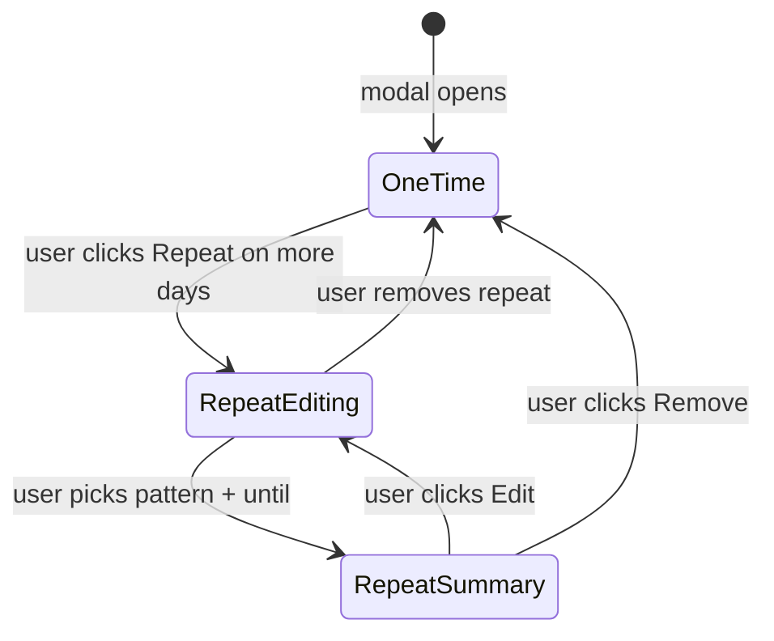

# Time entry modal — date picker + UX de-clutter

## Problem

The shared [`TimeEntryDialog`](apps/client/src/features/timesheet/time-entry-dialog.tsx) is vertically dense. The BA wants an editable entry date, but stacking more fields makes it worse. The **Repeat Entry** block is especially wasteful: a 4-option `SegmentedControl` always visible even though **~95% of logs are one-time** (`recurrence: "none"`).

## Current state

- Used by [`timesheet-page.tsx`](apps/client/src/features/timesheet/timesheet-page.tsx) and [`time-tracker-page.tsx`](apps/client/src/features/time-tracker/time-tracker-page.tsx).
- `TimeEntryDraft.date` + `recurrence` / `repeatUntil` in [`time-entry-draft.ts`](apps/client/src/features/timesheet/time-entry-draft.ts); save via `draftToIsoRange()` and batch API — **no contract or API changes**.
- Recurrence UI only on **create** (`canEdit && !editingLog`) — edit flow never shows repeat controls today.

## UX redesign

Goal: **shorter default modal** than today while adding date editability and a clearer recurrence experience.

### Primary form (always visible)

```
Log time

Project     [ Select project        ▼ ]
Task        [ Select task           ▼ ]
When        · 30m
            [ Jun 20, 2026 ▼ ] [ 6:00 PM ] [ 6:30 PM ]
Description [ What did you work on?          ]

[ Log time ]  [ Cancel ]
```

| Change | Rationale |
|--------|-----------|
| **When row** — Date + Start + End + inline duration | Replaces header date + 2-col time grid + duration line |
| Remove task breadcrumb under Task select | Redundant with select value |
| Remove date from modal header | Date lives in When row; keep timer hint only |
| `space-y-3` between fields | Slight vertical tightening |

### Recurrence — opt-in progressive disclosure (create only)

**Principle:** One-time entry = **zero recurrence chrome**. No segmented control, no "Do not repeat" label, no border section.

#### State machine



#### State A — Default (one-time) · **0 extra height**

After Description, show a single muted text button (create + `canEdit` only):

```
+ Repeat on more days
```

- No labels, no segmented control, no border-top section.
- `draft.recurrence` stays `"none"`.

#### State B — Repeat panel open · **~72px when configuring**

Clicking `+ Repeat on more days` reveals an inline panel (soft `bg-muted/40 rounded-lg p-3 space-y-3`):

```
Repeat
  [ Daily ]  [ Weekdays ]  [ Weekly ]     ← 3 pill toggles (not 4; "none" = closed state)
  Until     [ Jun 27, 2026 ▼ ]             ← DatePicker, same row on sm+
  ~5 entries · same time each day          ← live preview count (new helper)
  Remove repeat                            ← ghost link, resets to State A
```

| Detail | Decision |
|--------|----------|
| Pattern control | **3 pill buttons** in a row — replaces 4-wide `SegmentedControl`; clearer than dropdown for 3 choices |
| Default pattern | **Weekdays** when panel opens (common standup/scrum case); or **Daily** — pick one and document in implementation |
| Until date | `DatePicker`; default `repeatUntil = draft.date`; sync forward if entry date moves past it |
| Preview line | `estimateRecurrenceCount(date, repeatUntil, recurrence)` — small helper in `time-entry-draft.ts` or `repeat-entry-panel.tsx`; muted `text-xs` |
| Remove | Sets `recurrence: "none"`, collapses panel |
| Edit mode | **Hidden entirely** — recurrence is create-only (unchanged business rule) |

#### State C — Repeat configured (optional compact summary)

If user selects pattern + until then collapses mentally (panel stays open until Remove), show summary inline instead of raw controls:

```
↻ Weekdays until Jun 27 · ~5 entries    [Edit] [Remove]
```

Use State C only if panel feels busy; **MVP can stay in State B** until configured, then allow closing panel while keeping summary chip visible above footer. Recommend **State B + Remove link** for v1 simplicity; add summary chip if QA wants less visual noise after setup.

#### Space saved vs today

| Today | Proposed default |
|-------|------------------|
| Border-top section + "Repeat Entry" label + 4-segment control (~80px) | Single link line (~24px) or **0px if we put link beside Description label** |
| Repeat until + helper text always possible | Until row only inside open panel |

**Optional micro-placement:** put `+ Repeat on more days` as a right-aligned link on the Description label row (`Description ··· + Repeat`) — saves an entire form row on default open.

### Jira — separate "More options" (timesheet only)

Do **not** bundle recurrence with Jira. Recurrence gets its own affordance; Jira stays rare:

- Collapsed link: `More options` (only rendered when `jiraSuggestions.length > 0`)
- Expands to `JiraIssuePicker` only
- Default collapsed

### Visual hierarchy summary

```
┌─ Primary (required path) ─────────────────┐
│ Project · Task · When · Description       │
└───────────────────────────────────────────┘
┌─ Optional (create only) ──────────────────┐
│ + Repeat on more days  →  panel if open   │
│ More options           →  Jira if needed  │
└───────────────────────────────────────────┘
```

## Overlap protection (critical)

- **Timesheet**: existing `findOccupancyConflict()` in `saveEntry()` — verify after refactor.
- **Time tracker**: new [`validate-time-entry-overlap.ts`](apps/client/src/features/timesheet/validate-time-entry-overlap.ts) + call before POST/PATCH.
- Batch create (recurrence) already skips conflicts server-side; client still validates the **first day's** slot if not batching preview.

## New component

Extract [`repeat-entry-panel.tsx`](apps/client/src/features/timesheet/repeat-entry-panel.tsx):

- Props: `draft`, `timezone`, `canEdit`, `onPatch`, `open`, `onOpenChange`
- Renders States A/B (and optional C)
- Unit tests: default closed; opens panel; pattern selection; until sync; remove resets draft
- Keeps `time-entry-dialog.tsx` readable

## Files to change

| File | Change |
|------|--------|
| [`time-entry-dialog.tsx`](apps/client/src/features/timesheet/time-entry-dialog.tsx) | When row, Description row link, embed RepeatEntryPanel, Jira More options |
| [`repeat-entry-panel.tsx`](apps/client/src/features/timesheet/repeat-entry-panel.tsx) | **New** — recurrence progressive disclosure |
| [`repeat-entry-panel.spec.tsx`](apps/client/src/features/timesheet/repeat-entry-panel.spec.tsx) | **New** — state machine tests |
| [`time-entry-dialog.spec.tsx`](apps/client/src/features/timesheet/time-entry-dialog.spec.tsx) | When row, no repeat UI on edit, read-only |
| [`validate-time-entry-overlap.ts`](apps/client/src/features/timesheet/validate-time-entry-overlap.ts) | Shared overlap check (+ spec) |
| [`time-tracker-page.tsx`](apps/client/src/features/time-tracker/time-tracker-page.tsx) | Overlap validation before save |
| [`apps/client/e2e/time-tracker.spec.ts`](apps/client/e2e/time-tracker.spec.ts) | When row visible; no repeat link on edit |

**Remove:** `SegmentedControl` import from dialog for recurrence (may still be used elsewhere in app).

**Out of scope:** contracts, API, admin app.

## Implementation sketch — When row

```tsx
<div className="space-y-2">
  <div className="flex items-center justify-between gap-2">
    <Label>When</Label>
    {durationHint ? <span className="text-xs text-muted-foreground">· {durationHint}</span> : null}
  </div>
  <div className="grid grid-cols-1 gap-2 sm:grid-cols-[1.2fr_1fr_1fr]">
    <DatePicker value={draft.date} onChange={handleDateChange} disabled={!canEdit} /* ... */ />
    <Input id="entry-start" type="time" /* ... */ />
    <Input id="entry-end" type="time" /* ... */ />
  </div>
</div>
```

## Implementation sketch — Description + repeat affordance

```tsx
<div className="space-y-2">
  <div className="flex items-center justify-between gap-2">
    <Label htmlFor="entry-description">Description</Label>
    {canEdit && !editingLog ? (
      <button type="button" className="text-xs text-muted-foreground hover:text-foreground" onClick={() => setRepeatOpen(true)}>
        + Repeat on more days
      </button>
    ) : null}
  </div>
  <Input id="entry-description" /* ... */ />
</div>
<RepeatEntryPanel open={repeatOpen} draft={draft} onPatch={patch} onOpenChange={setRepeatOpen} timezone={timezone} />
```

When `repeatOpen` or `recurrence !== "none"`, hide the `+ Repeat` link and show the panel (or summary).

## Test plan

1. **repeat-entry-panel.spec.tsx**: closed by default; pills set recurrence; until syncs with entry date; remove resets; preview count updates.
2. **time-entry-dialog.spec.tsx**: When row; edit mode has no repeat affordance; read-only disables When.
3. **Overlap helper**: conflict detection.
4. **Manual**: default modal visibly shorter than screenshot; repeat flow discoverable; batch save unchanged.
5. **Pre-PR**: `pnpm format:check && pnpm lint && pnpm typecheck && pnpm test && pnpm build`
