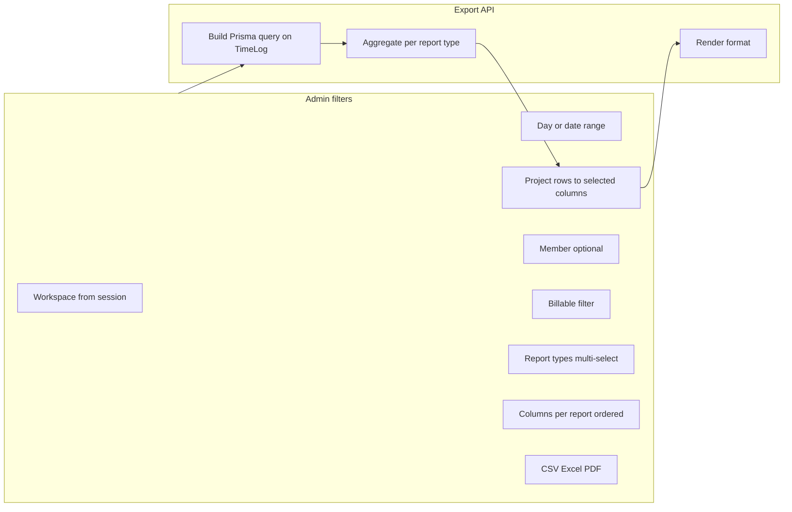
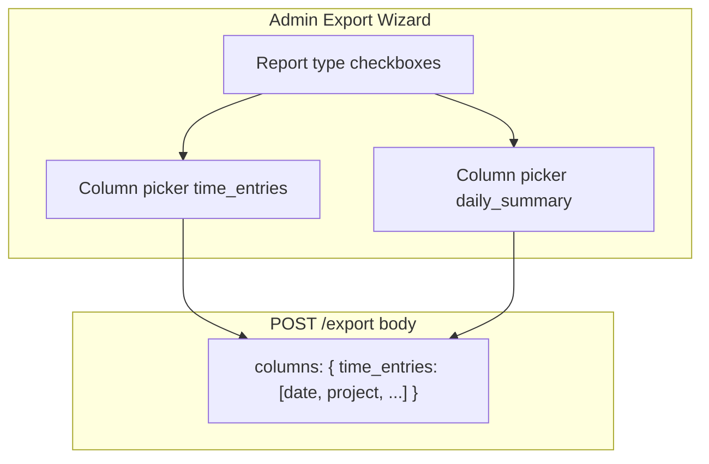

# Export feature plan

## Current state

You already have a minimal export path:

- **API**: [`apps/api/src/modules/export/application/export.service.ts`](apps/api/src/modules/export/application/export.service.ts) — flat **time log rows** for the active workspace, `from`/`to`, optional `projectId` / `userId`, formats `csv` | `pdf`.
- **Contracts**: [`packages/contracts/src/dto/export.dto.ts`](packages/contracts/src/dto/export.dto.ts) — query schema only.
- **Admin UI**: [`apps/admin/src/app/(admin)/exports/page.tsx`](<apps/admin/src/app/(admin)/exports/page.tsx>) — date range + CSV/PDF buttons only.
- **Billing math**: [`apps/api/src/modules/reporting/application/reporting.service.ts`](apps/api/src/modules/reporting/application/reporting.service.ts) already resolves **billable hours + amounts** using hourly rates (project → user → user default). Export does **not** use this yet.

**Important domain note:** “Team” is per-project ([`DOMAIN_MODEL.md`](docs/architecture/DOMAIN_MODEL.md)). Exports do not query `TeamMember` directly; they query **`TimeLog`** joined to `User`, `Task`, `Project`. “Team member” in the UI means **filter by user** (optionally limited to members of a selected project’s team).



---

## What to export (recommended report catalog)

Admin can **pick one or more** of these per download. All respect the same filters.

### 1. Time entries (detail) — **MVP must-have**

One row per logged interval. Best for audit, payroll import, and accounting tools.

**Default column order** (admin can change — see [Column picker](#column-picker-and-order)):

| Key           | Header label | Source                                    |
| ------------- | ------------ | ----------------------------------------- |
| `workspace`   | Workspace    | Current workspace name                    |
| `client`      | Client       | `Project.clientName`                      |
| `project`     | Project      | `Project.name`                            |
| `task`        | Task         | `Task.taskName`                           |
| `member`      | Member       | `User.name`                               |
| `email`       | Email        | `User.email`                              |
| `date`        | Date         | `startTime` (UTC in file; document in UI) |
| `start_time`  | Start        | `startTime`                               |
| `end_time`    | End          | `endTime`                                 |
| `hours`       | Hours        | `durationSec / 3600`                      |
| `billable`    | Billable     | yes/no                                    |
| `rate`        | Rate         | Resolved hourly rate                      |
| `amount`      | Amount       | Hours × rate if billable                  |
| `description` | Description  | `TimeLog.description`                     |
| `source`      | Source       | `timer` / `manual`                        |

### 2. Daily summary

Aggregated by **date × member × project** (and billable split). Column keys: `date`, `member`, `email`, `client`, `project`, `total_hours`, `billable_hours`, `non_billable_hours`, `billable_amount`.

### 3. By project

One row per project in range (matches dashboard `timeByProject`). Column keys: `project`, `client`, `total_hours`, `billable_hours`, `non_billable_hours`, `billable_amount`, `active_members`.

### 4. By member

One row per user who logged time (matches `timeByUser`). Column keys: `member`, `email`, `total_hours`, `billable_hours`, `non_billable_hours`, `billable_amount`.

### 5. Invoice / billable-only detail (optional Phase 2)

Same as **Time entries** but pre-filtered to `isBillable = true`, with subtotal footer. Useful for client-facing PDF.

---

## Filters (admin export wizard)

| Filter                       | Behavior                                                                                                                                              |
| ---------------------------- | ----------------------------------------------------------------------------------------------------------------------------------------------------- |
| **Period**                   | `from` + `to` (date inputs). Single day = same `from`/`to` with end-of-day on `to`. Presets later: Today, This week, Last 30 days.                    |
| **Project**                  | Optional; all projects if empty. Dropdown from `GET /projects`.                                                                                       |
| **Member**                   | Optional; all users if empty. Dropdown from `GET /workspaces/:id/members` on new Workspace page.                                                      |
| **Team scope** (optional UX) | When a project is selected, checkbox “Only project team members” → restrict `userId` to `TeamMember` for that project (still exported via time logs). |
| **Billable**                 | `all` \| `billable` \| `non_billable` (add to `exportQuerySchema`).                                                                                   |

Workspace is always the **active workspace** (`X-Workspace-Id`); include workspace name in file header / first row.

---

## Column picker and order

Admins choose **which columns appear** and **left-to-right order** for each selected report type. Applies to **CSV, Excel sheets, and PDF tables** (PDF summary sections may keep fixed layout for totals).

### Contracts (SSOT)

In [`packages/contracts/src/dto/export.dto.ts`](packages/contracts/src/dto/export.dto.ts):

- Define `EXPORT_COLUMNS` — a map of report type → allowed column keys + human labels (for UI and validation).
- Define `DEFAULT_EXPORT_COLUMNS` — recommended default order per report type.
- Query/body field:

```ts
// Ordered list; only keys from EXPORT_COLUMNS[reportType] allowed
columns: z.record(
  z.enum(["time_entries", "daily_summary", "by_project", "by_member"]),
  z.array(z.string()).min(1)
).optional();
```

If `columns` is omitted for a report type, use `DEFAULT_EXPORT_COLUMNS`. Server validates: unknown keys → 400; empty array → 400; at least one column required.

**Transport:** Prefer `POST /export` with JSON body when column maps are large; keep `GET /export` for simple downloads (defaults only) or pass `columns` as URL-encoded JSON for small selections.

### API rendering

Generic helper in export service:

```ts
projectRows(rows: Record<string, unknown>[], columnKeys: string[], labels: Record<string, string>)
```

- CSV/Excel header row = labels in `columnKeys` order.
- Data cells = `row[key]` for each key.
- Excel: column widths optional; no extra columns beyond selection.

### Admin UI

On [`exports/page.tsx`](<apps/admin/src/app/(admin)/exports/page.tsx>), for **each checked report type**:

1. **Column list** — checkboxes for all allowed columns (default: all on, default order).
2. **Reorder** — move selected columns up/down (simple buttons in v1; drag-and-drop optional later). Only **selected** columns participate in order.
3. **Reset to default** — restores default keys and order for that report.
4. **(Phase 2)** Save named preset in `localStorage` per workspace (e.g. “Payroll CSV”, “Client invoice”).

UX rules:

- Changing report checkboxes shows/hides that report’s column panel.
- Minimum one column selected per active report before Export is enabled.
- Preview line: “Exporting 8 columns in order: Date, Project, Member, …”



---

## Formats

| Format            | When to use                | Delivery when multiple report types selected                                                                                                                                                                                          |
| ----------------- | -------------------------- | ------------------------------------------------------------------------------------------------------------------------------------------------------------------------------------------------------------------------------------- |
| **CSV**           | Integrations, spreadsheets | **One file per selected report** (e.g. `detail.csv`, `by-project.csv`). If 2+ selected, return a **ZIP** (`application/zip`).                                                                                                         |
| **Excel (.xlsx)** | Finance/ops preferred      | **One workbook, one sheet per selected report** (sheet names: Detail, Daily, ByProject, ByMember). Add dependency `exceljs` in [`apps/api/package.json`](apps/api/package.json).                                                      |
| **PDF**           | Printable summary          | **Summary PDF only** for v1: cover (workspace, period, filters), totals table (workspace + by project), then optional appendix of detail lines capped (e.g. 500 rows) or “see Excel for full detail”. Full detail PDF can be Phase 2. |

---

## API design (extend existing endpoint)

Add **`POST /export`** (primary) with JSON body; keep **`GET /export`** for backward-compatible simple exports (date range + format, all default columns).

```ts
// packages/contracts/src/dto/export.dto.ts (conceptual)
reportTypes: z.array(z.enum([...])).min(1),
billable: z.enum(["all", "billable", "non_billable"]).default("all"),
format: z.enum(["csv", "xlsx", "pdf"]),
columns: z.record(reportTypeEnum, z.array(columnKeyEnum)).optional(),
from, to, projectId?, userId?, teamOnly?: boolean
```

Response: binary stream with `Content-Disposition` filename `kloqra-{workspaceSlug}-{from}-{to}.{zip|xlsx|pdf}`.

**Refactor for DRY:** Extract shared “fetch logs + resolve rates + aggregate” from [`reporting.service.ts`](apps/api/src/modules/reporting/application/reporting.service.ts) into something like `apps/api/src/modules/reporting/application/time-aggregation.service.ts` (or shared helper used by reporting + export) so billable amounts stay consistent with the dashboard.

---

## Admin UI ([`exports/page.tsx`](<apps/admin/src/app/(admin)/exports/page.tsx>))

Replace the minimal wizard with:

1. **Period** — from / to (keep current defaults: last 30 days).
2. **Filters** — project select, member select, billable select, optional “project team only”.
3. **Reports** — checkboxes: Time entries, Daily summary, By project, By member (default: Time entries + By project).
4. **Columns** — per selected report: checkbox list + up/down reorder + “Reset columns” (see [Column picker](#column-picker-and-order)).
5. **Format** — CSV | Excel | PDF.
6. **Export** — single button → `POST /export` with full body; row-count preview optional later.

Load filter options from existing APIs (`PROJECTS.LIST`, `WORKSPACES.MEMBERS`). Column metadata from `EXPORT_COLUMNS` exported by contracts (import in admin app).

---

## Implementation phases

### Phase 1 — Better detail + filters + column picker (small, high value)

- Contracts: `EXPORT_COLUMNS`, `DEFAULT_EXPORT_COLUMNS`, `POST /export` body schema.
- `time_entries` only; column projection in CSV; default column set if `columns` omitted.
- Share rate resolution with reporting.
- Admin UI: filters + **column picker for time entries** (checkbox + reorder).

### Phase 2 — Summaries + Excel + column picker for all reports

- Implement `daily_summary`, `by_project`, `by_member` aggregations.
- `exceljs` multi-sheet export; CSV multi-file ZIP; column picker per report type.
- Admin UI: report type checkboxes + Excel format + column panels for each report.

### Phase 3 — PDF polish

- PDF layout: title block, filter summary, totals, compact tables.
- Optional `invoice` report type (billable detail + subtotal).

---

## Out of scope (for now)

- Cross-workspace export (always current workspace).
- Scheduled/email exports — see [FUTURE_SCOPE.md](docs/architecture/FUTURE_SCOPE.md).
- Currency beyond USD label used in reporting.

**Note:** Member export and filename conventions are implemented. Other product features (approvals, budgets, client portal, etc.) live in [PRODUCT_ROADMAP.md](docs/architecture/PRODUCT_ROADMAP.md), not this plan.

---

## Testing

- API unit tests: aggregation totals match reporting dashboard for same filters.
- Column tests: custom order reflected in CSV header row; invalid column key → 400; subset export missing deselected fields.
- Manual: seed data in Demo Workspace, export with 3 columns in custom order, open in Excel/Sheets.
- Edge cases: empty range, project filter with no logs, billable-only filter, one column selected.
