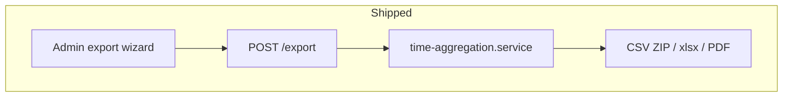

# Export scale-up plan

Reference competitor: [Clockify Reports](https://clockify.me/features/reports) — breakdowns, detailed export, CSV/Excel/PDF, shareable links, scheduled email, PDF customization, custom breakdowns.

Prior work (shipped): [.cursor/plans/export_feature_plan_1864d505.plan.md](./export_feature_plan_1864d505.plan.md), [docs/specs/export.md](../docs/specs/export.md).

Product sequencing: [docs/architecture/PRODUCT_ROADMAP.md](../docs/architecture/PRODUCT_ROADMAP.md) Phase B–D.

---

## Baseline (already shipped)

| Capability         | Location                                                   |
| ------------------ | ---------------------------------------------------------- |
| Report types       | `time_entries`, `daily_summary`, `by_project`, `by_member` |
| Formats            | CSV (ZIP multi), Excel multi-sheet, PDF summary            |
| Filters            | Period, project, member, teamOnly, billable                |
| Column picker      | Per-report order; contracts SSOT                           |
| Member export      | `POST /export/me`, client timesheet                        |
| Aggregation parity | `time-aggregation.service` shared with reporting           |
| Period chips       | 7d / 30d / 90d / This month on exports page                |

**Do not rebuild** — extend `exportReportTypeSchema`, aggregations in `export.service.ts`, and admin wizard panels.



---

## Design principles

1. **Contracts first** — every new report type gets column keys, labels, defaults in `packages/contracts/src/dto/export.dto.ts`; filenames in `export-filename.ts`.
2. **One aggregation path** — new reports are functions on the same fetched log set + rate resolution (no duplicate Prisma queries per report).
3. **Preview before bytes** — lightweight count endpoint avoids generating huge files blindly (Clockify-style confidence).
4. **Presets before schedules** — named configs in UI teach what users want emailed later.
5. **Distribution last** — shareable links and cron need auth/storage; defer until report catalog stabilizes.

---

## Phase 1 — Wizard UX & dashboard bridge (1 PR, ~3–5 days)

**Goal:** Make exports faster for daily ops without new report types.

### 1.1 Export preview API

| Item           | Detail                                                                                                                 |
| -------------- | ---------------------------------------------------------------------------------------------------------------------- |
| Route          | `POST /export/preview` (ADMIN), body subset of `exportBodySchema` (same filters + `reportTypes`, no `format` required) |
| Response       | `{ counts: Record<ExportReportType, number>, totalLogRows: number, isEmpty: boolean }`                                 |
| Implementation | Reuse aggregation row builders in `export.service.ts`; count only, no render                                           |

**Files:** `export.controller.ts`, `export.service.ts`, `export.dto.ts` (`exportPreviewBodySchema`, `exportPreviewResponseSchema`), `ROUTES.md`.

### 1.2 Admin UI preview line

Below **Export** button on [exports/page.tsx](<../../apps/admin/src/app/(admin)/exports/page.tsx>):

- Debounced call to preview when filters/report selection change.
- Copy: `~1,240 time entry rows · 12 projects · Empty range` or warning if `isEmpty`.

### 1.3 Named presets (localStorage v1)

| Item        | Detail                                                              |
| ----------- | ------------------------------------------------------------------- |
| Storage key | `kloqra-export-presets:{workspaceId}`                               |
| Shape       | `{ id, name, body: ExportBodyDto }[]`                               |
| UI          | Dropdown: Load preset · Save as… · Delete; does not auto-run export |

Optional: ship [export-column-picker.tsx](../../apps/admin/src/components/export-column-picker.tsx) helper `useExportPresets(workspaceId)`.

### 1.4 Quick export from dashboard

On [dashboard/page.tsx](<../../apps/admin/src/app/(admin)/dashboard/page.tsx>):

- **Export** button next to range chips (7 / 30 / 90).
- Uses dashboard’s current `from`/`to` + `projectId`/`userId` filters.
- Fixed defaults: `reportTypes: ['time_entries','by_project']`, `format: 'xlsx'`, default columns, `billable: 'all'`.
- Link “Customize…” → `/exports?from=…&to=…` (query params optional stretch).

### 1.5 Period presets

Add chips: **Today**, **This week** (Monday-start v1; align to `Workspace.settings.weekStart` in Phase 2 when settings ship).

---

## Phase 2 — Report catalog & client PDF (1–2 PRs, ~1 week)

**Goal:** Clockify “detailed + summary + client PDF” parity for download-only workflows.

### 2.1 `invoice` report type

| Item    | Detail                                                                                        |
| ------- | --------------------------------------------------------------------------------------------- |
| Rows    | Same projection as `time_entries` with `billable: 'billable'` enforced server-side            |
| Extra   | Footer/subtotal row in PDF and last row in CSV/Excel (`billable_amount` total)                |
| Columns | Subset: client, project, task, date, hours, rate, amount, description (defaults in contracts) |
| PDF     | Prefer this report as default sheet when format is PDF and only invoice selected              |

### 2.2 `by_task` report type

| Item    | Detail                                                                                                |
| ------- | ----------------------------------------------------------------------------------------------------- |
| Grain   | One row per `taskId` (task name, project, client, totals)                                             |
| Columns | `task`, `project`, `client`, `total_hours`, `billable_hours`, `non_billable_hours`, `billable_amount` |

### 2.3 `weekly_summary` report type

| Item    | Detail                                                                                 |
| ------- | -------------------------------------------------------------------------------------- |
| Grain   | ISO week label + member + project (mirror `daily_summary` but bucket by week)          |
| Columns | `week_start`, `week_label`, `member`, `email`, `client`, `project`, hour/amount fields |

### 2.4 PDF branding (minimal)

| Item      | Detail                                                                                                                                                                                         |
| --------- | ---------------------------------------------------------------------------------------------------------------------------------------------------------------------------------------------- |
| Header    | Workspace display name, period, filter summary (existing)                                                                                                                                      |
| Logo      | Optional `Workspace.settings.logoUrl` — embed if reachable                                                                                                                                     |
| Footer    | Optional `settings.exportFooterNote` — plain text                                                                                                                                              |
| Contracts | Extend workspace settings Zod when [user settings / workspace settings](../plans/user_settings_management_79030cb7.plan.md) lands; until then hardcode footer field optional on workspace JSON |

**Member export:** Do not expose `invoice` or ops reports on `POST /export/me` unless product asks.

---

## Phase 3 — Ops & finance reports (1 PR, after Phase 2 stable)

**Goal:** Clockify “users without time”, estimates/budget, utilization — as export rows, not live charts.

### 3.1 `users_without_time`

- Input: same date range + optional project (team members) or all workspace members.
- Output: member, email, last_log_date (nullable), days_in_range_without_logs.
- Data: members LEFT JOIN aggregate log counts in range.

### 3.2 `budget_vs_actual`

- Requires `Project.budgetHours` (already in schema).
- Per project: budget_hours, logged_hours, remaining, percent_used, billable_amount optional.

### 3.3 `utilization`

- Per member × week: logged_hours, expected_hours (default 40, from settings later).
- utilization_pct column.

**Tests:** Each report — seed fixture, assert row counts and totals match hand-calculated aggregation tests (pattern: `time-aggregation.export.spec.ts`).

---

## Phase 4 — Distribution (epic, Phase D roadmap)

**Goal:** Clockify share + schedule. Separate from file generation.

| Feature                | Approach sketch                                                                                                           |
| ---------------------- | ------------------------------------------------------------------------------------------------------------------------- |
| **Scheduled export**   | `ExportSchedule` table: cron, recipient emails, frozen `ExportBodyDto` JSON, lastRunAt; worker uses existing `generate()` |
| **Shareable link**     | `ReportShare` token → read-only HTML or JSON view; no workspace JWT; expires_at                                           |
| **Rounding at export** | Apply `Workspace.settings.roundingMinutes` in aggregation layer before render                                             |

**Dependencies:** Phase 1 presets inform default scheduled bodies; Phase 2 PDF branding needed for client-facing emails.

**Out of scope for this epic:** QuickBooks/Xero sync, expense/attendance reports, cross-workspace export, public API keys.

---

## API & contracts checklist (every new report)

- [ ] Add to `exportReportTypeSchema`
- [ ] `*_COLUMNS`, `EXPORT_COLUMN_LABELS`, `DEFAULT_EXPORT_COLUMNS`
- [ ] `exportColumnsSchema` key
- [ ] `export-filename.ts` segment
- [ ] `export.service.ts` — `buildXRows()` + switch in generate
- [ ] Excel sheet tab name (≤31 chars)
- [ ] PDF section title
- [ ] Admin `REPORT_OPTIONS` + column picker panel
- [ ] Spec + user guide paragraph
- [ ] API test

---

## UI information architecture (target)

```
Exports
├── Period (presets + date inputs)
├── Filters (project, member, billable, team only)
├── Presets (load / save / delete)
├── Preview (~rows)
├── Reports (checkboxes + column panels per type)
├── Format
└── Export

Dashboard
└── [7d|30d|90d] … charts … [Export ↓] [Customize → /exports]
```

---

## Suggested PR split

| PR   | Scope                           | Risk   |
| ---- | ------------------------------- | ------ |
| PR1  | Phase 1 entirely                | Low    |
| PR2  | `invoice` + `by_task` + tests   | Medium |
| PR3  | `weekly_summary` + PDF branding | Medium |
| PR4  | Phase 3 ops reports             | Medium |
| PR5+ | Phase 4 distribution            | High   |

---

## Success metrics

- Admin can export dashboard range in **one click** without visiting wizard.
- Preview shows **non-zero row estimate** before download for 30-day workspace exports.
- **Invoice PDF** usable for client send (billable-only, subtotal, workspace name).
- New report totals **match** reporting dashboard for identical filters (regression tests).
- No duplicate rate-resolution logic outside `time-aggregation.service`.

---

## Explicitly deferred

| Item                                       | Reason                                                   |
| ------------------------------------------ | -------------------------------------------------------- |
| Live in-app “custom breakdown” builder     | Dashboard/charts concern; export gets fixed report types |
| Bulk edit / time audit in export           | Timesheet admin features, not export                     |
| Expense / attendance / assignments reports | No domain models yet                                     |
| Cross-workspace export                     | Agency tier; separate security model                     |
| Multi-currency columns                     | USD label only today                                     |
| Member presets / scheduled member export   | Low demand; member path stays simple                     |

---

## Doc updates when shipping

1. Move items from Phase B in `PRODUCT_ROADMAP.md` → **Shipped** with links.
2. Expand `docs/specs/export.md` report catalog table.
3. Refresh `docs/user-guides/admin/exports.md` (presets, preview, new reports).
4. Mark todos in this plan `completed` per PR.

---

## First implementation step

Start **Phase 1 / PR1**: `POST /export/preview` + debounced UI + localStorage presets + dashboard Export button. No new report types until preview and presets land (validates body shape for later schedules).
