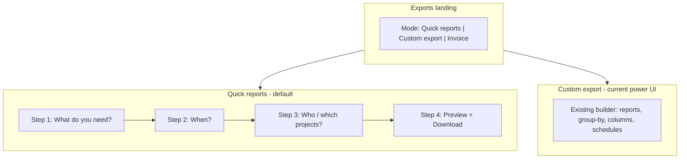
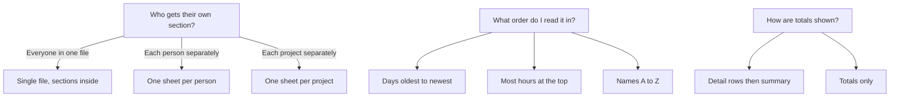

# Exports: Multi-Select Filters + HR-Friendly Redesign

## Investigation summary

### Multi-select: **Yes, feasible** (backend changes required)

Today, scope filters are **single-select only** end-to-end:

- Contract: [`packages/contracts/src/dto/export.dto.ts`](packages/contracts/src/dto/export.dto.ts) — `projectId` / `userId` are optional single UUIDs
- UI: [`packages/web-shared/src/components/report-scope-filters.tsx`](packages/web-shared/src/components/report-scope-filters.tsx) — `SearchableSelect` with `__all__` sentinel
- API: [`apps/api/src/common/time/time-aggregation.service.ts`](apps/api/src/common/time/time-aggregation.service.ts) — `userIds: { in: [...] }` already exists internally; `projectId` is equality only

A ready-made UI primitive exists but is unused in features: [`packages/ui/src/components/ui/searchable-multi-select.tsx`](packages/ui/src/components/ui/searchable-multi-select.tsx).

Per your choice, multi-select will be **exports-only** — we will **not** change shared `ReportScopeFilters` (dashboard stays single-select).

### Why exports feels too technical today

The current page ([`apps/admin/src/features/exports/exports-page.tsx`](apps/admin/src/features/exports/exports-page.tsx), ~975 lines) exposes power-user concepts upfront:

| Technical concept | HR-unfriendly label today |
|---|---|
| Excel tab structure | "Workbook layout" / "One tab per person" |
| Sort dimensions | "Row order inside each tab" + group-by chips + ↑↓ reorder |
| Two controls for one idea | "Workbook layout" AND "Row order" both change grouping — confusing overlap |
| Report catalog | 12 report types across 3 groups |
| Column schema | Per-report column picker |
| Scope | Collapsed "Scope filters" panel |

HR users typically want: **pick a purpose → pick dates → pick people/projects → download**. The current UI inverts that (structure first, purpose implicit).

---

## Target UX (full overhaul)



### Quick reports (new default)

**Scenario cards** — each card pre-fills `sheetLayout`, `reportTypes`, `groupBy`, `billable`, `format`:

| Scenario ID | User-facing title | Subtitle | Pre-config reports |
|---|---|---|---|
| `payroll` | Payroll & timesheets | Hours per person, ready for payroll | `tabs_per_member`, `time_entries` + `member_daily_total` + `weekly_summary` |
| `client_billing` | Client billing pack | Billable hours grouped by client | `tabs_per_client`, `time_entries` + `by_client` + `invoice`, `billable: billable` |
| `project_review` | Project review | Hours and budget per project | `tabs_per_project`, `time_entries` + `by_project` + `budget_vs_actual` |
| `team_summary` | Team summary | Who worked how much this period | `standard`, `by_member` + `member_project_breakdown` |
| `missing_time` | Who hasn't logged time? | Find gaps before payroll closes | `standard`, `users_without_time` + `missing_days` |
| `capacity` | Team capacity | Who is over or under expected hours | `standard`, `overtime_summary` + `utilization` |
| `approval_status` | Timesheet approvals | Submission and approval status by person | `standard`, `timesheet_approval_status` (shown only when workspace has approval-enabled projects) |

Copy rules for Quick reports:
- Never say "tab", "workbook", "group-by", "dimension", "rollup", or "report type" in primary UI
- Preview sidebar: **"12 people · 171 time entries"** instead of "13 tabs • 171 time entries"
- Download CTA: **"Download timesheets"** / **"Download billing report"** (scenario-specific), not `Download XLSX`
- Show **live filename preview** with purpose + smart date range before download (see Dynamic export filenames)
- Describe organization in one plain sentence: *"Each person on their own sheet, days listed oldest to newest"*

**Step 3 filters** use a new exports-only component with multi-select:
- **Projects** — `SearchableMultiSelect`; empty = all projects
- **People** — `SearchableMultiSelect`; empty = all members
- Category stays single-select (optional, collapsed under "More filters")
- **Task** disabled when 0 or 2+ projects selected (union loading is ambiguous; document this)

Advanced options in Quick mode: collapsed **"Adjust file details"** link → opens minimal overrides (format, billable, optional organize override) without exposing full builder.

---

## Organization, grouping & sorting (non-technical mental model)

### The problem today

HR users think in **reading order**, not spreadsheet mechanics. The current UI splits that across two cards:

1. **Workbook layout** — "One tab per person" (file/sheet structure)
2. **Row order inside each tab** — multi-select chips + ↑↓ (sort/group dimensions)

Both change how data is grouped, but nothing explains the relationship. A payroll coordinator does not think *"group by member then day"* — they think *"I want each person's hours, day by day, in date order."*

### How non-technical users actually think



Three questions, plain language — **no** `sheetLayout`, **no** `groupBy`, **no** arrow buttons.

### Solution: `export-organize` abstraction layer

New file [`apps/admin/src/lib/export-organize.ts`](apps/admin/src/lib/export-organize.ts) — single SSOT that maps user-facing choices → existing API fields (`sheetLayout`, `groupBy`, `reportTypes` order). **No new API sort contract in v1** — reuse [`export-sort.util.ts`](apps/api/src/modules/export/application/export-sort.util.ts) and existing builder defaults.

```ts
// User-facing preset (stored in UI state + optional preset metadata)
type ExportOrganizePreset =
  | "person_sheets_chronological"   // payroll default
  | "person_sheets_by_project"      // person sheet, projects grouped inside
  | "one_file_by_person"            // standard + member → day
  | "one_file_by_project"
  | "one_file_by_client"
  | "client_sheets_chronological"   // billing default
  | "project_sheets_chronological"
  | "summary_by_hours"              // totals only, people sorted by hours
  | "summary_alphabetical";
```

Each preset defines:

| Field | Example (`person_sheets_chronological`) |
|---|---|
| `sheetLayout` | `tabs_per_member` |
| `groupBy` | `["member", "day"]` |
| `reportOrder` | detail sheets first, then `weekly_summary` |
| `summarySort` | `chronological` \| `by_hours_desc` \| `alphabetical` |
| `describe()` | *"Each team member gets their own sheet. Days are listed in order, starting with the earliest."* |

Helper functions:
- `organizePresetFromBody(body)` — reverse-map saved presets for Custom mode hydration
- `applyOrganizePreset(preset)` → `{ sheetLayout, groupBy, reportOrder }`
- `describeOrganize(body)` → plain-language sentence for preview sidebar
- `organizeOptionsForScenario(scenarioId)` → 2–3 sensible presets only (not all 9)

### Quick reports — organization baked in + simple override

Each scenario ships a **default organize preset** (hidden). User never sees technical controls unless they expand **"Change how it's organized"**:

| Scenario | Default organize | Plain-language preview |
|---|---|---|
| `payroll` | `person_sheets_chronological` | *"One sheet per person · days in date order"* |
| `client_billing` | `client_sheets_chronological` | *"One sheet per client · projects listed under each client"* |
| `project_review` | `project_sheets_chronological` | *"One sheet per project · team members listed inside each"* |
| `team_summary` | `summary_by_hours` | *"Everyone in one file · people with the most hours first"* |
| `missing_time` | `summary_alphabetical` | *"Alphabetical list of people who haven't logged time"* |
| `capacity` | `one_file_by_person` | *"One row per person per week · over/under hours highlighted"* |
| `approval_status` | `summary_alphabetical` | *"Grouped by person · pending approvals at the top"* |

**Optional override UI** (collapsed under "Change how it's organized") — radio list, max 3 choices per scenario:

```
How should the file be organized?
○ Each person on their own sheet          ← default for payroll
○ Everyone in one file, grouped by person
○ Everyone in one file, grouped by project

Within each section:
○ List days in date order (recommended)   ← default
○ List projects, then days
```

Maps to `ExportOrganizePreset` via `export-organize.ts`. Changing organize updates preview sentence live.

### Custom export — redesigned organize section

Replace the two current cards with one **"Organize the file"** section:

**Block 1 — File structure** (radio, replaces workbook layout cards):
- Everyone in one file
- Separate sheet per team member
- Separate sheet per project
- Separate sheet per client

**Block 2 — Reading order** (two dropdowns max, replaces group-by chips + ↑↓):
- **Group first by:** Person / Project / Client / Day / Week / Category *(dropdown 1)*
- **Then by:** *(optional dropdown 2)* — contextual options based on first choice
- Helper text under dropdowns: auto-generated sentence from `describeOrganize()`

**Block 3 — Sheet order** (when multiple report types selected):
- Drag-to-reorder list with HR labels: "Time detail" → "Daily totals" → "Weekly totals" → "Summary by person"
- Default order per scenario; persisted in preset `reportTypes` array order (already honored by export service)

**Block 4 — Summary tables** (read-only info + one toggle):
- Totals sheets (`by_member`, `by_project`, etc.) sort **most hours first** by default (existing builder behavior)
- Toggle: **"Sort people alphabetically instead"** → maps to `groupBy: ["member"]` + builder sort override or `summary_alphabetical` preset

Hide Block 2 entirely when file structure is `tabs_per_*` and preset already implies inner sort (payroll = member sheet + chronological days).

### Preview sidebar — show organization, not mechanics

Update [`export-layout-preview.tsx`](apps/admin/src/components/export-layout-preview.tsx):

| Today | After |
|---|---|
| "WHAT YOU WILL GET (EXCEL TABS)" | **"What you'll download"** |
| "Alex Chen 18" (tab + row count) | **"Alex Chen — 18 entries, Jun 1–18"** |
| "13 tabs • 171 time entries" | **"12 people · 171 hours logged"** |
| (no organize info) | **`describeOrganize()` sentence** under the headline |

For `tabs_per_member`, list people alphabetically in preview (HR expectation), not arbitrary API order.

### Column order (what appears in each row)

Quick mode: **no column picker** — scenario uses `DEFAULT_EXPORT_COLUMNS` with HR-friendly headers from `EXPORT_COLUMN_LABELS` (already human-readable).

Custom mode: rename **"Columns"** → **"Choose what to include"**:
- Show friendly labels ("Date", "Hours", "Project") not keys (`start_time`, `durationSec`)
- Default order matches payroll convention: Date → Member → Project → Hours → Description
- Reorder via drag (existing `ExportColumnPicker` behavior)

### API / contract notes

- **v1: no new `sortBy` contract field** — all user choices compile to existing `sheetLayout` + `groupBy`
- Summary sort direction (`by_hours_desc` vs `alphabetical`): implement in [`export-rows.builder.ts`](apps/api/src/modules/export/application/export-rows.builder.ts) via a optional `summarySort` on organize preset, applied only to rollup reports (`by_member`, `by_project`, `by_client`) — or pass as metadata in preset JSON without widening public schema
- Legacy presets: `organizePresetFromBody()` reconstructs UI state from `sheetLayout` + `groupBy` combo
- [`export-group-by.ts`](apps/admin/src/lib/export-group-by.ts): keep for Custom mode power mapping; Quick mode never imports `GROUP_BY_DIMENSION_OPTIONS` directly

### New UI component

[`apps/admin/src/features/exports/export-organize-picker.tsx`](apps/admin/src/features/exports/export-organize-picker.tsx):
- Props: `mode: "quick" | "custom"`, `scenarioId?`, `value`, `onChange`
- Quick: radio list (2–3 options)
- Custom: file structure radios + two dropdowns + optional sheet-order drag list
- Emits `ExportOrganizePreset` or full `{ sheetLayout, groupBy, reportOrder }`

### Tests

- [`export-organize.spec.ts`](apps/admin/src/lib/export-organize.spec.ts) — every preset round-trips to expected `sheetLayout` + `groupBy`; `describeOrganize` output is non-empty; `organizePresetFromBody` handles legacy combos
- E2E: payroll scenario preview shows "One sheet per person" sentence

---

## Dynamic export filenames (always date-aware)

### The problem today

[`buildExportFilename`](packages/contracts/src/export-filename.ts) already includes ISO dates, but names are **generic and repetitive**:

```
kloqra-demo-workspace-2026-06-01_to_2026-06-18.xlsx   ← no purpose, no scenario
```

- **Excel/PDF** downloads omit report/scenario slug entirely (only CSV zip entries get `reportSlug`)
- Admin fallback is `kloqra-export.xlsx` if `Content-Disposition` is missing ([`exports-page.tsx`](apps/admin/src/features/exports/exports-page.tsx))
- HR users save files like `kloqra-demo-workspace-2026-06-01_to_2026-06-18 (3).xlsx` — impossible to tell payroll from billing without opening
- Date format is always raw ISO — not human-scannable (`jun-2026` vs `2026-06-01_to_2026-06-18`)

### Target: purpose + date in every filename

**Pattern:**

```
{kloqra}-{workspace}-{purpose}[-{scope-hint}]-{date-range}.{ext}
```

**Examples:**

| Context | Filename |
|---|---|
| Payroll quick export, Jun 1–18 | `kloqra-acme-payroll-timesheets-jun-1-to-18-2026.xlsx` |
| Client billing, full June | `kloqra-acme-client-billing-jun-2026.xlsx` |
| Team summary, single day | `kloqra-acme-team-summary-jun-18-2026.xlsx` |
| Missing time report | `kloqra-acme-missing-time-jun-2026.xlsx` |
| Filtered to 1 project | `kloqra-acme-payroll-timesheets-brand-campaign-jun-2026.xlsx` |
| Filtered to 3 people | `kloqra-acme-payroll-timesheets-3-people-jun-2026.xlsx` |
| Custom export (multi-report) | `kloqra-acme-time-entries-and-summaries-jun-2026.xlsx` |
| Member self-export | `kloqra-acme-my-timesheet-jun-1-to-18-2026.pdf` |

### Smart date-range segment (always present)

New helper in [`export-filename.ts`](packages/contracts/src/export-filename.ts): `formatExportDateRange(from, to)`:

| Condition | Output segment | Example |
|---|---|---|
| Same calendar day | `{mon}-{day}-{year}` | `jun-18-2026` |
| Same month, different days | `{mon}-{d1}-to-{d2}-{year}` | `jun-1-to-18-2026` |
| Full calendar month (1st → last day) | `{mon}-{year}` | `jun-2026` |
| Spans months or partial months | `{iso-from}_to_{iso-to}` | `2026-05-15_to_2026-06-18` |
| Invalid/missing dates | `unknown-date` | (existing fallback) |

Use workspace locale where possible for month abbreviations; filename stays ASCII (`jun` not `juin`).

### Purpose slug (scenario-driven)

Map Quick scenario → slug in [`export-scenarios.ts`](apps/admin/src/features/exports/export-scenarios.ts):

| Scenario | `purposeSlug` |
|---|---|
| `payroll` | `payroll-timesheets` |
| `client_billing` | `client-billing` |
| `project_review` | `project-review` |
| `team_summary` | `team-summary` |
| `missing_time` | `missing-time` |
| `capacity` | `team-capacity` |
| `approval_status` | `timesheet-approvals` |

**Custom export** (no scenario): derive from primary report + layout:
- Single report: `time-entries`, `weekly-summary`, etc.
- Multi-report: join top 2 slugs — `time-entries-and-by-member`
- `tabs_per_member` + `time_entries` → `timesheets-by-person`

### Optional scope hint (when filters narrow)

Append **one** short segment when scope is restricted (max 24 chars, sanitized):

| Filter state | Segment |
|---|---|
| 1 project selected | project slug — `brand-campaign` |
| 2–5 projects | `{n}-projects` |
| 1 person selected | person slug — `alex-chen` |
| 2–5 people | `{n}-people` |
| No scope filters | omit segment |

### Contract + API changes

Extend `BuildExportFilenameInput` in [`export-filename.ts`](packages/contracts/src/export-filename.ts):

```ts
purposeSlug?: string;       // payroll-timesheets, client-billing, …
scopeHint?: string;         // pre-sanitized segment from filters
dateRangeStyle?: "smart";   // default smart compaction
```

Add optional `exportPurpose?: string` to [`exportBodySchema`](packages/contracts/src/dto/export.dto.ts) (max 48 chars, sanitized on parse) — Quick flow sends scenario `purposeSlug`; Custom flow sends derived slug. Server **always** builds filename; client never trusts arbitrary full filenames (security).

[`export.service.ts`](apps/api/src/modules/export/application/export.service.ts):
- Compute `scopeHint` from normalized `projectIds` / `userIds` + project/member names in context
- Pass `purposeSlug: body.exportPurpose ?? derivePurposeFromBody(body)` to `buildExportFilename`
- Apply to **xlsx, pdf, and zip** (not just per-CSV inside zip)
- PDF document title: `{Purpose} — {smart date range}` (e.g. *Payroll timesheets — Jun 1–18, 2026*)

[`export-schedule.service.ts`](apps/api/src/modules/export/application/export-schedule.service.ts): email attachment uses same naming; subject line includes purpose + date range.

### Admin UI — show filename before download

[`export-download-panel.tsx`](apps/admin/src/features/exports/export-download-panel.tsx):
- Call shared `buildExportFilename()` client-side (same contracts helper) for **live preview**
- Display: **"File name: kloqra-acme-payroll-timesheets-jun-1-to-18-2026.xlsx"**
- Update when period, scenario, filters, or format changes
- Replace hardcoded `kloqra-export.${ext}` fallback with client-computed `buildExportFilename()` matching server input

Download button label stays human ("Download timesheets"); filename is secondary detail below.

### Backward compatibility

- Existing API bodies without `exportPurpose` → fall back to current behavior + smart date range (upgrade ISO-only names to compact dates)
- Presets/schedules without `exportPurpose` → derive on export from `reportTypes` + `sheetLayout`
- [`export-filename.spec.ts`](packages/contracts/src/export-filename.spec.ts): add cases for all date-range rules, purpose slug, scope hint, max-length truncation (~120 chars total)

### Tests

- Contract: `formatExportDateRange` edge cases (same day, full month, cross-year)
- API: export e2e asserts `Content-Disposition` filename contains purpose + date
- Admin: download panel shows filename matching server response

---

## HR-focused reports (new + existing)

Today there are **12 admin report types**, but several HR-relevant ones are buried in a technical catalog (`users_without_time`, `utilization`, `weekly_summary`) or missing entirely. This plan adds **6 new report types** derivable from data already in the system, and surfaces them through Quick scenarios above.

### Data available today (no new tables required)

| Source | Fields used |
|---|---|
| `TimeLog` | `durationSec`, `startTime`, `endTime`, `isBillable`, `description`, `source` (`timer` / `manual`) |
| `User` | `name`, `email`, `defaultHourlyRate` |
| `Task` → `Project` | `taskName`, `project.name`, `clientName`, `budgetHours` |
| `Task` → `Category` | `category.name` |
| `Workspace.settings` | `expectedWeeklyHours` (default 40), `weekStart` |
| `WorkspaceMember` | roster for "who didn't log" |
| `TimesheetPeriod` | `status`, `periodStart/End`, `submittedAt`, `reviewedAt`, `reviewNote` |

### New report types (contract + `export-rows.builder`)

Add to `exportReportTypeSchema` in [`export.dto.ts`](packages/contracts/src/dto/export.dto.ts):

| Report ID | HR-friendly label | What it answers | Rows | Implementation |
|---|---|---|---|---|
| `member_daily_total` | Daily hours per person | "How many hours did Alex work each day?" (all projects combined) | date × member | Roll up `ctx.aggregates.daily` by date+member, sum hours |
| `member_project_breakdown` | Hours by person & project | "Where did each person spend their time?" | member × project | Roll up logs by userId+projectId |
| `missing_days` | Days with no time logged | "Which weekdays did someone not log anything?" | member × date (gap only) | Cross product of workspace members (or filtered) × weekdays in range minus days with logs |
| `overtime_summary` | Over / under hours | "Who worked more or less than expected this week?" | member × week | Extend utilization: add `over_hours`, `under_hours`, `status` (`over` / `under` / `on_track`) using `expectedWeeklyHours` |
| `hours_by_source` | Timer vs manual entries | "Was time entered live or typed in later?" | member (or member × project) | Group logs by `source`, sum hours |
| `timesheet_approval_status` | Timesheet approval status | "Who submitted / approved timesheets?" | member × project × period | Query `TimesheetPeriod` in date range; join user + project names; columns: `member`, `email`, `project`, `period_label`, `status`, `submitted_at`, `reviewed_at`, `review_note` |

**Column SSOT** — add `*_COLUMNS` constants and `EXPORT_COLUMN_LABELS` entries for each, plus `DEFAULT_EXPORT_COLUMNS` defaults. Human-readable headers (e.g. "Over hours", "Days missing") not snake_case in the Excel file.

**Sheet layout support** — new detail-style reports (`member_daily_total`, `member_project_breakdown`, `missing_days`) participate in `tabs_per_member` splits the same way `time_entries` / `daily_summary` do. Update [`export-sheet.util.ts`](apps/api/src/modules/export/application/export-sheet.util.ts) and preview logic accordingly.

**Custom export catalog** — group reports for power users:

| Group | Reports |
|---|---|
| **Payroll & attendance** | `time_entries`, `member_daily_total`, `weekly_summary`, `daily_summary`, `missing_days`, `users_without_time` |
| **Team & capacity** | `by_member`, `member_project_breakdown`, `utilization`, `overtime_summary`, `hours_by_source` |
| **Clients & billing** | `by_client`, `by_project`, `invoice`, `budget_vs_actual` |
| **Detail breakdowns** | `by_task`, `by_category` |
| **Approvals** | `timesheet_approval_status` |

Existing reports stay unchanged; new ones are additive (non-breaking contract enum extension).

### Reports we are NOT adding (no data yet)

- Leave / PTO, public holidays, overtime rules, cost centers — not in schema
- Approved-vs-logged hour reconciliation — would need TimesheetPeriod hour totals vs logs (future)

### API work for new reports

- [`export-rows.builder.ts`](apps/api/src/modules/export/application/export-rows.builder.ts) — one `build*` method per new type
- [`export-preview.spec.ts`](apps/api/src/modules/export/application/export-preview.spec.ts) — counts for new types
- [`export-sheet.util.ts`](apps/api/src/modules/export/application/export-sheet.util.ts) — tab-split eligibility
- [`docs/specs/export.md`](docs/specs/export.md) — catalog table update
- Unit tests: `export-rows.builder.spec.ts` (create if missing) with fixture logs covering rollup edge cases (zero logs, single member, weekend gaps)

### Custom export (preserved power mode)

Move today's full UI (workbook layout cards, group-by, report chips, column picker, presets, schedules) behind a top-level **"Custom export"** tab alongside **"Quick reports"** and existing **"Invoice wizard"**.

Custom mode uses the **Organize the file** section above (replaces separate workbook layout + row order cards entirely).

---

## Multi-select implementation (exports-only)

### 1. Contracts (contract-first)

Extend [`exportFiltersBaseSchema`](packages/contracts/src/dto/export.dto.ts):

```ts
projectIds: z.array(uuidSchema).max(50).optional(),
userIds: z.array(uuidSchema).max(100).optional(),
// keep projectId / userId for backward compat
```

Add `z.preprocess` normalization:
- If `projectId` set and `projectIds` empty → `projectIds = [projectId]`
- Same for `userId` → `userIds`
- If both singular and array present → merge + dedupe (arrays win for export query)
- Empty array treated as "no filter" (same as omit)

Update all dependent schemas: `exportBodySchema`, `exportPreviewBodySchema`, `exportQuerySchema`, preset/schedule bodies. Update [`packages/contracts/src/contracts.spec.ts`](packages/contracts/src/contracts.spec.ts) and [`docs/specs/export.md`](docs/specs/export.md).

### 2. API

[`time-aggregation.service.ts`](apps/api/src/common/time/time-aggregation.service.ts):
- Add `projectIds?: string[]`
- Query: `projectIds?.length ? { id: { in: projectIds } } : projectId ? { id: projectId } : {}`

[`export.service.ts`](apps/api/src/modules/export/application/export.service.ts):
- Resolve filters: prefer normalized `projectIds` / `userIds`
- `teamOnly`: when multiple `projectIds`, union team member user IDs across projects (intersect with `userIds` if also set)
- Member export access checks: validate user can access **all** selected projects

[`export-rows.builder.ts`](apps/api/src/modules/export/application/export-rows.builder.ts):
- `users_without_time`: scope to `userIds` when set; else all workspace members
- `budget_vs_actual`: when multiple `projectIds`, one row per selected project (not global)

Add unit tests in `time-aggregation.service.spec.ts`, `export.service.spec.ts`, and contract round-trip tests.

### 3. Admin FE — new scope component

Create [`apps/admin/src/features/exports/export-scope-filters.tsx`](apps/admin/src/features/exports/export-scope-filters.tsx):
- State: `projectIds: string[]`, `userIds: string[]` (not shared web-shared component)
- Uses `SearchableMultiSelect` from `@kloqra/ui`
- Chip summary: "3 projects", "2 people" with per-item remove
- Task loading: only when exactly **one** project selected (reuse existing task fetch logic)

Update [`export-normalize.ts`](apps/admin/src/lib/export-normalize.ts) to map old presets (`projectId`/`userId`) → arrays on load.

Wire into both Quick and Custom flows; Custom flow replaces `ReportScopeFilters` on exports page only.

---

## Redesign file structure

Split the monolith for maintainability:

| New file | Responsibility |
|---|---|
| [`export-organize.ts`](apps/admin/src/lib/export-organize.ts) | Plain-language organize presets → `sheetLayout` + `groupBy` + `reportOrder` |
| [`export-organize-picker.tsx`](apps/admin/src/features/exports/export-organize-picker.tsx) | Quick radio / Custom dropdown organize UI |
| [`export-scenarios.ts`](apps/admin/src/features/exports/export-scenarios.ts) | Scenario definitions + default organize preset + reports |
| [`export-quick-flow.tsx`](apps/admin/src/features/exports/export-quick-flow.tsx) | 4-step guided UI |
| [`export-custom-flow.tsx`](apps/admin/src/features/exports/export-custom-flow.tsx) | Extracted current builder |
| [`export-scope-filters.tsx`](apps/admin/src/features/exports/export-scope-filters.tsx) | Multi-select scope UI |
| [`export-download-panel.tsx`](apps/admin/src/features/exports/export-download-panel.tsx) | Shared sticky preview + download (used by both flows) |
| [`exports-page.tsx`](apps/admin/src/features/exports/exports-page.tsx) | Thin orchestrator: mode tabs, shared state, data fetching |

Shared state lifted to `exports-page.tsx`: period, scope arrays, preview, export actions. Scenario selection resets report/layout fields but preserves period + scope.

Update [`export-layout-preview.tsx`](apps/admin/src/components/export-layout-preview.tsx) copy: "What you will get" lists people/project names in plain language for Quick mode.

---

## Presets & schedules compatibility

- **Load**: `normalizeExportBody` converts legacy single IDs → arrays; UI state hydrates correctly
- **Save**: always persist `projectIds` / `userIds` (can omit deprecated singular fields on new saves)
- **Schedules**: no DB migration — JSON body shape evolves via normalization on read

---

## Testing (per workspace policy)

| Layer | Tests |
|---|---|
| Contracts | Array filter parse/normalize, max length, backward compat with `projectId` |
| API | Multi-project/user log fetch, teamOnly + multi-project, preview sheet counts |
| Admin | `export-scenarios.spec.ts` (template mapping), `export-scope-filters.spec.tsx` or Playwright e2e for Quick flow happy path |
| Existing | Keep [`export-sheet-layout.spec.ts`](apps/admin/src/lib/export-sheet-layout.spec.ts) green |

Pre-PR gate: `pnpm format:check && pnpm lint && pnpm typecheck && pnpm test && pnpm build`

---

## Delivery phases

**Phase A — Multi-select foundation** (unblocks HR filter need even before full redesign)
- Contracts + API + `export-scope-filters.tsx` wired into current page (Custom mode temporarily)

**Phase B — New HR reports**
- Contracts enum + columns + 5 TimeLog-derived builders + tests
- `timesheet_approval_status` builder (TimesheetPeriod query)
- Sheet layout + preview support for splittable new reports

**Phase C — Organize layer**
- `export-organize.ts` + picker component + preview `describeOrganize()` copy
- Replace workbook layout + group-by cards in Custom mode

**Phase D — Quick reports UX**
- 7 scenario cards with default organize presets + optional override
- 4-step flow, plain-language preview sidebar, download panel with filename preview

**Phase E — Dynamic filenames**
- `formatExportDateRange` + `exportPurpose` in contracts
- Server filename builder + PDF title + schedule attachments
- Client filename preview in download panel

**Phase F — Custom mode extraction + polish**
- Move builder to Custom tab, regrouped report catalog, column picker rename, preset normalization, e2e

---

## Out of scope (explicit)

- Dashboard / shared `ReportScopeFilters` multi-select
- Category or task multi-select
- Invoice wizard multi-project (stays single project)
- Leave/PTO, holiday calendar, or payroll system integrations
- Figma mock — can add later if you share a design file

## Risk notes

- **Task filter + multi-project**: disabled unless exactly one project — avoids ambiguous UX and N+1 task fetches
- **Large selections**: cap at 50 projects / 100 users in contract to protect query performance
- **Preview accuracy**: ensure preview API respects `projectIds`/`userIds` so sidebar counts match download
