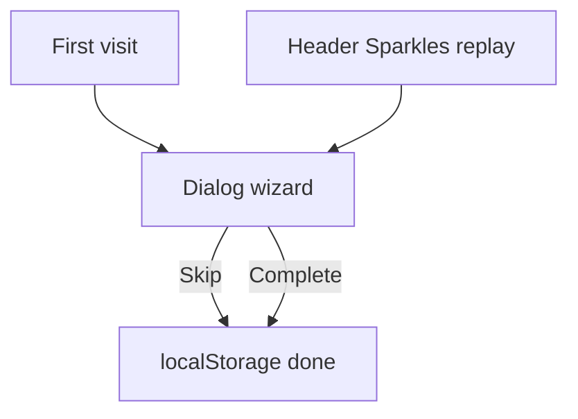
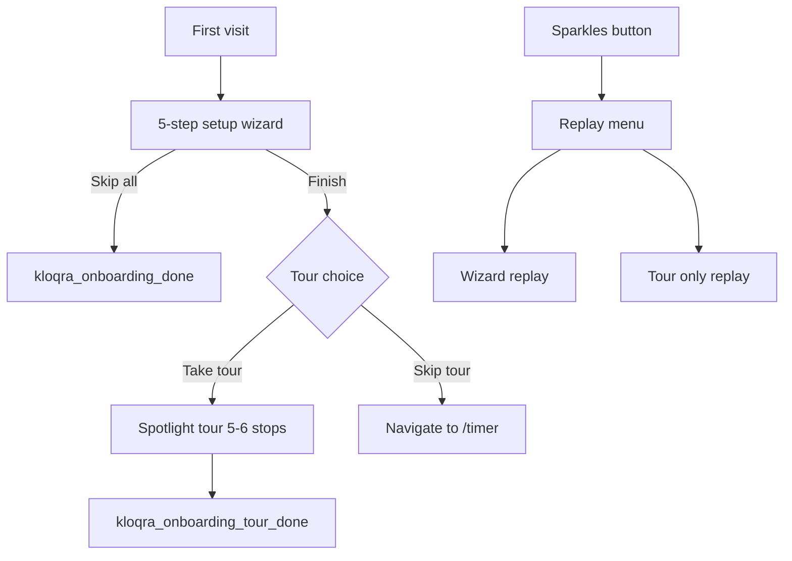

# Hybrid Onboarding Upgrade (Member Portal)

## Current state

Onboarding is a **3-step dialog** in [`apps/client/src/features/onboarding/onboarding-overlay.tsx`](apps/client/src/features/onboarding/onboarding-overlay.tsx):

1. Welcome blurb
2. Admin: create project / Member: assigned projects list
3. Timer + keyboard shortcuts

It misses most of what the app offers today: **Dashboard widgets**, **Time Tracker vs Timesheet**, **project overview + personal colors**, **approvals**, **settings/profile**, and the **Sparkles replay** button. Persistence is `localStorage` key `kloqra_onboarding_done` only.

## Target experience

**Phase 1 — Setup wizard** (dialog, ~3 min): educate + keep existing admin project-creation flow.

**Phase 2 — Spotlight tour** (~1 min): anchor tooltips to real nav/header so users learn where things live.

---

## Phase 1: Richer setup wizard

### Refactor to data-driven steps

Extract step config from the 420-line overlay into:

| File                                                                                             | Purpose                                                           |
| ------------------------------------------------------------------------------------------------ | ----------------------------------------------------------------- |
| [`onboarding-steps.ts`](apps/client/src/features/onboarding/onboarding-steps.ts)                 | Step metadata, copy, icons, `roles: "all" \| "admin" \| "member"` |
| [`onboarding-feature-card.tsx`](apps/client/src/features/onboarding/onboarding-feature-card.tsx) | Reusable card: icon, title, one-liner, optional route badge       |
| [`onboarding-overlay.tsx`](apps/client/src/features/onboarding/onboarding-overlay.tsx)           | Thin orchestrator: step index, nav footer, role filtering         |

### New 5-step flow

| #   | Step                         | Audience | Content                                                                                                                                                                          |
| --- | ---------------------------- | -------- | -------------------------------------------------------------------------------------------------------------------------------------------------------------------------------- |
| 1   | **Welcome**                  | All      | Personalized greeting; updated value prop (track time, project insights, submit timesheets); progress estimate                                                                   |
| 2   | **Your workspace**           | Branch   | **Keep existing logic**: admin project-creation form (name, client, color, default task with assignee); member assigned-projects list + empty state                              |
| 3   | **Three ways to track time** | All      | 3 feature cards: **Timer** (live tracking), **Time Tracker** (weekly list + date range), **Timesheet** (calendar drag-and-drop)                                                  |
| 4   | **Projects & dashboard**     | All      | 2 cards: **My projects → Overview** (your hours, charts, personal color picker); **Dashboard** (widgets, period filter, quick timer)                                             |
| 5   | **Finish setup**             | All      | Approvals one-liner; keyboard shortcuts (`Space`, `Ctrl+Shift+T`); Sparkles = replay hint; CTAs: **Take the quick tour** (primary) / **Go to Timer** (secondary) / **Skip tour** |

**Admin step 2 rule preserved**: if admin has zero projects, hide Next until project created or Skip.

### Visual polish (within existing Dialog)

- Replace 3-dot progress with **labeled step counter** (`Step 2 of 5`) + bar
- Use `onboarding-feature-card` grid (`sm:grid-cols-3` on step 3, `sm:grid-cols-2` on step 4)
- Lucide icons per feature (reuse sidebar icons from [`workspace-shell.tsx`](apps/client/src/components/workspace-shell.tsx))
- Subtle `animate-fade-in-up` on step transitions (already referenced)

---

## Phase 2: Spotlight tour

### New UI primitive in `@kloqra/ui`

Add [`packages/ui/src/components/spotlight-tour.tsx`](packages/ui/src/components/spotlight-tour.tsx):

- Props: `steps: { target: string; title; body; placement? }[]`, `open`, `onComplete`, `onSkip`
- Renders fixed overlay with **cutout** around `document.querySelector(target)` (box-shadow or clip-path)
- Tooltip card with title, body, Back / Next / Skip
- `scrollIntoView({ block: "nearest" })` on step change
- `ResizeObserver` + window resize listener to reposition
- `z-index` above shell; trap focus in tooltip for a11y
- **Mobile fallback**: if target not visible (collapsed sidebar), show centered card without cutout + copy like "Find this in the menu"

Export from [`packages/ui/src/index.ts`](packages/ui/src/index.ts). Unit tests in sibling `spotlight-tour.spec.tsx`.

### Tour anchors (`data-tour` attributes)

Extend [`SidebarNavItem`](packages/ui/src/components/layout-shell.tsx) with optional `tourId?: string` → `data-tour={tourId}` on desktop + mobile nav `Link`s.

Wire in [`workspace-shell.tsx`](apps/client/src/components/workspace-shell.tsx):

| `tourId`            | Target                                  |
| ------------------- | --------------------------------------- |
| `nav-timer`         | `/timer`                                |
| `nav-time-tracker`  | `/time-tracker`                         |
| `nav-projects`      | `/projects`                             |
| `nav-approvals`     | `/approvals`                            |
| `onboarding-replay` | Sparkles button in `ShellHeaderActions` |

Add optional `tourId` prop to [`shell-header-actions.tsx`](packages/web-shared/src/components/shell-header-actions.tsx) for the Sparkles button.

### Tour steps ([`onboarding-tour-steps.ts`](apps/client/src/features/onboarding/onboarding-tour-steps.ts))

1. **Sidebar intro** — `data-tour="nav-timer"` (or first nav item): "Everything you need is here"
2. **Timer** — live tracking, pick project + assigned task
3. **Time Tracker** — edit past entries, date range filters
4. **My projects** — overview stats, personalize your project color
5. **Approvals** — submit timesheets when your workspace requires it
6. **Replay anytime** — `data-tour="onboarding-replay"` Sparkles button

### Orchestration in provider

Update [`onboarding-provider.tsx`](apps/client/src/features/onboarding/onboarding-provider.tsx):

- State: `wizardOpen`, `tourOpen`, `replayMode`
- `openOnboarding({ replay?, tourOnly? })` — replay menu can launch wizard-only or tour-only
- Wizard `onComplete({ startTour })` → if `startTour`, open tour; else `router.push("/timer")`
- Tour complete → set `kloqra_onboarding_tour_done` (skip when `replay`)

**localStorage keys:**

| Key                           | Meaning                    |
| ----------------------------- | -------------------------- |
| `kloqra_onboarding_done`      | Wizard finished (existing) |
| `kloqra_onboarding_tour_done` | Tour finished (new)        |

First visit: show wizard if `!onboarding_done`. After wizard, offer tour regardless of tour_done (user choice). Auto-skip tour on replay if user picks "Go to Timer".

### Sparkles replay UX

Change Sparkles click from immediate wizard replay to a small **popover/menu** (use existing [`Popover`](packages/ui/src/components/ui/popover.tsx)):

- "Full setup guide" → wizard replay
- "Quick product tour" → tour replay only

---

## What we are NOT doing (scope guard)

- No admin portal onboarding
- No API / `User.onboardingCompleted` field (stay localStorage unless you ask later)
- No new npm tour library (custom `SpotlightTour` keeps design control)
- No page-level deep tours (timer controls, dashboard widgets) in v1 — sidebar + header is enough for a tight first tour

---

## Tests

| Layer       | File                                                                                                                           |
| ----------- | ------------------------------------------------------------------------------------------------------------------------------ |
| UI unit     | `packages/ui/src/components/spotlight-tour.spec.tsx` — step advance, skip, complete callbacks                                  |
| Client unit | `apps/client/src/features/onboarding/onboarding-steps.spec.ts` — role filtering, step count                                    |
| Client e2e  | `apps/client/e2e/onboarding.spec.ts` — first-visit wizard visible; complete wizard → tour starts; Sparkles popover; skip paths |

Pre-PR gate: `pnpm format:check && pnpm lint && pnpm typecheck && pnpm test && pnpm build`

---

## File change summary

**New:** `onboarding-steps.ts`, `onboarding-feature-card.tsx`, `onboarding-tour.tsx`, `onboarding-tour-steps.ts`, `spotlight-tour.tsx`, e2e + unit specs

**Edit:** `onboarding-overlay.tsx`, `onboarding-provider.tsx`, `workspace-shell.tsx`, `layout-shell.tsx`, `shell-header-actions.tsx`, `packages/ui/src/index.ts`

**No changes:** `packages/contracts`, `apps/api`
