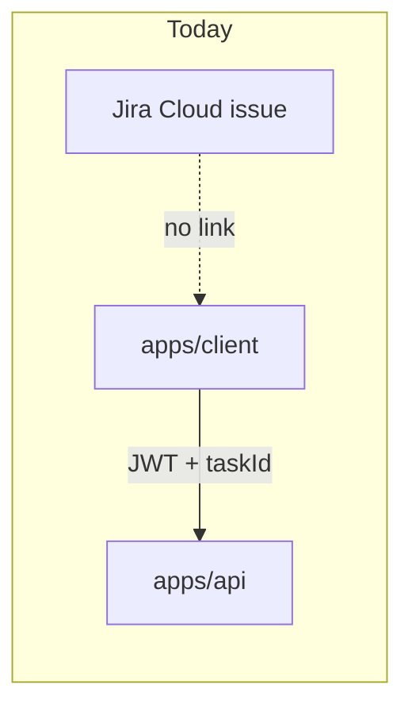
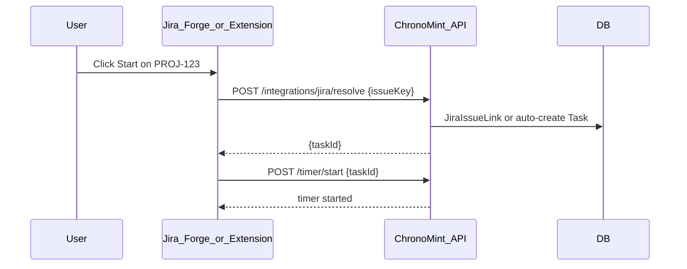
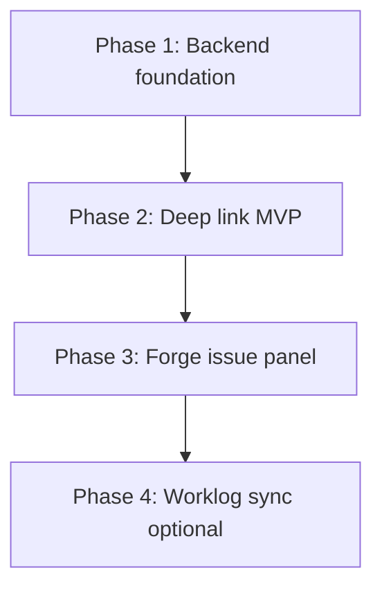
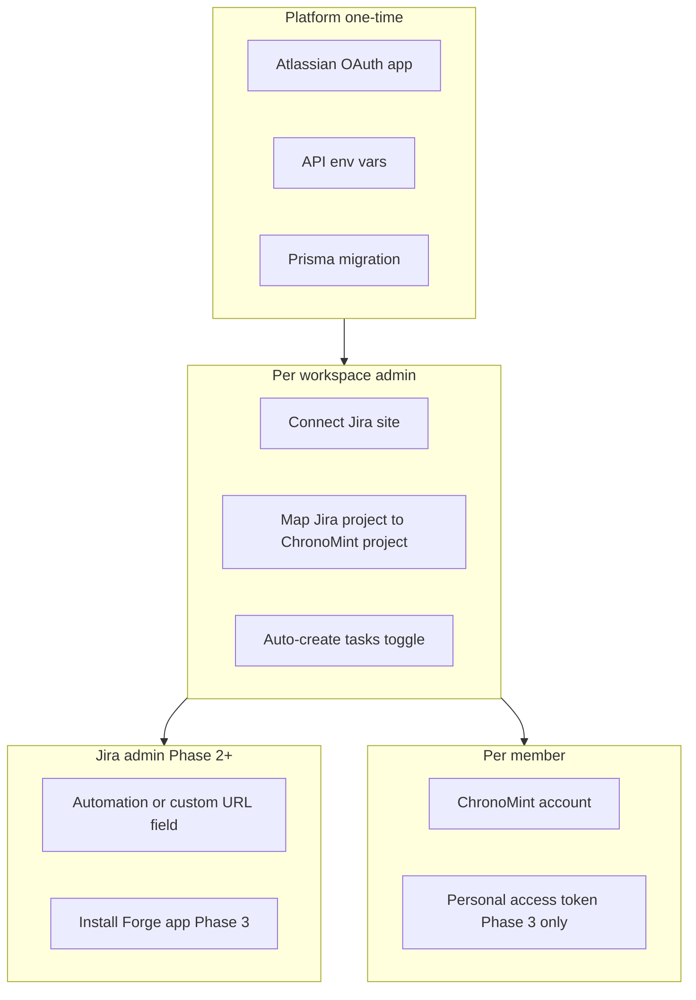

# Jira integration options

## Current state

ChronoMint has **no Jira integration** today. The only related artifacts are forward-looking stubs:

- [`packages/contracts/src/user-preferences.ts`](packages/contracts/src/user-preferences.ts) — `jiraSyncUpdates` notification toggle (no mailer/sync behind it)
- [`docs/architecture/FUTURE_SCOPE.md`](docs/architecture/FUTURE_SCOPE.md) — lists "IDE plugins / Jira inbound receivers" as Phase 3+

Time entries are created via existing API endpoints that any plugin would call:

| Action      | Endpoint            | Required fields                      |
| ----------- | ------------------- | ------------------------------------ |
| Start timer | `POST /timer/start` | `taskId` (UUID)                      |
| Stop timer  | `POST /timer/stop`  | optional `description`, `isBillable` |
| Manual log  | `POST /timelogs`    | `taskId`, `startTime`, `endTime`     |

All routes require **JWT auth** + `X-Workspace-Id` + `X-Auth-Scope: client` ([`docs/architecture/AUTH.md`](docs/architecture/AUTH.md)). There is **no OAuth connector, API keys, or external ID on tasks** yet — those are the main gaps.



---

## The core problem

Jira issues use keys like `PROJ-123`. ChronoMint tasks use internal UUIDs. A plugin must **bridge** issue key → `taskId`, then call the timer API as the logged-in user.

That bridge needs:

1. **Jira connection** — workspace admin connects Atlassian (OAuth 3LO)
2. **Mapping** — Jira project/issue ↔ ChronoMint project/task
3. **External auth** — Forge app / extension cannot rely on browser cookies alone; needs a token strategy

---

## Option comparison

|                         | **A. Forge app** (native Jira UI)            | **B. Browser extension**                       | **C. Deep link** (fastest MVP)                       |
| ----------------------- | -------------------------------------------- | ---------------------------------------------- | ---------------------------------------------------- |
| **UX**                  | "Start timer" button on issue panel          | Injected button or toolbar popup on Jira pages | Link opens ChronoMint `/timer` with issue pre-filled |
| **Install**             | Jira admin installs from Marketplace         | Each user installs Chrome/Firefox add-on       | Bookmark / Jira custom field link                    |
| **Jira Cloud fit**      | Best — official Atlassian model              | Good — reads issue from URL/DOM                | Good — pass issue key in URL                         |
| **Maintenance**         | Atlassian review + Forge runtime             | DOM changes can break selectors                | Lowest — no Jira-side code                           |
| **Timer state in Jira** | Possible (issue panel shows running/stopped) | Harder unless polling API from extension       | None — user switches to ChronoMint                   |
| **Effort**              | High (new `apps/jira-forge` + backend)       | Medium (extension package + backend)           | Low (client route + mapping UI)                      |
| **Distribution**        | Atlassian Marketplace                        | Chrome Web Store / sideload                    | Internal docs only                                   |

**Recommendation for Jira Cloud:** pursue **C → A** — ship deep links and mapping first to validate workflow, then build a **Forge issue panel** for the native in-Jira experience.

---

## Recommended approach (decided)

Ship in this order; **skip the browser extension** unless Marketplace approval blocks Forge and you need an interim solution.

| Phase | Deliverable             | Why                                                               |
| ----- | ----------------------- | ----------------------------------------------------------------- |
| **1** | Backend foundation      | OAuth, mapping, resolve API, PAT auth — required by every surface |
| **2** | Deep link MVP           | Fast validation with real users; no Atlassian review              |
| **3** | Forge issue panel       | Native in-Jira UX for Jira Cloud                                  |
| **4** | Worklog sync (optional) | Only if customers ask for time pushed back to Jira                |

**v1 product decisions:**

- **Mapping:** Auto-create ChronoMint tasks from Jira issues under admin-mapped projects (not manual per-issue linking)
- **Plugin auth:** Personal access tokens (PAT) for Forge; normal JWT login for deep links
- **Jira connection:** Workspace admin connects once (not per-user OAuth to Jira)
- **Scope:** Start/stop timer only; defer manual log-from-panel and worklog sync

**Defer for now:**

- Browser extension (fragile DOM, per-user install; Forge covers Cloud)
- Forge ↔ ChronoMint OAuth (upgrade from PAT once usage proves out)
- `write:jira-work` scope / worklog push to Jira

---

## Shared backend foundation (all options)

New vertical slice: `apps/api/src/modules/integrations/jira/` (contracts-first).

### 1. Contracts + schema

In [`packages/contracts`](packages/contracts):

- `IntegrationProvider` enum: `jira`
- Jira connection DTOs (site URL, cloud ID, connected/disconnected status)
- Issue mapping DTOs (`jiraIssueKey`, `jiraIssueId`, `taskId`)
- Optional: extend `timelogSourceSchema` in [`packages/contracts/src/dto/common.dto.ts`](packages/contracts/src/dto/common.dto.ts) with `"jira"` (reserved in docs, not in Zod today)

Prisma additions in [`apps/api/prisma/schema.prisma`](apps/api/prisma/schema.prisma):

```prisma
model JiraConnection {
  id            String   @id @default(uuid())
  workspaceId   String   @unique
  cloudId       String
  siteUrl       String
  accessToken   String   // encrypted at rest
  refreshToken  String
  expiresAt     DateTime
  connectedById String
  ...
}

model JiraIssueLink {
  id           String @id @default(uuid())
  workspaceId  String
  jiraIssueKey String   // e.g. PROJ-123
  jiraIssueId  String
  taskId       String   @unique
  task         Task     @relation(...)
  @@unique([workspaceId, jiraIssueKey])
}

model JiraProjectMapping {
  id                  String  @id @default(uuid())
  workspaceId         String
  jiraProjectKey      String
  chronomintProjectId String
  autoCreateTasks     Boolean @default(true)
  defaultCategoryId   String
  @@unique([workspaceId, jiraProjectKey])
}

model PersonalAccessToken {
  id          String   @id @default(uuid())
  userId      String
  workspaceId String
  name        String
  tokenHash   String   @unique
  expiresAt   DateTime?
  createdAt   DateTime @default(now())
  revokedAt   DateTime?
}
```

### 2. Atlassian OAuth 3LO

- Register app at [developer.atlassian.com](https://developer.atlassian.com)
- Scopes: `read:jira-work`, `read:jira-user` (v1); add `write:jira-work` only if posting worklogs back to Jira later
- API routes:
  - `GET /integrations/jira/connect` — redirect to Atlassian
  - `GET /integrations/jira/callback` — store tokens on workspace
  - `DELETE /integrations/jira` — disconnect (admin only)
  - `GET /integrations/jira/status` — connection + mapped projects summary
  - `GET /integrations/jira/resolve?issueKey=PROJ-123` — issue → `taskId`
  - `PUT /integrations/jira/project-mappings` — admin CRUD for `JiraProjectMapping`

Full env var and Atlassian Console setup: see [Configuration requirements](#configuration-requirements).

### 3. Issue → task resolution service

`JiraIssueResolverService.resolve(workspaceId, issueKey)`:

1. Look up `JiraIssueLink` by key
2. If missing, optionally fetch issue from Jira API and **auto-create** task under a linked project (admin-configured default project per Jira project key)
3. Return `taskId` for timer/timelog calls

Admin UI (in `apps/admin` or client settings): map Jira project `PROJ` → ChronoMint project, toggle auto-create tasks from issues.

### 4. External API auth for plugins

Current JWT + cookie flow does not work cleanly inside Forge's isolated runtime. Options:

| Approach                                  | Pros                                    | Cons                                           |
| ----------------------------------------- | --------------------------------------- | ---------------------------------------------- |
| **Personal access tokens (PAT)** per user | Simple for extension + Forge; revocable | New auth guard path; users must generate token |
| **OAuth device flow**                     | No manual token copy                    | More UX steps                                  |
| **Forge → ChronoMint OAuth**              | Seamless after first connect            | Most complex                                   |

**Pragmatic v1:** add `POST /auth/personal-tokens` (user creates PAT) + `PatAuthGuard` on `/timer/*` and `/integrations/jira/*`. Forge and extension send `Authorization: Bearer <pat>`.

Reuse existing timer logic in [`apps/api/src/modules/timer/application/timer.service.ts`](apps/api/src/modules/timer/application/timer.service.ts) — no timer rewrite needed.



---

## Option A: Atlassian Forge app (native plugin)

**What it is:** A serverless app hosted by Atlassian that renders UI inside Jira issue pages.

**UX sketch:**

- Issue panel: current issue key, mapped ChronoMint task name, **Start / Stop** buttons, elapsed time (poll `GET /timer/active`)
- First use: "Connect ChronoMint" → OAuth or paste PAT
- Unmapped issue: "Link to project" or auto-create if enabled

**New package:** `apps/jira-forge/` (or repo sibling)

- `manifest.yml` — `jira:issuePanel` module
- `src/index.jsx` — panel UI calling ChronoMint API via `fetch` with stored user token
- Forge `storage` for per-user PAT or OAuth refresh

**Pros:** Best member experience; stays in Jira; Marketplace distribution; no fragile DOM scraping.

**Cons:** Atlassian app review; Forge sandbox limits; separate deploy pipeline; PAT/OAuth setup required.

**Rough effort:** 3–5 weeks after backend foundation.

---

## Option B: Browser extension

**What it is:** Chrome/Firefox extension that detects `*.atlassian.net/browse/PROJ-123` and injects a floating "Start in ChronoMint" control.

**UX sketch:**

- Extension popup: login to ChronoMint once (stores PAT in `chrome.storage`)
- On Jira issue pages: read issue key from URL → resolve → start timer
- Optional badge when timer is running

**New package:** `apps/browser-extension/` (Manifest V3)

**Pros:** Faster to prototype than Forge; no Marketplace wait; you control release cadence.

**Cons:** Per-user install; Jira UI redesigns can break URL/DOM assumptions; weaker "official" feel; Chrome Web Store review.

**Rough effort:** 2–3 weeks after backend foundation.

---

## Option C: Deep link MVP (recommended first slice)

**What it is:** A URL members click from Jira (custom link field, automation, or bookmark):

```
https://app.example.com/timer?jiraIssue=PROJ-123
```

**Client changes** in [`apps/client/src/features/timer/timer-page.tsx`](apps/client/src/features/timer/timer-page.tsx):

1. Parse `jiraIssue` query param on load
2. Call new API `GET /integrations/jira/resolve?issueKey=PROJ-123`
3. Pre-select project/task; user clicks Start (or auto-start if you want one-click)

**Jira setup (no code in Jira):**

- Add a **custom field** or **Automation** "Open link" action on issues pointing to the deep link
- Or document a bookmarklet

**Pros:** Validates mapping + OAuth with minimal surface area; ships in days; no Atlassian approval.

**Cons:** Context switch to ChronoMint tab; not truly "in Jira."

**Rough effort:** 1–2 weeks (backend mapping + client route handler).

---

## Optional future: sync worklogs back to Jira

Not required for "start entry from Jira," but often requested later:

- On `POST /timer/stop`, if task has `JiraIssueLink`, call Jira REST `POST /rest/api/3/issue/{id}/worklog`
- Requires `write:jira-work` scope and idempotency (store `jiraWorklogId` on `TimeLog`)

Defer until v1 start-timer flow is stable.

---

## Recommended phased rollout



| Phase | Deliverable                                        | Validates                                   |
| ----- | -------------------------------------------------- | ------------------------------------------- |
| **1** | Jira OAuth, `JiraIssueLink`, resolve API, PAT auth | Admin can connect Jira; issues map to tasks |
| **2** | `/timer?jiraIssue=KEY` deep link                   | Members can start timers from Jira links    |
| **3** | Forge issue panel (Start/Stop)                     | Native in-Jira UX without leaving the page  |
| **4** | Push worklogs to Jira                              | Bi-directional sync                         |

---

## Configuration requirements

Configuration is split by **who** sets it up and **which phase** is live. Nothing beyond Phase 1 is required until that phase ships.



### 1. One-time platform setup (DevOps / you)

ChronoMint does not have these today. Set up once per environment (dev, staging, production).

#### Atlassian Developer Console

Create an OAuth 2.0 (3LO) app at [developer.atlassian.com](https://developer.atlassian.com):

| Setting                   | Value                                                 |
| ------------------------- | ----------------------------------------------------- |
| **Callback URL**          | `https://<api-host>/integrations/jira/callback`       |
| **Dev callback**          | `http://localhost:3001/integrations/jira/callback`    |
| **Scopes (v1)**           | `read:jira-work`, `read:jira-user`                    |
| **Scopes (Phase 4 only)** | `write:jira-work` (worklog sync; requires re-consent) |

#### New API environment variables

Add to [`apps/api/.env`](apps/api/.env), [`apps/api/.env.example`](apps/api/.env.example), and [`deploy/env.production.example`](deploy/env.production.example):

| Variable                           | Required | Description                                                |
| ---------------------------------- | -------- | ---------------------------------------------------------- |
| `ATLASSIAN_CLIENT_ID`              | Yes      | OAuth app client ID from Atlassian Developer Console       |
| `ATLASSIAN_CLIENT_SECRET`          | Yes      | OAuth app client secret                                    |
| `ATLASSIAN_REDIRECT_URI`           | Yes      | Must match callback URL registered in Atlassian exactly    |
| `INTEGRATION_TOKEN_ENCRYPTION_KEY` | Yes      | Encrypts stored Jira refresh tokens at rest (min 32 bytes) |

Optional / phase-specific:

| Variable                | Phase | Description                                                                                                                          |
| ----------------------- | ----- | ------------------------------------------------------------------------------------------------------------------------------------ |
| `CHRONOMINT_CLIENT_URL` | 2     | Public client base URL for deep links, e.g. `https://app.yourdomain.com` (can derive from `FRONTEND_ORIGIN` if single client origin) |
| `FORGE_APP_ID`          | 3     | Forge app identifier for manifest / deployment pipeline                                                                              |

Validate in [`apps/api/src/load-env.ts`](apps/api/src/load-env.ts) (Zod schema, same pattern as SMTP vars).

#### Existing env (unchanged, still required)

| Variable                                  | Role in Jira integration                           |
| ----------------------------------------- | -------------------------------------------------- |
| `FRONTEND_ORIGIN`                         | CORS for OAuth redirect back to admin/settings UI  |
| `JWT_ACCESS_SECRET`, `JWT_REFRESH_SECRET` | Normal login; PAT is additive, not a replacement   |
| `DATABASE_URL`                            | Stores `JiraConnection`, `JiraIssueLink`, PAT rows |
| `REDIS_URL`                               | Timer start/stop still uses Redis                  |

#### Database and CI

- Run Prisma migration for new models (`JiraConnection`, `JiraIssueLink`, `JiraProjectMapping`, `PersonalAccessToken`, etc.)
- CI ([`.github/workflows/ci.yml`](.github/workflows/ci.yml)): mock Jira API in integration tests; do **not** require live Atlassian credentials in CI unless explicitly needed
- Document all new vars in [`docs/development/ENVIRONMENT.md`](docs/development/ENVIRONMENT.md)
- Add operator runbook: `docs/runbooks/jira-integration.md` (setup checklist for admins)

---

### 2. Workspace admin configuration (in ChronoMint)

Required after **Phase 1** ships. Each workspace configures once.

| Step                  | Where                              | What                                                                                             |
| --------------------- | ---------------------------------- | ------------------------------------------------------------------------------------------------ |
| **Connect Jira**      | Admin → Integrations (or Settings) | Click "Connect Jira" → Atlassian login → select site (`*.atlassian.net`)                         |
| **Map projects**      | Same screen                        | For each Jira project key (`PROJ`), select target ChronoMint project                             |
| **Auto-create tasks** | Per mapping                        | When enabled, first timer on `PROJ-123` creates a ChronoMint task from issue summary             |
| **Default category**  | Per mapping or workspace default   | Category for auto-created tasks ([`Task.categoryId`](apps/api/prisma/schema.prisma) is required) |
| **Disconnect**        | Admin only                         | `DELETE /integrations/jira` revokes tokens and stops resolve                                     |

Without project mapping, issue keys cannot resolve to a `taskId` and timer start will fail with a clear error. Schema: `JiraProjectMapping` in [Shared backend foundation](#1-contracts--schema).

---

### 3. Per-member configuration

Depends on how the member starts the timer.

#### Deep link only (Phase 2)

| Requirement         | Notes                                                                                                              |
| ------------------- | ------------------------------------------------------------------------------------------------------------------ |
| ChronoMint account  | Member of the workspace                                                                                            |
| Project team access | Existing [`ProjectAccessService`](apps/api/src/modules/projects/application/project-access.service.ts) rules apply |
| Browser login       | Normal JWT session; **no PAT** if already logged into client                                                       |
| Link access         | Bookmark, Jira automation, or custom field opens `/timer?jiraIssue={{issue.key}}`                                  |

#### Forge app (Phase 3)

| Step             | What                                                                     |
| ---------------- | ------------------------------------------------------------------------ |
| Generate PAT     | Account → API tokens → Create (scoped to user + workspace)               |
| Connect in Forge | First open of issue panel → paste PAT → stored in Forge per-user storage |
| API headers      | `Authorization: Bearer <pat>`, `X-Workspace-Id`, `X-Auth-Scope: client`  |

PAT endpoints (Phase 1):

- `POST /auth/personal-tokens` — create (returns token once)
- `GET /auth/personal-tokens` — list (names/dates only, not secret)
- `DELETE /auth/personal-tokens/:id` — revoke

---

### 4. Jira-side configuration (Jira admin)

#### Phase 1 — none

OAuth and mapping happen entirely in ChronoMint admin UI.

#### Phase 2 — deep link (pick one)

| Approach                          | Jira configuration                                                                                                                                   |
| --------------------------------- | ---------------------------------------------------------------------------------------------------------------------------------------------------- |
| **Automation rule** (recommended) | Project or global rule → trigger (e.g. issue viewed, button, transition) → action "Open URL" → `https://<client-host>/timer?jiraIssue={{issue.key}}` |
| **Custom URL field**              | Add URL field with template containing `{{issue.key}}`                                                                                               |
| **Bookmarklet**                   | No Jira admin setup; document for members                                                                                                            |

Example automation URL pattern:

```
https://app.yourdomain.com/timer?jiraIssue={{issue.key}}
```

#### Phase 3 — Forge app

| Step               | Who                 | Action                                                           |
| ------------------ | ------------------- | ---------------------------------------------------------------- |
| Register Forge app | Platform team       | `manifest.yml` with `jira:issuePanel`, deploy via `forge deploy` |
| Install on site    | Jira site admin     | Marketplace install or private distribution during dev           |
| Grant permissions  | Automatic           | Scopes declared in manifest; users see Atlassian consent         |
| Configure API base | Forge env / storage | Point panel at production API URL                                |

Forge `manifest.yml` essentials:

```yaml
modules:
  jira:issuePanel:
    - key: chronomint-timer-panel
      resource: main
      title: ChronoMint
permissions:
  scopes:
    - read:jira-work
  external:
    fetch:
      backend:
        - https://api.yourdomain.com
```

#### Phase 4 — worklog sync (optional)

| Step                | Action                                                         |
| ------------------- | -------------------------------------------------------------- |
| Expand OAuth scopes | Add `write:jira-work` in Atlassian app                         |
| Re-authorize        | Workspace admin reconnects Jira in ChronoMint                  |
| Idempotency         | Store `jiraWorklogId` on `TimeLog` to avoid duplicate worklogs |

---

### 5. Configuration by phase (checklist)

```text
Phase 1 — Backend foundation
  [ ] Create Atlassian OAuth 3LO app
  [ ] Set ATLASSIAN_* + INTEGRATION_TOKEN_ENCRYPTION_KEY in API env
  [ ] Run Prisma migration
  [ ] Update ENVIRONMENT.md and deploy env examples
  [ ] Workspace admin: Connect Jira + map projects + set default category

Phase 2 — Deep link MVP
  [ ] Set CHRONOMINT_CLIENT_URL (or derive from FRONTEND_ORIGIN)
  [ ] Jira admin: Automation rule or custom URL field with deep link
  [ ] Members: Use link while logged into ChronoMint client

Phase 3 — Forge issue panel
  [ ] Register and deploy Forge app
  [ ] Jira admin: Install app on site
  [ ] Members: Create PAT + connect once in issue panel

Phase 4 — Worklog sync (optional)
  [ ] Add write:jira-work scope
  [ ] Admin re-authorizes Jira connection
  [ ] Enable worklog push in workspace integration settings
```

---

### 6. What you do NOT need to configure

- Per-issue manual linking in v1 (if auto-create + project mapping enabled)
- Browser extension / Chrome Web Store (skipped per recommendation)
- Jira Server / Data Center (target is Jira Cloud only)
- Changes to timer overlap, timesheet lock, or one-timer-per-user rules (existing API behavior unchanged)
- New client env vars for Phase 2 (uses existing `NEXT_PUBLIC_API_BASE_URL`)

---

### 7. Practical minimum for v1 (Phases 1 + 2)

Minimum config to get members timing from Jira:

1. **Platform:** Atlassian OAuth app + 4 API env vars + DB migration
2. **Workspace admin:** Connect Jira → map each `PROJ` → ChronoMint project → enable auto-create → pick default category
3. **Jira admin:** One automation rule opening `https://app…/timer?jiraIssue={{issue.key}}`
4. **Members:** Click link; log into ChronoMint as usual

Forge and PAT setup can wait until Phase 3.

---

## Tests and compliance (per repo rules)

- Contracts: [`packages/contracts/src/contracts.spec.ts`](packages/contracts/src/contracts.spec.ts)
- API unit specs beside services; e2e in `apps/api/test/integrations-jira.e2e.ts`
- Forge/extension: smoke tests where feasible; manual test plan for Marketplace
- Pre-PR: `pnpm format:check && pnpm lint && pnpm typecheck && pnpm test && pnpm build`

---

## Key decisions

| Decision                | Status      | Choice                                                           |
| ----------------------- | ----------- | ---------------------------------------------------------------- |
| Delivery order          | **Decided** | Phase 1 → 2 (deep link) → 3 (Forge); skip browser extension      |
| Mapping strategy        | **Decided** | Auto-create tasks under admin-mapped Jira projects               |
| Plugin auth             | **Decided** | PAT for Forge (Phase 3); JWT for deep links (Phase 2)            |
| Who connects Jira       | **Decided** | Workspace admin only, once per workspace                         |
| v1 scope                | **Decided** | Start/stop timer only; no worklog sync yet                       |
| Forge OAuth upgrade     | **Open**    | Replace PAT with seamless OAuth later if adoption warrants       |
| Admin UI location       | **Open**    | `apps/admin` integrations page vs client workspace settings      |
| Auto-start on deep link | **Open**    | Pre-fill task only vs auto-call `POST /timer/start` on page load |
