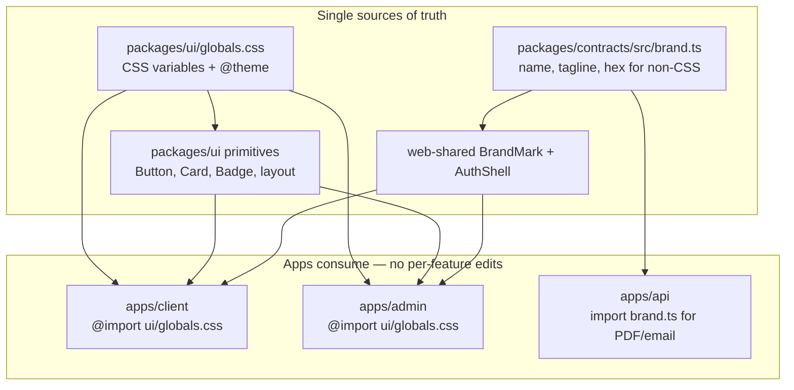
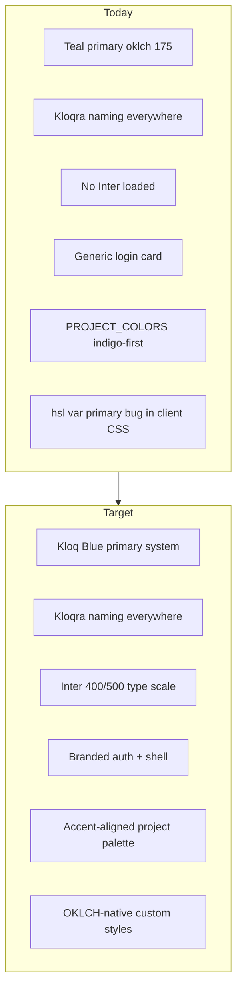

# Kloqra Brand & Full Rebrand Plan

## Brand summary (from [Kloqra Brand Guideline 1.pdf](/Users/chamal/Downloads/Kloqra%20Brand%20Guideline%201.pdf))

| Area              | Spec                                                                                                  |
| ----------------- | ----------------------------------------------------------------------------------------------------- |
| **Tagline**       | Track Time. Unlock Productivity.                                                                      |
| **Primary**       | Kloq Blue `#236bfe` — CTAs, logo, links                                                               |
| **Primary depth** | Royal Blue `#1a42c8` (hover), Navy `#0d2d6e` (headings)                                               |
| **Tints**         | Sky `#93b4ff`, Ice `#eef2ff`                                                                          |
| **Accents**       | Mint `#00c9a7`, Amber `#f59e42`, Alert Red `#ef4444`, Indigo `#a855f7`                                |
| **Neutrals**      | Surface `#f8fafc`, Border `#e2e8f0`, Muted `#94a3b8`, Body `#475569`, Dark `#1e293b`, Black `#0a0f1e` |
| **Typography**    | Inter 400/500 only; defined type scale (Display 40px → Label 11px)                                    |
| **Icons**         | Lucide, 1.5px stroke, 24px grid, rounded caps                                                         |
| **Radius**        | Tags 4px, inputs/buttons 8px, cards 12px, panels 16px, pills full                                     |
| **Borders**       | 0.5px on UI borders                                                                                   |
| **Voice**         | Efficient, trusted, intelligent, warm — professional tone                                             |

**Logo (interim):** Lucide `Timer` in Kloq Blue square until final logo assets arrive.

---

## Centralized architecture (leverage what we already have)

You already have the right pattern — **change once, propagate everywhere**. Most feature code uses semantic Tailwind classes (`bg-primary`, `text-muted-foreground`, `border-border`) rather than hardcoded hex. The rebrand should extend this, not fight it.



| Layer                  | File(s)                                                                                                                                             | What changes                                                     | What does NOT need changes                                   |
| ---------------------- | --------------------------------------------------------------------------------------------------------------------------------------------------- | ---------------------------------------------------------------- | ------------------------------------------------------------ |
| **CSS tokens**         | [`packages/ui/src/globals.css`](packages/ui/src/globals.css)                                                                                        | All colors, radii, borders, dark mode                            | ~100+ feature files using `bg-primary`, `text-primary`, etc. |
| **TS brand constants** | `packages/contracts/src/brand.ts` (new)                                                                                                             | Name, tagline, hex palette                                       | Invoice PDF, export filenames, metadata, shells import this  |
| **UI primitives**      | [`packages/ui/src/components/ui/*`](packages/ui/src/components/ui/)                                                                                 | Button, Card, Input, Badge variants once                         | Every page that imports from `@kloqra/ui`                    |
| **Layout primitives**  | [`packages/ui/src/components/layout.tsx`](packages/ui/src/components/layout.tsx), [`layout-shell.tsx`](packages/ui/src/components/layout-shell.tsx) | PageHeader/Section heading weights, sidebar logo slot            | All pages using `PageHeader`                                 |
| **Brand shells**       | `web-shared` BrandMark + AuthShell (new)                                                                                                            | Login, sidebar logo, loading state                               | One component replaces duplicated Timer markup               |
| **App globals**        | [`apps/client/src/app/globals.css`](apps/client/src/app/globals.css)                                                                                | Fix custom styles to use `color-mix(in oklch, var(--primary) …)` | Dashboard grid already uses semantic vars once fixed         |

**Rule for this rebrand:** no hex or brand strings in feature folders. If a value must appear in code (PDF, email, `document.title`), it comes from `brand.ts`. If it's visual, it comes from CSS variables.

---

## Current vs target



**Key files today:**

- Tokens: [`packages/ui/src/globals.css`](packages/ui/src/globals.css) — teal OKLCH, `--radius: 0.5rem`
- Shells: [`apps/client/src/components/workspace-shell.tsx`](apps/client/src/components/workspace-shell.tsx), [`apps/admin/src/components/admin-shell.tsx`](apps/admin/src/components/admin-shell.tsx) — `logoTitle="Kloqra"`, Timer `strokeWidth={2.25}`
- Auth: [`apps/client/src/app/(auth)/login/login-form.tsx`](<apps/client/src/app/(auth)/login/login-form.tsx>) — plain card, no brand moment
- Project colors: [`packages/contracts/src/project-colors.ts`](packages/contracts/src/project-colors.ts) — indigo-first, misaligned with brand
- CSS bug: [`apps/client/src/app/globals.css`](apps/client/src/app/globals.css) — `hsl(var(--primary))` but tokens are OKLCH
- PDF exports: [`apps/api/src/modules/export/application/invoice.service.ts`](apps/api/src/modules/export/application/invoice.service.ts) — hardcoded slate/sky, not Kloqra

---

## Implementation phases

### Phase 0 — Brand constants module (TS single source)

Add [`packages/contracts/src/brand.ts`](packages/contracts/src/brand.ts) — shared by API, web-shared, and apps:

```ts
export const BRAND_NAME = "Kloqra";
export const BRAND_TAGLINE = "Track Time. Unlock Productivity.";
export const BRAND_SUBTAGLINE = "Built for focus, not friction.";
export const BRAND_COLORS = {
  primary: "#236bfe",
  primaryHover: "#1a42c8",
  navy: "#0d2d6e"
  // ... full palette from PDF
} as const;
```

Export from [`packages/contracts/src/index.ts`](packages/contracts/src/index.ts). Use everywhere a string or hex is needed outside CSS:

- Shell `logoTitle` → `BRAND_NAME`
- `metadata.title`, `document.title`, Swagger, mailer from-name
- Invoice PDF colors in [`invoice.service.ts`](apps/api/src/modules/export/application/invoice.service.ts)
- Export filename prefix in [`export-filename.ts`](packages/contracts/src/export-filename.ts)

`PROJECT_COLORS` in [`project-colors.ts`](packages/contracts/src/project-colors.ts) derives from `BRAND_COLORS` accents (same file or import) — one palette definition.

---

### Phase 1 — Design token foundation (CSS only)

Rewrite [`packages/ui/src/globals.css`](packages/ui/src/globals.css) to map Kloqra semantics to CSS variables (keep OKLCH for perceptual consistency). **Both apps already import this file** — no app-level token duplication:

**Light mode mapping:**

- `--primary` → Kloq Blue `#236bfe`
- `--primary-foreground` → White
- `--background` → White / Surface `#f8fafc`
- `--foreground` → Navy `#0d2d6e` or Dark `#1e293b`
- `--muted-foreground` → Muted `#94a3b8`
- `--border` → Border `#e2e8f0`
- `--accent` → Ice `#eef2ff`
- `--destructive` → Alert Red `#ef4444`
- Add semantic tokens: `--success` (Mint), `--warning` (Amber), `--premium` (Indigo)
- `--ring` → Kloq Blue
- Chart colors → brand accent set

**Dark mode (derived — not in PDF):**

- `--background` → Black `#0a0f1e`
- `--card` → Dark `#1e293b`
- `--primary` → Sky `#93b4ff` (readable on dark) with Kloq Blue for high-emphasis CTAs if needed
- Preserve contrast ratios for body/muted/border

**Radius tokens** (extend `@theme inline`):

- `--radius-sm: 4px` (tags)
- `--radius-md: 8px` (inputs, buttons) — set as base `--radius`
- `--radius-lg: 12px` (cards)
- `--radius-xl: 16px` (panels/modals)

**Border:** introduce `--border-width: 0.5px` and apply in base layer / component defaults.

Optional raw hex aliases in globals for debugging only (`--kloq-blue: #236bfe`) — production code uses semantic names (`--primary`, `--success`).

**Fix:** Replace all `hsl(var(--primary))` in [`apps/client/src/app/globals.css`](apps/client/src/app/globals.css) with `color-mix(in oklch, var(--primary) 28%, transparent)` — keeps custom dashboard grid styles token-driven.

Wire new semantic colors in `@theme inline` so Tailwind utilities exist app-wide:

```css
--color-success: var(--success);
--color-warning: var(--warning);
--color-premium: var(--premium);
```

---

### Phase 2 — Typography (centralized, not per-feature)

**App entry (once per app):** Load Inter via `next/font/google` in both root layouts with weights 400 + 500 only.

**Token layer:** Add type scale to globals `@theme` + `@layer base` heading rules:

```css
h1,
h2,
h3 {
  @apply font-medium tracking-tight;
}
```

This covers pages using raw `<h1>` and primitives like [`PageHeader`](packages/ui/src/components/layout.tsx) / [`CardTitle`](packages/ui/src/components/ui/card.tsx) when updated to `font-medium` **in packages/ui only**.

**Do not** sweep `font-semibold` across `apps/client/features/**` — update layout primitives in `packages/ui` and accept that widget-specific bold (e.g. stat numbers) can stay until a later polish pass.

---

### Phase 3 — UI primitives only (packages/ui)

Touch **only** shared primitives — every consumer updates automatically:

| File                                                              | Change                                                                            |
| ----------------------------------------------------------------- | --------------------------------------------------------------------------------- |
| [`button.tsx`](packages/ui/src/components/ui/button.tsx)          | Use `rounded-md` (maps to 8px token); variants reference semantic colors          |
| [`card.tsx`](packages/ui/src/components/ui/card.tsx)              | `rounded-lg` (12px token); `border` uses token width                              |
| [`input.tsx`](packages/ui/src/components/ui/input.tsx)            | Radius from token; focus `ring-ring`                                              |
| [`badge.tsx`](packages/ui/src/components/ui/badge.tsx)            | Add `success` / `warning` / `premium` variants mapping to new tokens              |
| [`layout.tsx`](packages/ui/src/components/layout.tsx)             | PageHeader `font-medium`; Section headings                                        |
| [`layout-shell.tsx`](packages/ui/src/components/layout-shell.tsx) | Logo slot uses `bg-primary` (not hardcoded hex); accept `logoIcon` from BrandMark |

Map Kloqra radius scale in `@theme` so Tailwind classes align:

- `rounded-sm` → 4px (tags)
- `rounded-md` → 8px (buttons/inputs)
- `rounded-lg` → 12px (cards)
- `rounded-xl` → 16px (panels)

---

### Phase 4 — Brand shells (web-shared, wire once)

Add two shared components in [`packages/web-shared`](packages/web-shared):

**`BrandMark`** — Timer icon `strokeWidth={1.5}`, `bg-primary` container, wordmark from `BRAND_NAME`

**`AuthShell`** — branded login layout (tagline from `BRAND_TAGLINE`, subtagline from `BRAND_SUBTAGLINE`, children slot for form)

Wire into **4 call sites only:**

- [`workspace-shell.tsx`](apps/client/src/components/workspace-shell.tsx) — pass `<BrandMark />` as `logoIcon`, `logoTitle={BRAND_NAME}`
- [`admin-shell.tsx`](apps/admin/src/components/admin-shell.tsx) — same
- Client login/register + admin login — wrap forms in `<AuthShell>`

**App metadata** (2 files): `layout.tsx` in client/admin import `BRAND_NAME` + `BRAND_TAGLINE` for `metadata`.

**Favicon:** single SVG using `BRAND_COLORS.primary`, copy to both apps.

**Timer `document.title`:** one line in timer store importing `BRAND_NAME`.

---

### Phase 5 — Project color palette (derive from brand.ts)

Update [`packages/contracts/src/project-colors.ts`](packages/contracts/src/project-colors.ts) to **import from `brand.ts`** — no duplicate hex lists:

```ts
import { BRAND_PROJECT_COLORS } from "./brand.js";
export const PROJECT_COLORS = BRAND_PROJECT_COLORS;
```

Update [`packages/contracts/src/contracts.spec.ts`](packages/contracts/src/contracts.spec.ts). **Non-breaking** for existing DB values outside palette.

---

### Phase 6 — Full naming sweep (Kloqra → Kloqra)

Mechanical rename across ~300+ references. Group by risk:

**High visibility (do first):**

- UI strings, metadata, onboarding copy, empty states
- [`packages/web-shared/src/features/account/account-settings-page.tsx`](packages/web-shared/src/features/account/account-settings-page.tsx)
- [`apps/client/src/features/onboarding/onboarding-overlay.tsx`](apps/client/src/features/onboarding/onboarding-overlay.tsx)
- Export titles in [`apps/api/src/modules/export/application/export.service.ts`](apps/api/src/modules/export/application/export.service.ts)
- Swagger title in [`apps/api/src/main.ts`](apps/api/src/main.ts)
- Mailer from-name in [`apps/api/src/common/mailer/mailer.service.ts`](apps/api/src/common/mailer/mailer.service.ts) → `Kloqra <noreply@kloqra.app>` (domain is deploy follow-up)

**Package rename (`@kloqra/*` → `@kloqra/*`):**

- Rename packages: `contracts`, `ui`, `web-shared`, `config-*`
- Update all `package.json` names, `pnpm-lock.yaml`, import paths, `turbo.json`, CI workflows, Dockerfiles, `tsconfig` paths, ESLint config
- Root package name: `chronomint` → `kloqra`
- App filters: `@kloqra/api`, `@kloqra/client`, `@kloqra/admin`

**Local storage keys:** `kloqra-sidebar-collapsed` → `kloqra-sidebar-collapsed` (with one-time migration read fallback)

**Seed / test fixtures:** `admin@kloqra.dev` → `admin@kloqra.dev`, workspace name "Kloqra" in [`apps/api/prisma/seed-data.ts`](apps/api/prisma/seed-data.ts)

**Docs:** README, CONTRIBUTING, runbooks, cursor skills/rules — rename references

**Out of repo (document checklist, do not block PR):**

- GitHub repo rename
- Railway/Vercel project names (`kloqra-*` → `kloqra-*`)
- DNS / SMTP domain (`kloqra.app`)
- Postgres database name (`chronomint` → optional, breaking for existing devs)

---

### Phase 7 — Voice & microcopy (targeted pass)

Apply voice guide to high-traffic strings (not every string in one PR):

| Context             | Target copy                                            |
| ------------------- | ------------------------------------------------------ |
| Empty timer         | "No time tracked yet today. Hit start and get going."  |
| Timer stopped toast | "Timer stopped. {duration} logged."                    |
| Generic errors      | "Something went wrong. Your time is safe — try again." |
| Delete confirm      | "Delete this entry? This can't be undone."             |

Files: timer features, toast/sonner messages, empty states in dashboard widgets, stale timer dialog.

---

### Phase 8 — Export & PDF branding (import brand.ts)

[`apps/api/src/modules/export/application/invoice.service.ts`](apps/api/src/modules/export/application/invoice.service.ts): replace hardcoded hex with `BRAND_COLORS` + `BRAND_TAGLINE` from `@kloqra/contracts`.

[`packages/contracts/src/export-filename.ts`](packages/contracts/src/export-filename.ts): prefix from `BRAND_NAME`.

---

## Testing strategy

Per [`kloqra-test-delivery`](.cursor/skills/kloqra-test-delivery/SKILL.md):

- Update [`packages/ui/src/**/*.spec.tsx`](packages/ui/src/) for Button/Card/Badge variant changes
- Add `brand-mark.spec.tsx` for BrandMark render
- Update contract specs for `PROJECT_COLORS`
- Update e2e auth helpers if seed emails change ([`apps/admin/e2e/helpers/auth.ts`](apps/admin/e2e/helpers/auth.ts))
- Visual check: login, sidebar, dark mode, dashboard grid placeholders (OKLCH fix)

Pre-PR gate: `pnpm format:check && pnpm lint && pnpm typecheck && pnpm test && pnpm build`

---

## Suggested PR breakdown

Centralized layers first — each PR is small because feature folders are barely touched:

1. **PR A — Foundation:** `brand.ts` + `globals.css` token rewrite + Inter font + radius `@theme` remap
2. **PR B — Primitives:** packages/ui Button/Card/Badge/Input/layout updates + client globals OKLCH fix
3. **PR C — Shells:** BrandMark + AuthShell + 4 wire-up sites + favicon + metadata
4. **PR D — Naming:** `BRAND_NAME` sweep for strings, package rename `@chronomint` → `@kloqra`, seed emails
5. **PR E — API touchpoints:** invoice PDF + export filenames + mailer (all via `brand.ts` imports)

**Estimated feature-file touches:** ~10 wire-up files + mechanical string rename. **Not** ~100 component color edits.

---

## Risks and mitigations

| Risk                                | Mitigation                                                                  |
| ----------------------------------- | --------------------------------------------------------------------------- |
| Package rename breaks CI/cache      | Single atomic PR; run full test suite                                       |
| Dark mode not in PDF                | Derive from Black/Dark neutrals; validate contrast manually                 |
| Existing project colors in DB       | Palette change only affects new picks; old hex still valid until user edits |
| Inter 500-only vs existing bold UI  | Phase typography audit; prioritize headings, not every widget               |
| Deploy infra still named chronomint | Document post-merge runbook step                                            |
