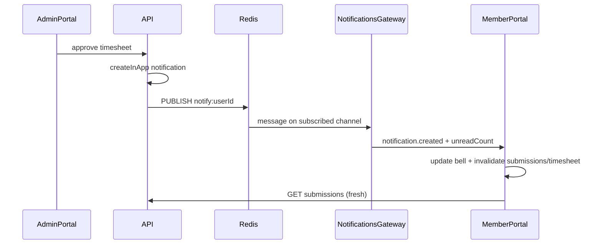

# Live sync: WebSocket notifications + data invalidation

> **Guide:** For a plain-language explainer of WebSocket, Socket.IO, and how the gateway fits in, see [websocket_notifications_guide.plan.md](./websocket_notifications_guide.plan.md).

## Decision

**Use WebSockets for in-app notification push** (user requirement). The codebase already uses **SSE + Redis pub/sub** for presence ([`presence.service.ts`](apps/api/src/modules/presence/application/presence.service.ts)) — same pub/sub backbone, different transport:

| Transport | Best for | Already in repo |
|-----------|----------|-----------------|
| **WebSocket** | Bidirectional; notification push + future commands | No (add `@nestjs/websockets`) |
| SSE | One-way server push; simpler proxies | Yes (presence) |

WebSocket is the right call if you want one real-time pipe later (notifications now, optional sync events later). SSE would be faster to ship but diverges from the chosen direction.

---

## Root cause (unchanged)

Notifications and page data are **decoupled**:

- Bell: polls unread count every **60s** ([`notifications-store.ts`](packages/web-shared/src/stores/notifications-store.ts))
- Submissions/Timesheet: **fetch once** on mount; [`invalidate()`](apps/client/src/stores/member-data.store.ts) is never called
- Dropdown: unread bump animates badge only; no `metadata.href` navigation

Admin action → API persists + creates notification → **member UI does not hear about it until poll or reload**.

---

## Target architecture

**Fallback:** if WebSocket disconnected, keep existing **60s unread poll** + **focus refetch** on Submissions/Timesheet.

---

## Phase 1 — WebSocket notification push (API)

### Contracts first

Add to [`packages/contracts`](packages/contracts/src):

- `ROUTES.NOTIFICATIONS.STREAM` or `WS /notifications` path constant
- Event payload schemas (Zod):
  - `notification.created` — `{ notification: NotificationDto, unreadCount: number }`
  - `notification.read` (optional later) — sync read state across tabs
  - `data.invalidate` (optional, same connection) — `{ scope: "submissions" | "timesheet" | "projects" | "pending_approvals", projectId?, periodId? }`

Start with **`notification.created` only**; derive invalidation scope from `notification.type` on the client.

### API module

New files under `apps/api/src/modules/notifications/`:

- **`notifications.gateway.ts`** — NestJS WebSocket gateway
  - Auth: validate session cookie / access token on handshake (reuse existing auth guard pattern)
  - Room key: `user:{userId}` (notifications are per-user, not per-workspace)
  - On connect: optional snapshot `{ unreadCount }` via existing service
- **`notifications-realtime.service.ts`** — Redis pub/sub pool (mirror [`PresenceService.subscribeWorkspace`](apps/api/src/modules/presence/application/presence.service.ts))
  - Channel: `notifications:user:{userId}`
  - Publish after successful `createInApp`

Hook publish in [`NotificationsDispatchService.deliver`](apps/api/src/modules/notifications/application/notifications-dispatch.service.ts) (after in-app row created) or [`NotificationsService.createInApp`](apps/api/src/modules/notifications/application/notifications.service.ts).

### Multi-instance / Railway

Same as presence: **Redis pub/sub** so any API replica that created the notification publishes, and the replica holding the member's WebSocket forwards the event. Works with `REDIS_USE_MEMORY=true` locally (single process).

### Dependencies

Add to `apps/api`: `@nestjs/websockets`, `@nestjs/platform-socket.io` (or `ws` — Socket.IO gives reconnect built-in).

Configure Nest [`main.ts`](apps/api/src/main.ts) CORS/origins for client + admin WS URLs.

---

## Phase 2 — Client WebSocket + store integration

### web-shared

- **`use-notification-socket.ts`** — connect when workspace session exists; disconnect on logout
  - On `notification.created`: prepend to recent list, set unread count, dispatch **`invalidateWorkspaceData`** by type
  - On disconnect/error: fall back to existing poll in [`notifications-store.ts`](packages/web-shared/src/stores/notifications-store.ts)
  - Exponential backoff reconnect (Socket.IO default or manual)

- **`workspace-data-sync.ts`** — `invalidateWorkspaceData(workspaceId, scope)`:
  - Client: `useMySubmissionsStore.invalidate`, timesheet refresh callbacks, `invalidateListItemsCache`
  - Admin: pending-timesheets refetch registry

### Shell wiring

- [`apps/client/src/components/workspace-shell.tsx`](apps/client/src/components/workspace-shell.tsx)
- [`apps/admin/src/components/admin-shell.tsx`](apps/admin/src/components/admin-shell.tsx) (or equivalent)

One socket per logged-in user covers both apps if they share auth (separate tabs = separate connections, OK).

### Notification dropdown

[`notification-dropdown.tsx`](packages/web-shared/src/components/notification-dropdown.tsx):

- Row click → navigate to `metadata.href` + mark read
- Remove dependency on unread poll for **instant** badge when socket connected

---

## Phase 3 — Page refetch subscribers

| Page | On invalidate scope | Backup |
|------|---------------------|--------|
| [`submissions-page.tsx`](apps/client/src/features/submissions/submissions-page.tsx) | `submissions` | `useRefetchOnWindowFocus` |
| [`timesheet-page.tsx`](apps/client/src/features/timesheet/timesheet-page.tsx) | `timesheet` / `submissions` | same |
| Admin approvals | `pending_approvals` | existing 60s poll |

Type → scope mapping (client-side from pushed `notification.type`):

| Types | Scope |
|-------|-------|
| `TIMESHEET_APPROVED`, `TIMESHEET_REJECTED`, reminders, amendments, missing digest | submissions + timesheet |
| `TIMESHEET_SUBMITTED`, `TIMESHEET_AMENDMENT_REQUESTED` | pending_approvals (admin) |
| `PROJECT_*`, `TASK_*` | projects |

---

## Phase 4 (optional) — Approval settings notification

[`projects.service.update`](apps/api/src/modules/projects/application/projects.service.ts) waives periods but sends **no notification** today. Add template `project.approvalSettingsChanged` → team members → pushes over same WebSocket → invalidates submissions.

---

## What to deprecate / keep

| Mechanism | After WebSocket |
|-----------|-----------------|
| 60s unread poll | **Keep as fallback** when socket disconnected |
| Focus refetch | **Keep** — covers tab return + WS gap |
| SSE for presence | **Unchanged** — separate concern |
| Phase 3 SSE for all domain events | **Not needed** if WS carries invalidate scopes later |

---

## Tests

| Layer | Test |
|-------|------|
| Contracts | Event payload schema validation |
| API | `createInApp` publishes Redis message; gateway forwards to connected client (mock Redis) |
| web-shared | Socket message → store update + invalidate dispatch |
| Client | Submissions refetch when invalidate event fires |

---

## Expected UX after Phase 1–3

1. Member on Submissions, tab focused → admin approves → **bell + table update within ~1s** (WebSocket)
2. WebSocket drops (sleep/network) → badge catches up within 60s via poll; focus refetch refreshes data
3. Click notification → deep link + fresh data
4. Admin on Approvals → member submit pushes instantly to pending list

---

## Out of scope (for now)

- Mobile push (FCM/APNs)
- Full CRDT / live collaborative editing
- Replacing presence SSE with WebSocket (can unify later)
