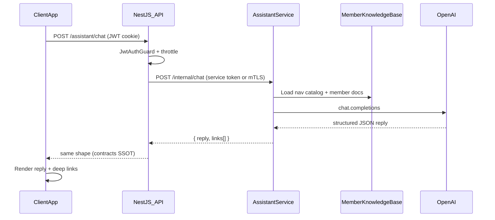
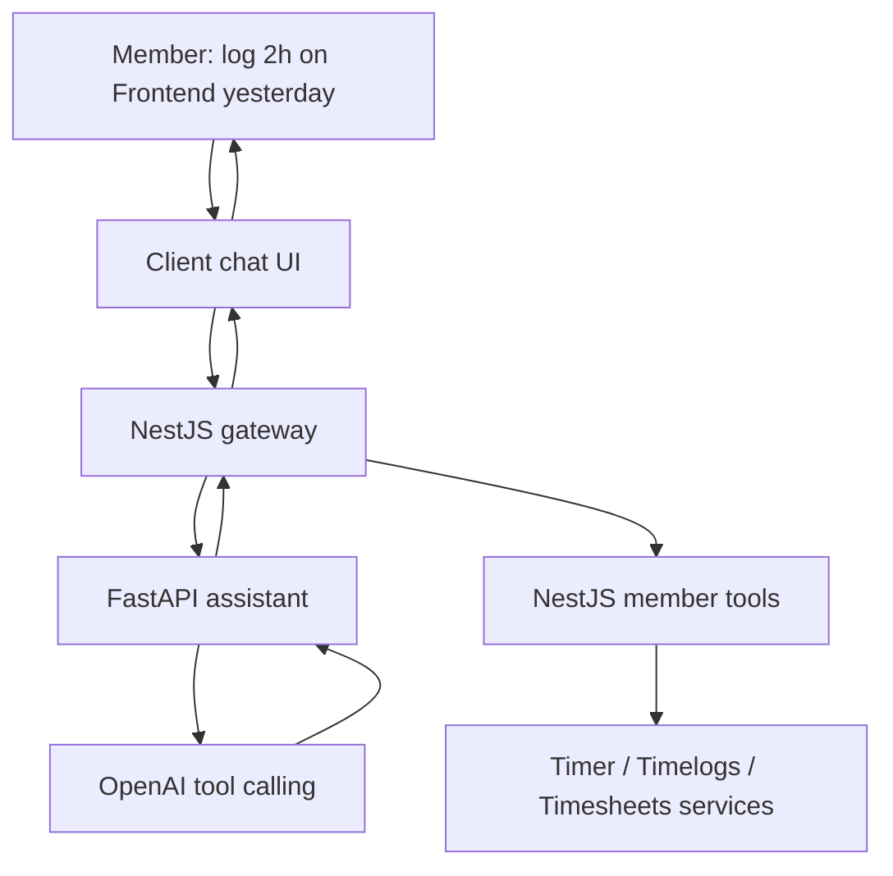
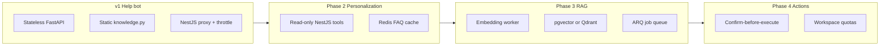
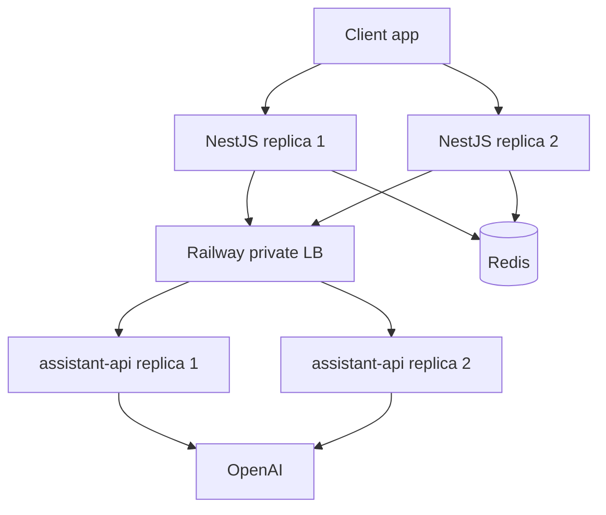
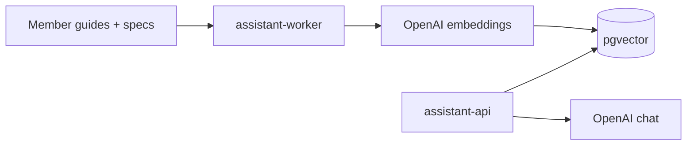

# Member AI Help Bot (OpenAI, help & navigation)

## What you chose

- **OpenAI** for the conversational layer (not OpenAPI tool-calling)
- **v1 scope:** explain features + deep-link to pages — no timer/timesheet actions via the bot
- **Architecture:** dedicated **Python microservice** using **FastAPI** (locked decision — see below), with NestJS as the public gateway

OpenAPI on the NestJS side ([`apps/api/src/main.ts`](apps/api/src/main.ts) → `/api/docs`) stays useful for Phase 2 read-only tool calls against member endpoints. The Python service gets its own auto-generated OpenAPI at `/docs` (built into FastAPI).

### Framework decision: FastAPI (not Flask, not Django)

**Recommendation: FastAPI** for `apps/assistant-api`. This is the professional default for a stateless AI API microservice in 2026.

| Criterion                       | FastAPI                                 | Flask                                       | Django                                               |
| ------------------------------- | --------------------------------------- | ------------------------------------------- | ---------------------------------------------------- |
| **Fit for this service**        | Purpose-built for small HTTP APIs       | Fine for scripts; dated for new AI services | Full web platform — overkill for v1                  |
| **Async / OpenAI I/O**          | Native `async` + `httpx`                | Awkward (sync workers or partial async)     | Async support exists but heavier                     |
| **Request validation**          | Pydantic v2 (aligns with Zod contracts) | Bolt-on (manual or marshmallow)             | DRF serializers — more ceremony                      |
| **OpenAPI docs**                | Free at `/docs`                         | Requires extensions                         | DRF schema or drf-spectacular                        |
| **Boilerplate**                 | Minimal                                 | Minimal but you assemble everything         | High (settings, apps, middleware stack)              |
| **Auth / users / admin**        | Not included (good — NestJS owns this)  | Not included                                | Built-in — **duplicates** NestJS                     |
| **Background jobs (RAG later)** | Add Celery/ARQ when needed              | Same                                        | Celery integrates well — but NestJS already has cron |
| **Team hiring signal**          | Standard for AI/ML API services         | Legacy microservices                        | Best when Python _is_ the main backend               |
| **Deploy footprint**            | Small container, fast cold start        | Small                                       | Larger (more deps, migrations, settings)             |

**Why not Flask?** Flask is a valid choice if you already run Flask in production and the team knows it cold. For a _new_ service whose job is mostly “validate JSON → call OpenAI → return JSON”, Flask means assembling validation, async, and docs yourself. That’s extra work with no upside over FastAPI.

**Why not Django?** Django shines when Python is the **primary** backend: ORM, admin UI, user model, migrations, multi-app monolith. Kloqra already has NestJS + Prisma + JWT for all of that. Putting Django here would mean two backends owning domain concepts, or Django becoming a second monolith for AI-only data. Consider Django **only if** the assistant service later grows into a large standalone product (conversation DB, embedding pipeline admin, model registry, Celery fleet) and you consciously want Python to own that entire vertical — not for v1 help chat.

**When to revisit Django:** Phase 3+ if you persist chat history, vector indexes, and batch embedding jobs entirely in Python **and** need a built-in admin UI to operate them. Even for **full time entry**, Django is still not required — writes stay in NestJS. Revisit Django only if Python becomes a standalone AI platform with its own ORM-heavy domain.

**Full time entry future:** FastAPI remains the best choice — see [Future: full time entry via bot](#future-full-time-entry-via-bot) below.

### Why Python microservice (your direction)

| Benefit            | Detail                                                                                                                 |
| ------------------ | ---------------------------------------------------------------------------------------------------------------------- |
| Future AI features | RAG, embeddings, smart categorization ([`FUTURE_SCOPE.md`](docs/architecture/FUTURE_SCOPE.md)) fit naturally in Python |
| Key isolation      | `OPENAI_API_KEY` lives only on the assistant service — not on the main API                                             |
| Independent scale  | Rate-limit-heavy chat can scale separately from timer/timesheet API                                                    |
| Clean boundary     | Main NestJS API stays focused on domain logic; Python stays a **specialist worker**, not a second monolith             |

---

## Product goal

Members already have structured onboarding ([`onboarding-overlay.tsx`](apps/client/src/features/onboarding/onboarding-overlay.tsx), Sparkles menu in [`shell-header-actions.tsx`](packages/web-shared/src/components/shell-header-actions.tsx)). The bot fills the gap for **ad-hoc questions** after onboarding:

- “How do I submit my timesheet?”
- “Where do I export my hours?”
- “What’s the difference between Timer and Time Tracker?”

Responses should be short, accurate, and include **clickable in-app links**.

---

## Architecture



**Key principles:**

- Browser never sees `OPENAI_API_KEY` — key only on Python service
- Client still calls **one origin** (NestJS) — cookies and CORS unchanged
- Python service is **not public** in production — Railway private networking or internal URL + shared secret
- `packages/contracts` remains SSOT for request/response shapes; Python mirrors with Pydantic models

---

## v1 capabilities (in scope)

| User intent                 | Bot behavior                                                  |
| --------------------------- | ------------------------------------------------------------- |
| How to use a feature        | Answer from curated member docs                               |
| Where is X in the app?      | Return deep link(s) from nav catalog                          |
| Member vs admin permissions | Explain boundaries (no billing, no other members’ hours)      |
| Onboarding confusion        | Suggest Sparkles → “Full setup guide” or “Quick product tour” |
| Off-topic / unsafe          | Polite refusal; stay within Kloqra member help                |

**Nav catalog (source of truth for links)** — align with actual client routes from [`workspace-shell.tsx`](apps/client/src/components/workspace-shell.tsx):

| Label              | Path                    | When to suggest                       |
| ------------------ | ----------------------- | ------------------------------------- |
| Timer              | `/timer`                | Start/stop live tracking              |
| Time Tracker       | `/time-tracker`         | Weekly list of entries                |
| Timesheet          | `/timesheet`            | Calendar edit, manual entries, export |
| Dashboard          | `/dashboard`            | Personal summary widgets              |
| Submissions        | `/submissions`          | Submit timesheet for approval         |
| My Projects        | `/projects`             | Assigned projects + overview          |
| Tasks              | `/tasks`                | Browse assigned tasks                 |
| Notifications      | `/notifications`        | In-app alerts                         |
| Profile / Settings | `/profile`, `/settings` | Account, password, 2FA                |

Note: member docs still mention `/approvals` ([`getting-started.md`](docs/user-guides/member/getting-started.md)) while nav uses `/submissions` — fix docs as part of this work so the bot’s knowledge matches the app.

---

## v1 non-goals (explicit)

- Start/stop timer, create entries, submit timesheets via bot
- Reading live user data (hours, tasks, submission status) from API
- Admin app assistant
- OpenAPI-driven function calling
- Conversation persistence / chat history in DB

These are natural **Phase 2+** extensions (see below).

---

## Implementation plan (contract-first)

### 1. Contracts — [`packages/contracts`](packages/contracts)

Add minimal DTOs + route:

```typescript
// packages/contracts/src/dto/assistant.dto.ts
assistantChatMessageSchema; // { role: 'user' | 'assistant', content: string }
assistantChatRequestSchema; // { messages: message[] }  max ~10 turns, content length caps
assistantLinkSchema; // { label: string, href: string }
assistantChatResponseSchema; // { reply: string, links?: link[] }
```

```typescript
// packages/contracts/src/routes.ts
ASSISTANT: {
  CHAT: "/assistant/chat";
}
```

Update [`contracts.spec.ts`](packages/contracts/src/contracts.spec.ts) snapshots.

### 2a. Python assistant service — [`apps/assistant-api/`](apps/assistant-api/) (new)

New app in monorepo (Python, **not** in pnpm workspace):

```
apps/assistant-api/
  pyproject.toml
  Dockerfile                  # uvicorn, $WEB_CONCURRENCY workers
  src/
    main.py                   # FastAPI app, /health, /internal/chat
    schemas.py                # Pydantic models mirroring assistant.dto.ts
    knowledge.py              # member-help-knowledge + KNOWLEDGE_VERSION constant
    openai_client.py          # async OpenAI wrapper; log token usage
    prompt.py                 # system prompt builder (cache-friendly static prefix)
    config.py                 # env, timeouts, feature flags
  tests/
    test_chat.py
    test_knowledge.py
```

**Endpoint (internal only):**

- `GET /health` — Railway healthcheck
- `POST /internal/chat` — body matches `assistantChatRequestSchema`; returns `assistantChatResponseSchema`

**Auth between NestJS ↔ Python (pick one for v1):**

| Option                                    | v1 recommendation                                           |
| ----------------------------------------- | ----------------------------------------------------------- |
| Shared secret header `X-Assistant-Secret` | **Yes** — simple, works on Railway private URL              |
| JWT forwarded from NestJS                 | Optional Phase 2 if Python needs userId for personalization |
| mTLS                                      | Overkill for v1                                             |

NestJS passes minimal context in v1: `{ messages, userDisplayName? }` — no workspace time data.

**System prompt essentials** (live in Python `prompt.py`):

- Role: “Kloqra member app help assistant”
- Only use provided knowledge; say “I’m not sure” rather than invent features
- Output JSON matching response schema (`response_format: json_object`)
- Never ask for passwords; never claim to perform actions
- Prefer 1–3 links when relevant

**Env vars (Python service only):**

```
OPENAI_API_KEY=
OPENAI_MODEL=gpt-4o-mini
ASSISTANT_INTERNAL_SECRET=   # shared with NestJS
ASSISTANT_ENABLED=true
```

**Local dev:** `uvicorn src.main:app --reload --port 3003` alongside `pnpm dev`.

### 2b. NestJS proxy module — [`apps/api/src/modules/assistant/`](apps/api/src/modules/assistant/)

Thin gateway slice — **no OpenAI code in NestJS**:

| File                                     | Responsibility                                                        |
| ---------------------------------------- | --------------------------------------------------------------------- |
| `assistant.module.ts`                    | HttpModule / fetch client to Python service                           |
| `application/assistant-proxy.service.ts` | Forward validated body; map errors; graceful fallback if Python down  |
| `interface/http/assistant.controller.ts` | `POST ROUTES.ASSISTANT.CHAT`, `@UseGuards(JwtAuthGuard)`, `@Throttle` |

**NestJS env vars:**

```
ASSISTANT_SERVICE_URL=http://localhost:3003   # Railway private URL in prod
ASSISTANT_INTERNAL_SECRET=                    # must match Python service
ASSISTANT_ENABLED=true
```

Add to [`load-env.ts`](apps/api/src/load-env.ts) + [`apps/api/.env.example`](apps/api/.env.example).

**Rate limiting:** Redis-backed per-user throttle on NestJS (not in-memory only) — reuse existing Redis; default 20 req/min/user. See **Scaling roadmap**.

**Proxy resilience (scale-ready v1):**

- Timeout: 30s to Python service
- Circuit breaker: after N consecutive 5xx/timeout, return static fallback + nav links for 60s
- Pass `x-request-id` through to Python logs

**Security:** JwtAuthGuard on public route; Python reachable only via internal network + secret header.

### 3. Client UI — [`apps/client`](apps/client)

| Piece                   | Location                                                                                                                                                                                             |
| ----------------------- | ---------------------------------------------------------------------------------------------------------------------------------------------------------------------------------------------------- |
| Chat panel (slide-over) | `apps/client/src/features/assistant/assistant-panel.tsx`                                                                                                                                             |
| Hook                    | `use-assistant-chat.ts` — calls `api(ROUTES.ASSISTANT.CHAT)`                                                                                                                                         |
| Provider                | `assistant-provider.tsx` — open/close state, message list                                                                                                                                            |
| Entry point             | Extend Sparkles popover in [`shell-header-actions.tsx`](packages/web-shared/src/components/shell-header-actions.tsx) with **“Ask Kloqra”** (MessageCircle icon) — client-only prop `onOpenAssistant` |
| Wire in shell           | [`workspace-shell.tsx`](apps/client/src/components/workspace-shell.tsx)                                                                                                                              |

**UX details:**

- Floating panel bottom-right (does not block timer)
- Suggested starter chips: “How do I start a timer?”, “Submit my timesheet”, “Export my hours”
- Assistant messages render `reply` as markdown (simple: bold + lists only)
- `links[]` render as `Button variant="outline"` using Next.js `Link`
- Loading state + error toast if API/OpenAI unavailable
- `aria-label="Open help assistant"` for a11y

**Do not add** a new top-level nav item in v1 — keep it in the header help cluster beside existing onboarding.

### 4. Knowledge base maintenance

Create a single SSOT file the **Python service** loads at startup:

[`apps/assistant-api/src/knowledge.py`](apps/assistant-api/src/knowledge.py)

Content derived from (keep in sync):

- [`docs/user-guides/member/getting-started.md`](docs/user-guides/member/getting-started.md)
- [`docs/user-guides/member/timer-and-timesheet.md`](docs/user-guides/member/timer-and-timesheet.md)
- [`docs/user-guides/member/export-my-data.md`](docs/user-guides/member/export-my-data.md)
- [`docs/user-guides/member/profile-and-settings.md`](docs/user-guides/member/profile-and-settings.md)
- [`onboarding-steps.ts`](apps/client/src/features/onboarding/onboarding-steps.ts) card copy

Add `docs/specs/assistant.md` (BA spec) describing scope, safety rules, and knowledge update process.

### 5. Deployment — Railway (second service)

Today only the NestJS API deploys via [`railway.toml`](railway.toml) + [`apps/api/Dockerfile`](apps/api/Dockerfile). Add a **parallel Railway service** in the same project:

| Item           | NestJS API (existing)                                | Assistant service (new)                       |
| -------------- | ---------------------------------------------------- | --------------------------------------------- |
| Root           | `apps/api/Dockerfile`                                | `apps/assistant-api/Dockerfile`               |
| Port           | 3001                                                 | 3003 (or `$PORT`)                             |
| Health         | `/health`                                            | `/health`                                     |
| Public URL     | Yes (client-facing)                                  | **No** — private networking only              |
| Secrets        | `ASSISTANT_SERVICE_URL`, `ASSISTANT_INTERNAL_SECRET` | `OPENAI_API_KEY`, `ASSISTANT_INTERNAL_SECRET` |
| Watch patterns | existing                                             | `apps/assistant-api/**`                       |

**Railway setup steps:**

1. Add service → same repo → Dockerfile path `apps/assistant-api/Dockerfile`
2. Enable **Private Networking**; copy internal hostname into NestJS `ASSISTANT_SERVICE_URL` (e.g. `http://assistant-api.railway.internal:3003`)
3. Do **not** assign a public domain to the Python service
4. Staging + production each get their own assistant service + OpenAI key

**Local / CI:**

- Root `docker-compose.yml` (optional): api + assistant-api for one-command dev
- CI: add `pytest apps/assistant-api` job alongside existing `pnpm test`
- Pre-PR: `pnpm …` gate unchanged for TS; Python lint via `ruff` (optional v1)

**Cost note:** second Railway service ≈ small always-on container; OpenAI usage dominates cost, not the Python VM.

### 6. Tests (required per [`chronomint-test-delivery`](.cursor/skills/chronomint-test-delivery/SKILL.md))

| Layer        | Test                                                                                      |
| ------------ | ----------------------------------------------------------------------------------------- |
| Contracts    | Schema + route snapshot                                                                   |
| Python       | `apps/assistant-api/tests/` — mock OpenAI; link extraction, refusal, missing-key fallback |
| NestJS proxy | `assistant-proxy.service.spec.ts` — mock Python HTTP; timeout/error mapping               |
| API e2e      | `apps/api/test/assistant.e2e.ts` — member JWT → 200 (Python mocked or test container)     |
| Client RTL   | `assistant-panel.spec.tsx` — renders starter chips, displays links                        |
| Client e2e   | `apps/client/e2e/assistant.spec.ts` — open panel, send question, see `/timer` link        |

---

## Phase 2 options (not v1 — for your roadmap)

If you later want richer answers **without** giving the LLM write access:

| Enhancement             | Mechanism                                                                                                        |
| ----------------------- | ---------------------------------------------------------------------------------------------------------------- |
| Personalized stats      | API fetches `GET /reporting/me` server-side, injects a **summary sentence** into prompt (not raw logs)           |
| OpenAPI read-only tools | Filter Swagger doc to member-safe GET routes; server executes tool calls with user JWT                           |
| Workspace toggle        | `Workspace.settings.assistantEnabled` in [`workspace-settings.ts`](packages/contracts/src/workspace-settings.ts) |
| Action bot              | Separate epic — confirm-before-execute pattern for timer/submit                                                  |

OpenAPI becomes valuable in Phase 2 because [`main.ts`](apps/api/src/main.ts) already generates the spec — you would **filter** it to member GET endpoints rather than exposing admin routes to the model.

---

## Future: full time entry via bot

**Short answer: yes, FastAPI is still the best choice** even if the bot eventually handles full time entry — start/stop timer, manual logs, edits, submissions. You do **not** need Django or to move timelog logic into Python.

### Why FastAPI still wins for “full time entering”

The hard domain work **already lives in NestJS** and should stay there:

| Capability              | Existing home                                                                              | Why not move to Python                       |
| ----------------------- | ------------------------------------------------------------------------------------------ | -------------------------------------------- |
| Start/stop timer        | [`timer.service.ts`](apps/api/src/modules/timer/application/timer.service.ts)              | Redis state, assignee guards, billable rules |
| Create/edit/delete logs | [`timelogs.service.ts`](apps/api/src/modules/timelogs/application/timelogs.service.ts)     | RBAC, locked periods, audit trail            |
| Submit timesheet        | [`timesheets.service.ts`](apps/api/src/modules/timelogs/application/timesheets.service.ts) | Approval workflow, cascade rules             |
| Task/project resolution | [`tasks.service.ts`](apps/api/src/modules/tasks/application/tasks.service.ts)              | Assignee scoping for members                 |

Python’s future job is **natural language → structured intent → proposed action**, not reimplementing time entry.



### Recommended action pattern (safe at scale)

**Never let the LLM write directly to the database.** Use a three-step flow:

1. **Understand** (FastAPI + OpenAI): parse “log 2 hours on Acme Frontend yesterday afternoon”
2. **Propose** (contracts): return a typed action card, e.g. `proposedAction: { type: 'CREATE_TIMELOG', taskId, startTime, endTime, description? }`
3. **Confirm + execute** (client + NestJS): member taps **Confirm** → NestJS calls existing services with their JWT

Optional **read tools** (no confirm needed): list assigned tasks, active timer, week summary — NestJS executes GETs and passes summaries to Python.

This pattern scales because:

- All RBAC, assignee filters, and locked-period checks run in **one place** (NestJS)
- FastAPI stays stateless — tool loops are just more HTTP + OpenAI rounds
- OpenAPI defines the **tool catalog** from filtered member routes (timer, timelogs, timesheets GET/POST)

### Where OpenAPI fits (becomes essential for actions)

For help-only v1, OpenAPI is optional. For full time entry, it is **the professional approach**:

- Export member-safe operations from NestJS Swagger (subset of [`routes.ts`](packages/contracts/src/routes.ts)):
  - `GET /tasks`, `GET /timer/active`, `GET /reporting/me`
  - `POST /timer/start`, `POST /timer/stop`, `POST /timelogs`, `PATCH /timelogs/:id`, `POST /timesheets/submit`
- NestJS **tool executor** maps OpenAI tool calls → existing service methods (not raw HTTP from Python)
- Python can either:
  - **Option A (recommended):** return `proposedAction` JSON only; NestJS never gives Python a user JWT
  - **Option B:** multi-turn tool loop orchestrated entirely in NestJS; Python only does NLU

Option A keeps the trust boundary cleanest.

### Example member intents (Phase 4)

| User says                              | Bot proposes                                    | After confirm             |
| -------------------------------------- | ----------------------------------------------- | ------------------------- |
| “Start timer on API docs task”         | `{ type: 'START_TIMER', taskId }`               | `POST /timer/start`       |
| “Stop my timer”                        | `{ type: 'STOP_TIMER' }`                        | `POST /timer/stop`        |
| “Log 1.5h on design review yesterday”  | `{ type: 'CREATE_TIMELOG', ... }`               | `POST /timelogs`          |
| “Move today’s 9–11 entry to Project B” | `{ type: 'UPDATE_TIMELOG', id, ... }`           | `PATCH /timelogs/:id`     |
| “Submit this week for Acme project”    | `{ type: 'SUBMIT_TIMESHEET', projectId, date }` | `POST /timesheets/submit` |

Ambiguity (“which Frontend task?”) → bot returns `clarification` with task picker options from `GET /tasks`, not a blind write.

### Contracts additions (when you build actions)

Extend assistant response schema (Phase 4):

```typescript
proposedActionSchema; // discriminated union: START_TIMER | STOP_TIMER | CREATE_TIMELOG | ...
clarificationSchema; // { question, options: { label, taskId? }[] }
assistantChatResponseSchema; // reply + links? + proposedAction? + clarification?
```

Client renders action cards with **Confirm / Cancel** — same UX pattern as submission previews.

### FastAPI vs Django for this specific future

| Need                      | FastAPI                                    | Django                                    |
| ------------------------- | ------------------------------------------ | ----------------------------------------- |
| NLU + tool planning       | Excellent (async, Pydantic action schemas) | DRF adds weight, no benefit               |
| Execute time entry        | **Not in Python** — NestJS                 | Would duplicate or call NestJS anyway     |
| Conversation memory       | SQLAlchemy + Postgres when needed          | Django ORM — second domain model          |
| Background categorization | ARQ worker                                 | Celery — fine but NestJS already has cron |

**Conclusion:** Full time entry makes OpenAPI + NestJS tool execution **more** important; it does **not** push you toward Django. FastAPI remains the AI/orchestration layer; NestJS remains the system of record.

### Phased rollout for time entry (don’t skip steps)

| Phase | Bot capability                                                                |
| ----- | ----------------------------------------------------------------------------- |
| v1    | Help + deep links only                                                        |
| 2     | Read tools: “how many hours this week?”, “what’s my active timer?”            |
| 3     | Propose + confirm: manual log, start/stop timer                               |
| 4     | Edit/delete, submit timesheet, amendment requests                             |
| 5     | Proactive nudges (“you haven’t logged Tuesday”) — async worker, not chat path |

Each phase adds contracts + NestJS executor methods + client confirm UI — **no Python framework change**.

---

## Scaling roadmap

Design v1 so you can grow without re-architecting. The assistant path is **I/O-bound** (OpenAI latency + token cost), not CPU-bound — scale by **replicas, caching, queues, and quotas**, not bigger VMs.

### Scale stages (what changes when)



| Stage        | Traffic profile                   | Architecture change                                | Infra                                                               |
| ------------ | --------------------------------- | -------------------------------------------------- | ------------------------------------------------------------------- |
| **v1**       | &lt;100 concurrent chats          | Single FastAPI replica OK                          | 1 Railway service, NestJS in-memory/Redis throttle                  |
| **Growth**   | 100s–1000s members/day            | Horizontal FastAPI replicas; Redis FAQ cache       | 2–4 assistant replicas; reuse existing Railway **Redis**            |
| **RAG**      | Large doc corpus, smarter answers | Async embedding worker; vector search              | ARQ + Redis queue; pgvector in Postgres **or** Qdrant sidecar       |
| **Platform** | Multi-workspace SaaS at scale     | Per-workspace quotas; observability; model routing | OpenAI org limits + fallback model; Sentry/metrics on both services |

### v1 — build scale-ready from day one (low cost)

These are cheap now and avoid painful refactors later:

| Decision                         | Why it scales                                                                                                                                                              |
| -------------------------------- | -------------------------------------------------------------------------------------------------------------------------------------------------------------------------- |
| **Stateless FastAPI**            | No in-memory sessions; Railway can run N replicas behind internal load balancer                                                                                            |
| **Short request timeout**        | NestJS proxy: 30s max to Python; fail fast with friendly fallback                                                                                                          |
| **Circuit breaker**              | If Python/OpenAI errors &gt; threshold, NestJS skips LLM and returns static help links for 60s                                                                             |
| **Knowledge version**            | `KNOWLEDGE_VERSION=2026-06-14` in Python; include in cache keys later                                                                                                      |
| **Redis throttle (NestJS)**      | Use existing [`RedisService`](apps/api/src/common/redis/redis.service.ts) for per-user limits — works across **multiple NestJS replicas** (in-memory `@Throttle` does not) |
| **Structured logs + request ID** | Propagate `x-request-id` NestJS → Python → OpenAI metadata for tracing at volume                                                                                           |
| **Uvicorn workers**              | Dockerfile: `uvicorn --workers 2` (or `$WEB_CONCURRENCY`) — more concurrent OpenAI waits per container                                                                     |
| **No DB in v1**                  | Zero migration/connection-pool overhead until you need history or vectors                                                                                                  |

**Per-user limits (v1 defaults, tune later):**

- 20 requests / minute / user (NestJS, Redis-backed)
- Max 10 messages per request body (client sends last N turns only)
- Max 2k chars per user message

**Workspace-level limits (Phase 2):** `Workspace.settings.assistantDailyQuota` — NestJS checks Redis counter before proxying.

### Horizontal scaling — FastAPI on Railway



- **NestJS → Python:** Railway private DNS load-balances across assistant replicas automatically when you scale the assistant service.
- **FastAPI:** remain stateless; any replica can serve any chat.
- **Do not** use sticky sessions — not needed for v1 (client sends message history).

### Cost scaling — OpenAI is the real bottleneck

Container cost is small; **tokens** dominate. Mitigations in priority order:

| Technique                     | When     | Savings                                                                                            |
| ----------------------------- | -------- | -------------------------------------------------------------------------------------------------- |
| **`gpt-4o-mini` default**     | v1       | ~10–20× vs GPT-4 class models                                                                      |
| **Redis FAQ cache**           | Phase 2  | Cache `{hash(messages + knowledgeVersion)} → response` TTL 24h for identical help questions        |
| **OpenAI prompt caching**     | Phase 2  | Static system prompt + knowledge block marked cacheable — reduces input token cost on repeat calls |
| **Pre-classifier (optional)** | Phase 3  | Cheap regex/embedding match for top 20 FAQs → skip LLM entirely                                    |
| **Streaming (UX only)**       | Phase 2  | Does not reduce cost; improves perceived latency                                                   |
| **Workspace quotas**          | Phase 2+ | Hard cap daily chats per workspace on free/starter tiers                                           |

Track per-request: `prompt_tokens`, `completion_tokens`, `latency_ms`, `cache_hit` — log in Python, aggregate in Sentry/Datadog later.

### Phase 2 — personalization + cache (still no Python DB)

| Feature                 | Scale pattern                                                                                                   |
| ----------------------- | --------------------------------------------------------------------------------------------------------------- |
| “Hours this week?”      | NestJS fetches `GET /reporting/me`, passes **one summary sentence** to Python — not raw logs                    |
| OpenAPI read-only tools | Tool execution stays in **NestJS** (JWT + RBAC); Python only plans which tool — or NestJS orchestrates entirely |
| FAQ cache               | Redis on NestJS before calling Python                                                                           |
| Admin assistant toggle  | `Workspace.settings.assistantEnabled`                                                                           |

NestJS remains the **trust boundary** for member data — Python never gets a user JWT in v2 unless you explicitly add scoped service tokens.

### Phase 3 — RAG and async workers (first Python DB)

When static `knowledge.py` is too large or stale:

| Component          | Recommendation                                                                                                                                                                    |
| ------------------ | --------------------------------------------------------------------------------------------------------------------------------------------------------------------------------- |
| **Vector store**   | Start with **pgvector** in existing Railway Postgres (new schema `assistant`, no Prisma coupling) — one less service. Move to **Qdrant** if &gt;1M chunks or heavy hybrid search. |
| **Embeddings**     | OpenAI `text-embedding-3-small`; batch on doc change                                                                                                                              |
| **Job queue**      | **ARQ** (async Redis queue) — fits FastAPI; reuse Railway Redis. Avoid Celery unless team already runs it.                                                                        |
| **Indexer worker** | Separate Railway service `assistant-worker` (same Docker image, different start command) — scales independently from chat API                                                     |
| **Chat API**       | Retrieve top-k chunks → inject into prompt; still stateless                                                                                                                       |



Reindex on deploy when `KNOWLEDGE_VERSION` bumps — worker job, not blocking chat.

### Phase 4 — action bot + smart categorization (platform scale)

From [`FUTURE_SCOPE.md`](docs/architecture/FUTURE_SCOPE.md):

| Feature                    | Scale pattern                                                                           |
| -------------------------- | --------------------------------------------------------------------------------------- |
| **Timer / submit actions** | NestJS executes writes after explicit user confirm in UI — never auto-execute from LLM  |
| **Smart categorization**   | Async worker on `TimeLog` create events — Python classifies in background; no chat path |
| **Conversation history**   | Postgres `assistant.conversations` — partition by `workspace_id`; TTL 90 days           |
| **Feedback loop**          | Thumbs up/down → store for eval sets; periodic prompt tuning                            |

At this stage, evaluate **Django** only if the Python vertical owns multiple persisted domains (conversations + vectors + job admin). FastAPI + ARQ + SQLAlchemy still scales fine for most teams.

### Observability checklist (add before high traffic)

- Health: `/health` on both services (already planned)
- Metrics: request count, p95 latency, OpenAI error rate, tokens/request
- Alerts: Python unreachable, OpenAI 429 rate, daily token spend threshold
- Sentry: already on NestJS — add Python SDK to `assistant-api`

### What not to do early

- Don’t put Python on a public URL — ever
- Don’t share Prisma models with Python — separate schema or raw SQL if needed
- Don’t stream chat through NestJS proxy in v1 — adds complexity; add in Phase 2 if UX requires it
- Don’t scale by synchronous embedding in the chat request path — always queue
- Don’t skip Redis-backed rate limits if you run &gt;1 NestJS replica

---

## Delivery order

1. **Spec + contracts** (`assistant.md`, DTOs, route)
2. **Python service** (`apps/assistant-api`, Dockerfile, knowledge base, pytest)
3. **NestJS proxy** (thin module + e2e with mocked Python)
4. **Client panel** + header entry point
5. **Railway second service** + env docs in [`docs/runbooks/railway.md`](docs/runbooks/railway.md)
6. **Doc fix** (`/approvals` → `/submissions` in member guides)
7. **Pre-PR gate:** `pnpm format:check && pnpm lint && pnpm typecheck && pnpm test && pnpm build` + `pytest apps/assistant-api`

---

## Risks and mitigations

| Risk                         | Mitigation                                                                     |
| ---------------------------- | ------------------------------------------------------------------------------ |
| Hallucinated features        | JSON schema + “only use knowledge base” prompt; unit tests on known Q&A        |
| Cost abuse                   | Per-user Redis throttle + message caps; workspace quotas in Phase 2            |
| OpenAI 429 / outage          | Circuit breaker + static fallback links; optional model fallback env           |
| Key missing in staging       | Graceful “Assistant unavailable” + link to member docs                         |
| Stale knowledge              | `KNOWLEDGE_VERSION` + spec update process; Phase 3 RAG reindex job             |
| Two-service ops              | Health checks on both; NestJS returns friendly fallback if Python unreachable  |
| Contract drift TS ↔ Python   | Pydantic models documented in spec; optional JSON Schema export from Zod later |
| Multi-replica throttle drift | Redis-backed limits on NestJS from v1 — not in-memory `@Throttle` alone        |
| Token cost at scale          | gpt-4o-mini + Phase 2 FAQ cache + prompt caching + workspace quotas            |
| RAG latency                  | Async indexer; retrieve in chat path only (top-k), never sync full reindex     |
