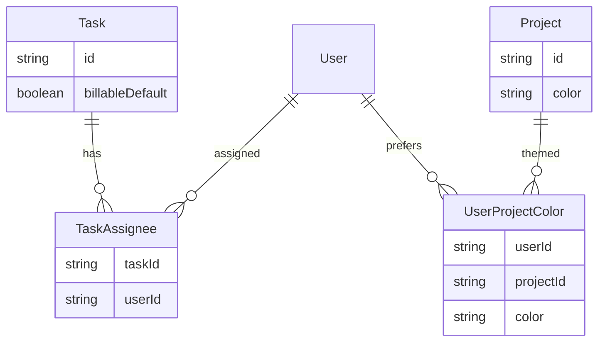

# Member & Project UX Rollup

## Scope summary

| #   | Feature                | Current state                                                        | Target                                                                              |
| --- | ---------------------- | -------------------------------------------------------------------- | ----------------------------------------------------------------------------------- |
| 1   | Avatar                 | `getUserInitials(name)` from `session.user.name`                     | 2 letters from **first + last name**                                                |
| 2   | Project stats          | Admin detail = tasks/team/settings only; client = list only          | **Overview** tab (admin) + member **project detail** with scoped stats              |
| 3   | Billable               | `billableDefault` admin-only; members toggle `isBillable` on entries | **Admin-only everywhere**; members inherit task default                             |
| 4–5 | Assignees              | Project `TeamMember` only; no per-task assignees                     | **TaskAssignee** model; checkbox picker from project team; admin can update anytime |
| 6   | Onboarding replay      | Auto on `/timer`; `localStorage` only                                | **Help/Sparkles icon** in header reopens flow                                       |
| 7   | Personal project color | Single `Project.color` (admin)                                       | Per-user override; admin canonical color unchanged                                  |

**Your decisions (locked in):**

- Billable: members lose per-entry toggle; admin controls via task `billableDefault` only.
- Legacy tasks with no assignees: **hidden from members** until admin assigns.

---

## Architecture (new data)

---

## Phase 1 — Contracts & schema (`packages/contracts`, Prisma)

### 1.1 Avatars (session shape)

- Extend [`authUserSchema`](packages/contracts/src/dto/auth.dto.ts) with optional `firstName` / `lastName` (populated from `User` on login/bootstrap).
- Add [`getDisplayInitials(firstName, lastName, fallbackName)`](packages/ui/src/components/shell/shell-utils.ts) — exactly 2 chars: first char of first name + first char of last name; fallback to existing word logic when last name missing.

### 1.2 Task assignees

- Prisma: new `TaskAssignee` (`taskId`, `userId`, `@@unique([taskId, userId])`).
- [`task.dto.ts`](packages/contracts/src/dto/task.dto.ts):
  - `assignees: { userId, userName }[]` on `TaskDto`
  - `createTaskSchema.assigneeUserIds: uuid[]` **min 1**
  - `updateTaskSchema.assigneeUserIds` optional (admin replace list)
- Update [`contracts.spec.ts`](packages/contracts/src/contracts.spec.ts) snapshots.

### 1.3 Billable enforcement (API contract)

- Document in timelog/timer DTOs: `isBillable` **ignored for MEMBER** on create/update/stop (server derives from `task.billableDefault`).
- Optional: strip from member-facing response metadata (no schema break required).

### 1.4 Project stats

- New `projectSummaryQuerySchema` (`from`, `to`) + `projectSummarySchema` (period totals, `byTask`, `byCategory`, billable split).
- New route: `ROUTES.REPORTING.PROJECT_SUMMARY(id)` → `GET /reporting/projects/:projectId/summary`
  - **ADMIN**: all members’ time on project in range.
  - **MEMBER**: own time only; requires team access to project.

### 1.5 Personal project color

- Prisma: `UserProjectColor` (`userId`, `projectId`, `color`, unique pair).
- Extend `ProjectDto` with optional `myColor: string | null` (member’s override for current user; omitted for admin list or always null).
- New routes:
  - `PUT /users/me/projects/:projectId/color` — member sets personal color (any valid hex/palette via `projectColorSchema`)
  - `DELETE` to clear override

---

## Phase 2 — API (`apps/api`)

### 2.1 Tasks module

- [`tasks.service.ts`](apps/api/src/modules/tasks/application/tasks.service.ts): create/update assignees in transaction; include assignees in `toDto`.
- **Member list filter**: tasks where `TaskAssignee` exists for `userId`; tasks with **zero assignees excluded** for members; admins see all.
- **Timelog guard**: `assertCanLogTask(userId, taskId)` — team member **and** (admin OR has `TaskAssignee` row). Apply in [`timelogs.service.ts`](apps/api/src/modules/timelogs/application/timelogs.service.ts) and [`timer.service.ts`](apps/api/src/modules/timer/application/timer.service.ts).

### 2.2 Billable

- On member timelog create/update/timer-stop: set `isBillable = task.billableDefault`; reject body `isBillable` if present (400 or silently ignore — prefer ignore + log).
- Service specs for member vs admin paths.

### 2.3 Reporting

- `ReportingService.projectSummary(workspaceId, projectId, userId, role, query)` — reuse `TimeAggregationService.fetchLogs` with `projectId` (+ `userId` for members).
- Controller: `@Roles` both; project access via `ProjectAccessService`.

### 2.4 User project colors

- New small slice under `users` or `projects`: get/set/delete `UserProjectColor`.
- `ProjectsService.toDto`: join current user’s override → `myColor`; `color` stays admin canonical.

### 2.5 Auth bootstrap

- Include `firstName`/`lastName` in session payload from [`users.service`](apps/api/src/modules/users/application/users.service.ts) / auth module.

**Migration**: one Prisma migration for `TaskAssignee` + `UserProjectColor`.

---

## Phase 3 — Shared UI (`packages/ui`, `packages/web-shared`)

### 3.1 Avatars

- Update [`UserAvatar`](packages/ui/src/components/shell/user-avatar.tsx) to accept optional `firstName`/`lastName`; use `getDisplayInitials`.
- [`ShellHeaderActions`](packages/web-shared/src/components/shell-header-actions.tsx) + [`SidebarUserFooter`](packages/ui/src/components/shell/sidebar-user-footer.tsx): pass names from session.

### 3.2 Onboarding replay

- Refactor [`onboarding-overlay.tsx`](apps/client/src/features/onboarding/onboarding-overlay.tsx):
  - Export `openOnboarding()` / `OnboardingProvider` (or lightweight event bus) so header can trigger without clearing route.
  - Support `forceOpen` prop + `replay` mode (skip auto localStorage gate when opened manually).
- [`ShellHeaderActions`](packages/web-shared/src/components/shell-header-actions.tsx): add **Sparkles** (or HelpCircle) icon button, `aria-label="Show onboarding"`, calls `openOnboarding({ replay: true })`.
- Mount provider in [`workspace-shell.tsx`](apps/client/src/components/workspace-shell.tsx) (not only timer page).

### 3.3 Project stats (shared)

- New [`ProjectOverviewStats`](packages/web-shared/src/components/project-overview-stats.tsx):
  - Period filter (reuse [`DashboardPeriodFilter`](packages/web-shared/src/components/dashboard-period-filter.tsx))
  - KPI row: total hours, billable hours, entries/tasks count
  - Charts: task breakdown + category split (reuse chart primitives from admin/client where possible)
  - `mode: "admin" | "member"` only affects copy, not layout

### 3.4 Assignee picker (admin)

- New [`TaskAssigneePicker`](packages/ui/src/components/task-assignee-picker.tsx): checkbox list of project team members (name + email), multi-select, “select all” optional.

### 3.5 Personal color (member)

- New [`MemberProjectColorPicker`](packages/ui/src/components/project-color.tsx) or extend existing picker with “Your color” label; calls `PUT /users/me/projects/:id/color`.

---

## Phase 4 — Admin app

### 4.1 Project overview tab

- Add `overview` to [`project-detail-nav.tsx`](apps/admin/src/features/projects/project-detail-nav.tsx) (default landing; redirect `[projectId]/page.tsx` → `overview`).
- New [`project-overview-tab.tsx`](apps/admin/src/features/projects/project-overview-tab.tsx) using `ProjectOverviewStats` + `GET /reporting/projects/:id/summary`.

### 4.2 Tasks panel

- [`project-tasks-panel.tsx`](apps/admin/src/features/projects/project-tasks-panel.tsx):
  - **Assignee picker** on create/edit (load team from existing `GET /projects/:id/team`).
  - **Billable default** checkbox remains admin-only (no change to visibility).
  - Show assignee chips in task table.

---

## Phase 5 — Client app

### 5.1 Project detail (new)

- Routes: `app/(workspace)/projects/[projectId]/layout.tsx`, `page.tsx` (overview), reuse slim shell patterned on admin [`project-detail-shell.tsx`](apps/admin/src/features/projects/project-detail-shell.tsx).
- [`projects-page.tsx`](apps/client/src/features/projects/projects-page.tsx): link project name → detail overview.
- Overview: `ProjectOverviewStats` in **member mode** (own hours only).

### 5.2 Billable UI removal (member)

- Hide/disable billable checkbox in:
  - [`time-entry-dialog.tsx`](apps/client/src/features/timesheet/time-entry-dialog.tsx)
  - [`timer-page.tsx`](apps/client/src/features/timer/timer-page.tsx)
  - [`dashboard-page.tsx`](apps/client/src/features/dashboard/dashboard-page.tsx) quick timer
- Always set `isBillable` from `suggestBillableFromTask()` when saving (server enforces anyway).

### 5.3 Task & time entry scoping

- Filter task dropdowns to assigned tasks only (stores already loaded from `GET /tasks` — API filter handles this).
- Empty state when no assigned tasks: “Ask your admin to assign you to tasks on this project.”

### 5.4 Personal project color

- On member project overview: “Your color for this project” picker (does not show admin color editor).
- Update [`project-color-styles.ts`](apps/client/src/lib/project-color-styles.ts) to prefer `project.myColor ?? project.color`.

---

## Phase 6 — Tests & QA

| Layer      | Tests                                                                                            |
| ---------- | ------------------------------------------------------------------------------------------------ |
| Contracts  | DTO/route snapshots, assignee + color schemas                                                    |
| API        | `tasks.service.spec`, `timelogs.service.spec`, `reporting.service.spec`, e2e assignee + billable |
| UI         | `getDisplayInitials`, `TaskAssigneePicker`, `ProjectOverviewStats`                               |
| Client e2e | Project detail overview, onboarding replay button, no billable toggle for member                 |
| Admin e2e  | Task create with assignees, project overview tab                                                 |

Pre-PR: `pnpm format:check && pnpm lint && pnpm typecheck && pnpm test && pnpm build`

---

## Suggested delivery order

1. **Contracts + migration** (assignees, colors, reporting route, auth names)
2. **API enforcement** (assignees, billable, reporting, colors)
3. **Avatar + onboarding replay** (quick wins, low risk)
4. **Admin tasks assignees + project overview**
5. **Client project detail + billable removal + personal colors**

---

## Risks / notes

- **Legacy tasks**: members will see fewer tasks until admins assign; add admin banner on tasks tab: “N tasks have no assignees and are hidden from members.”
- **Assignee picker** must only list **active** `TeamMember` rows for the project.
- **Personal colors** are per user per project; reporting/charts for members should use `myColor` for display; admin/reporting exports keep canonical `Project.color`.
