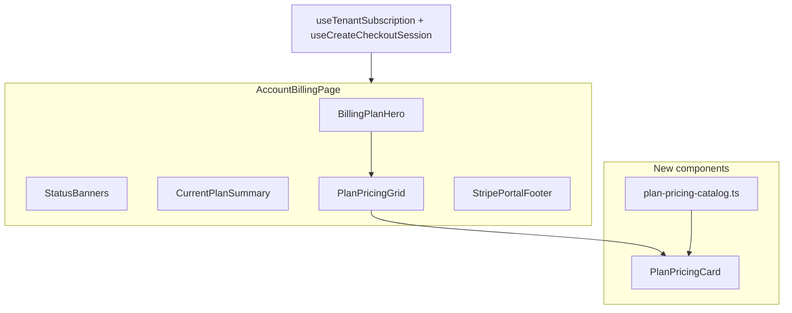

# Modern Billing & Plan Page

## Target

Redesign **[`apps/admin/src/features/account/account-billing-page.tsx`](apps/admin/src/features/account/account-billing-page.tsx)** — the tenant-owner subscription page at `/account/billing`. This is the page titled "Subscription" today; it will become a centered "Billing and Plan" experience like your mockup.

**Out of scope (for now):** signup plan picker, `/billing` hourly-rates page, platform-admin tenant forms, and backend/Stripe yearly billing.

## Current state vs mockup

| Mockup element | Today | Plan |
|---|---|---|
| Centered hero ("Billing and Plan") | `AppBar` left-aligned, utilitarian | Centered hero section with title + subtitle + short copy |
| Monthly / Yearly toggle | Not present | **Omit for v1** — Stripe has one `stripePriceId` per plan; adding a toggle without yearly prices would mislead users |
| 3 pricing cards in a row | 2 minimal upgrade cards | 3-column responsive grid (Starter, Pro highlighted, Enterprise/Pilot contact) |
| Dollar prices | None in UI | Static display prices in admin config (not in contracts/API yet) |
| Feature checklist | Only workspace/seat counts | Rich feature bullets derived from `DEFAULT_PLAN_LIMITS` + product copy |
| "Most Recommended" badge | None | `bg-primary` banner on Pro (middle card) using `Zap` icon from `lucide-react` |
| Current plan CTA | "Current plan" disabled button | Same behavior, styled as muted/outline CTA |
| Status banners | past_due / trial_ending | Keep above the pricing section unchanged |

## Architecture



## New files

### 1. Plan display catalog — [`apps/admin/src/config/plan-pricing-catalog.ts`](apps/admin/src/config/plan-pricing-catalog.ts)

Admin-local marketing config (no contracts change needed):

- Map `PLAN_SLUGS.STARTER` and `PLAN_SLUGS.PRO` to display name, tagline, **monthly display price** (e.g. `$29/mo`, `$99/mo` — placeholder until product confirms), and feature strings
- Mark `PRO` as `recommended: true`
- Optional third card: "Enterprise" / Pilot tier as **contact sales** (not checkout) since Pilot is `isPublic: false` and has no Stripe price

Feature bullets will combine limits from [`packages/contracts/src/plan-catalog.ts`](packages/contracts/src/plan-catalog.ts) with product copy, e.g.:

- `Up to {maxSeats} seats`
- `Up to {maxWorkspaces} workspaces`
- `Up to {maxReportingApiKeys} reporting API keys`
- Plus fixed bullets: time tracking, approvals, exports, etc.

### 2. `PlanPricingCard` — [`apps/admin/src/features/account/plan-pricing-card.tsx`](apps/admin/src/features/account/plan-pricing-card.tsx)

Reusable card matching mockup structure:

- **Container:** `rounded-xl border bg-card shadow-sm`; recommended variant gets `border-primary ring-1 ring-primary/20`
- **Recommended banner:** full-width top strip `bg-primary text-primary-foreground` with `Zap` icon + "Most recommended"
- **Price row:** large `text-3xl font-semibold tabular-nums` + `/mo` caption in `text-muted-foreground`
- **CTA:** full-width `Button` — `default` for upgrade, `secondary`/`outline` for current, `outline` for enterprise contact
- **Features:** `CheckCircle2` from `lucide-react` in `text-primary` (existing pattern in [`export-preview-status.tsx`](apps/admin/src/features/exports/export-preview-status.tsx))

Preserve existing `data-testid` values: `billing-upgrade-starter`, `billing-upgrade-pro`.

### 3. `BillingPlanHero` — inline in page or small sibling component

Centered section inside a soft panel:

```tsx
// Theme tokens from packages/ui/src/globals.css
className="rounded-2xl border border-border/70 bg-muted/20 px-6 py-10 text-center"
// Title: text-3xl font-semibold text-primary (or foreground with primary accent)
// Subtitle + body: text-muted-foreground
```

### 4. Current plan summary — compact strip above grid

Collapse today's large `billing-plan-card` into a slim status bar showing:

- Current plan name + status badge (`Badge` from `@kloqra/ui`)
- Trial/period end dates
- "Manage subscription" + Refresh (keep `billing-manage-button` testid)

Full limits detail moves into the pricing cards themselves.

## Page layout (top to bottom)

1. **Status banners** — unchanged (`billing-past-due-banner`, `billing-trial-ending-banner`)
2. **Hero** — "Billing and Plan" / "Find the right plan for you" / short transparent-pricing copy
3. **Current plan strip** — `billing-plan-card` (slimmed, same testid)
4. **Pricing grid** — `grid gap-6 lg:grid-cols-3` with `data-testid="billing-upgrade-plans"`
5. **Footer** — Stripe portal link, refund policy, return to account (unchanged copy)

Remove the old `AppBar` title block; the hero replaces it. Page heading for a11y: keep an `h1` in the hero.

## Theme color mapping (mockup purple → Kloqra tokens)

| Mockup | Kloqra class |
|---|---|
| Purple title / active toggle | `text-primary`, `bg-primary` |
| Light purple card tint | `bg-primary/5`, `border-primary/30` |
| Page background wash | `bg-muted/20` panel on default `bg-background` |
| Recommended badge | `bg-primary text-primary-foreground` |
| Check icons | `text-primary` |
| Muted body text | `text-muted-foreground` |
| Premium accent (optional Pro highlight) | `text-premium` or `border-premium` |

No new CSS variables — only Tailwind utilities already mapped in [`packages/ui/src/globals.css`](packages/ui/src/globals.css).

## Behavior preserved

- `useTenantSubscription`, `useCreateCheckoutSession`, `useCreatePortalSession` — no hook changes
- Checkout redirect via `window.location.assign(url)` on upgrade click
- `isCurrent` disables CTA when plan names match (case-insensitive, same as today)
- Owner-only access via existing account nav / RBAC — no route changes

## Tests

| File | Change |
|---|---|
| [`apps/admin/e2e/account-billing.spec.ts`](apps/admin/e2e/account-billing.spec.ts) | Update heading assertion from "Subscription" → "Billing and Plan"; keep upgrade/manage testids |
| [`apps/admin/src/features/account/plan-pricing-card.spec.tsx`](apps/admin/src/features/account/plan-pricing-card.spec.tsx) | New RTL test: recommended badge, current-plan disabled CTA, feature list render |
| [`apps/admin/src/config/plan-pricing-catalog.spec.ts`](apps/admin/src/config/plan-pricing-catalog.spec.ts) | Assert catalog covers Starter + Pro slugs and limits align with `DEFAULT_PLAN_LIMITS` |

## Future follow-ups (not in this PR)

- **Signup page** — reuse `PlanPricingCard` in [`signup-page.tsx`](apps/admin/src/features/auth/signup-page.tsx) for visual parity
- **Monthly/Yearly toggle** — requires contracts + Prisma `stripePriceIdYearly` (or similar) + checkout interval param
- **Live prices from Stripe** — extend `GET /plans/public` to return `unitAmount` + `interval` (contracts change, LSA gate)

## Visual reference

Your mockup (3 cards, centered hero, recommended middle card, checkmark features) applied with Kloqra's purple `primary` hue (~264 OKLCH) instead of the mockup's generic purple.
