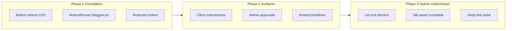

# Motion polish pass

## Current state

You already have good bones—no need to reinvent:

- **Radix + tw-animate-css** on modals, selects, notification dropdown ([`modal-styles.ts`](packages/ui/src/components/ui/modal-styles.ts), [`notification-dropdown.tsx`](packages/web-shared/src/components/notification-dropdown.tsx))
- **Shell transitions** (300ms sidebar/drawer) in [`shell-styles.ts`](packages/ui/src/components/shell/shell-styles.ts)
- **Widget enter** via `animate-in fade-in zoom-in-95` on dashboard cards
- **Budget bar width** transitions in admin widgets

Gaps today:

- **No motion tokens** (durations/easings are ad hoc: 150ms, 200ms, 300ms, 500ms scattered)
- **`animate-fade-in-up` / `animate-fade-in` are used but not defined** in [`onboarding-overlay.tsx`](apps/client/src/features/onboarding/onboarding-overlay.tsx) and [`workspace-page.tsx`](apps/admin/src/features/workspace/workspace-page.tsx)—likely no-ops today
- **No `prefers-reduced-motion` policy**
- **Abrupt loading → content swaps** (`CenteredLoader` → full page in submissions/approvals)
- **No exit animation** when approving/rejecting cards (items vanish instantly)
- **Buttons/cards** use `transition-colors` only—no press/hover depth



---

## Phase 1 — Shared motion foundation (`@kloqra/ui`)

### 1. Motion tokens in [`packages/ui/src/globals.css`](packages/ui/src/globals.css)

Add CSS custom properties and keyframes:

| Token                  | Value                           | Use           |
| ---------------------- | ------------------------------- | ------------- |
| `--motion-fast`        | 150ms                           | menus, micro  |
| `--motion-base`        | 220ms                           | cards, lists  |
| `--motion-slow`        | 320ms                           | shell, layout |
| `--motion-ease-out`    | `cubic-bezier(0.16, 1, 0.3, 1)` | enters        |
| `--motion-ease-in-out` | `cubic-bezier(0.4, 0, 0.2, 1)`  | toggles       |

Define missing animations (fix existing dead classes):

- `@keyframes fade-in-up` → `.animate-fade-in-up`
- `@keyframes fade-in` → `.animate-fade-in`
- `@keyframes shimmer` → upgrade skeletons from flat `animate-pulse`
- `@keyframes highlight-pulse` → deep-link focus ring (2–3 gentle pulses, then stop)

Add global reduced-motion block:

```css
@media (prefers-reduced-motion: reduce) {
  *,
  *::before,
  *::after {
    animation-duration: 0.01ms !important;
    animation-iteration-count: 1 !important;
    transition-duration: 0.01ms !important;
  }
}
```

### 2. Lightweight React helpers (new files in `packages/ui/src/components/motion/`)

| Component                     | Tech                               | Purpose                                                   |
| ----------------------------- | ---------------------------------- | --------------------------------------------------------- |
| `MotionReveal`                | CSS classes                        | Fade + 8px slide-up on mount; props: `delay`, `className` |
| `StaggerList` / `StaggerItem` | CSS `animation-delay` via index    | Stagger card/list enters (40–60ms steps, cap ~300ms)      |
| `CrossfadePresence`           | **motion/react**                   | Tab panel / loading→content swap                          |
| `DismissableList`             | **motion/react** `AnimatePresence` | Card removed after approve/reject                         |

Add `motion` as a **dependency of `@kloqra/ui`** (peer on React 19). Export from [`packages/ui/src/index.ts`](packages/ui/src/index.ts).

Tests: `motion-reveal.spec.tsx`, `stagger-list.spec.tsx`, `crossfade-presence.spec.tsx` (render + reduced-motion class assertions).

### 3. Primitive micro-interactions (small diffs, high ROI)

- [`button.tsx`](packages/ui/src/components/ui/button.tsx): add `transition-[color,transform,box-shadow] active:scale-[0.98]` (disabled when reduced motion via CSS)
- [`card.tsx`](packages/ui/src/components/ui/card.tsx): optional `interactive` variant → `transition-shadow hover:shadow-md` (already on widget shell)
- [`layout.tsx` SegmentedControl](packages/ui/src/components/layout.tsx): sliding background pill behind active segment (CSS `translate` on a pseudo-element or inner highlight div)—currently only `transition-colors`
- [`table-loading.tsx`](packages/ui/src/components/data-table/table-loading.tsx): swap `animate-pulse` rows for shimmer gradient
- [`spinner.tsx`](packages/ui/src/components/ui/spinner.tsx): wrap `CenteredLoader` content area in `CrossfadePresence` so loaded content fades in instead of popping

---

## Phase 2 — Submissions & approvals (highest user-visible impact)

### Client — [`submissions-page.tsx`](apps/client/src/features/submissions/submissions-page.tsx)

- Wrap week toolbar + summary bar in `MotionReveal`
- Wrap submission card list in `StaggerList` (each [`SubmissionStatusCard`](apps/client/src/features/timesheet/submission-status-card.tsx))
- Replace abrupt `loading ? CenteredLoader : cards` with `CrossfadePresence` keyed on `loading`
- **Deep link highlight**: when `highlighted`, apply `animate-highlight-pulse` on the ring in `SubmissionStatusCard` (CSS keyframe; no JS loop)

### Admin — [`approvals-page.tsx`](apps/admin/src/features/approvals/approvals-page.tsx)

- Tab content panels (`review` / `missing` / `amendments`): `CrossfadePresence` with 150ms opacity + 4px Y shift
- Wrap [`PendingTimesheetCard`](apps/admin/src/features/approvals/pending-timesheet-card.tsx) and [`AmendmentRequestCard`](apps/admin/src/features/approvals/amendment-request-card.tsx) lists in `StaggerList`
- After `handleReview` / `handleAmendmentReview` removes an item, use `DismissableList` so approved/rejected cards slide out + collapse height (~220ms) before unmount
- Expand/collapse of activity in pending cards: CSS `grid-template-rows: 0fr → 1fr` transition (pure CSS, no motion lib)

### Shared — notifications & nav

- [`notification-dropdown.tsx`](packages/web-shared/src/components/notification-dropdown.tsx): unread dot gets one-time `scale` pop when count increases (motion `useAnimate` or CSS `@keyframes` on count change)
- Sidebar active nav: subtle left-border or background slide (extend existing [`shell-styles.ts`](packages/ui/src/components/shell/shell-styles.ts) nav item classes)

---

## Phase 3 — Broader polish (same patterns, lower priority)

Apply the same primitives to:

- Dashboard widget grid (stagger on first paint; already has enter on shell)
- Account settings section swap ([`account-settings-page.tsx`](packages/web-shared/src/features/account/account-settings-page.tsx))
- Onboarding wizard steps—replace undefined `animate-fade-in-up` with the new token-backed class + step `CrossfadePresence`
- Admin list pages using `DataTableCard` (shimmer loading only)

**Explicitly skip** (too heavy for “little touches”):

- Full Next.js View Transitions on every route
- Parallax, confetti, or chart re-animation overrides
- Animating every table row on pagination

---

## Design principles (keep it production-worthy)

1. **Purpose over decoration** — motion confirms an action (submitted, approved, tab changed), not decorates idle UI
2. **Short + eased out** — enters 200–320ms; exits slightly faster (150–220ms)
3. **Respect reduced motion** — global CSS override + motion components check `useReducedMotion()` and skip transforms
4. **One system** — all new animation via tokens/helpers, not one-off Tailwind in feature folders
5. **Performance** — animate `opacity` and `transform` only; avoid `height` except via `grid`/`motion` layout helpers

---

## Verification

- `pnpm --filter @kloqra/ui test` — new motion component specs
- Manual smoke: submissions week nav, approve/reject card dismiss, approvals tab switch, notification dropdown, reduced-motion OS setting
- Pre-PR gate: `pnpm format:check && pnpm lint && pnpm typecheck && pnpm test && pnpm build`
