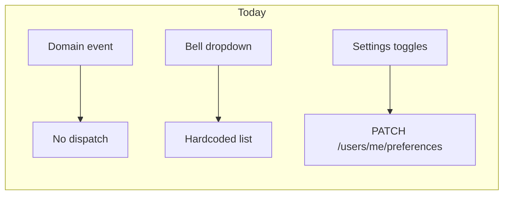
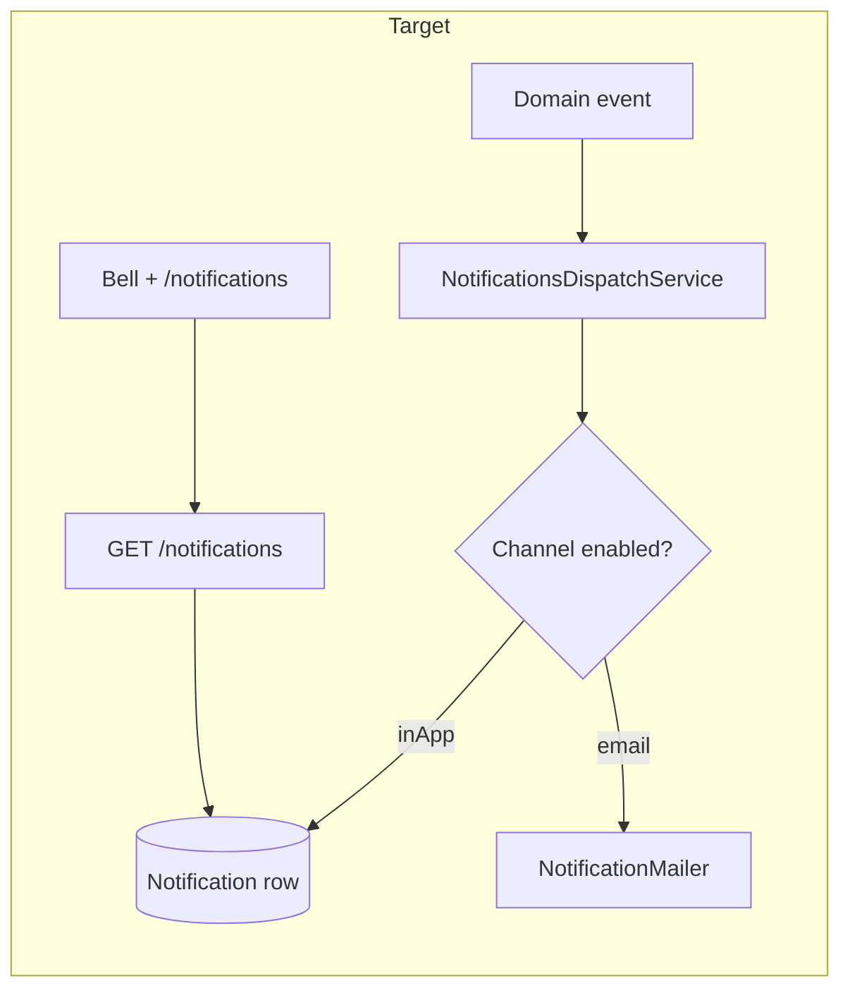
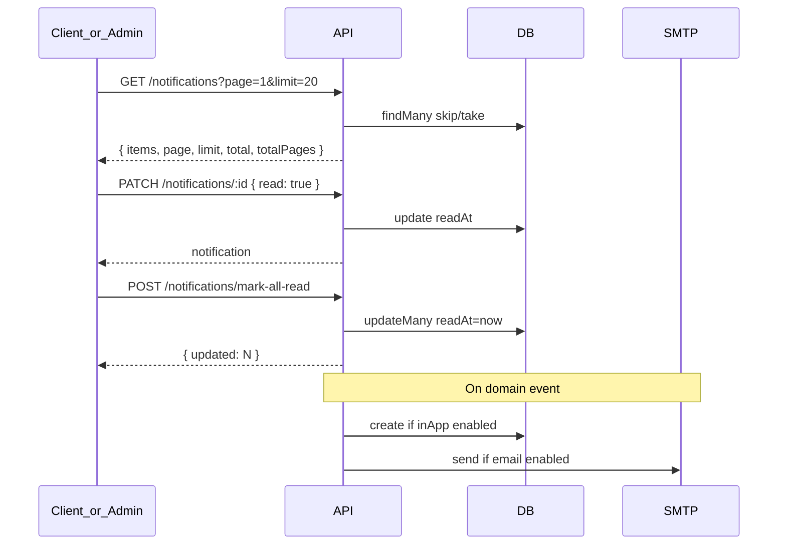

# Notifications Inbox and Delivery Plan

## Current state

| Layer            | Exists                                                                                                                                             | Gap                                                                    |
| ---------------- | -------------------------------------------------------------------------------------------------------------------------------------------------- | ---------------------------------------------------------------------- |
| Settings toggles | 6 email-only On/Off buttons in [`notifications-section.tsx`](packages/web-shared/src/features/account/settings/sections/notifications-section.tsx) | No In-App channel; saves flat booleans; same rows for member and admin |
| Bell dropdown    | Mock data in [`notification-dropdown.tsx`](packages/web-shared/src/components/notification-dropdown.tsx)                                           | No API; "View all" links to settings                                   |
| Contracts prefs  | Legacy `{ inApp?, email? }` union in [`user-preferences.ts`](packages/contracts/src/user-preferences.ts)                                           | Normalized to single boolean on read                                   |
| Backend          | `User.preferences` JSON only                                                                                                                       | No `Notification` model or module                                      |
| Sidebar          | No `/notifications` route in client or admin                                                                                                       | Admin Approvals badge polls pending timesheets separately              |





---

## Role model

Admins manage members and do not track time. Notification **preferences** and **default dispatch** are split by audience:

| Audience                   | Primary events                                                               | Hidden toggles (not shown in settings)                              |
| -------------------------- | ---------------------------------------------------------------------------- | ------------------------------------------------------------------- |
| **Member** (client portal) | Project/task assignment, timesheet status, reminders, idle timer, Jira sync  | `approvalRequest`, `memberChanges`, `exportSchedule`, `budgetAlert` |
| **Admin** (admin portal)   | Approval requests, member join/leave, export schedule results, budget alerts | `timesheetReminders`, `idleTimerAlert`, `taskAssignment`            |

Both apps share the same API (`GET /notifications` scoped to `userId` + `workspaceId`) and the same web-shared inbox UI. Settings section receives a `variant: "member" | "admin"` prop (derived from session role in each shell).

---

## Phase 1 — Contracts (SSOT first)

### 1.1 Dual-channel preferences

Update [`packages/contracts/src/user-preferences.ts`](packages/contracts/src/user-preferences.ts):

- Replace flat `ResolvedUserNotifications` booleans with per-type `{ inApp: boolean; email: boolean }`.
- Keep `enabled` as master switch (disables both channels).
- **Member keys** (shown in client settings):
  - `projectAssignment`, `taskAssignment`, `timesheetReminders`, `idleTimerAlert`, `jiraSyncUpdates`
  - `timesheetStatus` — approved/rejected updates (covers "Timesheet Approved" mock)
- **Admin keys** (shown in admin settings):
  - `approvalRequest` — timesheet submitted and awaiting review
  - `memberChanges` — member invited, joined, or removed from workspace
  - `exportSchedule` — scheduled export completed or failed
  - `budgetAlert` — project budget threshold crossed (near/over)
- Migration helpers:
  - `normalizeNotificationChannels(value, defaults)` — legacy boolean → `{ inApp: true, email: value }` for member keys; admin keys default `{ inApp: true, email: false }`
  - `resolveNotificationChannels(prefs)` — returns full channel map for dispatch
  - `memberNotificationKeys()` / `adminNotificationKeys()` — for role-filtered UI
- Update `mergeUserPreferences` + `contracts.spec.ts` for new keys and backward compat.

### 1.2 Notification DTOs and routes

New [`packages/contracts/src/dto/notification.dto.ts`](packages/contracts/src/dto/notification.dto.ts):

```ts
// notificationType enum
PROJECT_ASSIGNMENT | TASK_ASSIGNMENT | TIMESHEET_REMINDER |
IDLE_TIMER_ALERT | JIRA_SYNC_UPDATE | TIMESHEET_STATUS |
APPROVAL_REQUEST | MEMBER_CHANGE | EXPORT_SCHEDULE | BUDGET_ALERT

notificationSchema: { id, workspaceId, type, title, body, readAt, createdAt, metadata? }
listNotificationsQuerySchema: listPaginationQuerySchema.extend({
  unreadOnly: z.coerce.boolean().optional()
})
listNotificationsResponseSchema: createPaginatedListResponseSchema(notificationSchema)
unreadCountResponseSchema: { count: number }
updateNotificationReadSchema: { read: boolean }
markAllNotificationsReadSchema: { unreadOnly?: boolean }
```

`metadata` carries deep-link hints, e.g. `{ href: "/approvals", periodId, projectId }`.

Add to [`packages/contracts/src/routes.ts`](packages/contracts/src/routes.ts):

```ts
NOTIFICATIONS: {
  LIST: "/notifications",
  UNREAD_COUNT: "/notifications/unread-count",
  BY_ID: (id) => `/notifications/${id}`,
  MARK_ALL_READ: "/notifications/mark-all-read"
}
```

Add `NOTIFICATION_NOT_FOUND` to [`errors.ts`](packages/contracts/src/errors.ts). Export from [`index.ts`](packages/contracts/src/index.ts).

---

## Phase 2 — Database

Add to [`apps/api/prisma/schema.prisma`](apps/api/prisma/schema.prisma):

```prisma
model Notification {
  id          String    @id @default(uuid())
  userId      String
  workspaceId String
  type        String    // matches contract enum
  title       String
  body        String
  metadata    Json      @default("{}")
  readAt      DateTime?
  createdAt   DateTime  @default(now())

  user      User      @relation(fields: [userId], references: [id], onDelete: Cascade)
  workspace Workspace @relation(fields: [workspaceId], references: [id], onDelete: Cascade)

  @@index([userId, workspaceId, createdAt(sort: Desc)])
  @@index([userId, workspaceId, readAt])
}
```

Migration: `apps/api/prisma/migrations/<timestamp>_notifications/migration.sql`.

---

## Phase 3 — API module

New vertical slice: `apps/api/src/modules/notifications/` (per [`chronomint-api-slice`](.cursor/skills/chronomint-api-slice/SKILL.md)).

### 3.1 Service endpoints

| Method  | Route                          | Behavior                                                                                           |
| ------- | ------------------------------ | -------------------------------------------------------------------------------------------------- |
| `GET`   | `/notifications`               | Paginated list for `user.userId` + `user.workspaceId`; `unreadOnly` filter; order `createdAt DESC` |
| `GET`   | `/notifications/unread-count`  | `COUNT` where `readAt IS NULL`                                                                     |
| `PATCH` | `/notifications/:id`           | Set/clear `readAt` (`{ read: true \| false }`); 404 if not owned                                   |
| `POST`  | `/notifications/mark-all-read` | Bulk `readAt = now()` for current user+workspace                                                   |

Follow existing pagination utilities in [`pagination.util.ts`](apps/api/src/common/http/pagination.util.ts) and categories list pattern in [`categories.service.ts`](apps/api/src/modules/categories/application/categories.service.ts).

### 3.2 Dispatch service (how notifications are created)

`NotificationsDispatchService.notify({ userId, workspaceId, type, title, body, metadata, preferenceKey })`:

1. Load user preferences → `resolveNotificationChannels` for `preferenceKey`.
2. If master `enabled` is false → no-op.
3. If `channels.inApp` → `prisma.notification.create(...)`.
4. If `channels.email` → `NotificationMailer.send(...)` (new file alongside [`member-provisioning.mailer.ts`](apps/api/src/common/mailer/member-provisioning.mailer.ts)); graceful no-op when SMTP unconfigured.

Helper: `notifyWorkspaceAdmins(workspaceId, { type, title, body, metadata, preferenceKey })` — fans out to all `WorkspaceMember` with `role = ADMIN`, excluding the actor when appropriate.

Register `NotificationsModule` in app module; export dispatch service for cross-module use.

### 3.3 Member domain events (client portal)

| Trigger location                                                                                                  | Type                 | Preference key      | Recipient                                         |
| ----------------------------------------------------------------------------------------------------------------- | -------------------- | ------------------- | ------------------------------------------------- |
| [`projects.service.ts`](apps/api/src/modules/projects/application/projects.service.ts) — add team member          | `PROJECT_ASSIGNMENT` | `projectAssignment` | Added member                                      |
| Task assign (tasks module)                                                                                        | `TASK_ASSIGNMENT`    | `taskAssignment`    | Assignee                                          |
| [`timesheets.service.ts`](apps/api/src/modules/timelogs/application/timesheets.service.ts) — `approve` / `reject` | `TIMESHEET_STATUS`   | `timesheetStatus`   | Period owner (member)                             |
| [`stale-timer.service.ts`](apps/api/src/modules/timer/application/stale-timer.service.ts) — auto-stop             | `IDLE_TIMER_ALERT`   | `idleTimerAlert`    | Timer owner (keep Redis flag for immediate toast) |
| Jira sync completion (if hook exists)                                                                             | `JIRA_SYNC_UPDATE`   | `jiraSyncUpdates`   | Initiating user                                   |

`TIMESHEET_REMINDER` — defer to follow-up cron; seed via e2e fixtures.

### 3.4 Admin domain events (admin portal)

Admins do not receive member-self alerts (idle timer, submit reminders). Focus on management workflows:

| Trigger location                                                                                                                         | Type               | Preference key    | Recipient                                                                  |
| ---------------------------------------------------------------------------------------------------------------------------------------- | ------------------ | ----------------- | -------------------------------------------------------------------------- |
| [`timesheets.service.ts`](apps/api/src/modules/timelogs/application/timesheets.service.ts) — `submit`                                    | `APPROVAL_REQUEST` | `approvalRequest` | Workspace admins (or project reviewers); metadata links to `/approvals`    |
| [`workspace.service.ts`](apps/api/src/modules/workspace/application/workspace.service.ts) — `invite`                                     | `MEMBER_CHANGE`    | `memberChanges`   | All workspace admins except inviter (optional: include inviter)            |
| [`workspace.service.ts`](apps/api/src/modules/workspace/application/workspace.service.ts) — `removeMember`                               | `MEMBER_CHANGE`    | `memberChanges`   | Remaining workspace admins                                                 |
| [`export-schedule.service.ts`](apps/api/src/modules/export/application/export-schedule.service.ts) — run success/failure                 | `EXPORT_SCHEDULE`  | `exportSchedule`  | Schedule creator + `recipientEmails` mapped to user accounts when possible |
| Budget burn-down check in [`reporting.service.ts`](apps/api/src/modules/reporting/application/reporting.service.ts) or post-timelog hook | `BUDGET_ALERT`     | `budgetAlert`     | Workspace admins when project crosses 90% or exceeds budget                |

**Approvals badge consolidation:** Once `APPROVAL_REQUEST` notifications work, admin shell can show unread count from `GET /notifications/unread-count` filtered by type (or keep dedicated pending-count on Approvals nav — both are acceptable; prefer notification unread for bell/sidebar, keep Approvals badge as actionable pending count).

### 3.5 Tests

Per [`chronomint-test-delivery`](.cursor/skills/chronomint-test-delivery/SKILL.md):

- `notifications.service.spec.ts` — list pagination, read/unread, mark-all, ownership, channel gating, admin fan-out
- `apps/api/test/notifications.e2e.ts` — member + admin flows
- Extend timesheets/workspace/export specs to assert dispatch calls (mocked)

---

## Phase 4 — Shared UI (`packages/web-shared`)

### 4.1 Settings — role-aware dual-channel toggles

| File                                                                                                                | Change                                                                                             |
| ------------------------------------------------------------------------------------------------------------------- | -------------------------------------------------------------------------------------------------- |
| New `notification-channel-row.tsx`                                                                                  | In-App + Email `Switch` pair per row                                                               |
| [`notifications-section.tsx`](packages/web-shared/src/features/account/settings/sections/notifications-section.tsx) | Accept `variant: "member" \| "admin"`; render appropriate row set; save `{ inApp, email }` per key |
| [`account-settings-page.tsx`](packages/web-shared/src/features/account/account-settings-page.tsx)                   | Pass variant from optional prop (default `"member"`)                                               |

**Member rows (7):** master + projectAssignment, taskAssignment, timesheetReminders, idleTimerAlert, jiraSyncUpdates, timesheetStatus

**Admin rows (5):** master + approvalRequest, memberChanges, exportSchedule, budgetAlert

### 4.2 Data hooks

New `use-notifications.ts`:

- `useNotificationUnreadCount()` — polls/refetches on focus; drives bell badge + sidebar badge
- `usePaginatedNotifications({ unreadOnly? })` — wraps `usePaginatedList` against `ROUTES.NOTIFICATIONS.LIST`
- `markNotificationRead(id, read)`, `markAllNotificationsRead()` — optimistic updates + API

### 4.3 Bell dropdown (wire to API)

Refactor [`notification-dropdown.tsx`](packages/web-shared/src/components/notification-dropdown.tsx):

- Fetch latest 5–10 items + unread count from API (not mock)
- Click item → `PATCH` mark read; secondary action for mark unread
- "Mark all read" → `POST /notifications/mark-all-read`
- Footer link → `/notifications` (not settings)
- Optional `metadata.href` navigation on row click

### 4.4 Notifications inbox page

New `notifications-page.tsx` in web-shared (shared by both apps):

- Header: title, unread count, "Mark all read" button
- Filter tabs: All | Unread
- List rows: icon by type, title, body, relative time, unread dot
- Per-row actions: Mark read / Mark unread
- `TablePagination` at bottom
- Empty state; deep links from `metadata.href` (member: `/timesheet`, admin: `/approvals`, `/team-management`, `/exports`)

---

## Phase 5 — App wiring (client + admin)

### Client (member portal)

| File                                                                                                                     | Change                                                                                                   |
| ------------------------------------------------------------------------------------------------------------------------ | -------------------------------------------------------------------------------------------------------- |
| New [`apps/client/src/app/(workspace)/notifications/page.tsx`](<apps/client/src/app/(workspace)/notifications/page.tsx>) | Thin route → `NotificationsPage`                                                                         |
| [`workspace-shell.tsx`](apps/client/src/components/workspace-shell.tsx)                                                  | Add `{ href: "/notifications", label: "Notifications", Icon: Bell, badge: unreadCount }` after Approvals |
| [`shell-header-actions.tsx`](packages/web-shared/src/components/shell-header-actions.tsx)                                | Pass `viewAllHref="/notifications"`                                                                      |
| [`settings/page.tsx`](<apps/client/src/app/(workspace)/settings/page.tsx>)                                               | Pass `variant="member"` to `AccountSettingsPage`                                                         |

### Admin (admin portal)

| File                                                                                                           | Change                                                                                                                                        |
| -------------------------------------------------------------------------------------------------------------- | --------------------------------------------------------------------------------------------------------------------------------------------- |
| New [`apps/admin/src/app/(admin)/notifications/page.tsx`](<apps/admin/src/app/(admin)/notifications/page.tsx>) | Thin route → `NotificationsPage`                                                                                                              |
| [`admin-shell.tsx`](apps/admin/src/components/admin-shell.tsx)                                                 | Add `{ href: "/notifications", label: "Notifications", Icon: Bell, badge: unreadCount }` after Approvals; wire `useNotificationUnreadCount()` |
| [`admin-header-actions.tsx`](apps/admin/src/components/admin-header-actions.tsx)                               | Pass `viewAllHref="/notifications"` via `ShellHeaderActions`                                                                                  |
| [`settings/page.tsx`](<apps/admin/src/app/(admin)/settings/page.tsx>)                                          | Pass `variant="admin"` to `AccountSettingsPage`                                                                                               |

Both shells reuse the same web-shared components; only nav placement and settings variant differ.

---

## API contract summary



---

## Preference → type mapping

### Member

| Settings key         | Notification type    | Email subject               |
| -------------------- | -------------------- | --------------------------- |
| `projectAssignment`  | `PROJECT_ASSIGNMENT` | Added to project            |
| `taskAssignment`     | `TASK_ASSIGNMENT`    | Task assigned               |
| `timesheetReminders` | `TIMESHEET_REMINDER` | Submit your timesheet       |
| `idleTimerAlert`     | `IDLE_TIMER_ALERT`   | Timer auto-stopped          |
| `jiraSyncUpdates`    | `JIRA_SYNC_UPDATE`   | Jira sync complete          |
| `timesheetStatus`    | `TIMESHEET_STATUS`   | Timesheet approved/rejected |

### Admin

| Settings key      | Notification type  | Email subject                   |
| ----------------- | ------------------ | ------------------------------- |
| `approvalRequest` | `APPROVAL_REQUEST` | Timesheet awaiting your review  |
| `memberChanges`   | `MEMBER_CHANGE`    | Team member joined or removed   |
| `exportSchedule`  | `EXPORT_SCHEDULE`  | Scheduled export ready / failed |
| `budgetAlert`     | `BUDGET_ALERT`     | Project budget threshold alert  |

---

## Delivery order

1. Contracts + tests (member + admin preference keys, notification DTOs)
2. Prisma migration
3. Notifications API module + e2e
4. Dispatch service + NotificationMailer
5. Wire member domain events
6. Wire admin domain events
7. web-shared hooks + role-aware settings toggles
8. Notifications page + dropdown wiring
9. Client + admin routes and sidebar
10. Pre-PR: `pnpm format:check && pnpm lint && pnpm typecheck && pnpm test && pnpm build`

---

## Out of scope (follow-ups)

- Real-time push (SSE/WebSocket) — v1 uses fetch on open/focus + pagination
- Scheduled `TIMESHEET_REMINDER` cron
- Notification delete/archive endpoint
- Budget alert background job (v1 can fire on timelog create or reporting refresh hook; full scheduled scan is follow-up)
