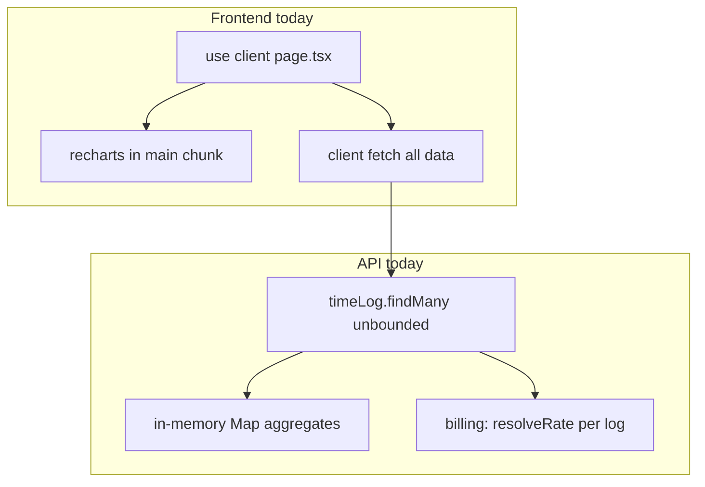
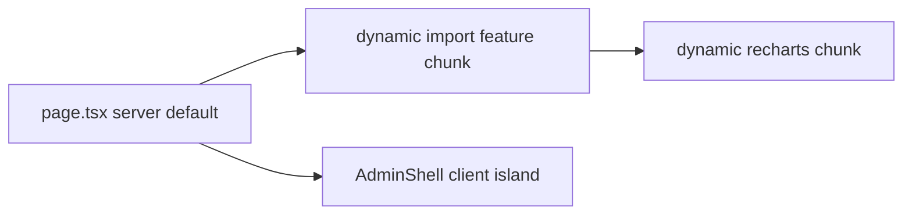

# Kloqra Performance & Dynamic Loading Plan

## Current baseline

| Layer              | State                                                                                                                                                                    | Main risk                                       |
| ------------------ | ------------------------------------------------------------------------------------------------------------------------------------------------------------------------ | ----------------------------------------------- |
| **Build / minify** | Next 15 SWC defaults only; identical bare configs in [apps/admin/next.config.ts](apps/admin/next.config.ts) and [apps/client/next.config.ts](apps/client/next.config.ts) | Minification helps little if bundles stay large |
| **Frontend**       | No `next/dynamic`; admin is ~all `"use client"`; **recharts** on dashboard with no lazy boundary                                                                         | Large initial JS on admin routes                |
| **API**            | All rollups via `findMany` + in-memory loops; no pagination in contracts                                                                                                 | Memory/DB scale with workspace history          |
| **Worst query**    | [billing.service.ts](apps/api/src/modules/billing/application/billing.service.ts) — up to **3 Prisma calls per log** in `summary()`                                      | O(n) queries on billable logs                   |



**Relationship to [project hardening plan](.cursor/plans/project_hardening_plan_2d9d2bb8.plan.md):** Hardening PR5 (`common/time` + billing DRY) and PR4 (admin `features/` + thin server pages) **accelerate** this plan. Schedule performance PRs **after PR1 (tooling)** so new ESLint/Prettier do not fight large refactors.

---

## Phase 1 — Quick wins (balanced, 1–2 PRs)

### 1A API: fix N+1 and duplicate fetches

**Billing (highest ROI)** — Replace per-log `resolveRate()` loop in [billing.service.ts](apps/api/src/modules/billing/application/billing.service.ts) with the pattern already used in [time-aggregation.service.ts](apps/api/src/modules/reporting/application/time-aggregation.service.ts):

- `fetchLogs` or equivalent `findMany` with `task: { select: { projectId: true } }` (not full `user: true`)
- One `resolveRateMaps(workspaceId)` call before the loop
- In-loop: `resolveRate(log.userId, log.task.projectId, defaultRate)` — **2 queries total** instead of 3×N

**Export `users_without_time`** — [export-rows.builder.ts](apps/api/src/modules/export/application/export-rows.builder.ts) lines 314–323: replace per-member `findFirst` with one batched query (e.g. `findMany` where `userId in (...)` + in-memory “latest per user”, or raw `DISTINCT ON` migration if member count is large).

**Reporting dashboard dedup** — [reporting.service.ts](apps/api/src/modules/reporting/application/reporting.service.ts) `dashboard()` reimplements `fetchLogs` + rate maps (lines 89–110). Delegate to injected `TimeAggregationService.fetchLogs` + `resolveRateMaps` + `buildAggregates` (same as export path).

**Export context** — [export.service.ts](apps/api/src/modules/export/application/export.service.ts): pass workspace/settings from `loadContext` into `runExport` to avoid second `workspace.findUnique`.

**myWeekSummary** — Single week `fetchLogs`; derive `todayHours` by filtering week logs in memory (lines 31–41 in reporting.service.ts).

### 1B API: guardrails in contracts

Add validation in [packages/contracts](packages/contracts/src/dto/) (Zod schemas):

- **Max date range** on `ReportQueryDto`, export body, billing summary (e.g. 366 days) — reject oversized reads at the edge
- **Timelogs list**: optional `limit` + `cursor` (start with `limit` default 500, required `from`/`to` for calendar views)

No DB migration required for guards; indexes can follow in Phase 2.

### 1C Frontend: true dynamic imports + package optimization

Update **both** [next.config.ts](apps/admin/next.config.ts) files:

```ts
experimental: {
  optimizePackageImports: ["@kloqra/ui", "lucide-react", "recharts"];
}
```

**Lazy-load heavy UI** (admin first):

- Wrap [report-charts.tsx](apps/admin/src/components/report-charts.tsx) (and dashboard chart sections) with `next/dynamic(() => import(...), { ssr: false, loading: () => <ChartSkeleton /> })`
- Remove duplicate `recharts` from [apps/admin/package.json](apps/admin/package.json) if charts only come from `@kloqra/ui` — single version via UI package

**Loading boundaries:**

- Add `loading.tsx` under `apps/admin/src/app/(admin)/dashboard/` and `exports/`
- Add same for client `timesheet/` and `timer/` routes

**Client already has the right page pattern** — [timesheet/page.tsx](<apps/client/src/app/(workspace)/timesheet/page.tsx>) is a thin server wrapper; extend that to admin routes as hardening PR4 lands.

### 1D Observability (small, enables Phase 2)

- Add `@next/bundle-analyzer` behind `ANALYZE=true` script in admin + client `package.json`
- Document baseline command in [docs/development/TESTING.md](docs/development/TESTING.md) or new `docs/development/PERFORMANCE.md`
- Optional CI step: upload `.next/analyze` artifact on PR (non-blocking first)

---

## Phase 2 — Query & payload optimization

### 2A Prisma: selective reads

In [time-aggregation.service.ts](apps/api/src/modules/reporting/application/time-aggregation.service.ts), replace `include: { user: true, task: { include: { project: true } } }` with explicit **`select`** for fields used by `buildAggregates` and export row builders (ids, duration, billable, names, emails, `projectId`, `clientName`).

Apply same `select` discipline to billing after it shares aggregation helpers.

### 2B Indexes ([schema.prisma](apps/api/prisma/schema.prisma))

Hot filter pattern: `task → project → workspaceId` + `startTime` range. Today only `@@index([userId, startTime])` and `@@index([taskId, startTime])`.

Evaluate (with `EXPLAIN` on staging data):

- `@@index([startTime])` on `TimeLog` for range scans
- Optional denormalized `workspaceId` on `TimeLog` if join cost remains high (larger migration; only if metrics justify)

Add `@@index([workspaceId, effectiveFrom])` on `HourlyRate` if rate tables grow.

### 2C Pagination & incremental loading

| Endpoint            | Change                                                                            |
| ------------------- | --------------------------------------------------------------------------------- |
| `GET /timelogs`     | Cursor + `take`; client timesheet fetches month window only                       |
| Reporting dashboard | Keep full range but capped by contract max; consider `?granularity=summary` later |
| Export              | Enforce max range; for `time_entries` > N rows, stream CSV or async job (Phase 3) |

Update [timelogs.service.ts](apps/api/src/modules/timelogs/application/timelogs.service.ts) and client [timesheet-page.tsx](apps/client/src/features/timesheet/timesheet-page.tsx) to pass bounded `from`/`to` always.

### 2D Presence SSE hot path

[presence.service.ts](apps/api/src/modules/presence/application/presence.service.ts): batch `task.findMany({ id: { in } })` after Redis timer keys; debounce full `snapshot()` on SSE (e.g. 1s) in [presence.controller.ts](apps/api/src/modules/presence/interface/http/presence.controller.ts).

### 2E Access checks

[project-access.service.ts](apps/api/src/modules/projects/application/project-access.service.ts): replace `accessibleProjectIds().includes(id)` with targeted `findFirst` — fewer rows per authorization check.

---

## Phase 3 — Caching, aggregation at DB, async heavy work

### 3A Redis read cache (optional, after query fixes)

Use existing [redis.service.ts](apps/api/src/common/redis/redis.service.ts):

- Key: `report:{workspaceId}:{from}:{to}:{hash(filters)}` TTL 60–300s
- Invalidate on `timeLog` / `hourlyRate` writes in timelogs + billing services
- **Not** a substitute for pagination; reduces repeat dashboard hits

### 3B DB-level aggregates (when in-memory paths hurt)

For dashboard-only summaries, introduce `prisma.timeLog.groupBy` by `taskId` / `userId` with `_sum: { durationSec: true }` — keep detailed `fetchLogs` for export row detail reports only.

### 3C Export & schedules

- [export-schedule.service.ts](apps/api/src/modules/export/application/export-schedule.service.ts): move `generate` off `setInterval` into a queue/worker (BullMQ or DB job table) — prevents event-loop blocking
- Stream large CSV/XLSX instead of buffering entire workbook in [export.service.ts](apps/api/src/modules/export/application/export.service.ts)
- Public share ([report-share.service.ts](apps/api/src/modules/export/application/report-share.service.ts)): rate-limit + same max range as authenticated export

---

## Phase 4 — Build pipeline & “true dynamic” frontend architecture

Aligns with hardening **admin `features/`** refactor:



- **Server `page.tsx`** → dynamic import of `features/<domain>/*-page.tsx` where the feature is large (exports, dashboard)
- **Smaller client islands**: nav, workspace switcher, dialogs only
- **Turborepo** (optional): `turbo.json` with `build`/`lint` cache — faster CI, not smaller prod bundles
- **CI bundle budget** (after baselines): fail PR if admin first-load JS grows >10% without approval

### Minification note

Next 15 already minifies via SWC. **Meaningful “minification” gains come from smaller graphs** (`optimizePackageImports`, `next/dynamic`, removing duplicate deps), not custom terser config. Avoid premature `modularizeImports` unless analyzer shows barrel leaks.

---

## Delivery strategy (stacked PRs)

| PR     | Focus                                                                                    | Depends on              |
| ------ | ---------------------------------------------------------------------------------------- | ----------------------- |
| **P1** | Billing N+1 + export users_without_time + reporting dashboard dedup + contract max range | Hardening PR1 (tooling) |
| **P2** | next.config optimizePackageImports + dynamic recharts + loading.tsx + bundle analyzer    | P1 or parallel          |
| **P3** | Prisma `select` + timelogs pagination + indexes migration                                | P1                      |
| **P4** | Redis report cache + presence batching + project-access                                  | P3                      |
| **P5** | Admin server pages + dynamic features + CI bundle budget                                 | Hardening PR4           |

Run after each: `pnpm typecheck && pnpm test && pnpm build` + `ANALYZE=true pnpm --filter @kloqra/admin build` once to record chunk sizes.

---

## Success metrics

| Metric                       | Target                                                            |
| ---------------------------- | ----------------------------------------------------------------- |
| Billing `summary` DB queries | Fixed small constant (≤4) regardless of log count                 |
| Admin dashboard route JS     | recharts in separate chunk; measurable via analyzer               |
| Timelogs list                | Bounded by `limit` + date window                                  |
| Export/report date range     | Rejected > 366 days at API                                        |
| `dashboard()` code path      | Single `TimeAggregationService` pipeline, no duplicate `findMany` |
| CI                           | Optional non-blocking bundle report; later hard budget            |

---

## What not to do early

- Custom webpack minifiers — negligible vs bundle splitting
- Full `workspaceId` denormalization on `TimeLog` without production query plans
- Caching before fixing N+1 and pagination — masks correctness and memory issues
- Blocking all exports on async queue before fixing batched queries — ship query fixes first
