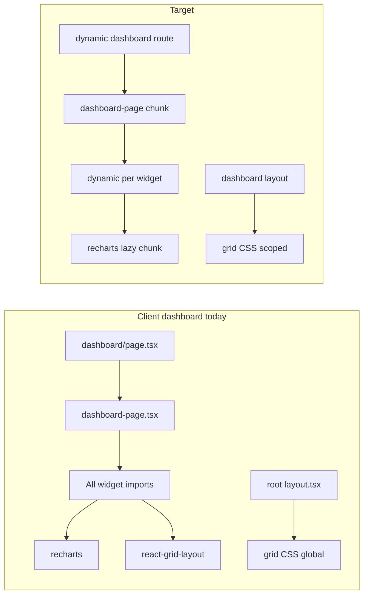

# Performance & Minification Optimization Plan

## What “slow” likely means today

Production JS is **already minified** by Next.js 15 (SWC). Slowness is usually from **how much code ships** and **how much gets compiled**, not missing minification.

Current hotspots in this repo:

| Area              | Symptom                                    | Root cause                                                                                                                                                                                                              |
| ----------------- | ------------------------------------------ | ----------------------------------------------------------------------------------------------------------------------------------------------------------------------------------------------------------------------- |
| **Browser**       | Dashboard / first navigation feels heavy   | Client dashboard loads all widgets + `recharts` + `react-grid-layout` upfront; root layout imports grid CSS on every route                                                                                              |
| **Dev startup**   | `pnpm dev` feels slow                      | [`predev:apps`](package.json) runs Docker/native bootstrap + builds contracts/ui + `prisma generate` before starting 3 apps                                                                                             |
| **Build / CI**    | `pnpm test:prepr` / `pnpm build` take long | Sequential gates in [`scripts/test-prepr.sh`](scripts/test-prepr.sh); Turbo tasks force `^build` before lint/typecheck/test                                                                                             |
| **Compile graph** | Next recompiles shared code                | [`@kloqra/web-shared`](packages/web-shared/package.json) exports raw TypeScript (`./src/index.ts`), unlike prebuilt [`@kloqra/contracts`](packages/contracts/package.json) and [`@kloqra/ui`](packages/ui/package.json) |

Existing good patterns to extend (not reinvent):

- Admin uses [`charts-lazy.tsx`](apps/admin/src/components/charts-lazy.tsx) + route-level `dynamic()` for dashboard/exports
- Motion components lazy-load `motion/react` after mount ([`crossfade-presence.tsx`](packages/ui/src/components/motion/crossfade-presence.tsx))
- Bundle analyzer wired in both Next configs ([`apps/client/next.config.ts`](apps/client/next.config.ts), [`apps/admin/next.config.ts`](apps/admin/next.config.ts))
- API guardrails documented in [`docs/development/PERFORMANCE.md`](docs/development/PERFORMANCE.md) (Redis cache, pagination caps)



---

## Phase 0 — Baseline (do first, ~30 min)

Establish numbers before changing code so improvements are provable.

1. **Bundle analysis** (already supported):

   ```bash
   pnpm --filter @kloqra/client analyze
   pnpm --filter @kloqra/admin analyze
   ```

   Record top 5 client chunks (expect `recharts`, `react-grid-layout`, dashboard feature, `@kloqra/ui`, `@kloqra/web-shared`).

2. **Dev cold vs warm start**: time `pnpm dev` once cold, once with deps already up (note bootstrap + `tsc` for ui).

3. **CI segment timing**: run sections of [`scripts/test-prepr.sh`](scripts/test-prepr.sh) separately and note which dominates (usually Next builds + e2e).

4. **Fix stale doc**: [`docs/development/PERFORMANCE.md`](docs/development/PERFORMANCE.md) claims `optimizePackageImports` includes `@kloqra/ui` — actual config only lists `lucide-react` (client) and `lucide-react` + `recharts` (admin).

---

## Phase 1 — Runtime bundle wins (highest user impact)

### 1A. Client dashboard code-splitting (mirror admin)

**Problem:** [`apps/client/src/app/(workspace)/dashboard/page.tsx`](<apps/client/src/app/(workspace)/dashboard/page.tsx>) statically imports the 900+ line [`dashboard-page.tsx`](apps/client/src/features/dashboard/dashboard-page.tsx), which statically imports every widget including chart widgets.

**Change:**

- Wrap dashboard route with `next/dynamic` (same pattern as [`apps/admin/src/app/(admin)/dashboard/page.tsx`](<apps/admin/src/app/(admin)/dashboard/page.tsx>))
- Extract chart widgets into a lazy module (new `apps/client/src/features/dashboard/widgets-lazy.tsx`, modeled on admin’s `charts-lazy.tsx`)
- Optionally lazy-load non-visible widgets by registry ID so hidden dashboard tiles don’t pull their code

**Expected impact:** Smaller initial JS for `/timesheet`, `/submissions`, etc.; dashboard pays cost only when visited.

### 1B. Scope heavy CSS to dashboard routes

**Problem:** Both apps import grid CSS globally in root layout:

```7:8:apps/client/src/app/layout.tsx
import "react-grid-layout/css/styles.css";
import "react-resizable/css/styles.css";
```

**Change:** Move these imports to a dashboard-specific layout (e.g. `apps/client/src/app/(workspace)/dashboard/layout.tsx` and admin equivalent).

### 1C. Expand tree-shaking config

Update both [`next.config.ts`](apps/client/next.config.ts) files:

```ts
experimental: {
  optimizePackageImports: [
    "lucide-react",
    "recharts",
    "@radix-ui/react-dialog",
    "@radix-ui/react-select",
    "@radix-ui/react-popover",
    "@radix-ui/react-alert-dialog",
    "motion/react",
    "react-grid-layout",
  ],
}
```

Re-run `analyze` and compare chunk sizes.

### 1D. Trim `@kloqra/ui` barrel pressure (optional, medium effort)

Motion is already lazy internally. Bigger win is **import discipline**:

- Charts: keep using `@kloqra/ui/chart` (already split export in [`packages/ui/src/chart.ts`](packages/ui/src/chart.ts))
- Avoid importing motion-heavy components (`DismissableList`, `StaggerList`) on lightweight pages unless needed

Longer-term: add subpath exports (`@kloqra/ui/motion`, `@kloqra/ui/shell`) to reduce accidental barrel pulls — only if analyzer shows `@kloqra/ui` in shared layout chunks.

### 1E. Client chart widgets

Files importing `recharts` directly today:

- [`category-split-widget.tsx`](apps/client/src/features/dashboard/widgets/category-split-widget.tsx)
- [`weekly-progress-widget.tsx`](apps/client/src/features/dashboard/widgets/weekly-progress-widget.tsx)
- [`project-split-widget.tsx`](apps/client/src/features/dashboard/widgets/project-split-widget.tsx)

Lazy-load these via the new `widgets-lazy.tsx` wrapper with a skeleton fallback (reuse [`Skeleton`](packages/ui/src/components/ui/skeleton.tsx) pattern from loading routes).

---

## Phase 2 — Faster local dev

### 2A. Add a fast dev entrypoint

**Problem:** Every `pnpm dev` runs full [`predev:apps`](package.json) bootstrap.

**Change:** Add scripts like:

- `dev:apps` — start api/client/admin only (no bootstrap)
- `dev:once` — current behavior (bootstrap + build + start)

Document: run bootstrap once (`pnpm local` or first `pnpm dev`), then use `dev:apps` for daily work.

### 2B. Enable Turbopack for Next dev

Update client/admin dev scripts:

```json
"dev": "next dev --turbo -p 3000"
```

Verify dashboard, auth, and `@kloqra/ui` transpilation still work (both apps already use `transpilePackages`).

### 2C. Prebuild `@kloqra/web-shared` (structural)

Mirror contracts setup with `tsup` → `dist/`, update exports to point at built output. Next apps still list it in `transpilePackages` initially; over time this reduces repeated TS compilation across HMR.

Keep `dev:shared` watch running alongside apps for package changes.

---

## Phase 3 — Build & CI speed

### 3A. Turbo task tuning

In [`turbo.json`](turbo.json), `lint`, `typecheck`, and `test` all `dependsOn: ["^build"]`, forcing package builds even when outputs are cached/missing.

Options (pick one after measuring):

- Remove `^build` from `lint` where packages only need types (not dist)
- Add explicit `inputs`/`outputs` for `@kloqra/ui` build to improve cache hits
- Enable Turbo remote cache for the team (biggest CI win if multiple devs/CI share cache)

### 3B. Parallelize pre-PR unit tests

[`scripts/test-prepr.sh`](scripts/test-prepr.sh) runs package tests sequentially. Safe parallelization:

```bash
pnpm --parallel --filter @kloqra/contracts --filter @kloqra/ui --filter @kloqra/web-shared --filter @kloqra/admin --filter @kloqra/client test
```

Keep API coverage + Next builds sequential if memory-bound.

### 3C. Optional bundle budget gate

After Phase 1, add a lightweight CI check: fail if analyzed first-load JS for `/dashboard` exceeds a agreed threshold (prevents regressions when adding widgets/motion).

---

## Phase 4 — API & runtime data (already mostly in place)

Only pursue if profiler shows slow API calls, not slow JS:

- Confirm Redis dashboard cache TTL/invalidation (documented in PERFORMANCE.md)
- Ensure list endpoints use cursor pagination and date caps (already in contracts)
- Profile slow admin approvals/submissions queries if those pages feel slow after JS is optimized

---

## Recommended execution order

1. **Phase 0** baseline + fix PERFORMANCE.md
2. **Phase 1A/1B/1C/1E** client dashboard splitting + CSS scoping + optimizePackageImports (biggest UX win)
3. **Phase 2A/2B** dev workflow (biggest daily-dev win)
4. **Phase 3** CI/Turbo (biggest PR-gate win)
5. **Phase 2C** web-shared prebuild (structural, do when 1–3 are stable)

---

## Success criteria

- Client `/dashboard` first-load JS reduced measurably in bundle analyzer
- Non-dashboard routes no longer include `recharts` / grid layout in initial chunks
- Warm `dev:apps` startup under ~30s on a typical machine (excluding first Docker pull)
- `test:prepr` wall time reduced by parallel unit tests + better Turbo cache hits
- [`docs/development/PERFORMANCE.md`](docs/development/PERFORMANCE.md) reflects actual config and new scripts

## Out of scope (unless you ask)

- CDN / compression at deploy layer (Vercel/Railway handle gzip/brotli)
- Replacing `recharts` with a lighter chart lib
- Aggressive `@kloqra/ui` package splitting without analyzer proof
