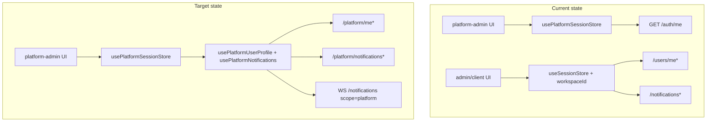
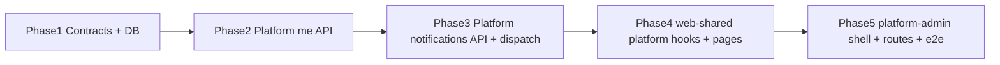

# Platform admin profile, settings, and notifications

## Verdict

**Yes — feasible with a dedicated platform account slice.**  
**No — not as a thin frontend-only change.** Dropping existing [`ProfilePage`](packages/web-shared/src/features/account/profile-page.tsx), [`AccountSettingsPage`](packages/web-shared/src/features/account/account-settings-page.tsx), and [`NotificationsPage`](packages/web-shared/src/features/notifications/notifications-page.tsx) into [`apps/platform-admin`](apps/platform-admin) will fail today because:

| Layer | Tenant apps (admin/client) | Platform admin today | Blocker |
|-------|---------------------------|----------------------|---------|
| Identity | `users` + workspace JWT | `platform_users` + platform JWT | Different tables and JWT claims |
| Profile API | `GET/PATCH /users/me` via [`JwtAuthGuard`](apps/api/src/common/guards/jwt-auth.guard.ts) | Only `GET /auth/me` → minimal [`PlatformSessionDto`](packages/contracts/src/dto/platform.dto.ts) | Guard requires `tenantId` + `workspaceId`; platform tokens rejected |
| Preferences | `User.preferences` JSON | Not stored on [`PlatformUser`](apps/api/prisma/schema.prisma) | No schema field |
| Notifications | `notifications` table keyed by `userId + workspaceId` | None | Model and dispatch pipeline are workspace-scoped |
| Frontend hooks | [`useUserProfile`](packages/web-shared/src/features/account/use-user-profile.ts), [`useNotificationUnreadCount`](packages/web-shared/src/hooks/use-notifications.ts) require `useSessionStore().workspaceId` | Uses [`usePlatformSessionStore`](packages/web-shared/src/stores/platform-session.store.ts) only | Hard workspace coupling |
| Realtime | Socket auth via tenant token; event schema requires `workspaceId` | Socket manager reads tenant [`getAccessToken`](packages/web-shared/src/stores/session.store.ts) | Platform scope unsupported |



---

## What “like other users” should mean for platform staff

Reuse **UX patterns and shared UI primitives**, not the full tenant feature set.

| Feature | Parity target | Exclude from v1 |
|---------|---------------|-----------------|
| **Profile** | Name, email, role badge, change display name | Work details, hourly rate, Jira integrations |
| **Settings → Appearance** | Theme (light/dark/system), persisted per platform user | — |
| **Settings → Security** | Change password, active sessions, revoke others | 2FA can follow tenant pattern in a fast-follow |
| **Settings → Notifications** | Platform-specific preference toggles (in-app + email) | Member/admin timesheet/project toggles |
| **Settings → Time / Account prefs** | Skip | Workspace/timezone prefs are tenant concepts |
| **Notifications inbox** | Full page + header bell + unread badge + mark read + realtime push | Workspace data invalidation hooks |

Suggested **platform notification events** (map to audit/ops actions already in [`PlatformAuditService`](apps/api/src/modules/platform/application/platform-audit.service.ts) and ops summary):

- Tenant created / updated / suspended / churned / deleted
- Subscription drift detected ([`platformOpsSummarySchema.reconcile`](packages/contracts/src/dto/platform.dto.ts))
- Bull queue failure threshold (from ops dashboard queues)
- Optional fast-follow: trial ending, past-due subscription spike

---

## Recommended architecture

### 1. Contracts first ([`packages/contracts`](packages/contracts))

Add under `ROUTES.PLATFORM`:

- `ME: "/platform/me"`
- `ME_PREFERENCES: "/platform/me/preferences"`
- `ME_PASSWORD: "/platform/me/password"`
- `ME_SESSIONS`, `ME_SESSIONS_REVOKE`, etc. (mirror tenant session routes)
- `NOTIFICATIONS`, `NOTIFICATIONS_UNREAD_COUNT`, `NOTIFICATIONS_MARK_ALL_READ`, `NOTIFICATION_BY_ID`

New DTOs:

- `PlatformUserProfileDto` — id, email, name, platformRole, preferences, effectiveTheme
- `PlatformNotificationDto` — same shape as tenant notification minus `workspaceId`
- `platformNotificationTypeSchema` + `platformNotificationPreferenceKeys` (e.g. `tenantLifecycle`, `queueFailures`, `subscriptionDrift`, `securityAlerts`)
- `platformNotificationCreatedEventSchema` — **separate from tenant event** (no required `workspaceId`) to avoid breaking [`notificationCreatedEventSchema`](packages/contracts/src/notification-realtime.ts)

### 2. Database ([`apps/api/prisma/schema.prisma`](apps/api/prisma/schema.prisma))

Extend `PlatformUser`:

```prisma
preferences Json @default("{}")
// optional fast-follow: totpSecret, totpEnabledAt, avatarUrl
```

New model:

```prisma
model PlatformNotification {
  id             String   @id @default(uuid())
  platformUserId String   @map("platform_user_id")
  type           String
  title          String
  body           String
  metadata       Json     @default("{}")
  readAt         DateTime? @map("read_at")
  createdAt      DateTime @default(now()) @map("created_at")
  platformUser   PlatformUser @relation(...)
  @@index([platformUserId, createdAt(sort: Desc)])
}
```

### 3. API ([`apps/api/src/modules/platform`](apps/api/src/modules/platform))

Split into vertical slices (per [`chronomint-api-slice`](.cursor/skills/chronomint-api-slice/SKILL.md)):

**Platform account module**

- Controller guarded by [`PlatformJwtAuthGuard`](apps/api/src/common/guards/platform-jwt-auth.guard.ts)
- Service methods: get/update profile, update preferences, change password (reuse password hashing from auth module)
- Sessions: list/revoke [`PlatformRefreshToken`](apps/api/prisma/schema.prisma) rows (same UX as tenant sessions)

**Platform notifications module**

- Mirror [`NotificationsController`](apps/api/src/modules/notifications/interface/http/notifications.controller.ts) API surface
- `PlatformNotificationsDispatchService` — create in-app (+ email via existing [`NotificationMailer`](apps/api/src/common/mailer/notification.mailer.ts)) respecting platform user prefs
- Fan-out policy: notify **all active SUPERADMIN** platform users (staff team is small; avoids per-user targeting complexity in v1)
- Emit from existing mutation points:
  - [`platform-tenants.controller.ts`](apps/api/src/modules/platform/interface/http/platform-tenants.controller.ts) after create/update/suspend/delete
  - Ops drift job or on-demand when [`platform-ops.service`](apps/api/src/modules/platform/application/platform-ops.service.ts) detects drift
  - Queue monitor when failed count crosses threshold

**Realtime**

- Extend [`NotificationsGateway.authenticate`](apps/api/src/modules/notifications/interface/ws/notifications.gateway.ts) to accept `scope: "platform"` and call `verifyPlatformAccessToken`
- Use dedicated Redis channel prefix, e.g. `platform-notifications:{platformUserId}`, to avoid conflating with tenant user channels

### 4. Shared frontend ([`packages/web-shared`](packages/web-shared))

Prefer **small platform-specific exports** over forcing tenant hooks to accept optional workspace:

| New export | Based on |
|------------|----------|
| `usePlatformUserProfile` | Pattern from `use-user-profile.ts`, keyed on `usePlatformSessionStore` |
| `usePlatformNotifications` / `usePlatformNotificationSocket` | Pattern from `use-notifications.ts` + `notification-socket-manager.ts`, using platform access token |
| `PlatformProfilePage` | Subset of profile tabs: Personal Info only |
| `PlatformAccountSettingsPage` | Reuse `SettingsShell` + `AppearanceSection` + `SecuritySection` + new `PlatformNotificationsSection` |
| `PlatformNotificationsPage` | Clone/adapt `NotificationsPage` without workspace pagination keys |

Also fix theme for platform app: [`Providers`](packages/web-shared/src/components/providers.tsx) currently reads only `useSessionStore`; when `NEXT_PUBLIC_AUTH_SCOPE=platform`, bind theme storage to platform user id.

Generalize [`ShellHeaderActions`](packages/web-shared/src/components/shell-header-actions.tsx) to accept `userName` / `avatarUserId` props so platform shell does not depend on tenant session.

### 5. Platform-admin app ([`apps/platform-admin`](apps/platform-admin))

**Routes** (mirror admin app thin wrappers):

- `src/app/(platform)/profile/page.tsx` → `PlatformProfilePage`
- `src/app/(platform)/settings/page.tsx` → `PlatformAccountSettingsPage`
- `src/app/(platform)/notifications/page.tsx` → `PlatformNotificationsPage`

**Shell updates** in [`platform-shell.tsx`](apps/platform-admin/src/components/platform-shell.tsx):

- Add `ShellHeaderActions` with `profileHref="/profile"`, `settingsHref="/settings"`, `notificationsHref="/notifications"`
- Add `/notifications` nav item with unread badge
- Fix `SidebarUserFooter.profileHref` from `/tenants` → `/profile`
- Wire `usePlatformNotificationSocket` + `usePlatformNotificationUnreadCount`

---

## Testing (required per repo policy)

- **Contracts**: route/DTO specs in `packages/contracts/src/*.spec.ts`
- **API**: unit specs for platform profile + notification services; e2e in `apps/api/test/platform-profile.e2e.ts`, `platform-notifications.e2e.ts`
- **UI**: Playwright in `apps/platform-admin/e2e/` — profile edit, settings theme save, notification mark-read, bell badge
- Pre-PR gate: `pnpm format:check && pnpm lint && pnpm typecheck && pnpm test && pnpm build`

---

## Phased delivery (recommended)



| Phase | Deliverable | Unblocks |
|-------|-------------|----------|
| **1** | Contracts + Prisma migration | All other work |
| **2** | `/platform/me*` (profile, prefs, password, sessions) | Profile + settings UI |
| **3** | `/platform/notifications*` + dispatch hooks + WS platform auth | Inbox + bell |
| **4** | web-shared platform pages/hooks + theme fix | App wiring |
| **5** | platform-admin routes, shell, e2e | User-visible parity |

**Fast-follow (not v1):** 2FA for platform users, avatar upload, per-user notification targeting, email digest batching.

---

## Risk notes

- **Contract change is LSA-gated** — plan assumes contracts edits are approved before API/FE implementation.
- **ID collision** — tenant `users.id` and `platform_users.id` are both UUIDs; use separate Redis channels and separate notification tables (do not reuse tenant `notifications` table).
- **Small staff set** — fan-out to all platform users is acceptable for v1; revisit if multiple platform roles are added later.
- **Audit log vs inbox** — audit log remains the authoritative compliance record; notifications are actionable alerts with read state.

---

## Effort estimate

Medium–large feature (~3–5 dev days): one migration, ~6–8 new API endpoints, notification dispatch integration, web-shared platform variant, shell wiring, and full test coverage. Much smaller than rebuilding tenant account UX from scratch because shared UI shells and notification patterns already exist.
