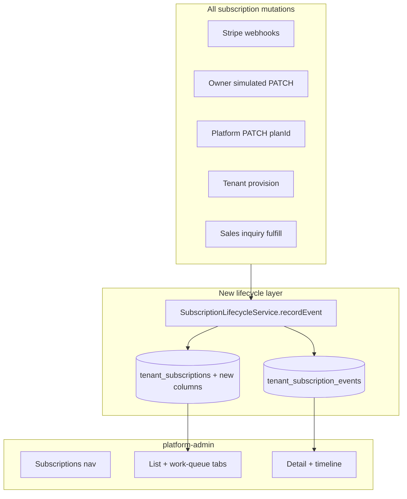

# Platform Subscriptions Console (prod-grade)

## Problem

Subscription data partially exists but is invisible or incomplete for platform ops:

| Need | Today | Gap |
|------|-------|-----|
| When billing cycle ends | `tenant_subscriptions.current_period_end` synced from Stripe | **Not shown** in [tenant-detail-page.tsx](apps/platform-admin/src/features/tenants/tenant-detail-page.tsx); null for simulated/manual subs |
| Which plan | Plan on tenant list + detail | List missing **status**, **cycle end**, **interval** |
| How long on plan | — | **No `planAssignedAt` or history** — only `createdAt` (total subscription age) |
| Fleet billing ops | Per-tenant sales card + Ops aggregates | **No cross-tenant inbox** |

Contracts already expose `currentPeriodEnd` / `trialEndsAt` on detail DTO ([platform.dto.ts](packages/contracts/src/dto/platform.dto.ts) `platformTenantSubscriptionSummarySchema`) — API returns them; UI ignores them.

---

## Data model (Prisma migration)

Extend [`TenantSubscription`](apps/api/prisma/schema.prisma):

| Column | Type | Purpose |
|--------|------|---------|
| `current_period_start` | `DateTime?` | Cycle start (Stripe sync or synthetic for manual) |
| `billing_interval` | `String?` | `monthly` \| `yearly` |
| `plan_assigned_at` | `DateTime` | Start of **current** plan tenure (updated on every `planId` change) |
| `billing_source` | `String` | `stripe` \| `simulated` \| `manual` (platform assign / enterprise) |

New immutable table `tenant_subscription_events`:

| Column | Notes |
|--------|-------|
| `id`, `tenant_id`, `subscription_id` | FK to subscription |
| `event_type` | `created`, `plan_changed`, `status_changed`, `period_renewed`, `trial_started`, `trial_ended`, `canceled` |
| `occurred_at` | Business timestamp (Stripe period boundary or mutation time) |
| `from_plan_id`, `to_plan_id` | Nullable UUIDs |
| `from_status`, `to_status` | Nullable strings |
| `actor_type` | `system` \| `platform_user` \| `tenant_owner` |
| `actor_id` | Nullable platform user / tenant user id |
| `metadata` | JSON — `stripeEventId`, `salesInquiryId`, `billingInterval`, etc. |
| `created_at` | Insert time |

Indexes: `(tenant_id, occurred_at DESC)`, `(event_type, occurred_at)`.

**Backfill migration:** set `plan_assigned_at = created_at`, `billing_source = 'manual'` where no Stripe id; run one-off reconcile for Stripe rows to populate period fields.

---

## Contracts (`packages/contracts`)

Add to [routes.ts](packages/contracts/src/routes.ts):

- `GET /platform/subscriptions` — paginated fleet list
- `GET /platform/subscriptions/work-queue` — actionable items + tab counts
- `GET /platform/subscriptions/:tenantId` — subscription detail + timeline
- `GET /platform/subscriptions/:tenantId/events` — paginated events (optional if detail embeds first page)

New DTOs in `platform-subscription.dto.ts`:

- `platformSubscriptionListItemSchema` — tenant summary + plan, status, `billingInterval`, `currentPeriodStart/End`, `trialEndsAt`, `planAssignedAt`, `billingSource`, `daysOnPlan` (computed server-side), `workItem` (nullable enum: `past_due`, `trial_ending`, `sales_open`, `sales_receipt_submitted`, `drift`)
- `platformSubscriptionDetailSchema` — extends list item + `stripeCustomerId`, `stripeSubscriptionId`, `limitsOverride`, recent events
- `platformSubscriptionEventSchema` — timeline row
- `platformSubscriptionWorkQueueSchema` — `{ counts: { pastDue, trialEnding, salesPending, receiptReview, drift }, items: [...] }`
- Query schemas: filters by `status`, `planSlug`, `billingSource`, `renewingWithinDays`, `workItem`

Update `platformTenantSubscriptionSummarySchema` to include the new fields so [tenant-detail-page.tsx](apps/platform-admin/src/features/tenants/tenant-detail-page.tsx) stays in sync without a second fetch.

---

## API (`apps/api`)

New vertical slice: `modules/platform/application/platform-subscriptions.service.ts` + `interface/http/platform-subscriptions.controller.ts`.

**List query** joins `tenants` + `tenant_subscriptions` + `plans`, ordered by `current_period_end ASC NULLS LAST` (renewals soonest first) with existing pagination pattern from [platform-tenants.service.ts](apps/api/src/modules/platform/application/platform-tenants.service.ts).

**Work queue** (single endpoint, tabbed client-side):

| Tab | Query rule |
|-----|------------|
| Past due | `status = past_due` |
| Trials ending | `status = trial` AND `trial_ends_at <= now + 7d` |
| Sales pending | open sales inquiries (`open`, `awaiting_receipt`, `receipt_submitted`) joined to tenant |
| Drift | subscriptions where Stripe reconcile mismatch (reuse logic from [platform-ops.service.ts](apps/api/src/modules/platform/application/platform-ops.service.ts) `countSubscriptionDrift`) |

**Centralized recorder** — `SubscriptionLifecycleService` in `modules/subscriptions/application/`:

Call from every mutation path (single place for prod-grade consistency):

1. [subscription-sync.service.ts](apps/api/src/modules/subscriptions/application/subscription-sync.service.ts) — Stripe webhook sync; capture `current_period_start`, interval from `price.recurring.interval`, record `period_renewed` / `plan_changed` / `status_changed`
2. [subscriptions.service.ts](apps/api/src/modules/subscriptions/application/subscriptions.service.ts) `changePlan` — set synthetic period (`now` → `+1mo` or `+1yr` from request/default monthly), `billing_source = simulated`, `plan_assigned_at = now`
3. [platform-tenants.service.ts](apps/api/src/modules/platform/application/platform-tenants.service.ts) — plan/status/limits changes; pass `actorType: platform_user`, `actorId` from JWT
4. Tenant provisioning + [subscription-sales-inquiry.service.ts](apps/api/src/modules/subscriptions/application/subscription-sales-inquiry.service.ts) fulfill — use `billing_interval` from inquiry when fulfilling enterprise

On `planId` change: always update `plan_assigned_at` and append `plan_changed` event with from/to plan ids.

---

## Platform-admin UI (`apps/platform-admin`)

### Nav

Add **Subscriptions** to [platform-shell.tsx](apps/platform-admin/src/components/platform-shell.tsx) console nav (between Tenants and Plans). Update [resolve-platform-shell-nav.ts](apps/platform-admin/src/lib/resolve-platform-shell-nav.ts) `CONSOLE_PATH_PREFIXES`.

### Pages

| Route | Component | Behavior |
|-------|-----------|----------|
| `/subscriptions` | `subscriptions-list-page.tsx` | Data table: Org, Plan, Status, Interval, Cycle ends, On plan since, Source. Tabs: **All**, **Needs action**, **Past due**, **Trials ending**, **Sales pending** |
| `/subscriptions/[tenantId]` | `subscription-detail-page.tsx` | Full billing card + **Timeline** (paginated events) + quick links to tenant detail / sales actions |

Reuse table/filter patterns from [tenant-list-page.tsx](apps/platform-admin/src/features/tenants/tenant-list-page.tsx) and [ops-dashboard-page.tsx](apps/platform-admin/src/features/ops/ops-dashboard-page.tsx).

**Tenant detail enhancement** (small): show `currentPeriodEnd`, `trialEndsAt`, `planAssignedAt`, interval in existing Subscription card — data already in API response.

**Work-queue actions** (inline from list where possible):

- Past due → link to tenant detail
- Sales `receipt_submitted` → download receipt + **Assign plan** (reuse plan select from tenant detail; PATCH `planId`)
- Sales `open` → **Send instructions** (existing API)

### web-shared

- `usePlatformSubscriptions`, `usePlatformSubscriptionDetail`, `usePlatformSubscriptionWorkQueue` hooks

---

## Display rules (UI copy)

| Status | “Cycle ends” column |
|--------|---------------------|
| `trial` | Show `trialEndsAt` labeled “Trial ends” |
| `active` / `past_due` | Show `currentPeriodEnd` labeled “Renews” |
| `canceled` / `suspended` | Show “—” or last period end from latest event |
| Manual enterprise (no Stripe) | Synthetic period from fulfill date + `billingInterval` |

**On plan since:** format `planAssignedAt` + relative duration (“84 days”).

---

## Tests and docs

Per [chronomint-test-delivery](.cursor/skills/chronomint-test-delivery/SKILL.md):

- Contract specs for new DTOs/routes
- `subscription-lifecycle.service.spec.ts` — event recording on plan/status changes
- `platform-subscriptions.service.spec.ts` — list filters, work-queue counts, tenure math
- `apps/api/test/platform-subscriptions.e2e.ts`
- `apps/platform-admin/e2e/subscriptions.spec.ts` — list tabs, detail timeline, work-queue action
- Update [platform-admin.md](docs/specs/platform-admin.md) and [subscriptions.md](docs/specs/subscriptions.md)

---

## Out of scope (follow-ups)

- Yearly Stripe Checkout (`stripePriceIdYearly`) — interval for self-serve yearly still limited until [modern plan page plan](.cursor/plans/modern_plan_page_ui_839e1435.plan.md) lands; manual/enterprise interval from sales inquiry works in v1
- Stripe Dashboard deep links / cancel-from-console
- Custom plan pricing beyond catalog `limitsOverride`
- Replacing tenant list — tenants page stays; subscriptions is the billing ops view

---

## Implementation order

1. Contracts + migration + backfill
2. `SubscriptionLifecycleService` + wire all mutation paths
3. Platform subscriptions API (list, detail, events, work-queue)
4. web-shared hooks
5. platform-admin UI (nav, list with tabs, detail + timeline)
6. Tenant detail subscription card polish
7. Tests + docs
