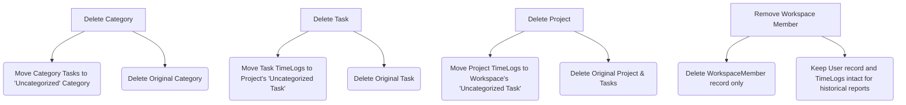

# Implementation Plan: Preserving Logged Time on Deletions

This plan details how the application will gracefully handle deletions of **Projects (Plans)**, **Categories**, **Tasks**, and **Workspace Members** by automatically preserving historical logged timesheet hours for reporting, dashboards, and auditing.

---

## User Review Required

> [!IMPORTANT]
> **Data Integrity & Clutter Prevention**
> Currently, deleting a Project or Task cascades and deletes all associated time logs from the database, leading to permanent loss of logged hours.
> Under this plan, we implement the following safeguards:
> - **Categories**: Deleting a Category automatically moves all its tasks to a default workspace-level `"Uncategorized"` Category.
> - **Projects & Tasks**: Deleting a Project/Task deletes the task records themselves (to avoid cluttering your views with old task names) but moves all associated `TimeLog` records into a single, workspace-level `"Uncategorized Task"` under the `"Uncategorized"` project.
> - **Workspace Members**: Removing a member from a workspace deletes their membership link but **does not delete their User record or historical TimeLogs**. All of their logged hours and names are naturally preserved in reports by design.

---

## Proposed Solution



### 1. Categories Service Deletion Logic
When a Category `C` is deleted:
1. Prevent deletion of the default `"Uncategorized"` category itself.
2. Find or create a default category named `"Uncategorized"` in the workspace.
3. Update all tasks currently associated with category `C.id` to reference `Uncategorized.id`.
4. Delete the category `C`.

### 2. Projects Service Deletion Logic
When a Project `P` is deleted:
1. Prevent deletion of the default `"Uncategorized"` project itself.
2. Find or create a default project named `"Uncategorized"` in the workspace.
3. Ensure a `Team` record exists for the `"Uncategorized"` project.
4. Find or create the default `"Uncategorized"` category in the workspace.
5. Find or create a task named `"Uncategorized Task"` under the `"Uncategorized"` project.
6. Find all tasks belonging to the project `P.id` being deleted.
7. Update all `TimeLog`s currently pointing to those tasks to point to the `"Uncategorized Task"` under the `"Uncategorized"` project.
8. Delete the project `P`.

### 3. Tasks Service Deletion Logic
When a Task `T` is deleted:
1. Prevent deletion of any `"Uncategorized Task"` itself.
2. Find or create the workspace's default `"Uncategorized"` category.
3. Find or create a task named `"Uncategorized Task"` under the same project `T.projectId` associated with the `"Uncategorized"` category.
4. Update all time logs currently referencing task `T.id` to reference the `UncategorizedTask.id`.
5. Delete the task `T`.

### 4. Workspace Member Deletion (No Code Changes Needed)
When a Workspace Member is removed:
1. The API deletes the `WorkspaceMember` membership link in the database.
2. The `User` record and `TimeLog` records are **retained** in the database.
3. The reporting engine (`time-aggregation.service.ts`) fetches names/emails directly from the `User` table. Therefore, all historical hours logged by the removed member remain fully visible in historical workspace reports.

---

## Proposed Changes

### Backend API

#### [MODIFY] [categories.service.ts](file:///Users/chamal/Desktop/ChronoMint/apps/api/src/modules/categories/application/categories.service.ts)
- Modify the `remove` method to:
  - Throw error if the category name is `"Uncategorized"`.
  - Lazy-load/create `"Uncategorized"` category.
  - Re-associate tasks instead of throwing conflict errors.

#### [MODIFY] [projects.service.ts](file:///Users/chamal/Desktop/ChronoMint/apps/api/src/modules/projects/application/projects.service.ts)
- Modify the `remove` method to:
  - Throw error if project name is `"Uncategorized"`.
  - Lazy-load/create `"Uncategorized"` project, team, default category, and default task.
  - Re-associate `TimeLog`s from the project's tasks to the workspace `"Uncategorized Task"`.

#### [MODIFY] [tasks.service.ts](file:///Users/chamal/Desktop/ChronoMint/apps/api/src/modules/tasks/application/tasks.service.ts)
- Modify the `remove` method to:
  - Throw error if task name is `"Uncategorized Task"`.
  - Lazy-load/create `"Uncategorized"` category and `"Uncategorized Task"` for the project.
  - Re-associate `TimeLog`s to the `"Uncategorized Task"`.

---

## Verification Plan

### Automated Tests
We will add unit tests in the respective spec files to assert:
1. Deleting a category updates tasks to point to `"Uncategorized"` and deletes the category.
2. Deleting a project updates all its tasks' time logs to point to `"Uncategorized Task"` inside the `"Uncategorized"` project.
3. Deleting a task updates its time logs to point to `"Uncategorized Task"` in the same project.
4. Default `"Uncategorized"` entities cannot be deleted.

Commands to run verification:
```bash
corepack pnpm --filter @kloqra/api test
corepack pnpm --filter @kloqra/api typecheck
```
