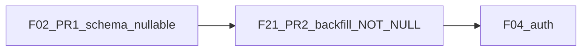

# SaaS-F02 — Tenant schema (research + implementation plan)

## Research summary

### Current state

| Area | Finding |
|------|---------|
| Prisma | Single schema at [`apps/api/prisma/schema.prisma`](apps/api/prisma/schema.prisma) — `Workspace` has no `tenant_id`; 36 migrations; string roles (no Prisma enums for workspace roles) |
| Contracts | **Done (F01/F03):** [`tenant-rbac.ts`](packages/contracts/src/tenant-rbac.ts), [`dto/tenant.dto.ts`](packages/contracts/src/dto/tenant.dto.ts), `ROUTES.TENANTS` / `ROUTES.PLATFORM` |
| API | **No tenant code** — `WorkspaceService.create` still creates orphan workspaces ([`workspace.service.ts`](apps/api/src/modules/workspace/application/workspace.service.ts)) |
| Auth | Uses `user.memberships[0]` — unchanged until **F04** |
| Seed | 3 workspaces (`acme`, `meridian`, `apex`); `admin@`, `ops@`, `member@` in **all three** via `wsMembers()` — **violates D08** if mapped 1 workspace = 1 tenant |

### Locked decisions that constrain F02

From [SAAS_PLATFORM_PLAN.md §7](docs/architecture/SAAS_PLATFORM_PLAN.md) and [TENANT_DOMAIN_MODEL.md](docs/architecture/TENANT_DOMAIN_MODEL.md):

- **D08:** `tenant_members` has `UNIQUE(user_id)` — one Organization per user
- **D15:** User may have multiple `workspace_members` rows **within the same tenant**
- **D16:** `tenants.status` includes `pending_setup` for superadmin-provisioned orgs
- **Backward compat (§7.3):** `workspaces.tenant_id` nullable in first PR; NOT NULL after F21 backfill

### Explicitly out of F02 scope

| Deferred epic | Reason |
|---------------|--------|
| **F04** | JWT `tenantId`, `TenantGuard`, switch-workspace tenant check |
| **F06–F07** | Tenant/workspace HTTP APIs |
| **F08+** | Admin Account UI (`features/account/`, `@kloqra/ui`) |
| **F09** | `plans`, `tenant_subscriptions` tables (P2; `tenantOverviewSchema` subscription field is API stub until then) |
| **F11+** | Stripe |
| **F14** | `platform-admin` app / superadmin user table |

F02 is **schema + seed + migration tests only** — no behavior change for existing login or workspace routes.

---

## F02 research gate resolutions

### 1. Migration strategy (D09) — updated per your direction

**Demo seed (F02):** Restructure to **one tenant, three workspaces** — showcases the real SaaS model (Organization → multiple workspaces).

```mermaid
flowchart TB
  subgraph demoTenant [DemoTenant_kloqra_demo]
    WS1[Workspace_acme]
    WS2[Workspace_meridian]
    WS3[Workspace_apex]
  end
  Owner[admin@_OWNER]
  Ops[ops@_tenant_ADMIN]
  Member[member@_multi_workspace_MEMBER]
  Owner --> demoTenant
  Ops --> demoTenant
  Member --> WS1
  Member --> WS2
  Member --> WS3
```

**Production pilots (F21):** Default mapping becomes **one tenant per customer organization**, with **N workspaces** under that tenant (not forced 1:1). For pilots that today have only one workspace, this is still 1 tenant + 1 workspace.

**Pre-migration audit (F21, required):** SQL/script must detect users who would belong to **more than one tenant** after grouping. Current shared demo users are the canonical failure case — production must resolve (split accounts, remove cross-org memberships, or confirm workspaces belong to same org) before NOT NULL.

**Recommendation:** Close D09 as: *"One tenant per customer org; multiple workspaces per tenant; migration fails on cross-tenant user conflict."*

### 2. Soft-delete vs hard-delete

**Decision:** **Status enum only** — no `deleted_at` on `tenants`.

Align with [`tenantStatusSchema`](packages/contracts/src/tenant-rbac.ts): `pending_setup | active | suspended | churned`. Rows retained for audit; `churned` blocks new activity (enforced in F12/F10 later). Matches existing pattern (`workspace_members.is_active`, no soft-delete on workspaces).

### 3. Unique constraints

| Constraint | F02 action |
|------------|------------|
| `tenants.slug` | **Global unique** (same as `workspaces.slug` today) |
| `tenant_members.user_id` | **Unique** (D08) |
| `tenant_members(tenant_id, user_id)` | Redundant with `user_id` unique — use `@@unique([userId])` only |
| Workspace slug per tenant | **Keep global unique on `workspaces.slug`** for F02 — avoids URL/routing churn; revisit only if collisions appear across tenants |
| Email per tenant invite | **Not in F02** — no invite table yet (F06/F07) |

### 4. Index plan

| Index | Purpose |
|-------|---------|
| `workspaces(tenant_id)` | Tenant-scoped listing (F06/F07) |
| `tenant_members(tenant_id)` | List org members |
| `tenant_members(user_id)` | Implicit via UNIQUE |

No index on `(user_id, tenant_id)` — single-column unique on `user_id` suffices.

### 5. Minor contract gap

[`tenantSchema`](packages/contracts/src/dto/tenant.dto.ts) omits `settings` jsonb proposed in F02 epic text. Add optional `settings: z.record(z.unknown()).optional()` in the same PR to keep contract ↔ DB aligned (no API exposure yet).

**Do not** add `tenantId` to [`workspaceSchema`](packages/contracts/src/dto/workspace.dto.ts) until F04/F07 need it in responses — avoids premature API surface.

### 6. `tenant_members.role` values

Prisma: `String` column (consistent with `workspace_members.role`). Values: `OWNER | ADMIN` per [`tenantMemberRoleSchema`](packages/contracts/src/tenant-rbac.ts). Optional SQL `CHECK` in migration for defense-in-depth.

---

## Proposed Prisma models

Add to [`schema.prisma`](apps/api/prisma/schema.prisma):

```prisma
model Tenant {
  id        String   @id @default(uuid())
  name      String
  slug      String   @unique
  status    String   @default("pending_setup")
  settings  Json     @default("{}")
  createdAt DateTime @default(now()) @map("created_at")
  updatedAt DateTime @updatedAt @map("updated_at")

  members    TenantMember[]
  workspaces Workspace[]

  @@map("tenants")
}

model TenantMember {
  id        String   @id @default(uuid())
  tenantId  String   @map("tenant_id")
  userId    String   @unique @map("user_id")
  role      String
  isActive  Boolean  @default(true) @map("is_active")
  createdAt DateTime @default(now()) @map("created_at")

  tenant Tenant @relation(fields: [tenantId], references: [id], onDelete: Cascade)
  user   User   @relation(fields: [userId], references: [id], onDelete: Cascade)

  @@index([tenantId])
  @@map("tenant_members")
}
```

Extend `Workspace`:

```prisma
tenantId String? @map("tenant_id")
tenant   Tenant? @relation(...)
@@index([tenantId])
```

Extend `User`:

```prisma
tenantMembership TenantMember?
```

**FK delete behavior:** `onDelete: Cascade` on tenant → workspaces (tenant delete removes workspaces — acceptable for v1 superadmin ops; document in runbook). Alternative: `Restrict` if legal retention required — **recommend Cascade for F02** with `churned` status used instead of delete in product flows.

---

## PR split (continuity-safe per §7.3)



### PR 1 — `SaaS-F02: tenant tables and nullable workspace FK`

1. Prisma models + migration SQL
2. Contract: optional `settings` on `tenantSchema` + spec
3. Seed restructure (see below)
4. Tests (see below)
5. Update F02 research gate checkboxes in SAAS plan; `TASK_BOARD` → F02 `in_progress` → `done`

`workspaces.tenant_id` stays **nullable** so existing deploys migrate without immediate data.

### PR 2 — `SaaS-F21: backfill tenant_id and enforce NOT NULL` (separate epic, same sprint)

1. `scripts/migrate-pilots-to-tenants.ts` + `docs/runbooks/tenant-migration.md`
2. Pre-flight audit: cross-tenant user detection
3. Follow-up migration: `ALTER COLUMN tenant_id SET NOT NULL`
4. Run on pilot DB copy before production

**Do not merge PR2 until PR1 is on `dev`.**

---

## Seed restructure (your requirement)

Files: [`seed-data.ts`](apps/api/prisma/seed-data.ts), [`seed.ts`](apps/api/prisma/seed.ts), [`seed-data.spec.ts`](apps/api/prisma/seed-data.spec.ts).

| Before | After |
|--------|-------|
| 3 independent workspaces | **1 tenant** (e.g. `slug: kloqra-demo`, `name: Kloqra Demo Organization`, `status: active`) |
| No `tenant_members` | `admin@` → `OWNER`; `ops@` → `ADMIN`; all other users → single `tenant_members` row only if they need org-level access (members get access via workspace only — **no tenant_members row required for plain members** unless F06 requires it) |

**Clarification on member rows:** Tenant **owner/delegate** need `tenant_members`. Workspace **members** only need `workspace_members` (per TENANT_RBAC). Seed should create:

- 1 `Tenant`
- 2 `TenantMember` rows (`admin@` OWNER, `ops@` ADMIN)
- 3 `Workspace` rows with `tenant_id` set
- Existing `workspace_members` / projects / logs unchanged in structure

Update `resetDatabase()` delete order: `tenantMember` → `workspace` → `tenant` (after children).

Add optional second tenant in seed (SAAS plan exit: "2 tenants, 3 workspaces") — e.g. `pending-setup` tenant with zero workspaces for D16 demo — **optional stretch**, not blocking.

---

## Tests (test-with-feature)

| Test | Path | Asserts |
|------|------|---------|
| Contract settings field | [`tenant-rbac.spec.ts`](packages/contracts/src/tenant-rbac.spec.ts) or `tenant.dto` spec | `tenantSchema` accepts `settings` |
| Seed invariants | [`seed-data.spec.ts`](apps/api/prisma/seed-data.spec.ts) | Document expected tenant/workspace layout; no user appears in workspaces with mismatched `tenant_id` after seed |
| Schema integration | **New** `apps/api/prisma/tenant-schema.spec.ts` | After `prisma generate`, `Tenant` / `TenantMember` models exist; `Workspace` has `tenantId` field (type-level / client smoke) |
| Migration SQL review | Manual + CI `prisma migrate deploy` on test DB | FK + indexes present |

No new API service tests in F02 (no API changes).

---

## Files to touch

| File | Change |
|------|--------|
| [`apps/api/prisma/schema.prisma`](apps/api/prisma/schema.prisma) | Models + relations |
| `apps/api/prisma/migrations/<timestamp>_add_tenants/` | SQL |
| [`apps/api/prisma/seed.ts`](apps/api/prisma/seed.ts) | `seedTenant()`, wire `tenant_id` |
| [`apps/api/prisma/seed-data.ts`](apps/api/prisma/seed-data.ts) | Optional `SEED_TENANT` constant |
| [`apps/api/prisma/seed-data.spec.ts`](apps/api/prisma/seed-data.spec.ts) | Multi-workspace tenant assertions |
| [`packages/contracts/src/dto/tenant.dto.ts`](packages/contracts/src/dto/tenant.dto.ts) | Optional `settings` |
| [`docs/architecture/TENANT_DOMAIN_MODEL.md`](docs/architecture/TENANT_DOMAIN_MODEL.md) | Mark tables as implemented |
| [`docs/architecture/SAAS_PLATFORM_PLAN.md`](docs/architecture/SAAS_PLATFORM_PLAN.md) | Check F02 research gates; note D09 resolution |
| [`TASK_BOARD.json`](TASK_BOARD.json) | F02 `in_progress` → `done` |
| [`docs/runbooks/tenant-migration.md`](docs/runbooks/tenant-migration.md) | F21 only |

**Not touched:** `apps/admin`, `apps/client`, auth module, workspace service behavior.

---

## Risk register

| Risk | Mitigation |
|------|------------|
| Seed shared users across 3 workspaces | **Fixed** by single-tenant seed |
| Production user spans unrelated workspaces | F21 audit script blocks NOT NULL migration; manual remediation |
| Nullable `tenant_id` hides missing backfill | F21 gate + F05 isolation E2E before any billing |
| `tenantOverviewSchema` needs subscription | Seed/API stub deferred to F09; F02 does not block |
| Workspace create without tenant | Allowed until F07; document as known gap |

---

## Exit criteria (F02)

- [ ] `prisma migrate deploy` clean on empty and existing DBs
- [ ] `pnpm --filter @kloqra/contracts test` green
- [ ] `prisma db seed` creates **1 tenant + 3 workspaces** with correct FKs
- [ ] All F02 research gate items checked in SAAS plan
- [ ] D09 documented: org-scoped tenant, multi-workspace allowed, conflict audit required
- [ ] No changes to login, workspace API, or FE apps

---

## After F02 (do not start in same PR)

1. **F21** — backfill + NOT NULL + runbook
2. **F04** — JWT + guards (highest risk)
3. **F05** — isolation E2E (**hard gate**)
4. **F06–F07** — tenant APIs + workspace create restrictions
5. **F08** — Account UI using existing FE conventions
