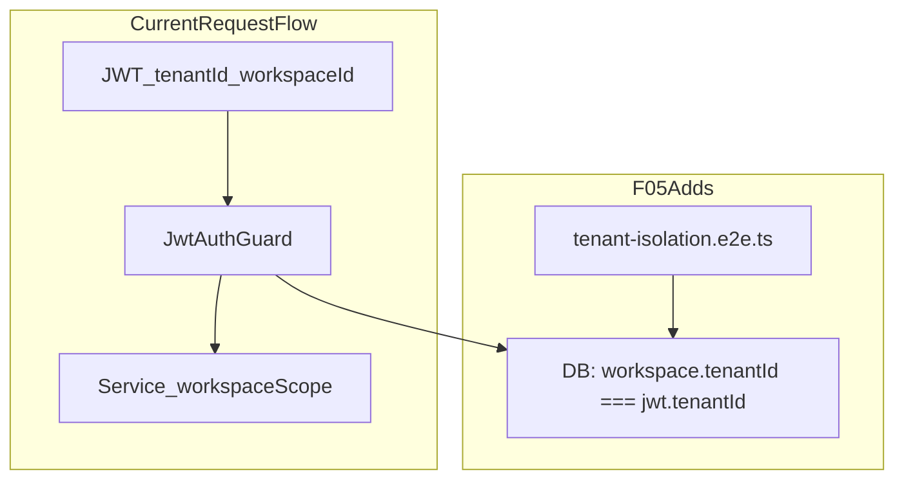

# SaaS-F05 — Data isolation E2E (production gate)

## Context

**Done (F02/F04 partial):**
- Schema: `tenants`, `tenant_members`, required `workspaces.tenant_id`
- JWT + session include `tenantId`; `switch-workspace` calls [`assertWorkspaceInUserTenant`](apps/api/src/common/tenant/tenant-context.ts)
- [`listForUser`](apps/api/src/modules/workspace/application/workspace.service.ts) filters by tenant; create requires tenant `OWNER`

**Gap (why F05 exists):**
- [`JwtAuthGuard`](apps/api/src/common/guards/jwt-auth.guard.ts) resolves `workspaceId` from token/header but **never verifies** that workspace belongs to JWT `tenantId`
- Demo seed is **one tenant** ([`SEED_TENANT`](apps/api/prisma/seed-data.ts)) — no second org to attack in E2E today
- [`SECURITY.md`](docs/development/SECURITY.md) documents workspace isolation only — no tenant section
- F04 research gate items (platform token, refresh `tenantId`) remain deferred; core tenant JWT is shippable



---

## F05 research gate resolutions

| Gate | Resolution |
|------|------------|
| Threat model: IDOR, cross-tenant UUID guess | Document in SECURITY.md; E2E covers switch, list, project/category/workspace admin IDOR |
| D13 no superadmin impersonation | Already decided — no code in F05 |
| Redis/Socket.IO | **Sufficient v1** — keys remain workspace-scoped; tenant boundary enforced at auth + workspace FK; note in SECURITY.md (no Redis changes) |
| Public API keys tenant boundary | **Defer F19** — document prep note only |
| Sentry `tenantId` tag | **Defer F22** — not blocking isolation gate |

---

## 1. Defense-in-depth: tenant workspace guard (completes F04 core)

**File:** [`apps/api/src/common/guards/jwt-auth.guard.ts`](apps/api/src/common/guards/jwt-auth.guard.ts)

After `resolveWorkspaceId(payload.workspaceId, header)`:

1. Load `workspace.tenantId` (single `findUnique` select — cache per-request on `req` to avoid duplicate queries if needed later)
2. If `workspace.tenantId !== payload.tenantId` → `403 FORBIDDEN` ("Workspace does not belong to your organization")
3. Optional fast path: skip DB if `resolvedWorkspaceId === payload.workspaceId` and we trust issuance — **still query** for prod-grade (stale token after tenant move is impossible v1, but catches bad tokens)

Extract helper to [`apps/api/src/common/tenant/tenant-context.ts`](apps/api/src/common/tenant/tenant-context.ts):

```typescript
export async function assertJwtWorkspaceTenant(
  prisma, jwtTenantId: string, workspaceId: string
): Promise<void>
```

**Tests:**
- [`jwt-auth.guard.spec.ts`](apps/api/src/common/guards/jwt-auth.guard.spec.ts) — mock Prisma; reject mismatched tenant
- [`tenant-context.spec.ts`](apps/api/src/common/tenant/tenant-context.spec.ts) — unit tests for new helper

**Inject** `PrismaService` into `JwtAuthGuard` (already pattern in Nest guards elsewhere).

---

## 2. E2E fixture — second tenant (isolated from demo seed)

**New file:** [`apps/api/test/helpers/tenant-isolation-fixture.ts`](apps/api/test/helpers/tenant-isolation-fixture.ts)

`createTenantBFixture(prisma)` creates in `beforeAll`:

| Entity | Values |
|--------|--------|
| Tenant | `slug: isolation-org-b`, `status: active` |
| Owner | `owner-b@kloqra.dev`, `tenant_members.role = OWNER` |
| Workspace | `slug: isolation-ws-b`, `tenant_id` set |
| Member | `member-b@kloqra.dev`, workspace ADMIN + project |
| Project | one project with task (for IDOR targets) |

Uses bcrypt hash `password123` to match existing e2e convention. **Does not modify** main seed — only inserts rows; `afterAll` deletes in FK-safe order (or rely on CI fresh DB per job).

**Update** [`test/helpers/auth.ts`](apps/api/test/helpers/auth.ts):

```typescript
export interface LoginSession {
  accessToken: string;
  tenantId: string;  // new
  workspaceId: string;
  userId: string;
  role: "ADMIN" | "MEMBER";
}
```

Parse `tenantId` from login response body.

---

## 3. `tenant-isolation.e2e.ts` — test matrix

**New file:** [`apps/api/test/tenant-isolation.e2e.ts`](apps/api/test/tenant-isolation.e2e.ts)

Follow existing pattern: `AppModule`, `cookieParser`, `loginAs`, `authedAgent`, `PrismaService`.

| # | Scenario | Actor | Action | Expected |
|---|----------|-------|--------|----------|
| 1 | Cross-tenant switch | Tenant A `member@` | `POST /auth/switch-workspace` with Tenant B `workspaceId` | **403** |
| 2 | Workspace list scoped | Tenant A user | `GET /workspaces` | Only Tenant A slugs (`acme`, `meridian`, `apex`); **not** `isolation-ws-b` |
| 3 | Workspace list scoped | Tenant B owner | `GET /workspaces` | Only `isolation-ws-b` |
| 4 | Project IDOR | Tenant A admin JWT + header for A | `GET /projects/:tenantBProjectId` or list filter | **403/404** (no leak) |
| 5 | Category IDOR | Tenant A admin | Admin category route on Tenant B workspace id in URL | **403** (controller `id !== user.workspaceId` or guard) |
| 6 | JWT/header tenant mismatch | Tenant A token | `X-Workspace-Id` = Tenant B workspace (if token workspace differs) | **403** workspace mismatch OR tenant guard |
| 7 | Session tenant claim | Tenant A login | `tenantId` in body matches demo tenant | **200**, correct `tenantId` |
| 8 | Per-workspace D14 (same tenant) | User in **only** `acme` | Admin route on `meridian` workspace id | **403** — create user `isolated-ws-a@` member of acme only |

Routes to use (from `@kloqra/contracts` `ROUTES`):
- `ROUTES.AUTH.SWITCH_WORKSPACE`
- `ROUTES.WORKSPACES.LIST`
- `ROUTES.PROJECTS.*` / `ROUTES.WORKSPACES.MEMBERS`

**Acceptance:** 403 or 404 only — never 200 with another tenant's data.

---

## 4. SECURITY.md tenant section

**File:** [`docs/development/SECURITY.md`](docs/development/SECURITY.md)

Add **Tenant isolation** section after workspace isolation:

- Organization (`tenants`) is the commercial boundary; workspaces are operational partitions within one tenant
- JWT carries `tenantId` + `workspaceId`; guard verifies workspace FK matches tenant
- `switch-workspace` and workspace list enforce tenant match (D08: one tenant per user)
- IDOR: services must scope by `req.user.workspaceId`; never authorize from body `tenantId`/`workspaceId`
- Redis/Socket.IO: workspace-scoped channels sufficient for P1
- Pen-test checklist: cross-tenant switch, UUID guess on projects/categories — **covered by** `tenant-isolation.e2e.ts`

Cross-link [TENANT_RBAC.md §11](docs/architecture/TENANT_RBAC.md).

---

## 5. CI and TASK_BOARD

**CI:** No new job required — [`test:integration`](package.json) already runs `apps/api/test/**/*.e2e.ts` in the [`integration`](.github/workflows/ci.yml) job (migrate + seed + vitest e2e). `tenant-isolation.e2e.ts` is automatically included.

Optional follow-up (not blocking): path-filtered required check for auth/tenant PRs — defer unless requested.

**TASK_BOARD:**
- SaaS-F05 → `done` when e2e green
- SaaS-F04 → `done` when guard + switch + session shipped (same PR)

**SAAS_PLATFORM_PLAN.md:**
- Check F05 research gates + §7.2 P1 checklist items for isolation e2e
- Bump implemented-in-code scorecard note

---

## 6. Files to touch

| File | Change |
|------|--------|
| `apps/api/src/common/tenant/tenant-context.ts` | `assertJwtWorkspaceTenant` |
| `apps/api/src/common/guards/jwt-auth.guard.ts` | Prisma inject + tenant check |
| `apps/api/src/common/guards/jwt-auth.guard.spec.ts` | Mismatch case |
| `apps/api/test/helpers/tenant-isolation-fixture.ts` | **new** |
| `apps/api/test/helpers/auth.ts` | `tenantId` on `LoginSession` |
| `apps/api/test/tenant-isolation.e2e.ts` | **new** |
| `docs/development/SECURITY.md` | Tenant section |
| `docs/architecture/SAAS_PLATFORM_PLAN.md` | F05 gates + §7.2 checks |
| `TASK_BOARD.json` | F04 done, F05 done |

**Not in scope:** FE changes, `tenants` HTTP module (F06), Sentry, Stripe, Playwright admin/client tests.

---

## 7. Exit criteria

- [ ] `assertJwtWorkspaceTenant` on every authenticated API request
- [ ] `tenant-isolation.e2e.ts` green locally and in CI `integration` job
- [ ] SECURITY.md tenant section published
- [ ] F04 + F05 research gates checked (except platform token / refresh deferrals)
- [ ] §7.2 P1 items: switch verify, isolation e2e, cross-tenant IDOR — checked

---

## 8. After F05 (stop gate lifted)

Per [SAAS_PLATFORM_PLAN.md §7.3](docs/architecture/SAAS_PLATFORM_PLAN.md):

1. **F06** — tenant membership HTTP API (`apps/api/src/modules/tenants/`)
2. **F07** — assign workspace admin flow (remaining F07 items)
3. **F08** — Account UI (`features/account/`, `@kloqra/ui`)
4. **F09+** — plans/billing only after F05 green

Do **not** merge billing (F11) until F05 is green in CI.
