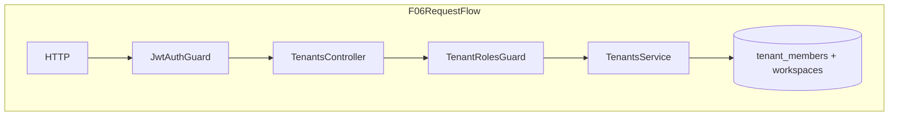

# SaaS-F06 — Tenant membership & overview API

## Context

**Done (F02–F05):**
- Schema: `tenants`, `tenant_members`, `workspaces.tenant_id`
- JWT carries `tenantId`; [`assertJwtWorkspaceTenant`](apps/api/src/common/tenant/tenant-context.ts) on every request
- [`requireTenantOwner`](apps/api/src/common/tenant/tenant-context.ts) already used by [`WorkspaceService.create`](apps/api/src/modules/workspace/application/workspace.service.ts)
- Seed: `admin@` = tenant `OWNER`, `ops@` = tenant `ADMIN`; workspace-only users (e.g. `member@`) have **no** `tenant_members` row
- Contracts routes exist: `ROUTES.TENANTS.*` in [`packages/contracts/src/routes.ts`](packages/contracts/src/routes.ts); DTOs in [`tenant.dto.ts`](packages/contracts/src/dto/tenant.dto.ts)

**Gap:** No `apps/api/src/modules/tenants/` module; [`docs/specs/tenants.md`](docs/specs/tenants.md) still marked "planned".



---

## F06 research gate resolutions

| Gate | Resolution |
|------|------------|
| Who can invite tenant admin? | **Owner only** — `POST MEMBERS` requires `OWNER` |
| Who can list members? | **Owner + tenant ADMIN** — `GET MEMBERS` |
| Seat counting | **Document + compute in OVERVIEW** — distinct active users across `tenant_members` ∪ `workspace_members` for tenant workspaces; **enforce limits in F10** |
| Remove last tenant owner? | **Blocked** — cannot deactivate or demote the sole active `OWNER` |
| Invite second OWNER? | **Blocked** — invites create `ADMIN` only; owner assigned at provisioning (F14/F15) |
| Cross-tenant user (D08) | Reject invite if email already has `tenant_members` for another tenant → `409 CONFLICT` |

---

## 1. Contracts (contract-first)

**File:** [`packages/contracts/src/dto/tenant.dto.ts`](packages/contracts/src/dto/tenant.dto.ts)

Add Zod schemas + types:

```typescript
export const inviteTenantMemberSchema = z.object({
  email: z.string().email(),
  name: z.string().min(1).max(120),
  role: z.literal("ADMIN") // only delegate role via invite
});

export const updateTenantMemberSchema = z.object({
  role: tenantMemberRoleSchema.optional(),
  isActive: z.boolean().optional()
}).refine((v) => v.role !== undefined || v.isActive !== undefined);

export const inviteTenantMemberResponseSchema = z.object({
  member: tenantMemberSchema,
  userCreated: z.boolean(),
  temporaryPassword: z.string().optional()
});
```

**File:** [`packages/contracts/src/contracts.spec.ts`](packages/contracts/src/contracts.spec.ts) — add route + schema smoke tests for `ROUTES.TENANTS.*`.

**No new routes** — use existing contract paths:
- `GET ROUTES.TENANTS.CURRENT`
- `GET ROUTES.TENANTS.OVERVIEW`
- `GET ROUTES.TENANTS.MEMBERS`
- `POST ROUTES.TENANTS.MEMBERS` (invite)
- `PATCH ROUTES.TENANTS.MEMBER(id)`

---

## 2. Tenant RBAC helpers

**File:** [`apps/api/src/common/tenant/tenant-context.ts`](apps/api/src/common/tenant/tenant-context.ts)

Add:

| Helper | Purpose |
|--------|---------|
| `requireTenantMember(prisma, userId, tenantId)` | Active `tenant_members` row; `tenantId` must match JWT |
| `requireTenantOwnerOrAdmin(prisma, userId, tenantId)` | For list members |
| `requireTenantOwner` | Already exists — reuse for invite/patch |

**New guard/decorator** (mirror workspace pattern):

- [`apps/api/src/common/decorators/tenant-roles.decorator.ts`](apps/api/src/common/decorators/tenant-roles.decorator.ts) — `@TenantRoles("OWNER" | "ADMIN")`
- [`apps/api/src/common/guards/tenant-roles.guard.ts`](apps/api/src/common/guards/tenant-roles.guard.ts) — resolves role from DB via `resolveTenantRoleForUser` (JWT does **not** carry `tenantRole` today — avoid F04 scope creep)

**Tests:** extend [`tenant-context.spec.ts`](apps/api/src/common/tenant/tenant-context.spec.ts) + new `tenant-roles.guard.spec.ts`.

---

## 3. Tenants module

**Scaffold** per [`chronomint-api-slice`](.cursor/skills/chronomint-api-slice/SKILL.md):

```
apps/api/src/modules/tenants/
  tenants.module.ts
  application/tenants.service.ts
  application/tenants.service.spec.ts
  interface/http/tenants.controller.ts
```

Register `TenantsModule` in [`apps/api/src/app.module.ts`](apps/api/src/app.module.ts). Import `AuthModule` + `MailerModule` (invite emails reuse [`MemberProvisioningMailer`](apps/api/src/common/mailer/member-provisioning.mailer.ts) / patterns from [`WorkspaceService.invite`](apps/api/src/modules/workspace/application/workspace.service.ts)).

### `TenantsService` methods

| Method | Auth | Behavior |
|--------|------|----------|
| `getCurrent(userId, tenantId)` | `requireTenantMember` | Return `TenantDto` for JWT tenant |
| `getOverview(userId, tenantId)` | `requireTenantOwner` | `TenantOverviewDto`: real `workspaceCount` + `seatCount`; **stub** `subscription` (no `plans` table yet — use inline trial defaults matching `tenantSubscriptionSchema`, e.g. status `trial`, generous limits constant) |
| `listMembers(userId, tenantId)` | `requireTenantOwnerOrAdmin` | Active + inactive members with user name/email |
| `inviteMember(userId, tenantId, dto)` | `requireTenantOwner` | Create/find user; enforce D08; create `tenant_members` with `ADMIN`; optional temp password + email |
| `updateMember(userId, tenantId, memberId, dto)` | `requireTenantOwner` | Patch role/`isActive`; block demoting/deactivating last active `OWNER`; block promoting to second `OWNER` |

All methods scope by `user.tenantId` from JWT — never accept `tenantId` from body.

### `TenantsController`

```typescript
@Controller()
@UseGuards(JwtAuthGuard, TenantRolesGuard)
export class TenantsController {
  @Get(ROUTES.TENANTS.CURRENT)
  getCurrent(@CurrentUser() user) { ... }

  @TenantRoles("OWNER")
  @Get(ROUTES.TENANTS.OVERVIEW)
  getOverview(@CurrentUser() user) { ... }

  @TenantRoles("OWNER", "ADMIN")
  @Get(ROUTES.TENANTS.MEMBERS)
  listMembers(@CurrentUser() user) { ... }

  @TenantRoles("OWNER")
  @Post(ROUTES.TENANTS.MEMBERS)
  inviteMember(@Body(ZodValidationPipe(inviteTenantMemberSchema)) body, @CurrentUser() user) { ... }

  @TenantRoles("OWNER")
  @Patch(ROUTES.TENANTS.MEMBER(":id"))
  updateMember(@Param("id") id, @Body(...), @CurrentUser() user) { ... }
}
```

---

## 4. E2E tests

**New file:** [`apps/api/test/tenants.e2e.ts`](apps/api/test/tenants.e2e.ts)

Reuse [`loginAs`](apps/api/test/helpers/auth.ts) + [`tenant-isolation-fixture`](apps/api/test/helpers/tenant-isolation-fixture.ts) for cross-tenant cases.

| # | Scenario | Actor | Expected |
|---|----------|-------|----------|
| 1 | Get current tenant | `admin@` | 200, `slug: kloqra-demo` |
| 2 | Get overview | `admin@` | 200, `workspaceCount >= 3`, stub subscription shape |
| 3 | List members | `ops@` (tenant ADMIN) | 200, includes `admin@` + `ops@` |
| 4 | Workspace-only user | `member@` | GET CURRENT → **403** |
| 5 | Invite tenant admin | `admin@` POST MEMBERS | 201, new `tenant_members` row |
| 6 | Non-owner invite | `ops@` POST MEMBERS | **403** |
| 7 | Cross-tenant invite conflict | `admin@` invites email already in tenant B | **409** |
| 8 | Deactivate tenant admin | `admin@` PATCH ops member | 200 |
| 9 | Block last owner demotion | `admin@` PATCH self `isActive: false` when sole OWNER | **403** |

---

## 5. Documentation & task board

| File | Change |
|------|--------|
| [`docs/specs/tenants.md`](docs/specs/tenants.md) | Mark API implemented; document seat definition + stub overview |
| [`docs/architecture/TENANT_RBAC.md`](docs/architecture/TENANT_RBAC.md) | Resolve tenant admin "TBD in F06" row; check F06 RBAC gate |
| [`docs/architecture/SAAS_PLATFORM_PLAN.md`](docs/architecture/SAAS_PLATFORM_PLAN.md) | Check F06 research gates + exit criteria |
| [`TASK_BOARD.json`](TASK_BOARD.json) | SaaS-F06 → `done` after CI green |

**Not in scope (F07/F08/F09/F14):**
- `ROUTES.TENANTS.WORKSPACES` (workspace create stays on `POST /workspaces` until F07 alias/migration)
- `ROUTES.PLATFORM.*` (F14/F15)
- Real `plans` / `tenant_subscriptions` tables (F09/F11)
- Account UI (`apps/admin/src/features/account/` — F08)
- Adding `tenantRole` to JWT / `RequestUser` (optional follow-up; DB lookup sufficient for account routes)

---

## 6. Exit criteria

- [ ] Contract schemas + specs for invite/update/response DTOs
- [ ] `TenantsModule` registered; all 5 routes return correct RBAC + data
- [ ] `tenants.service.spec.ts` + `tenants.e2e.ts` green
- [ ] `pnpm format:check && pnpm lint && pnpm typecheck && pnpm test && pnpm build` pass
- [ ] F06 research gates checked in SAAS plan
- [ ] TASK_BOARD SaaS-F06 marked `done`

---

## 7. After F06

Per [SAAS_PLATFORM_PLAN.md §7.3](docs/architecture/SAAS_PLATFORM_PLAN.md):

1. **F07** — workspace lifecycle (`TENANTS.WORKSPACES`, assign workspace admin flow)
2. **F08** — Account UI consuming `ROUTES.TENANTS.CURRENT`, `OVERVIEW`, `MEMBERS`
3. **F09+** — plan catalog before real subscription in overview
