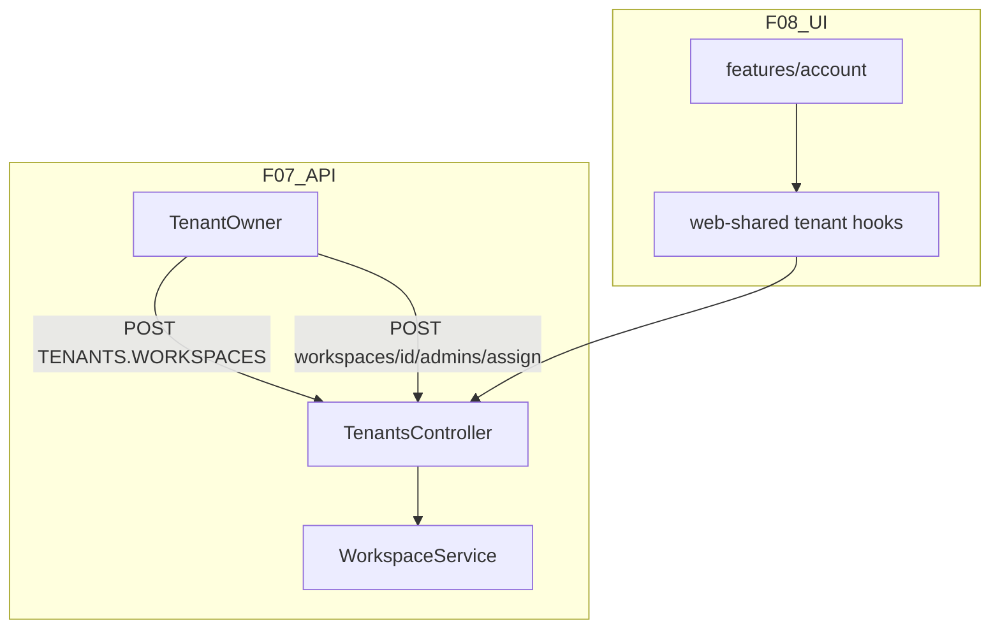

# SaaS-F07 + F08 — Workspace lifecycle & Account UI

## Context

**Done (F02–F06):**
- Tenant schema, JWT `tenantId`, isolation E2E, [`TenantsModule`](apps/api/src/modules/tenants/) (current, overview, members)
- [`WorkspaceService.create`](apps/api/src/modules/workspace/application/workspace.service.ts) already calls `requireTenantOwner` and sets `tenantId`; owner is bootstrapped as workspace `ADMIN`
- [`assignWorkspaceAdminSchema`](packages/contracts/src/dto/tenant.dto.ts) exists; `ROUTES.TENANTS.WORKSPACES` exists but is **not wired**
- Admin [`workspace-page.tsx`](apps/admin/src/features/workspace/workspace-page.tsx) calls `POST /workspaces` for **any** workspace admin — no Account mode, no tenant-role gating
- `AuthSessionDto` already includes `tenantId` + optional `tenantRole` ([`auth.dto.ts`](packages/contracts/src/dto/auth.dto.ts))

**Gap:** Tenant owner cannot assign a workspace admin unless they are workspace `ADMIN` on that workspace (`POST /workspaces/:id/members/invite` requires `@Roles("ADMIN")` + `assertWorkspaceRoute`). P2 §7.2 requires Account UI for create + assign.



**Execution order:** F07 contracts + API first (BE), then F08 FE consuming those routes. One PR or two small PRs (F07 then F08) — same sprint.

---

## F07 research gate resolutions

| Gate | Resolution |
|------|------------|
| Archive workspace | **Defer** — no soft-delete in F07 |
| Move workspace between tenants | **Forbid** (no API) — already decided |
| Default workspace on superadmin create | **Defer F15** |
| Seat counting | **Align with F06** — distinct active users in `tenant_members` ∪ `workspace_members`; document in [`auth-workspace.md`](docs/specs/auth-workspace.md) |
| Workspace name uniqueness | **Per tenant** — fix `assertNameAvailable` to filter by `tenantId` (today it is global) |

---

## Part 1 — F07 Backend

### 1. Contracts

**File:** [`packages/contracts/src/routes.ts`](packages/contracts/src/routes.ts)

Add:

```typescript
ASSIGN_ADMIN: (workspaceId: string) => `/workspaces/${workspaceId}/admins/assign`
```

(Under `WORKSPACES` — matches SAAS plan; tenant owner auth enforced in controller.)

**Files:** [`tenant.dto.ts`](packages/contracts/src/dto/tenant.dto.ts), [`workspace.dto.ts`](packages/contracts/src/dto/workspace.dto.ts)

- Tighten `assignWorkspaceAdminSchema`: require `email` **or** `userId` (refine existing optional fields)
- Add `assignWorkspaceAdminResponseSchema` (reuse `InviteMemberResponseDto` shape or thin wrapper)
- Contract specs in `tenant.dto.spec.ts` + `contracts.spec.ts`

### 2. Workspace service changes

**File:** [`workspace.service.ts`](apps/api/src/modules/workspace/application/workspace.service.ts)

| Change | Detail |
|--------|--------|
| `assertNameAvailable` | Add `tenantId` param; `findFirst({ where: { tenantId, name: { equals, mode: insensitive } } })` |
| `assignAdminAsTenantOwner` | New method: verify workspace `tenantId` matches JWT tenant; `requireTenantOwnerInTenant`; invite existing tenant user by `userId` or `email`+`name`; enforce D08 (user’s resolved tenant must match); delegate to existing `invite()` with `role: "ADMIN"` |
| `create` | Pass `tenantId` into `assertNameAvailable` |

**Note:** `invite()` does not require caller to be workspace ADMIN today — only controller does. `assignAdminAsTenantOwner` calls service directly without workspace-role check.

### 3. HTTP routes

**File:** [`tenants.controller.ts`](apps/api/src/modules/tenants/interface/http/tenants.controller.ts)

| Method | Route | Guard | Handler |
|--------|-------|-------|---------|
| POST | `ROUTES.TENANTS.WORKSPACES` | `@TenantRoles("OWNER")` | Delegate to `WorkspaceService.create` with `createTenantWorkspaceSchema` |
| POST | `ROUTES.WORKSPACES.ASSIGN_ADMIN(":workspaceId")` | `@TenantRoles("OWNER")` | `assignAdminAsTenantOwner(workspaceId, body, user)` |

Keep `POST /workspaces` as **deprecated alias** (same service) for backward compat until F08 migrates UI — document in spec.

**File:** [`workspace.controller.ts`](apps/api/src/modules/workspace/interface/http/workspace.controller.ts) — no new routes; existing invite remains for workspace admins.

### 4. Tests

**New:** [`apps/api/test/workspace-lifecycle.e2e.ts`](apps/api/test/workspace-lifecycle.e2e.ts)

| # | Scenario | Expected |
|---|----------|----------|
| 1 | Tenant owner `POST TENANTS.WORKSPACES` | 201, `tenant_id` set |
| 2 | Tenant admin `ops@` POST create | **403** |
| 3 | Workspace-only `member@` POST create | **403** |
| 4 | Owner creates WS-A + WS-B; assign same user ADMIN to both (two assign calls) | 201 each; user has two `workspace_members` rows |
| 5 | Assign user from tenant B fixture | **409** |
| 6 | Duplicate workspace name **within** same tenant | 409 |
| 7 | Same name in tenant B after tenant A has it | **201** (cross-tenant names OK) |

**Update:** [`workspace.service.spec.ts`](apps/api/src/modules/workspace/application/workspace.service.spec.ts) — tenant-scoped name check.

**Docs:** [`docs/specs/auth-workspace.md`](docs/specs/auth-workspace.md), [`docs/specs/tenants.md`](docs/specs/tenants.md) — mark F07 routes implemented.

---

## Part 2 — F08 Account UI

### 1. Research gate resolutions

| Gate | Resolution |
|------|------------|
| Nav: Account vs Workspace | **Dual mode** — sidebar item **Account** visible when `session.tenantRole` is `OWNER` or `ADMIN`; workspace nav unchanged |
| Owner landing after login | **If `tenantRole === OWNER` and no `?workspace=`** → redirect `/account` (workspace admins keep `/dashboard`) |
| Workspace switcher | Already tenant-scoped via `GET /workspaces` — no change |
| Mobile layout | **Responsive** — reuse `ResponsiveLayoutShell`; account pages use same card/table patterns as workspace settings |

### 2. web-shared hooks

**New files** under [`packages/web-shared/src/features/tenant/`](packages/web-shared/src/features/tenant/):

- `use-tenant-overview.ts` — `GET ROUTES.TENANTS.OVERVIEW` (owner only)
- `use-tenant-members.ts` — `GET ROUTES.TENANTS.MEMBERS`
- `use-tenant-current.ts` — `GET ROUTES.TENANTS.CURRENT`
- Export from `packages/web-shared/src/index.ts`

Pattern: `api()` + SWR or existing fetch hook conventions in web-shared.

### 3. Admin feature folder

Per [`chronomint-fe-feature`](.cursor/skills/chronomint-fe-feature/SKILL.md) and [TENANT_RBAC §12](docs/architecture/TENANT_RBAC.md):

```
apps/admin/src/features/account/
  account-overview-page.tsx       # overview cards: plan stub, workspace/seat counts
  account-workspaces-page.tsx     # list + create workspace modal
  account-organization-page.tsx   # tenant name/slug read-only v1
  account-billing-page.tsx        # stub CTA until F13
  components/
    create-workspace-dialog.tsx   # POST TENANTS.WORKSPACES
    workspace-admin-assign-dialog.tsx  # POST ASSIGN_ADMIN
```

**Thin pages:**

```
apps/admin/src/app/(admin)/account/page.tsx              → overview
apps/admin/src/app/(admin)/account/workspaces/page.tsx
apps/admin/src/app/(admin)/account/organization/page.tsx
apps/admin/src/app/(admin)/account/billing/page.tsx
```

Use `@kloqra/ui`: `DataTableCard`, `AppModal`, `Button`, `toast`; types from `@kloqra/contracts`.

### 4. Shell integration

**Files:** [`admin-shell.tsx`](apps/admin/src/components/admin-shell.tsx), [`admin-nav.ts`](apps/admin/src/config/admin-nav.ts)

- Add Account nav group (Overview, Workspaces, Organization, Billing) — show only when `session.tenantRole` is set
- Login flow ([`login/page.tsx`](apps/admin/src/app/login/page.tsx)): after successful login, if `tenantRole === "OWNER"` → `router.replace("/account")`

### 5. Deprecate workspace-page create for non-owners

**File:** [`workspace-page.tsx`](apps/admin/src/features/workspace/workspace-page.tsx)

- Hide create-workspace UI unless `session.tenantRole === "OWNER"` (or remove create entirely; link to Account → Workspaces)

### 6. Tests

| Layer | File |
|-------|------|
| Unit | `create-workspace-dialog` validation spec; `workspace-admin-assign-dialog` spec |
| Playwright | `apps/admin/e2e/account-workspace.spec.ts` — owner logs in → lands account → creates workspace → assigns admin → switch workspace → admin can open dashboard |

---

## TASK_BOARD & plan updates

| Item | Action |
|------|--------|
| SaaS-F07 | `done` after workspace-lifecycle E2E green |
| SaaS-F08 | `done` after Playwright + unit tests green |
| [`SAAS_PLATFORM_PLAN.md`](docs/architecture/SAAS_PLATFORM_PLAN.md) | Check F07/F08 gates; bump §7.2 P2 checklist (Account UI) |
| §7.2 P1 | Mark complete when F07 ships (last P1 epic) |

---

## Exit criteria

**F07**
- [ ] `POST ROUTES.TENANTS.WORKSPACES` + `POST ROUTES.WORKSPACES.ASSIGN_ADMIN` live
- [ ] Workspace names unique per tenant
- [ ] `workspace-lifecycle.e2e.ts` green in CI

**F08**
- [ ] `/account/*` pages render for tenant owner
- [ ] Create workspace + assign admin from Account UI
- [ ] Playwright account flow green
- [ ] Non-owners do not see Account nav or workspace create

---

## Not in scope (defer)

- F09/F10 — plan catalog + `PlanLimitGuard`
- F11+ — Stripe / billing tab real data (F13)
- F14/F15 — platform-admin + superadmin provision
- Workspace archive / soft-delete
- Removing owner auto-`ADMIN` on workspace create (acceptable bootstrap for v1)

---

## Suggested PR split

1. **PR 1 (BE):** F07 contracts + service + controller + E2E + specs
2. **PR 2 (FE):** F08 web-shared hooks + account features + Playwright
