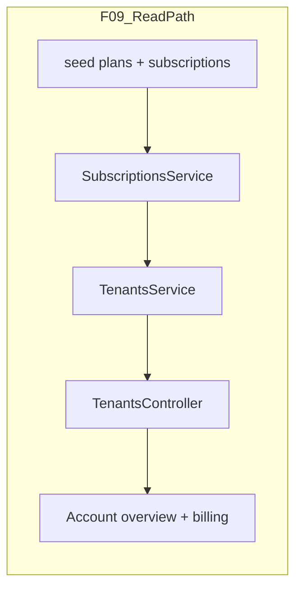

# SaaS-F09 — Plan catalog (no payments)

## Context

**Done (F02–F08):**
- Tenant schema, JWT `tenantId`, isolation + tenant/membership APIs, workspace lifecycle, Account UI shell
- Contract types already exist: [`planLimitsSchema`](packages/contracts/src/tenant-rbac.ts), [`tenantSubscriptionSchema`](packages/contracts/src/dto/tenant.dto.ts)
- Route reserved but **not wired**: `ROUTES.TENANTS.SUBSCRIPTION` in [`routes.ts`](packages/contracts/src/routes.ts)
- [`TenantsService.buildStubSubscription`](apps/api/src/modules/tenants/application/tenants.service.ts) returns hardcoded `Trial` + `STUB_PLAN_ID`
- [`tenants.e2e.ts`](apps/api/test/tenants.e2e.ts) asserts stub shape (`planName: "Trial"`)
- [`account-billing-page.tsx`](apps/admin/src/features/account/account-billing-page.tsx) is a static stub; overview already renders `subscription` from `GET OVERVIEW`

**Gap:** No `plans` / `tenant_subscriptions` tables; limits are not persisted; subscription cannot be read independently or seeded for F10/F11.



**Execution order:** contracts → Prisma migration + seed → API service → FE read-only → tests/docs. **Do not** implement `PlanLimitGuard` (F10) or Stripe (F11) in this epic.

---

## F09 research gate resolutions

| Gate | Resolution |
|------|------------|
| Tier names (Starter / Pro / Enterprise) | Seed **pilot**, **starter**, **pro** slugs; **Enterprise = pro plan + `limits_override`** on subscription (no separate catalog row v1) |
| Workspace counts per tier (D11) | **Placeholder numbers** in seed constants — tunable without schema change; document as provisional in spec |
| Limits JSON (`maxProjects`, `features[]`) | Keep optional fields on existing `planLimitsSchema`; seed with `maxWorkspaces` + `maxSeats` only; omit `maxProjects` until F10 needs it |
| Free / pilot plan for existing customers | **`pilot`** plan — `isPublic: false`, generous limits; assign to `kloqra-demo` seed tenant + F21 backfill |
| Enterprise manual override | Nullable `limits_override` JSONB on `tenant_subscriptions`; effective limits = merge(`plan.limits`, `limits_override`) |
| Trial duration (D04) | `trial_ends_at = created_at + 30 days` when `status = trial`; demo seed uses **`active`** on pilot plan to avoid demo expiry noise |

---

## 1. Contracts (contract-first)

**New:** [`packages/contracts/src/plan-catalog.ts`](packages/contracts/src/plan-catalog.ts)

- `PLAN_SLUGS` enum (`pilot`, `starter`, `pro`)
- `DEFAULT_PLAN_LIMITS` per slug (pilot generous; starter/pro placeholders)
- `planSchema` (`id`, `name`, `slug`, `limits`, `isPublic`)
- `resolveEffectiveLimits(planLimits, limitsOverride?)` pure helper
- Export from [`packages/contracts/src/index.ts`](packages/contracts/src/index.ts)

**Update:** [`tenant.dto.ts`](packages/contracts/src/dto/tenant.dto.ts) — no breaking changes to `tenantSubscriptionSchema` (already matches target API shape).

**Specs:** extend [`tenant.dto.spec.ts`](packages/contracts/src/dto/tenant.dto.spec.ts) + [`contracts.spec.ts`](packages/contracts/src/contracts.spec.ts) for `planSchema`, `SUBSCRIPTION` route, and `resolveEffectiveLimits` merge behavior.

---

## 2. Prisma schema + migration

**File:** [`apps/api/prisma/schema.prisma`](apps/api/prisma/schema.prisma)

```prisma
model Plan {
  id        String   @id @default(uuid())
  name      String
  slug      String   @unique
  limits    Json
  isPublic  Boolean  @default(false) @map("is_public")
  sortOrder Int      @default(0) @map("sort_order")
  createdAt DateTime @default(now()) @map("created_at")
  updatedAt DateTime @updatedAt @map("updated_at")
  subscriptions TenantSubscription[]
  @@map("plans")
}

model TenantSubscription {
  id                   String    @id @default(uuid())
  tenantId             String    @unique @map("tenant_id")
  planId               String    @map("plan_id")
  status               String
  trialEndsAt          DateTime? @map("trial_ends_at")
  currentPeriodEnd     DateTime? @map("current_period_end")
  limitsOverride       Json?     @map("limits_override")
  stripeCustomerId     String?   @unique @map("stripe_customer_id")
  stripeSubscriptionId String?   @unique @map("stripe_subscription_id")
  createdAt            DateTime  @default(now()) @map("created_at")
  updatedAt            DateTime  @updatedAt @map("updated_at")
  tenant Tenant @relation(fields: [tenantId], references: [id], onDelete: Cascade)
  plan   Plan   @relation(fields: [planId], references: [id])
  @@map("tenant_subscriptions")
}
```

- Add `subscription TenantSubscription?` on `Tenant`
- **Migration SQL backfill:** insert 3 plans; for every existing `tenants` row without subscription, create `tenant_subscriptions` pointing at `pilot` with `status = active`
- Stripe columns nullable — populated in F11 only

**Update:** [`tenant-schema.spec.ts`](apps/api/prisma/tenant-schema.spec.ts) — assert `Plan`, `TenantSubscription`, 1:1 `tenantId` unique.

---

## 3. Seed

**Files:** [`seed-data.ts`](apps/api/prisma/seed-data.ts), [`seed.ts`](apps/api/prisma/seed.ts)

| Slug | Name | `isPublic` | Limits (placeholder) | Demo assignment |
|------|------|------------|----------------------|-----------------|
| `pilot` | Pilot | false | 25 workspaces / 100 seats | `kloqra-demo` → `active` |
| `starter` | Starter | true | 3 / 10 | catalog only |
| `pro` | Pro | true | 10 / 50 | catalog only |

- Add `SEED_PLANS` constants with **stable UUIDs** (replace `STUB_PLAN_ID` in service)
- `seedPlans()` before `seedTenant()`; `seedTenantSubscription(tenantId)` after tenant create
- `resetDatabase()` delete order: `tenantSubscription` → `plan` (after tenant children)
- **E2E fixture:** update [`tenant-isolation-fixture.ts`](apps/api/test/helpers/tenant-isolation-fixture.ts) to create subscription for tenant B (or call shared `ensureTenantSubscription` helper)

**Update:** [`seed-data.spec.ts`](apps/api/prisma/seed-data.spec.ts) — every seeded tenant has exactly one subscription row.

---

## 4. API — Subscriptions module

**New module** (scaffold for F11):

```
apps/api/src/modules/subscriptions/
  subscriptions.module.ts
  application/subscriptions.service.ts
  application/subscriptions.service.spec.ts
```

| Method | Behavior |
|--------|----------|
| `getSubscriptionForTenant(tenantId)` | Load `tenant_subscriptions` + `plan`; map to `TenantSubscriptionDto` with merged limits |
| `ensureSubscriptionForTenant(tenantId, planSlug?)` | Used by seed/migration; default `pilot` |
| `toSubscriptionDto(row)` | Private mapper; uses `resolveEffectiveLimits` from contracts |

**Changes:**
- [`tenants.service.ts`](apps/api/src/modules/tenants/application/tenants.service.ts) — remove `buildStubSubscription`; inject `SubscriptionsService` in `getOverview`
- [`tenants.controller.ts`](apps/api/src/modules/tenants/interface/http/tenants.controller.ts) — add:

```typescript
@TenantRoles("OWNER")
@Get(ROUTES.TENANTS.SUBSCRIPTION)
getSubscription(@CurrentUser() user: RequestUser) {
  return this.subscriptions.getSubscriptionForTenant(user.tenantId);
}
```

- Register `SubscriptionsModule` in [`app.module.ts`](apps/api/src/app.module.ts); import into `TenantsModule`

**Auth:** `GET SUBSCRIPTION` = tenant owner only (same as overview subscription slice).

---

## 5. Frontend (read-only)

Minimal F09 UI — F13 owns checkout/portal.

| File | Change |
|------|--------|
| [`use-tenant-subscription.ts`](packages/web-shared/src/features/tenant/use-tenant-subscription.ts) | New hook: `GET ROUTES.TENANTS.SUBSCRIPTION` |
| [`index.ts`](packages/web-shared/src/index.ts) | Export hook |
| [`account-billing-page.tsx`](apps/admin/src/features/account/account-billing-page.tsx) | Show plan name, status, limits, trial end; keep "Manage subscription" disabled |
| [`account-overview-page.tsx`](apps/admin/src/features/account/account-overview-page.tsx) | No change required if overview already shows subscription (auto-fixes when API is real) |

No new Playwright scope required for F09 (overview E2E already covers plan display path); optional assertion update if billing page gets a `data-testid`.

---

## 6. Tests

| Layer | File | Scenarios |
|-------|------|-----------|
| Contracts | `plan-catalog` spec | Schema parse, limits merge |
| Prisma | `tenant-schema.spec.ts` | Models + relations |
| Unit | `subscriptions.service.spec.ts` | DTO mapping, override merge, not-found |
| Unit | `tenants.service.spec.ts` | Replace stub expectations with mocked `SubscriptionsService` |
| E2E | `tenants.e2e.ts` | Overview subscription = seeded `pilot`; new `GET SUBSCRIPTION` 200 for owner, 403 for ops/member |
| E2E | New `plans.e2e.ts` (optional) | Every tenant in DB has subscription after seed |

**Update existing assertion** in `tenants.e2e.ts` line 76–80: `planName: "Pilot"` (not `"Trial"`).

---

## 7. Documentation & task board

| File | Change |
|------|--------|
| [`docs/specs/tenants.md`](docs/specs/tenants.md) | Add `GET SUBSCRIPTION`; mark subscription as DB-backed; document effective limits + seat definition |
| **New** [`docs/specs/plans.md`](docs/specs/plans.md) | Catalog slugs, placeholder limits, override rules, F10/F11 pointers |
| [`docs/architecture/SAAS_PLATFORM_PLAN.md`](docs/architecture/SAAS_PLATFORM_PLAN.md) | Check F09 research gates + exit criteria; note D11 numbers still provisional |
| [`docs/architecture/TENANT_DOMAIN_MODEL.md`](docs/architecture/TENANT_DOMAIN_MODEL.md) | Mark `plans` / `tenant_subscriptions` implemented |
| [`TASK_BOARD.json`](TASK_BOARD.json) | SaaS-F09 → `done` after CI green |

---

## Exit criteria

- [ ] `plans` + `tenant_subscriptions` tables migrated; all tenants have a subscription row
- [ ] Seed creates `pilot`, `starter`, `pro`; demo tenant on `pilot`
- [ ] `GET ROUTES.TENANTS.SUBSCRIPTION` live; overview returns real subscription (no stub)
- [ ] Account billing page shows read-only plan info
- [ ] Unit + E2E tests green
- [ ] `pnpm format:check && pnpm lint && pnpm typecheck && pnpm test && pnpm build` pass

---

## Not in scope (defer)

- **F10** — `PlanLimitGuard`, `PLAN_LIMIT_EXCEEDED`, block workspace create / invites
- **F11** — Stripe products, webhooks, populating `stripe_*` columns
- **F13** — Customer Portal, upgrade CTA
- **F14/F15** — platform-admin plan assignment UI
- Public `GET /plans` catalog endpoint (not required for exit)
- Removing deprecated `POST /workspaces` alias

---

## Suggested PR

Single BE-heavy PR (~1–4 commits): contracts + migration + seed + subscriptions module + E2E; small FE follow-up for billing page + hook (can be same PR).

**After F09:** **F10** — wire `SubscriptionsService.getEffectiveLimits` into workspace create, member invite, and bulk invite guards.
