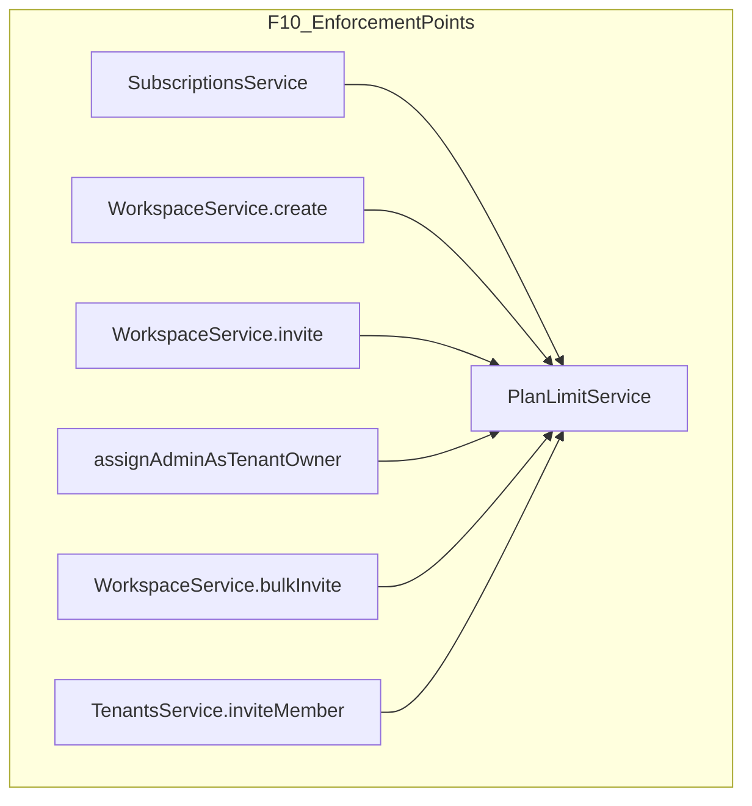

# SaaS-F10 — Plan limit enforcement

## Context

**Done (F09):**
- `plans` + `tenant_subscriptions` tables; [`SubscriptionsService`](apps/api/src/modules/subscriptions/application/subscriptions.service.ts) resolves effective limits via `resolveEffectiveLimits`
- Seat definition already implemented in [`TenantsService.countSeats`](apps/api/src/modules/tenants/application/tenants.service.ts): distinct active `user_id` in `tenant_members` ∪ `workspace_members` (tenant workspaces)
- Demo tenant (`kloqra-demo`) on **pilot** plan: 25 workspaces / 100 seats — E2E must **lower limits** via `limits_override` to test blocks

**Gap:** No enforcement on mutating paths; `ErrorCodes.PLAN_LIMIT_EXCEEDED` does not exist; bulk invite queues without cap check.



**Execution order:** contracts (`PLAN_LIMIT_EXCEEDED`) → `PlanLimitService` → wire service calls → E2E → docs. **Do not** implement payment-state blocking (F12) or billing upgrade UI (F13).

---

## F10 research gate resolutions

| Gate | Resolution |
|------|------------|
| Soft warn (80%) vs hard block (100%) | **Hard block only at 100%** in F10; soft warnings deferred to F13 billing banners |
| Downgrade / grandfather | **Grandfather existing** workspaces and members — only block **new** creates/invites when at or over cap |
| Enforce on | `WorkspaceService.create`, `invite`, `assignAdminAsTenantOwner`, `bulkInvite` (pre-queue), `TenantsService.inviteMember` |
| Seat count definition | **Reuse F06/F09 union** — extract from `TenantsService` into `PlanLimitService`; no new formula |

---

## 1. Contracts

**File:** [`packages/contracts/src/errors.ts`](packages/contracts/src/errors.ts)

```typescript
PLAN_LIMIT_EXCEEDED: "PLAN_LIMIT_EXCEEDED"
```

**Optional (recommended):** [`packages/contracts/src/plan-catalog.ts`](packages/contracts/src/plan-catalog.ts)

- `planLimitExceededDetailsSchema` — `{ limit: "maxWorkspaces" | "maxSeats", current: number, max: number }`
- Export type for API error `details` (if extended)

**Specs:** `errors` smoke test + `plan-catalog.spec.ts` for details schema.

**HTTP status:** `402 Payment Required` (per SAAS plan); thrown via `DomainException` with clear user message, e.g. `"Organization workspace limit reached (3/3)."`.

---

## 2. PlanLimitService

**New:** [`apps/api/src/modules/subscriptions/application/plan-limit.service.ts`](apps/api/src/modules/subscriptions/application/plan-limit.service.ts)

| Method | Behavior |
|--------|----------|
| `getEffectiveLimits(tenantId)` | Delegate to `SubscriptionsService.getSubscriptionForTenant` → `.limits` |
| `getWorkspaceCount(tenantId)` | `prisma.workspace.count({ where: { tenantId } })` |
| `getSeatCount(tenantId)` | Move logic from `TenantsService.countSeats` |
| `assertWorkspaceCreateAllowed(tenantId)` | If `workspaceCount >= limits.maxWorkspaces` → throw `PLAN_LIMIT_EXCEEDED` |
| `assertSeatsAvailable(tenantId, additionalSeats)` | If `seatCount + additionalSeats > limits.maxSeats` → throw |
| `countNewSeatsForEmails(tenantId, emails[])` | For each email: resolve user; if user already in seat set → 0; else +1 |
| `assertSeatsForEmails(tenantId, emails[])` | `assertSeatsAvailable(tenantId, countNewSeatsForEmails(...))` |

**Private helper:** `loadSeatUserIds(tenantId): Set<string>` — active tenant members + active workspace members under tenant.

**Export** from [`subscriptions.module.ts`](apps/api/src/modules/subscriptions/subscriptions.module.ts); import `SubscriptionsModule` into [`workspace.module.ts`](apps/api/src/modules/workspace/workspace.module.ts) and [`tenants.module.ts`](apps/api/src/modules/tenants/tenants.module.ts) (tenants already imports subscriptions).

**Refactor:** [`TenantsService`](apps/api/src/modules/tenants/application/tenants.service.ts) — replace private `countSeats` with `planLimit.getSeatCount`; keep `countWorkspaces` or delegate to `PlanLimitService` for DRY.

---

## 3. Enforcement wiring

### Workspace create

[`WorkspaceService.create`](apps/api/src/modules/workspace/application/workspace.service.ts) — after `requireTenantOwner`, before `assertNameAvailable`:

```typescript
await this.planLimit.assertWorkspaceCreateAllowed(tenantId);
```

### Single invite + assign admin

[`WorkspaceService.invite`](apps/api/src/modules/workspace/application/workspace.service.ts) — after workspace load, **before** user create:

```typescript
await this.planLimit.assertSeatsForEmails(workspace.tenantId, [email]);
```

`assignAdminAsTenantOwner` calls `invite()` — covered automatically.

**Note:** Re-inviting existing workspace member still hits `MEMBER_ALREADY_EXISTS` before seat check; existing tenant user invited to second workspace does **not** consume a new seat (email resolves to seated user → `additionalSeats = 0`).

### Bulk invite

[`WorkspaceService.bulkInvite`](apps/api/src/modules/workspace/application/workspace.service.ts) — before queue add:

```typescript
const emails = members.map((m) => m.email.trim().toLowerCase());
await this.planLimit.assertSeatsForEmails(workspace.tenantId, emails);
```

Dedupe emails in `countNewSeatsForEmails` so duplicate rows in CSV don't double-count.

**Worker:** No change required for F10 if pre-queue check is authoritative; optional defensive re-check in [`bulk-invite.worker.ts`](apps/api/src/modules/queues/workers/bulk-invite.worker.ts) is out of scope unless race conditions are a concern.

### Tenant admin invite

[`TenantsService.inviteMember`](apps/api/src/modules/tenants/application/tenants.service.ts) — before user create:

```typescript
await this.planLimit.assertSeatsForEmails(tenantId, [email]);
```

New tenant admin always adds a seat (or conflicts if already `tenant_members`).

---

## 4. Tests

| Layer | File | Scenarios |
|-------|------|-----------|
| Unit | `plan-limit.service.spec.ts` | At workspace cap; at seat cap; invite email for existing seated user allowed; bulk dedupe |
| Unit | `workspace.service.spec.ts` | Mock `PlanLimitService`; create/invite/bulkInvite propagate limit errors |
| Unit | `tenants.service.spec.ts` | Tenant invite blocked at seat cap |
| E2E | **New** [`apps/api/test/plan-limits.e2e.ts`](apps/api/test/plan-limits.e2e.ts) | See below |

### E2E scenarios (use `limits_override` on `kloqra-demo` subscription; restore in `afterAll`)

| # | Setup | Action | Expected |
|---|-------|--------|----------|
| 1 | `maxWorkspaces: 3` (demo has 3) | Owner `POST TENANTS.WORKSPACES` | **402**, `PLAN_LIMIT_EXCEEDED` |
| 2 | `maxSeats: <current>` | Owner `POST TENANTS.MEMBERS` new email | **402** |
| 3 | `maxSeats: <current>` | Owner `POST WORKSPACES.ASSIGN_ADMIN` new email | **402** |
| 4 | `maxSeats: <current+1>` | Bulk invite 2 net-new emails when only 1 seat left | **402** |
| 5 | `maxWorkspaces: 25` (restore) | Create workspace | **201** (sanity) |

Helper: `setTenantLimitsOverride(prisma, tenantId, override)` in test helpers.

---

## 5. Documentation and task board

| File | Change |
|------|--------|
| [`docs/specs/plans.md`](docs/specs/plans.md) | Document enforcement points, grandfather rule, seat formula, error code |
| [`docs/specs/tenants.md`](docs/specs/tenants.md) | Note tenant invite seat check |
| [`docs/specs/auth-workspace.md`](docs/specs/auth-workspace.md) | Workspace create + invite limits |
| [`docs/architecture/SAAS_PLATFORM_PLAN.md`](docs/architecture/SAAS_PLATFORM_PLAN.md) | Check F10 gates + P2 §7.2 `maxWorkspaces`/`maxSeats` enforced |
| [`TASK_BOARD.json`](TASK_BOARD.json) | SaaS-F10 → `done` after CI green |

---

## Exit criteria

- [ ] `PLAN_LIMIT_EXCEEDED` in contracts; **402** on limit violations
- [ ] Workspace create blocked at `maxWorkspaces`
- [ ] Single invite, assign-admin, tenant invite, and bulk invite blocked when seats exceeded
- [ ] Existing seated users invited to additional workspaces do not trip seat limit
- [ ] `plan-limit.service.spec.ts` + `plan-limits.e2e.ts` green
- [ ] `pnpm format:check && pnpm lint && pnpm typecheck && pnpm test && pnpm build` pass

---

## Not in scope (defer)

- **F12** — `past_due` / `suspended` subscription write guards
- **F13** — upgrade CTA in UI, 80% warning banners, Stripe checkout
- **F14/F15** — platform-admin plan override UI
- `maxProjects` enforcement
- NestJS HTTP `CanActivate` guard (service-layer asserts sufficient for invite body logic)
- Removing workspaces/members when over cap after downgrade

---

## Suggested PR

Single BE PR: contracts + `PlanLimitService` + workspace/tenants wiring + E2E + docs. No FE changes required (existing API error toasts surface messages); optional follow-up in F13 for structured upgrade links in error `details`.

**After F10:** P2 milestone complete (Account UI + limits without payment). Next: **F11** Stripe.
