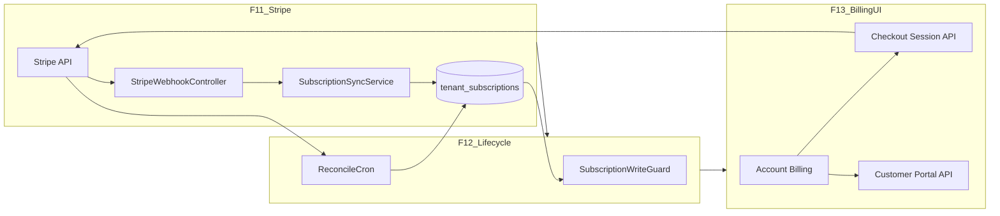

# SaaS-F11 + F12 + F13 — Stripe, lifecycle, Billing UX

## Context

**Done (P2):**
- [`plans`](apps/api/prisma/schema.prisma) + [`tenant_subscriptions`](apps/api/prisma/schema.prisma) with nullable `stripe_customer_id` / `stripe_subscription_id`
- [`SubscriptionsService`](apps/api/src/modules/subscriptions/application/subscriptions.service.ts), [`PlanLimitService`](apps/api/src/modules/subscriptions/application/plan-limit.service.ts) (F09/F10)
- Account shell: [`account-billing-page.tsx`](apps/admin/src/features/account/account-billing-page.tsx) read-only; `GET ROUTES.TENANTS.SUBSCRIPTION`
- Brevo mailer infrastructure ([`mailer.service.ts`](apps/api/src/common/mailer/mailer.service.ts))
- `@nestjs/schedule` already enabled ([`app.module.ts`](apps/api/src/app.module.ts))

**Gap:** No `stripe` npm package, no webhooks, no status sync, no payment write-guard, billing UI disabled. P3 §7.2 checklist unmet.



**Execution order:** F11 → F12 → F13 (strict). F23 legal is a **launch gate**, not a blocker to merge F11–F13 to `dev`.

---

## Cross-epic research gate resolutions

| Gate | Resolution |
|------|------------|
| Stripe Customer Portal | **Use Stripe-hosted Portal** for manage/cancel/payment method; custom card forms deferred |
| Card required for trial (D04) | **Card at paid checkout** (starter/pro); pilot tenants remain non-Stripe until upgrade |
| Grace after `invoice.payment_failed` | **0-day** before `past_due` status in DB; **7-day** `past_due` → `suspended` cron (configurable constant) |
| Read-only during `past_due` | **Allow** login, GET/read, export; **block** timer start, manual/batch timelog create, recurrence create (D12) |
| Running timer on payment fail | **Allow stop only** — no auto-stop in v1 |
| Proration | **Stripe default** proration on plan change; no custom logic in v1 |
| Invoice list in app | **Portal link only** — no in-app invoice table in F13 |
| Upgrade CTA on limit errors (F10) | F13: parse `PLAN_LIMIT_EXCEEDED` + show link to `/account/billing` |

---

## F11 — Stripe integration

**Goal:** Reliable webhook ingestion; DB stays in sync with Stripe subscription state.

### 1. Contracts

**[`packages/contracts/src/routes.ts`](packages/contracts/src/routes.ts)** — add under `TENANTS`:

```typescript
CHECKOUT: "/tenants/current/subscription/checkout",
PORTAL: "/tenants/current/subscription/portal",
```

**[`packages/contracts/src/routes.ts`](packages/contracts/src/routes.ts)** — add:

```typescript
WEBHOOKS: { STRIPE: "/webhooks/stripe" }
```

**New DTOs** in [`packages/contracts/src/dto/subscription.dto.ts`](packages/contracts/src/dto/subscription.dto.ts):

- `createCheckoutSessionSchema` — `{ planSlug: "starter" | "pro" }`, optional `successUrl`, `cancelUrl`
- `checkoutSessionResponseSchema` — `{ url: string }`
- `portalSessionResponseSchema` — `{ url: string }`

**[`packages/contracts/src/errors.ts`](packages/contracts/src/errors.ts):**

```typescript
PAYMENT_REQUIRED: "PAYMENT_REQUIRED"  // F12 uses; define in F11 contracts pass
```

### 2. Schema migration

**[`plans`](apps/api/prisma/schema.prisma):**

```prisma
stripeProductId String? @unique @map("stripe_product_id")
stripePriceId   String? @unique @map("stripe_price_id")
```

**New table `stripe_webhook_events`:**

```prisma
model StripeWebhookEvent {
  id          String   @id  // Stripe event id evt_...
  type        String
  processedAt DateTime @default(now()) @map("processed_at")
  @@map("stripe_webhook_events")
}
```

Seed: leave `pilot` without Stripe IDs; document mapping for `starter`/`pro` via env or seed constants (test mode price IDs).

### 3. API module (extend [`subscriptions/`](apps/api/src/modules/subscriptions/))

| File | Responsibility |
|------|----------------|
| `stripe/stripe.client.ts` | Wrap `stripe` SDK; lazy init from `STRIPE_SECRET_KEY` |
| `application/subscription-sync.service.ts` | Map Stripe subscription → `tenant_subscriptions` (status, period end, planId, stripe ids) |
| `application/stripe-webhook.service.ts` | Verify signature, idempotency insert, dispatch handlers |
| `interface/http/stripe-webhook.controller.ts` | `POST WEBHOOKS.STRIPE` — **raw body** required |
| `interface/http/subscription-billing.controller.ts` | Checkout + Portal session creators (owner-only) |

**[`main.ts`](apps/api/src/main.ts):** enable raw body for webhook route only:

```typescript
NestFactory.create(AppModule, { rawBody: true });
```

**Webhook handlers (minimum):**

| Event | Action |
|-------|--------|
| `checkout.session.completed` | Link `stripe_customer_id`, `stripe_subscription_id`; set status `active` or `trial` |
| `customer.subscription.updated` | Sync status + `current_period_end` + plan from price metadata |
| `customer.subscription.deleted` | Set `canceled` |
| `invoice.payment_failed` | Set `past_due` |

**Idempotency:** insert `stripe_webhook_events.id` first; skip if exists.

**Env** ([`docs/development/ENVIRONMENT.md`](docs/development/ENVIRONMENT.md)):

- `STRIPE_SECRET_KEY`, `STRIPE_WEBHOOK_SECRET`
- `STRIPE_PRICE_STARTER`, `STRIPE_PRICE_PRO` (or DB-only after seed)
- Local dev: Stripe CLI `stripe listen --forward-to localhost:3001/webhooks/stripe`

### 4. Tests (F11)

- Unit: webhook signature reject; idempotent replay; `subscription-sync.service.spec.ts` status mapping
- Integration: fixture JSON events ([`apps/api/test/fixtures/stripe/`](apps/api/test/fixtures/stripe/)) with mocked Stripe SDK
- E2E: invalid signature → **400**; valid fixture → DB updated

### F11 exit criteria

- [ ] `stripe` package added; webhook endpoint live
- [ ] Idempotency table prevents double-processing
- [ ] `starter`/`pro` plans mappable to Stripe prices
- [ ] Docs: [`docs/specs/subscriptions.md`](docs/specs/subscriptions.md) (new)

---

## F12 — Subscription lifecycle

**Goal:** Enforce D12 write block when unpaid; keep DB aligned with Stripe.

### 1. SubscriptionWriteGuard

**New:** [`apps/api/src/common/guards/subscription-write.guard.ts`](apps/api/src/common/guards/subscription-write.guard.ts)

- Resolve `tenantId` from JWT (`RequestUser.tenantId`)
- Load subscription status via `SubscriptionsService`
- **Block** when status ∈ `{ past_due, suspended, canceled }`
- Throw `402` + `PAYMENT_REQUIRED` with message + `details: { status }`

**Apply to controllers (service-layer alternative if guard is awkward):**

| Endpoint | File |
|----------|------|
| `POST` timer start | [`timer.controller.ts`](apps/api/src/modules/timer/interface/http/timer.controller.ts) |
| `POST` timelog create | [`timelogs.controller.ts`](apps/api/src/modules/timelogs/interface/http/timelogs.controller.ts) |
| `POST` timelog batch | same |
| Recurrence create path | [`timelogs.service.ts`](apps/api/src/modules/timelogs/application/timelogs.service.ts) `create` when `dto.recurrence` set |

Prefer **service helper** `assertSubscriptionAllowsWrites(tenantId)` called at start of `TimerService.start`, `TimelogsService.create/createBatch` — keeps guard off Socket paths and matches `PlanLimitService` pattern.

**Allow:** timer stop, GET/export, workspace read.

### 2. TenantStatusService + reconciliation

**New:** `application/subscription-reconcile.service.ts`

- `@Cron` daily: for subscriptions with `stripe_subscription_id`, fetch Stripe status, call `subscription-sync.service`
- Log drift corrections

**Optional:** `@Cron` trial expiry — if `status=trial` and `trialEndsAt < now` and no Stripe sub → set `past_due` or email only (pilot tenants exempt if no `stripe_customer_id`).

### 3. Notifications (minimal in F12)

- On transition to `past_due`: enqueue Brevo email to tenant owner (new template in [`member-provisioning.mailer.ts`](apps/api/src/common/mailer/) or dedicated `billing.mailer.ts`)
- In-app banner data: extend `GET TENANTS.SUBSCRIPTION` or `OVERVIEW` with `billingAlert: "past_due" | "trial_ending" | null`

### 4. Tests (F12)

- Unit: `assertSubscriptionAllowsWrites` per status
- E2E: [`apps/api/test/subscription-lifecycle.e2e.ts`](apps/api/test/subscription-lifecycle.e2e.ts)
  - Set subscription `past_due` via Prisma → `POST /timer/start` → **402** `PAYMENT_REQUIRED`
  - Set `active` → timer start succeeds
  - `canceled` blocked; `trial` + `active` allowed

### F12 exit criteria

- [ ] D12 mutations blocked for `past_due` / `suspended` / `canceled`
- [ ] Reconciliation cron registered
- [ ] Payment-failure email sent (Brevo)
- [ ] E2E lifecycle green

---

## F13 — Billing UX

**Goal:** Tenant owner upgrades and manages subscription without superadmin.

**Dependencies:** F08 Account shell, F11 checkout/portal APIs, F12 status accuracy.

### 1. API (if not fully in F11)

- `POST ROUTES.TENANTS.CHECKOUT` — create Stripe Checkout Session (mode `subscription`), metadata `{ tenantId, planSlug }`
- `POST ROUTES.TENANTS.PORTAL` — create Billing Portal session for `stripe_customer_id`
- Owner-only (`@TenantRoles("OWNER")`)

### 2. web-shared

- `useCreateCheckoutSession`, `useCreatePortalSession` hooks
- Extend `useTenantSubscription` or overview to surface `billingAlert`

### 3. Admin UI

**[`account-billing-page.tsx`](apps/admin/src/features/account/account-billing-page.tsx):**

- Plan cards for starter/pro (public plans from API or static from contracts)
- **Upgrade** → redirect to Checkout URL
- **Manage subscription** → Portal URL (enabled when `stripeCustomerId` present)
- Status badges: trial ending, past_due banner with CTA
- Show invoices via Portal (no custom list)

**Global banner** in [`admin-shell.tsx`](apps/admin/src/components/admin-shell.tsx): when `billingAlert` set, show dismissible alert linking to `/account/billing`.

**F10 integration:** in create-workspace dialog / API error handler, if `code === PLAN_LIMIT_EXCEEDED`, show "Upgrade plan" link.

### 4. Emails (Brevo)

| Template | Trigger |
|----------|---------|
| `billing.trial_ending` | Cron 7 days before `trialEndsAt` |
| `billing.payment_failed` | F12 `past_due` transition |
| Receipt | Stripe sends; optional Brevo copy on `invoice.paid` webhook (stretch) |

### 5. Tests (F13)

- Unit: billing page renders states (mock hooks)
- Playwright: [`apps/admin/e2e/account-billing.spec.ts`](apps/admin/e2e/account-billing.spec.ts) — owner sees upgrade CTA; portal button (mock API URLs in test env)
- Manual: Stripe test mode checkout end-to-end

### F13 exit criteria

- [ ] Owner upgrades starter/pro via Checkout without superadmin
- [ ] Manage subscription opens Portal
- [ ] Trial/past_due banners visible
- [ ] Playwright billing spec green

---

## Documentation and TASK_BOARD

| File | Update |
|------|--------|
| [`docs/specs/subscriptions.md`](docs/specs/subscriptions.md) | New — webhooks, states, env, local CLI |
| [`docs/specs/plans.md`](docs/specs/plans.md) | Stripe price mapping, upgrade path |
| [`docs/architecture/TENANT_RBAC.md`](docs/architecture/TENANT_RBAC.md) | Mark SubscriptionWriteGuard implemented |
| [`docs/architecture/SAAS_PLATFORM_PLAN.md`](docs/architecture/SAAS_PLATFORM_PLAN.md) | F11–F13 gates + P3 §7.2 checklist |
| [`TASK_BOARD.json`](TASK_BOARD.json) | F11 → F12 → F13 `done` per epic |

---

## Suggested PR split (3 PRs)

| PR | Epic | Scope |
|----|------|-------|
| 1 | **F11** | Schema, `stripe` dep, webhook + sync, contracts, fixture tests, ENV docs |
| 2 | **F12** | Write asserts, reconcile cron, billing alert field, lifecycle E2E, payment-failed email |
| 3 | **F13** | Checkout/portal endpoints (if split from F11), billing UI, banners, Playwright, trial email |

---

## Not in scope (defer)

- **F20** self-serve signup (checkout assumes existing tenant owner)
- **F23** legal docs (required before **production** paid launch, not dev merge)
- Custom Stripe Elements UI
- USD multi-currency (D10 open)
- Platform-admin plan override UI (F15)
- `subscriptions.e2e.ts` full Stripe live mode (F24 CI harness; use fixtures in F11–F12)

---

## Pre-implementation checklist (human)

- Create Stripe test account + Products/Prices for Starter/Pro
- Add Railway/Vercel env vars in staging
- Install Stripe CLI for local webhook forwarding
- Schedule F23 legal review before prod paid launch
