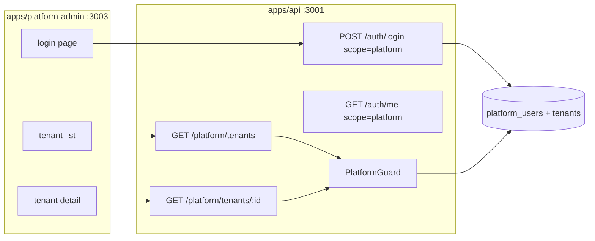

# SaaS-F14 — Platform admin scaffold

## Context

| Done (F04–F13) | Gap for F14 |
| --- | --- |
| `ROUTES.PLATFORM.*` in [packages/contracts/src/routes.ts](packages/contracts/src/routes.ts) | No platform DTOs; routes marked F15+ |
| `platformRoleSchema` in [packages/contracts/src/tenant-rbac.ts](packages/contracts/src/tenant-rbac.ts) | No `platform_users` table |
| Tenant model + subscription in Prisma | No `apps/api/src/modules/platform/` |
| Admin app pattern ([apps/admin](apps/admin)) | `apps/platform-admin/` does not exist |
| Cookie scope naming in [auth-scope.ts](apps/api/src/common/auth/auth-scope.ts) | Scope only accepts `client` \| `admin` \| `app` |
| `JwtAuthGuard` requires `tenantId` + `workspaceId` | No `PlatformGuard`; F04 platform JWT deferred |

**User decision:** F14 includes a **real read-only API** (not mocked UI).

**Out of scope (F15):** `POST /platform/tenants`, `PATCH`, suspend, provision owner, `tenant-create-page.tsx`.

---

## Research gate resolutions

| Gate | Decision |
| --- | --- |
| Deploy URL | Separate app on **port 3003** locally; staging on internal subdomain (e.g. `platform.internal.kloqra.com`); `robots.txt` disallow + no sitemap |
| `NEXT_PUBLIC_AUTH_SCOPE` | **`platform`** — separate cookie namespace (`access_token_platform`) |
| MFA for platform users | **Defer** — same login shape as admin v1; no TOTP branch in F14 |
| Shared UI | **Reuse** `@kloqra/ui` + `@kloqra/web-shared` (mirror admin); no standalone design system |
| Platform user storage | Dedicated **`platform_users`** table (isolated from tenant `users`; aligns with glossary in [SAAS_PLATFORM_PLAN.md](docs/architecture/SAAS_PLATFORM_PLAN.md) §2) |
| JWT shape | **`typ: "platform"`** + `platformRole: "SUPERADMIN"` + `scope: "platform"` — no `tenantId` / `workspaceId` (completes F04 deferred item) |
| Impersonation (D13) | **None** — platform staff see metadata only |

---

## Architecture



**Auth isolation:** Tenant sessions (`typ: access`, `scope: admin|client`) must be **rejected** on platform routes and vice versa. Platform login must **reject** tenant `users` credentials when `X-Auth-Scope: platform`.

---

## Delivery split (2 PRs, same epic)

### PR1 — F14a: contracts, schema, platform auth

**1. Contracts** ([packages/contracts](packages/contracts))

- Add [dto/platform.dto.ts](packages/contracts/src/dto/platform.dto.ts):
  - `platformUserSchema` — `id`, `email`, `name`, `platformRole`
  - `platformSessionSchema` — `user` + `platformRole` (no tenant/workspace fields)
  - `platformTenantListItemSchema` — `id`, `name`, `slug`, `status`, `createdAt`, `planSlug?`, `subscriptionStatus?`, `workspaceCount`, `memberCount`
  - `platformTenantDetailSchema` — extends list item + `ownerEmail?`, `subscription` summary, `billingAlert?`
  - `platformTenantListResponseSchema` — paginated `{ items, total, page, pageSize }`
- Export from `dto/index.ts`; add contract specs in `platform.dto.spec.ts`
- Update [docs/specs/tenants.md](docs/specs/tenants.md) — mark `ROUTES.PLATFORM` GET routes as F14

**2. Prisma** ([apps/api/prisma/schema.prisma](apps/api/prisma/schema.prisma))

```prisma
model PlatformUser {
  id           String   @id @default(uuid())
  email        String   @unique
  passwordHash String   @map("password_hash")
  name         String
  role         String   @default("SUPERADMIN") // platformRoleSchema
  isActive     Boolean  @default(true) @map("is_active")
  createdAt    DateTime @default(now()) @map("created_at")
  updatedAt    DateTime @updatedAt @map("updated_at")
  @@map("platform_users")
}
```

- Migration + seed: dev superadmin from env `PLATFORM_SUPERADMIN_EMAIL` / `PLATFORM_SUPERADMIN_PASSWORD` (document in [ENVIRONMENT.md](docs/development/ENVIRONMENT.md) and [.env.example](apps/api/.env.example))

**3. API auth extensions**

| File | Change |
| --- | --- |
| [auth-scope.ts](apps/api/src/common/auth/auth-scope.ts) | Accept `platform`; `requireProductionAuthScope` allows `platform` |
| [jwt-token.service.ts](apps/api/src/common/auth/jwt-token.service.ts) | `verifyPlatformAccessToken()` — requires `typ: "platform"`, `platformRole`, rejects tenant claims |
| New `platform-jwt-auth.guard.ts` | Sets `req.platformUser`; no workspace/tenant assertion |
| [auth.service.ts](apps/api/src/modules/auth/application/auth.service.ts) | `loginPlatform()`, `signPlatformAccessToken()`, `refreshPlatform()`, `getPlatformMe()` — use `generatedPrisma()` for `platform_users` |
| [auth.controller.ts](apps/api/src/modules/auth/interface/http/auth.controller.ts) | Branch login/refresh/me/logout on `getAuthScope(req) === "platform"` |

**4. Guards**

- `PlatformGuard` — `@UseGuards(PlatformJwtAuthGuard)` + assert `platformRole === SUPERADMIN`
- Platform routes must **not** use existing `JwtAuthGuard`

**5. Tests (PR1)**

- `jwt-token.service.spec.ts` — platform token verify/reject
- `auth.service.spec.ts` — platform login success; tenant user rejected on platform scope
- `platform-auth.e2e.ts` — login, me, refresh, cross-scope rejection (tenant token → 401 on `/platform/tenants`)

---

### PR2 — F14b: read-only platform API + app scaffold

**1. Platform module** — `apps/api/src/modules/platform/`

```
platform/
  platform.module.ts
  application/platform-tenants.service.ts
  interface/http/platform-tenants.controller.ts
```

| Route | Guard | Behavior |
| --- | --- | --- |
| `GET ROUTES.PLATFORM.TENANTS` | PlatformGuard | Paginated list; join `tenants`, `tenant_subscription`, `plans`; counts via `_count` |
| `GET ROUTES.PLATFORM.TENANT(id)` | PlatformGuard | Detail + primary owner email from `tenant_members` where `role=OWNER` |

- Register `PlatformModule` in [app.module.ts](apps/api/src/app.module.ts)
- Use `generatedPrisma(prisma)` pattern (same as subscriptions)

**2. web-shared** ([packages/web-shared](packages/web-shared))

- `bootstrapPlatformSession()` — refresh + `GET /auth/me`; **no** workspace list/switch
- `platformSession.store.ts` or extend session store with platform variant (separate localStorage keys already work via `AUTH_SCOPE=platform`)
- Export from package index; unit spec for bootstrap

**3. New app** — `apps/platform-admin/` (mirror [apps/admin/package.json](apps/admin/package.json))

| Piece | Notes |
| --- | --- |
| Port | **3003** (`dev` / `start` scripts) |
| Env | `NEXT_PUBLIC_AUTH_SCOPE=platform`, `NEXT_PUBLIC_API_URL=http://localhost:3001` |
| Layout | Root layout + `Providers` (theme, session) — copy minimal from admin |
| Routes | `(auth)/login`, `(platform)/tenants`, `(platform)/tenants/[id]` |
| Shell | `platform-shell.tsx` — nav: Tenants only; sign out |
| Features | `tenant-list-page.tsx` (`DataTableCard`), `tenant-detail-page.tsx` (read-only fields) |
| Middleware | Redirect unauthenticated → `/login`; authenticated `/` → `/tenants` |
| SEO | `robots.ts` → `disallow: /` |

**4. Monorepo wiring**

- Root [package.json](package.json): `"dev:platform": "pnpm --filter @kloqra/platform-admin dev"`
- [pnpm-workspace.yaml](pnpm-workspace.yaml): include `apps/platform-admin`
- [FRONTEND_ORIGIN](docs/development/ENVIRONMENT.md): add `http://localhost:3003`
- [CONTRIBUTING.md](docs/development/CONTRIBUTING.md): terminal 5 for platform-admin

**5. Tests (PR2)**

- `platform-tenants.e2e.ts` — list + detail; 401 without platform token; tenant admin token rejected
- Playwright `apps/platform-admin/e2e/platform-login.spec.ts` — seed superadmin logs in, sees tenant rows from DB
- Vitest smoke on list page component (optional, minimal)

**6. Docs**

- New `docs/specs/platform-admin.md` — auth scope, routes, deploy runbook stub
- Update [TENANT_RBAC.md](docs/architecture/TENANT_RBAC.md) §12 — F14 implemented checklist items
- [TASK_BOARD.json](TASK_BOARD.json): `SaaS-F14` → `done` on merge

---

## Key implementation notes

1. **Do not extend `JwtAuthGuard` for platform** — tenant/workspace assertions will break. Separate guard + verifier keeps F05 isolation intact.

2. **`GET /auth/me` response shape** — return `PlatformSessionDto` when scope is platform; web-shared platform bootstrap types accordingly. Tenant `AuthSessionDto` unchanged.

3. **Login controller** — update `requireProductionAuthScope` to allow `platform` in production (currently throws for non client/admin).

4. **CORS** — ensure `assertAllowedAuthOrigin` allows platform-admin origin when `FRONTEND_ORIGIN` includes `:3003`.

5. **No `PUBLIC_PLATFORM_URL` yet** — not needed until F15 emails; billing already uses `PUBLIC_ADMIN_URL` only.

6. **Prisma client pattern** — use [generated-prisma.util.ts](apps/api/src/common/prisma/generated-prisma.util.ts) for `platform_users` queries; do not globally switch `PrismaService` extends.

---

## Exit criteria (from master plan)

- [ ] Superadmin (seeded `platform_users`) logs into `http://localhost:3003`, sees real tenant list from API
- [ ] Tenant detail page shows org metadata + subscription summary (read-only)
- [ ] Tenant member cannot access platform routes; platform token cannot access tenant workspace routes
- [ ] App is separate origin/port from customer admin (`:3002`)
- [ ] `pnpm format:check && pnpm lint && pnpm typecheck && pnpm test && pnpm build` green

---

## Explicitly deferred to F15

- `POST /platform/tenants`, `PATCH`, `POST .../suspend`
- `tenant-create-page.tsx`, suspend/comp plan UI
- Owner provisioning emails, `must_change_password` flow
- MFA for platform users
