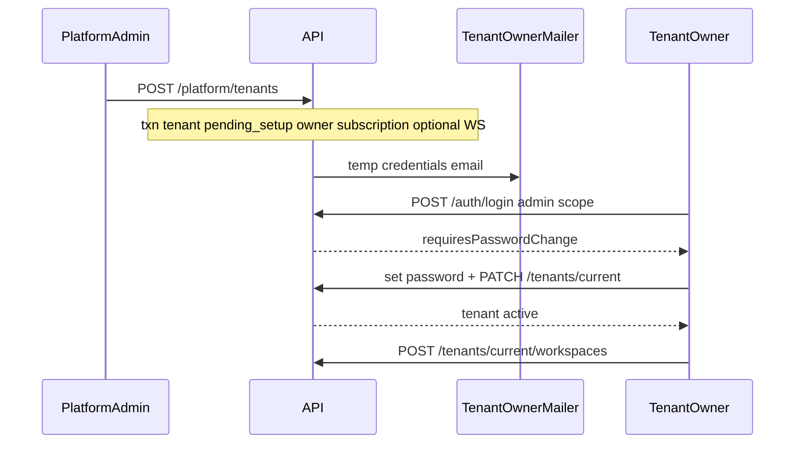
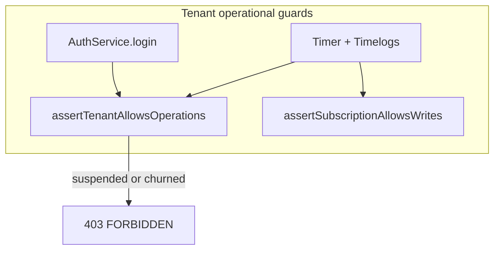

# SaaS-F15 — Superadmin tenant operations

## Context (post-F14)

| Done (F14) | Gap for F15 |
| --- | --- |
| [`PlatformGuard`](apps/api/src/common/guards/platform.guard.ts) + platform JWT | No mutation routes |
| [`GET /platform/tenants`](apps/api/src/modules/platform/application/platform-tenants.service.ts) | No `POST` / `PATCH` / suspend |
| [`apps/platform-admin`](apps/platform-admin/) login + read-only list/detail | No create/suspend UI |
| [`ROUTES.PLATFORM`](packages/contracts/src/routes.ts) | DTOs for create/update only |
| Tenant invite pattern in [`tenants.service.ts`](apps/api/src/modules/tenants/application/tenants.service.ts) | No superadmin provision transaction |
| [`assertSubscriptionAllowsWrites`](apps/api/src/modules/subscriptions/application/subscriptions.service.ts) | **`tenants.status` never checked** on login or writes |
| [`account-organization-page.tsx`](apps/admin/src/features/account/account-organization-page.tsx) | Read-only — no `pending_setup` completion |

**User intent:** Production-grade provision (includes optional first workspace). Delete/GDPR: no hard delete in F15; safe churn path only.

**Out of scope (F16+):** Platform audit log, automated GDPR export pipeline, hard `DELETE`, MFA for platform users.

---

## Research gate resolutions

| Gate | Decision |
| --- | --- |
| Owner invite email | New `TenantOwnerProvisioningMailer` — temp password, `must_change_password`, link via [`PUBLIC_ADMIN_URL`](apps/api/.env.example) (admin app) |
| First workspace on create | **Yes** — optional `firstWorkspace` in `POST /platform/tenants`; owner gets `workspace_members.ADMIN` |
| Plan override (`comp` / enterprise) | `planId` + optional `limitsOverride` on subscription (uses existing `tenant_subscriptions.limits_override` + [`resolveEffectiveLimits`](packages/contracts/src/plan-catalog.ts)); no new plan slugs in F15 |
| Suspend tenant | `tenants.status = suspended` **and** `tenant_subscriptions.status = suspended`; block login + writes; revoke refresh tokens for all tenant users |
| Delete tenant | **No hard delete.** `PATCH` may set `churned` only when preconditions met (suspended, no active Stripe subscription); export automation → **F16** + runbook stub |
| Superadmin bypass plan limits | Platform provision **bypasses** [`PlanLimitService`](apps/api/src/modules/subscriptions/application/plan-limit.service.ts) for initial workspace only |
| Owner completes org (D16) | `PATCH /tenants/current` (owner) when `pending_setup` → sets name/slug → `active` |

---

## Architecture





---

## Delivery split (2 PRs)

### PR1 — F15a: contracts, tenant guards, platform mutations API

**1. Contracts** ([`packages/contracts/src/dto/platform.dto.ts`](packages/contracts/src/dto/platform.dto.ts))

- `createPlatformTenantSchema` — `organizationName`, `ownerEmail`, `ownerName?`, `planId`, `subscriptionStatus?` (`trial`|`active`), `limitsOverride?`, `firstWorkspace?` `{ name, slug? }`
- `updatePlatformTenantSchema` — `name?`, `slug?`, `status?` (`active`|`suspended`|`churned`), `planId?`, `subscriptionStatus?`, `limitsOverride?` (nullable to clear)
- `createPlatformTenantResponseSchema` — `tenant` detail + `ownerUserId` + `temporaryPassword?` (dev/test only when mail unconfigured)
- `updateTenantCurrentSchema` — owner org setup: `name`, `slug` (at least one)
- `platformPlanListItemSchema` + `GET` route `ROUTES.PLATFORM.PLANS = "/platform/plans"`
- Specs in `platform.dto.spec.ts`; export from [`index.ts`](packages/contracts/src/index.ts)

**2. Tenant operational guard** — new [`assert-tenant-operations.util.ts`](apps/api/src/common/tenant/assert-tenant-operations.util.ts)

```typescript
// Block when tenants.status ∈ { suspended, churned }
export async function assertTenantAllowsOperations(prisma, tenantId): Promise<void>
```

Wire into:
- [`auth.service.ts`](apps/api/src/modules/auth/application/auth.service.ts) `login` / `refreshSession` / `getMe` (after membership resolved)
- [`subscriptions.service.ts`](apps/api/src/modules/subscriptions/application/subscriptions.service.ts) `assertSubscriptionAllowsWrites` (call tenant guard first)

**3. Platform provision service** — extend [`platform-tenants.service.ts`](apps/api/src/modules/platform/application/platform-tenants.service.ts)

| Method | Route | Behavior |
| --- | --- | --- |
| `createTenant` | `POST ROUTES.PLATFORM.TENANTS` | Single DB transaction: tenant (`pending_setup`), user (temp pwd, `mustChangePassword`, `emailVerifiedAt`), `tenant_members` OWNER, `tenant_subscription`, optional workspace + owner `workspace_members` ADMIN; slug collision handling (reuse workspace slugify pattern); superadmin bypass limits for initial WS |
| `updateTenant` | `PATCH ROUTES.PLATFORM.TENANT(id)` | Superadmin patch plan/subscription/limits/status/name/slug; churn validation (see below) |
| `suspendTenant` | `POST ROUTES.PLATFORM.SUSPEND_TENANT(id)` | Set tenant + subscription suspended; `auth.revokeAllRefreshTokens` for each tenant user |
| `listPlans` | `GET ROUTES.PLATFORM.PLANS` | All plans for create/edit picker |

**Churn rules (production-safe):**
- Only from `suspended` → `churned`
- Reject if `stripeSubscriptionId` present and Stripe status not canceled (check via existing [`StripeClient`](apps/api/src/modules/subscriptions/stripe/stripe.client.ts) or block if ID set without cancel — document manual cancel in runbook)

**4. Owner setup** — extend [`tenants.service.ts`](apps/api/src/modules/tenants/application/tenants.service.ts) + [`tenants.controller.ts`](apps/api/src/modules/tenants/interface/http/tenants.controller.ts)

- `PATCH ROUTES.TENANTS.CURRENT` (owner only) — update name/slug; if `status === pending_setup` and both name+slug valid → `active`

**5. Mailer** — [`tenant-owner-provisioning.mailer.ts`](apps/api/src/common/mailer/tenant-owner-provisioning.mailer.ts)

- Pattern from [`member-provisioning.mailer.ts`](apps/api/src/common/mailer/member-provisioning.mailer.ts); login URL = `PUBLIC_ADMIN_URL/login`

**6. Module wiring** — [`platform.module.ts`](apps/api/src/modules/platform/platform.module.ts): import `MailerModule`, `SubscriptionsModule`, `AuthModule`; register mailer + `PlatformPlansController` or extend existing controller

**7. Tests (PR1)**

- `platform-tenants.service.spec.ts` — create txn, suspend, churn validation, limitsOverride
- `assert-tenant-operations` unit spec
- `platform-tenants-provision.e2e.ts` — create → owner login blocked until password change → setup → active
- `platform-tenants-suspend.e2e.ts` — suspend blocks login + timer start
- Extend `auth.service.spec.ts` — suspended tenant login rejected

---

### PR2 — F15b: platform-admin + admin owner setup UI

**1. platform-admin** ([`apps/platform-admin`](apps/platform-admin))

| Piece | Path |
| --- | --- |
| Create page | `(platform)/tenants/new` → `tenant-create-page.tsx` (org name, owner email/name, plan select from `GET /platform/plans`, optional first workspace, trial toggle) |
| Detail actions | `tenant-detail-page.tsx` — Suspend button, plan/limits override form (PATCH), status badge |
| List CTA | `tenant-list-page.tsx` — "Create tenant" link |
| Nav | Add to [`platform-shell.tsx`](apps/platform-admin/src/components/platform-shell.tsx) |

**2. Admin app** — owner onboarding (D16)

- New route `/account/setup` or enhance [`account-organization-page.tsx`](apps/admin/src/features/account/account-organization-page.tsx) with edit form when `tenant.status === pending_setup`
- Redirect after login/set-password when owner + `pending_setup` → setup page
- `useTenantCurrent` + `PATCH /tenants/current` via web-shared hook

**3. web-shared**

- `useUpdateTenantCurrent()` or extend tenant hooks
- Optional: `usePlatformPlans()` for platform-admin

**4. Docs**

- Update [`docs/specs/platform-admin.md`](docs/specs/platform-admin.md) — mutation routes, provision flow, churn runbook stub
- Update [`docs/specs/tenants.md`](docs/specs/tenants.md) — owner setup PATCH
- [`TASK_BOARD.json`](TASK_BOARD.json): `SaaS-F15` → `done`
- [`TENANT_RBAC.md`](docs/architecture/TENANT_RBAC.md) §6 diagram — mark implemented

**5. Tests (PR2)**

- Playwright `platform-create-tenant.spec.ts` — superadmin creates tenant, sees in list
- Playwright `owner-setup.spec.ts` — provisioned owner completes org profile
- Vitest smoke on create form validation (minimal)

---

## Key implementation notes

1. **Reuse, don't fork** — Extract shared slugify + temp-user creation from [`tenants.service.ts`](apps/api/src/modules/tenants/application/tenants.service.ts) / [`workspace.service.ts`](apps/api/src/modules/workspace/application/workspace.service.ts) into small internal helpers if duplication exceeds ~30 lines; platform service owns the transaction boundary.

2. **Prisma** — Continue [`generatedPrisma(prisma)`](apps/api/src/common/prisma/generated-prisma.util.ts) in platform + subscription paths; no global `PrismaService` switch.

3. **Idempotency** — Reject `POST /platform/tenants` if `ownerEmail` already has `tenant_members` row (D08 one-tenant-per-user).

4. **Security** — Never return `temporaryPassword` in API response in production (`NODE_ENV=production`); log dev-only like member provisioning.

5. **F16 handoff** — Add `docs/runbooks/tenant-churn.md` stub: manual Stripe cancel → suspend → export (TBD) → PATCH churned.

---

## Exit criteria (from master plan)

- [ ] Superadmin creates tenant with plan + optional first workspace; owner receives email (or dev log)
- [ ] Owner logs in (admin), changes password, completes org profile → tenant `active`
- [ ] Owner can create additional workspaces via existing tenant API
- [ ] Suspended tenant cannot log in or start timer / create timelogs
- [ ] Platform-admin has create + suspend + plan override UI
- [ ] `pnpm format:check && pnpm lint && pnpm typecheck && pnpm test && pnpm build` green

---

## Explicitly deferred

- Hard delete + GDPR export automation (F16 / F21)
- Platform audit events (F16)
- `enterprise` plan slug (use `limitsOverride` on pilot/pro for comp accounts)
- Reactivate unsuspend endpoint (can use `PATCH` status `active` in F15 if needed — include in `updatePlatformTenant`)
